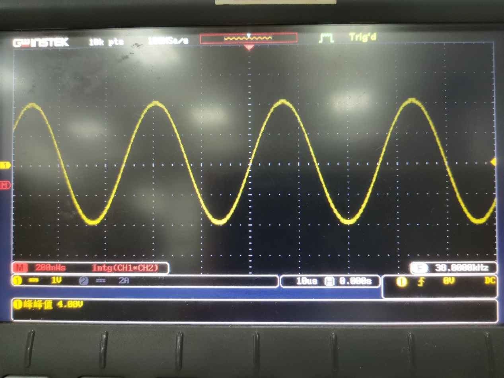
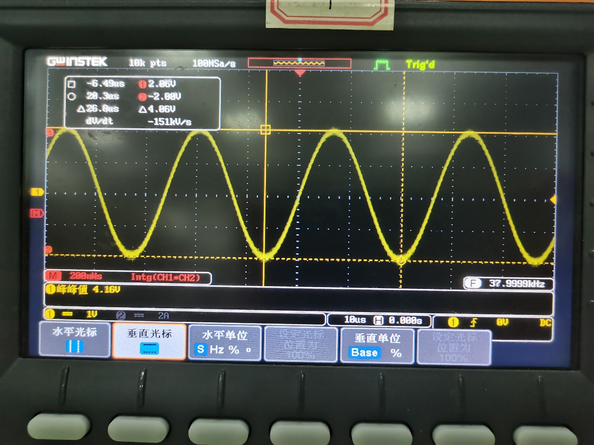
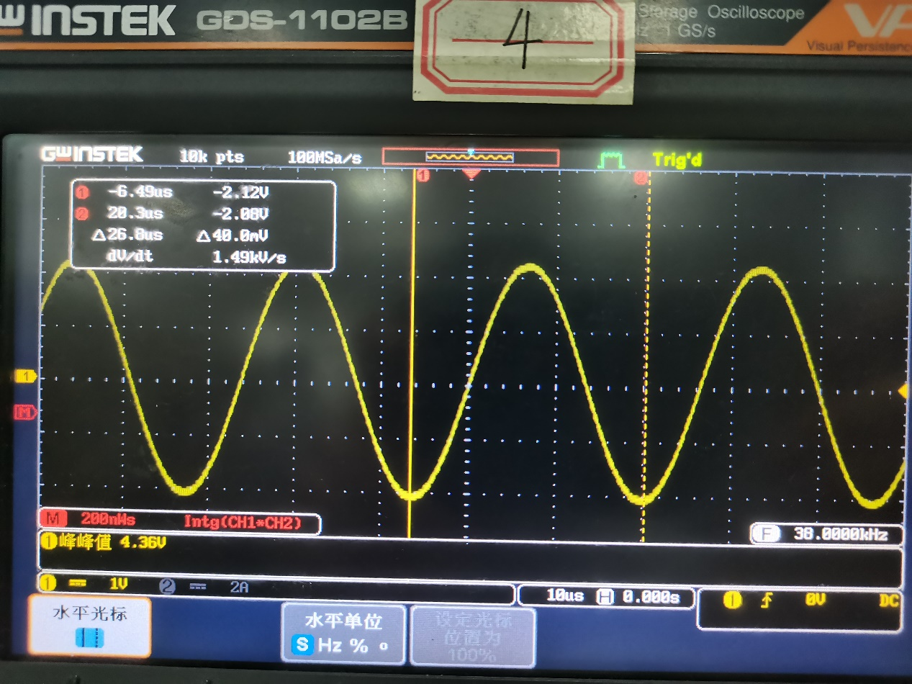
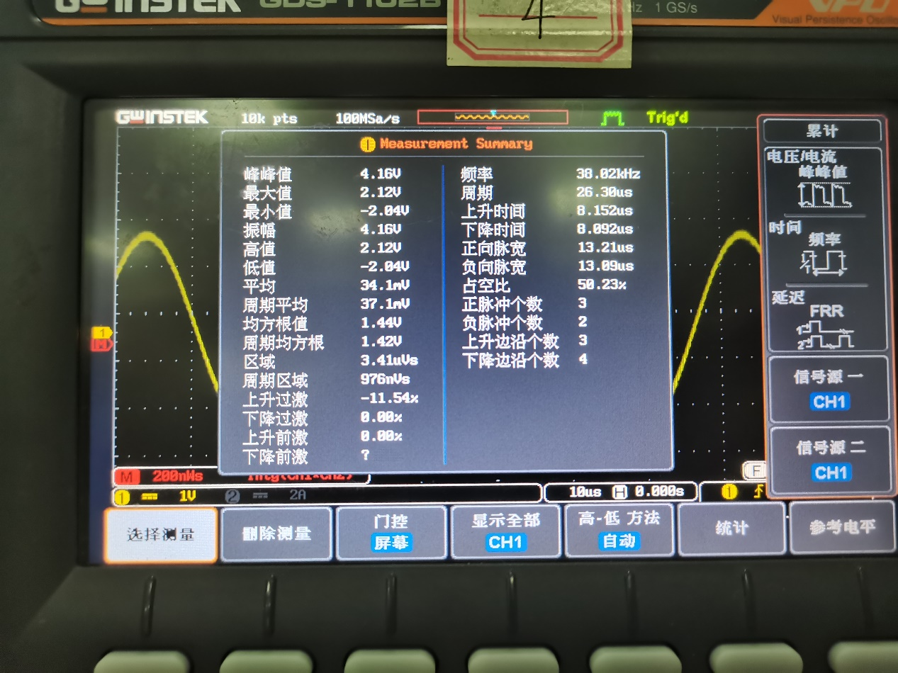

# 3.2 数字示波器

3.2数字示波器

一、实验目的

（1）了解和掌握数字示波器的基本作用和使用方法。

（2）学习使用函数信号发生器。

二、实验仪器

GDS-1102B型数字示波器、SP33520A型函数信号发生器等。

三、实验原理

数字示波器实际上是计算机技术的一种应用。不管什么型号和类型的数字示波器，其系统的硬件部分为一块高速的数据采集电路板。这块电路板能实现双通道数据输人和处理，如书图3.2-8所示。

从功能上可将硬件系统分为信号前端放大模块（可变增益放大器）、高速模数转换模块（ADC驱动器）、FPCA 逻辑控制模块、时钟分配、单片机控制模块、数据通信模块，液晶显示等控制部分。实验使用的仪器从数据的采集、存储（写入）、读出（取出）、测量运算、显示等全过程都采用数字化技术进行处理。这使得示波器的一些操作和测量能够实现自动化或智能化，如亮度、对比度的调节，自动设置显示波形，对被测信号的表征参数如周期、频事、电压幅度、脉冲宽度、占空比等即可直接计算并且把结果显示于屏幕。还可以将屏幕显示的内容和测量结果甚至面板设置进行保存，如储存参考波形，输出到打印机、软盘或直接到电脑。

实验使用的数字示波器型号为固纬GDS -1102B型数字示波器（参照数字示波器操作简介部分）。数字示波器在操作上与模拟示波器类同，显示和测量实际上是以模拟示波器的内容为基础加以改进和扩展的。观测波形依然是以“TIME/DIV”旋钮来调节显示多少个波形，同样是调节电平“LEVEL”旋钮使波形稳定。但是模拟示波器只能标示在操作面板“TIME/DIV”旋钮上的档位示值，而数字示波器可随着调节对应显示在屏幕的下方，在屏幕上还显示与之对应的采样率。y轴每格电压选择“Volts/DIV”等也一样。

数字示波器能将信号以一定的时间间隔进行采集并进行数字化处理，示波器显示的所有波形都是在满足一定触发条件下产生的。触发电平的调节决定了数字示波器何时开始采集数据和显示波形，一旦正确设定触发，就可以将不稳定的波形变成有意义的波形。数字示波器的y轴和x轴扫描信号可源自同一地址，因而同步性能非常好，显示的波形十分稳定，而且可以实现任意选择扫描开始和结束的位置，只要能保持每次扫描开始的位置和结束的位置相同，波形就是稳定的。

数字示波器与普通模拟示波器相比具有如下几大优点：

①用液晶显示屏取代了普通模拟示波器的电子射线示波管，因而实验仪器小巧精致。用对比度按键取代了普通模拟示波器的亮度和聚焦的两个调节按钮，并且设置了对比度自动调节功能：打开电源后，仪器便会根据环境光线的明暗，自动调节液晶显示屏的明暗对比度。如有需要，对比度也可进行手动调节。

②可通过外部控制系统（通常是计算机）进行远程控制操作。

③设有内存和USB输出接口，既可显示波形，也可将波形、各种设置以及测量数据储存，或者以其他的形式保存。

④设有自动设置功能。信号输人后，按下面板上的“AUTOSET”（自动设置）键，示波器可以自动设置y轴、x轴和触发条件，显示输入信号的波形。如果进行其他操作，自动设置功能将自动取消。按下“AUTOSET”键的时间不小于1s时，可以进行其他面板功能的设置。

四、实验内容与主要步骤

1.熟悉GDS-1102B型数字示波器及波形显示

①熟悉数字示波器的基本操作，了解数字示波器的菜单操作方法；熟悉SP33520A型函数信号发生器的使用方法（见附录）。

②连接信号发生器与示波器，观察相关波形和测量相关参数。调节信号发生器相关旋钮，设置信号输出通道，设置信号输出波形（方波、正弦波和三角波……），设置输出信号的其他参数（如：50Hz，Vp-p为5.000，相位0.0°）。

③同轴电缆和示波器的输入通道1（CH1）相连后，按下示波器面板上的自动设置按钮“AUTOSET”，在示波器上会显示出稳定的波形，调节垂直方向的灵敏度（Vertical）和水平方向（Horizontal）的扫描旋钮使波形大小适中，显示5~6个波形。

④测量波形的电压和时间参数：按“Measure”，测量频率、峰-峰值Vp-p、周期、脉宽、正占空间、上升时间，并与信号发生器面板上指示的相关参数比较。

⑤用U盘储存或记录数据。

2利用李萨如图形测频率

①调节信号发生器相关旋钮，设置通道1、通道2的输出信号为正弦波，两个通道信号的频率为简单的整数比，如1:1、2:1等，两通道的相位差为0°或90°。

②用BNC线（同轴电缆）将信号分别输出到示波器的输入通道1（CH1）和输入通道2（CH2）（注：待测信号输入到CH2通道），按下示波器面板上自动设置按钮“AUTOSET”，在示波器上显示出稳定的波形（不同频率比的李萨如图参照书实验3.1）。

③按常用菜单区“Acquire”按钮，按屏幕下方功能菜单对应的“X-Y”，此时波形由“YT”模式变为“XY”模式。将函数发生器的100Hz正弦波（信号发生器CH1）作为已知频率fx输入CH1通道，将函数发生器CH2通道（可设置输出100Hz）输出端的正弦波作为未知fy信号输入示波器的CH2通道。改变信号发生器CH1通道输出频率，分别调出1:1、2:1、3:1、3:2李萨如图形，并分别记录屏幕图形和计算频率fy值。记录于表格3.2-3。

3利用DSO观察脉搏信号

将实验室提供的压电传感器装置与示波器连接，调节示波器的相关旋钮。把压电传感装置紧贴个人脉搏跳动明显处，观察示波器相关脉搏信号，测量脉搏周期和心率。

五、数据记录及处理

六、实验感想

在使用过程中，“Autoset”、“Measure”和“Cursor”按键较常使用。示波器上手简单，能够为之后的磁谐振无线电能传输实验奠定良好的基础。
