# 3.3 共振法测量材料的杨氏模量

实验 **3.3**  共振法测量材料的杨氏模量

杨氏模量是固体材料的重要力学性质，它反映了固体材料抵抗外力产生拉伸（或压缩）形变的能力，

是选择机械构件材料的依据之一。杨氏模量的测量方法有多种，如拉伸法、弯曲法、共振法等等。拉伸法

常用于形变大、常温下的测量。但该方法使用的载荷较大，加载速度慢，有弛豫过程，不能真实地反映材

料内部结构的变化，且不适用于脆性材料，和材料在不同温度时的杨氏模量的测量。共振法不仅克服了拉

伸法的上述缺陷，而且更具有实用价值。它不仅适用于轴向均匀的杆（管）状金属材料，也可用于脆性材

料的杨氏模量与共振参数的检测。因此，共振法成为国家标准  GB/T2105-91  推荐使用的测量方法。

一、实验目的

1． 学习用共振法测量材料的杨氏模量；

2． 学习用外延法测量、处理实验数据；

3． 培养综合运用知识和使用常用实验仪器的能力。

二、实验仪器

FB2729A  型动态杨氏模量实验仪、多功能音频信号源、双踪示波器、电子天平、钢板尺、游标卡尺等。

三、实验原理

**1**．共振法测杨氏模量的物理基础

共振法测量杨氏模量是以自由梁的振动分析理论为基础的。根据棒的横振动方程

<table>
<tr><td></td><td>4*Y*</td><td></td><td>*S*</td><td></td><td>2*Y*</td><td>0</td><td>（3.3-1）</td></tr>
<tr><td>*x*</td><td>4</td><td></td><td>*EJ*</td><td>*t*</td><td>2</td><td></td><td></td></tr>
</table>

式中，Y  为棒位于 *x*  处的质元的振动位移；*E*  为棒的杨氏模量；S  为棒的横截面积；J  为棒的转动惯量；

为棒的密度；*x*  为质元的位置坐标；t  为时间变量。

分离变量法求解棒的横振动方程，另  Y(*x*，*t*) = X(*x*)·T(*t*)，代入方程（3.3-1）得

<table>
<tr><td>1</td><td>4 *d X*</td><td></td><td>*s*</td><td>1</td><td>2 *d T*</td><td></td><td>（3.3-2）</td></tr>
<tr><td>4 *X d x*</td><td></td><td>*EJ T dt*</td><td>2</td><td></td><td></td></tr>
</table>

可以看出，上式两边分别是 *x*  和 *t*  的函数，只有都等于一个任意常数时才有可能使等式成立。设这个

常数为 *K*4，得

<table>
<tr><td>4 *d X*</td><td></td><td>4 *K X*</td><td></td><td>0</td><td></td><td></td><td></td></tr>
<tr><td>4 *d x*</td><td></td><td></td><td></td><td></td><td>0</td><td></td><td>（3.3-3）</td></tr>
<tr><td>2 *d T*</td><td></td><td>4 *K EJ T* *s*</td><td></td><td></td><td></td><td></td></tr>
<tr><td>*dt*</td><td>2</td><td></td><td></td><td></td><td></td><td></td><td></td></tr>
</table>

解这两个线性常微分方程，得通解

| *Y x t*( , ) |  | ( | *Achkx*1 |  | *A shkx*2 |  | *B*1 | cos | *kx* |  | *B*2 | sin | *kx*)cos( |  | ) |  |
|---|---|---|---|---|---|---|---|---|---|---|---|---|---|---|---|---|

样棒作受迫横向振动，试样棒另一端的悬丝再把试样棒的机械振动传给换能器，将机械振动信号又变成电

信号。该信号经选频放大器的滤波放大，再送至示波器显示。

当信号源的频率不等于试样棒的固有频率时，试样棒不发生共振，示波器上几乎没有电信号波形或波

形幅度很小。当信号源的频率等于试样棒的固有频率时，试样棒发生共振，这时示波器上的波形幅度突然

增大，此时仪器读出的频率就是试样棒在该悬挂条件下的共振频率。

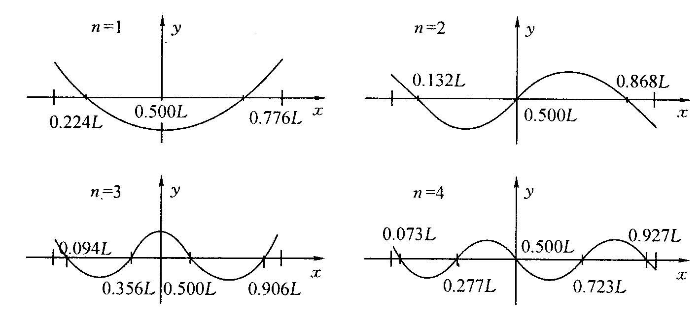

图  3.3-2

棒的横振动节点与振动级次有关。图  3.3-2  给出了 *n* = 1、2、3、4  时的振动波形。从 *n*  = 1  的图可以看

出，试样棒在作基频共振时存在两个节点，它们的位置距离其中一个端面分别为  0.224*L*  和  0.776*L*  处。理

论上悬挂点应取在节点处，此时试样棒的共振频率才是共振基频。

在实验上，由于悬丝对试样棒振动的阻尼，所检测到的共振频率大小是随悬挂点的位置而变化的。由

于压电换能器所拾取的是悬挂点的加速度共

| 振信号，而不是振幅共振信号，并且所检测到 的共振频率随悬挂点到节点的距离增大而增 大。若要直接测量试样棒的基频共振频率，只 有将悬丝挂在节点处。处于基频振动模式时， 试样棒上存在两个节点，它们的位置距离其中 的端面分别为  0.224*L*  和  0.776*L*  处。由于在节 点处的振幅几乎为零，很难激振和检测，所以 要想测得试样棒的基频共振频率，就需要采取 外延测量法。所谓外延测量法，就是所需要的 数据在测量数据范围之外，一般很难测量，为 了求得这个数值，采用作图外推求值的方法。 | 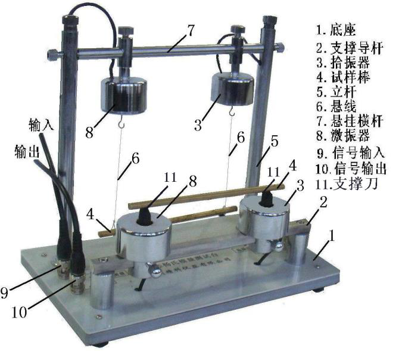 图  3.3-3  悬挂、支撑式动态杨氏模量测试台 |
|---|---|

就是说，先使用已测数据绘制出曲线，再将曲线按原规律延长到待求值范围，在延长部分求出所要的值。

值得注意的是，外延法只适用于在所研究范围内没有发生突变的情况，否则不能使用。

需要说明的是，试样棒的固有频率 *f*固  和基频共振频率 *f*共  是两个不同的概念，它们之间的关系为

<table>
<tr><td>*f*固</td><td></td><td>*f*</td><td>共</td><td>1</td><td></td><td>1</td><td>2</td><td>（3.3-7）</td></tr>
<tr><td></td><td></td><td></td><td></td><td></td><td></td><td>4*Q*</td><td></td><td></td></tr>
</table>

式中 *Q*  为试样棒的机械品质因数。对于悬挂法测量，一般 *Q*  值大于  50，基频共振频率和固有频率相

比只偏低  0.005％，所以在实验中可以用基频共振频率代替固有频率，用（3.3-6）式计算杨氏模量。

五、实验过程与步骤

（1）熟悉动态杨氏模量测试仪的结构及使用方法（图  3.3-3）。把实验仪器连接好，通电预热10分钟。

（2）测定试样的长度 *L*、直径 *d*  和质量 *m*，每个物理量各测  5  次，数据记录于表  3.3-1。计算试样棒的两

个节点位置（0.224*L*  和  0.776*L*），并在试样棒上标明。两个节点位置将作为试样棒悬挂点位置坐标的坐标

<table>
<tr><td>0.224*L*</td><td>10	30</td><td>0.224*L*</td></tr>
<tr><td></td></tr>
</table>

-30	-10*O*2020*O*-10-30

图  3.3-4  悬挂坐标标示

原点  O。在试样棒上标定测量共振频率时各悬挂点的位置（图  3.3-4）。

（3）如图  3.3-2  所示，将试样棒悬挂于两悬线上，两悬线挂点为-30mm，-30mm  处，调节横梁上活动支架

位置使悬线与试样棒轴向垂直，调节悬线长度使试样棒横向水平。待试样棒处于静止状态，再观察试样棒

安装是否合要求。

（4）待试样棒稳定之后，缓慢调节信号发生器频率旋钮，寻找试样棒的共振频率。当示波器荧屏上显示

的正弦波形幅度突然变大时，再调节信号发生器的频率微调旋钮，使波形振幅达到极大值，表明此时试样

棒处于共振状态。记录该位置的共振频率 *f*  。按照测量记录表格的要求，改变悬挂点和支架位置，测量在

不同悬挂状态下试样棒的共振基频，数据记录于表  3.3-2。

（5）“支撑式”：把试样棒从悬挂线上取下，轻放于测试台支撑式的激、拾振器的橡胶支撑刀上。把信号发

生器的输出与测试台的支撑式-输入相连，测试台的支撑式-输出与放大器的输入相接，放大器的输出与示

波器的  Y  输入相接。

（6）其余同“悬挂法”步骤。（选做）

六．数据记录和处理

1．实验测量数据记录

| 试样棒长度 *L*= | 103m  ；     试样棒质量 *m*= | 103  kg |
|---|---|---|

表  3.3-1  试样棒测量表 

| 次数 | 1 | 2 | 3 | 4 | 5 |
|---|---|---|---|---|---|
| *d*  (×10-3m) |  |  |  |  |  |
| *L*  (×103m) |  |  |  |  |  |
| *m*  (×10-3kg) |  |  |  |  |  |

*d*  =

=

=

表  3.3-2  共振频率的测量

<table>
<tr><td>悬挂点位置 (mm)</td><td>25</td><td>20</td><td>15</td><td>10</td><td>5</td><td>-5</td><td>-10</td><td>-15</td><td>-20</td><td>-25</td></tr>
<tr><td>共 振 频 率 *f* (Hz)</td><td>1</td><td></td><td></td><td></td><td></td><td></td><td></td><td></td><td></td><td></td><td></td></tr>
<tr><td></td><td>2</td><td></td><td></td><td></td><td></td><td></td><td></td><td></td><td></td><td></td><td></td></tr>
<tr><td></td><td>3</td><td></td><td></td><td></td><td></td><td></td><td></td><td></td><td></td><td></td><td></td></tr>
<tr><td></td><td>*f*</td><td></td><td></td><td></td><td></td><td></td><td></td><td></td><td></td><td></td><td></td></tr>
</table>

2．用外延法求基频共振频率1*f*

以悬挂点位置为横坐标 *x*，共振频率 *f*  为纵坐标，在直角坐标纸上按作图规范作 *x*- *f*  图线，并从图线

确定试样棒的基频共振频率1*f*  。（当*x*0时，纵坐标 *f*  值即为基频1*f*  。）

3．根据所测量数据，计算试样棒杨氏模量 *E*  。

注意事项

1．试样棒不可随处乱放，保持清洁，拿放时应特别小心。

2．悬挂试样棒后，应移动悬挂横杆上的激振，拾振器到既定位置，使两根悬线垂直试样棒。

3．更换试样棒要细心，避免损坏激振，拾振传感器。

4．实验时，试样棒需稳定之后才可以进行测量。

思考题

试讨论：试样的长度 *L*、直径 *d*、质量 *m*、共振频率 *f*  分别应该采用什么规格的仪器测量？为什

实验 **4.1**  光栅的特性及光波波长的测定

光谱测量和光谱分析是研究物质成分及研究原子和分子结构的重要手段。光栅是光谱测量中的一个重

要的、不可缺少的色散元件，它能将光源发出的光按波长分列为谱线并按有序排列。衍射光栅由大量等宽、等间距、平行排列的狭缝构成。一般可以分为两类：用透射光工作的透射光栅和用反射光工作的反射光栅。 	 本实验要求：理解光栅衍射的原理，研究衍射光栅的特性；掌握用衍射光栅精确测量波长的原理和方法；进一步熟悉分光计的工作原理和分光计的调节、使用方法。  一、实验目的

1、 进一步掌握分光计的构造、使用和调节方法。  2、 了解光栅特性，并利用光栅衍射法测量光波波长、角色散率和分辨本领。

二、实验仪器

分光计，低压汞灯，光栅片，平面镜。

<table>
<tr><td>三、实验简介 当一束白光垂直通过光栅时，光源发出的光波按波长次序展开成一系列的谱线。谱线的衍射角  与光</td></tr>
<tr><td>波长  及光栅常数*d*  满足关系</td><td>*d*</td><td>sin</td><td>*k*，（*k*    1, 2,...)</td><td>。因此，在已知光栅常数 *d*  的条件下，只需</td></tr>
<tr><td>测定</td><td>*k*     级谱线的衍射角  ，即可得到各谱线的波长  。所以实验中只需测定汞灯光源通过光栅衍射时</td></tr>
<tr><td>产生各谱线（</td><td>*k*     级）的衍射角  ，即可间接测得汞灯蓝光和黄光的波长。实验中需借助分光计测量衍</td></tr>
</table>

射角  ，因此分光计的调整也是本实验的内容之一。  四、实验原理  **4.1**．光栅常数和光栅方程

衍射光栅是由大量等宽、等间距、平行排列的狭缝构成的光学元件。用于可见光区的光栅每毫米缝数

可达几百到上千条。设缝宽为 *a*，相邻狭缝间不透光部分的宽度为 *b*，则缝间距 *d* =  *a* +  *b*  就称为光栅常数(图4.1-1)。

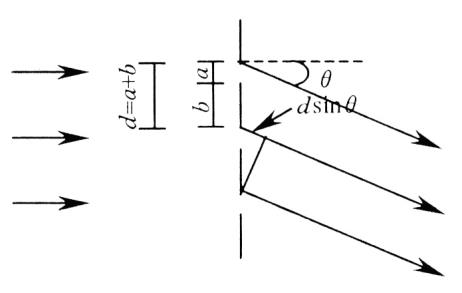

图  4.1-1    衍射光栅

根据夫琅和费衍射理论，波长  的平行光束垂直投射到光栅平面上时，光波将在每条狭缝处发生衍

<table>
<tr><td>射，各缝的衍射光在叠加处又会产生干涉，干涉结果决定于光程差。因为光栅各狭缝间距相等，所以相邻狭缝沿 *θ*  方向衍射光束的光程差都是 *d* sin*θ*(图  4.1-1)。*θ*  是衍射光束与光栅法线的夹角，称为衍射角。 	 在光栅后面放置一个会聚透镜，使透镜光轴平行于光栅法线(4.1-2)，透镜将会使图  4.1-2  所示平面上衍射角为 *θ*  的光都会聚在焦平面上的  P  点，由多光束干涉原理，在 *θ*  满足下式时将产生干涉主极大，P  点为</td></tr>
<tr><td>亮点：</td><td></td><td>*d*</td><td>sin</td><td>*k*(*k*</td><td></td><td>,0,1,2)</td><td>（4.1-1）</td></tr>
</table>

式中 *k*  是级数，*d*  是光栅常数。(4.1-1)式称为光栅方程，是衍射光栅的基本公式。  	 由(4.1-1)式可知，*θ*=0  对应中央主极大，P0  点为亮点。中央主极大两边对称排列着±1  级、±2  级……主极大。实际光栅的狭缝数目很大，缝宽越小，所以当产生平行光的光源为细长的狭缝时，光栅的衍射图样将是平行排列的细锐亮线，这些亮线实际就是光源狭缝的衍射干涉条纹。

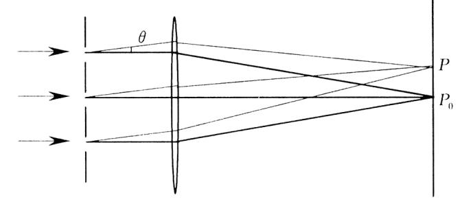

图  4.1-2    光栅衍射示意图    **4.2**．光栅光谱  	 当入射光为复色光时，由光栅方程可知，对给定常数 *d*  的光栅，只有在是 *k*=0  即 *θ*=0  的方向该复色光所包含的各种波长的中央主极大会重合，在透镜的焦平面上形成明亮的中央零级亮线。对 *k*  的其他值，各种波长的主极大都不重合，不同波长的细锐亮线出现在衍射角不同的方位，由此形成的光谱称为光栅光谱。级数 *k*  相同的各种波长的亮线在零级亮线的两边按短波到长波的次序对称排列形成光谱，*k*=1  为一级光谱，*k*=2  为二级光谱……，各种波长的细锐亮线称为光谱线。图  4.1-3  即为低压汞灯的衍射光谱示意图。如果确知光栅常数 *d* ，级数 *k* ，精确测定光谱线的衍射角就可以确定光波的波长。反之，也可以由已知的波长确定光栅常数。

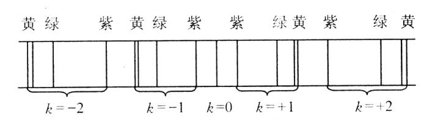

图  4.1-3    低压汞灯衍射光谱示意图    **4.3**．光栅的特性

角色散和分辨本领是光栅的两个重要特性。衍射光栅能将复色光按波长在透镜焦平面上分开成不同

<table>
<tr><td>波长的谱线，说明衍射光栅有色散作用。由于衍射现象，使光谱线扩展为较宽的亮条纹，因而限制了光栅的分辨能力，根据理论推导，光栅的色散能力可以用角色散  D  表征。</td></tr>
<tr><td></td><td>*D*  </td><td>*d*</td><td>（）</td></tr>
<tr><td></td><td></td><td>*d*</td><td>4.1-2</td></tr>
</table>

上式表示单位波长间隔的两条单色谱线间的角间距。将光栅方程（4.1-1） 微分就可以得到光栅的角色散

<table>
<tr><td></td><td>*D*  </td><td></td><td>*k*</td><td>（4.1-3）</td></tr>
<tr><td></td><td></td><td>*d*</td><td>cos</td><td></td></tr>
<tr><td>由方程（4.1-3）可知，光栅常数越小，角色散越大，光谱的级次越高，角色散越大。</td></tr>
<tr><td>分辨本领 *R*  表征光栅分辨光谱细节的能力，如果光栅刚刚能将  和</td><td></td><td>*d*两条谱线分开，则</td></tr>
<tr><td>*R*  </td><td></td><td>（4.1-4）</td></tr>
<tr><td></td><td>*d*</td><td></td></tr>
</table>

根据瑞利判断，当一条谱线的光强极大和另一条谱线的极小重合时，两条谱线刚好可以被分辨。由此

| 可以推出 | *R* |  | *kN* | （4.1-5） |
|---|---|---|---|---|

式中  N  为光栅的总狭缝数，k  为光谱的级数。N  的数目很大，可知光栅是具有高分辨本领的光学元件。 五、实验过程与步骤  **5.1**、调整分光计

利用光垂直入射光栅的光栅方程式*d*sin*k*(*k*,0,1,2)研究光栅特性和测量光谱必须满足：

①入射平行光必须垂直于光栅表面；②零级两侧的光谱线等高。为满足上述两个条件，测量前需作分光计和平面光栅的调整。

测量前调节：  （1）分光计调节要求：平行光管产生平行光，望远镜调焦于无穷远；平行光管光轴、望远镜光轴垂

直于仪器转轴，并使平行光管光轴与望远镜光轴在同一水平线上。有关分光计的调节方法，请参阅教材中的实验  3.9。

（2）调节光栅平面与平行光管光轴垂直。

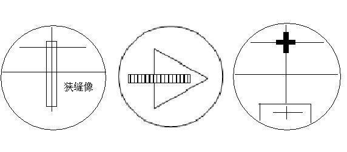

图  4.1-4                                          图  4.1-5                                    图  4.1-6

具体方法：使平行光管正对光源，调节平行光管产生平行光，并调节狭缝宽度至  1 mm~2mm，转动望

远镜使分划板的叉丝对准狭缝中央，见图  4.1-4。固定望远镜，将光栅置于载物台上（如图  4.1-5），根据目测尽可能做到使光栅平面垂直平分“1”、“2”连线，而“3”应在光栅平面内。转动游标盘，使光栅大致垂直于望远镜光轴。用自准直法严格地调节载物台下的调平螺钉“1”、“2”（注意，不能调节望远镜的调倾螺钉），直至望远镜射出的、经光栅平面反射回来的绿十字在图  4.1-6  位置。此时，光栅平面与平行光管的光轴垂直，且与仪器转轴平行，随即固定游标盘（注：不必把光栅转  180°）。

（3）调节零级两边谱线等高。  松开望远镜的止动螺钉，转动望远镜，观察正、负一级光谱线，注意观察叉丝交点是否在各条谱线的

中央。如果不在中央，应调节载物台下螺钉“3”，使正、负一级谱线的中央都过叉丝交点，此时两边谱线等高。

**5.2**、用平面衍射光栅测量低压汞灯谱线波长  分光计按要求调节好之后，必须固定载物台和游标盘，只让望远镜能绕主轴转动。首先左、右转动望

远镜全面观察光栅的衍射光谱，再开始测量各条谱线位置。测量时，可以从中央明条纹开始分别向左、右两边测量，也可以从左（或右）边到右（左）边，单方向转动望远镜测量。记录数据于表  4.1-1。测量完毕后，将平面光栅从载物台上拿下，但不要调乱已调好的分光计。

注意：开始测量角度  之前，必须通过移动观察目镜观察一周，在确定  k＝±2  级时，对应的两条黄

光清晰可见的前提下，才开始测量。另外，在  k＝±1  时，同一光谱偏离  0  级的角度大小应该大致相等。在  k＝±2  时也具有同样的特点，这一特点可用于检验光栅是否与入射光垂直。

六、测量记录和数据处理

将测量数据记录于表  4.1-1  及利用表  4.1-2  处理数据

表  4.1-1  测量记录（各级次每条谱线位置）

<table>
<tr><td>右</td><td>0</td><td>+1</td><td>+2</td></tr>
<tr><td></td><td>左</td><td>右</td><td>左</td><td>右</td><td>左</td><td>右</td></tr>
<tr><td>紫光</td><td></td><td></td><td></td><td></td><td></td><td></td><td></td><td></td><td></td><td></td></tr>
<tr><td>绿光</td><td></td><td></td><td></td><td></td><td></td><td></td><td></td><td></td><td></td><td></td></tr>
<tr><td>黄光  1</td><td></td><td></td><td></td><td></td><td></td><td></td><td></td><td></td><td></td><td></td></tr>
</table>

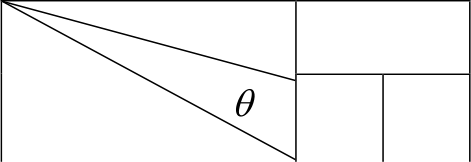

| 黄光  2 |  |  |  |  |  |  |  |  |  |  |
|---|---|---|---|---|---|---|---|---|---|---|

(1)用已知绿光波长（绿光波长λ=546.07nm）计算光栅常数，光栅常数 *d*=         mm。  再用测量得到的光栅常数计算紫光、黄光波长，数据处理如表  4.1-2。

表  4.1-2  数据处理

<table>
<tr><td></td><td>黄光  1</td><td>黄光  2</td><td>紫光</td></tr>
<tr><td></td><td>衍射角</td><td>波长  </td><td>衍射角</td><td>波长</td><td>衍射角</td><td>波长  </td></tr>
<tr><td>-2</td><td></td><td></td><td></td><td></td><td></td><td></td></tr>
<tr><td>-1</td><td></td><td></td><td></td><td></td><td></td><td></td></tr>
<tr><td>+1</td><td></td><td></td><td></td><td></td><td></td><td></td></tr>
<tr><td>+2</td><td></td><td></td><td></td><td></td><td></td><td></td></tr>
<tr><td></td></tr>
</table>

<table>
<tr><td> </td><td></td><td></td><td></td><td></td><td></td><td></td><td></td><td></td><td></td><td></td><td></td><td></td><td></td><td>1 *n*  </td><td>1</td><td></td></tr>
<tr><td>其中衍射角 </td><td>*k*左－0左</td><td>＋</td><td>*k*右－0右</td><td>，</td><td>*i*</td><td>*n* </td><td>1</td><td>( 		*i*</td><td></td><td>)</td><td>2</td><td></td><td></td><td>*i*</td><td></td><td></td><td>。</td></tr>
<tr><td></td><td></td><td></td><td></td><td></td><td></td><td></td><td></td><td></td><td></td><td></td><td></td><td></td><td></td><td></td><td></td><td></td><td></td></tr>
<tr><td>*k*</td><td></td><td>2</td><td></td><td></td><td></td><td></td><td></td><td>*n*</td><td></td><td>1</td><td></td><td></td><td></td><td></td><td></td><td>*n*</td><td></td><td></td></tr>
</table>

(2)由测得的紫光、绿光的衍射角  和波长，计算光栅的角色散率  D。由测得的两条黄光谱线波长  计算光

栅的分辨本领  R。    注意事项**:**  （1）不得用手触摸光学仪器和光学元件的光学表面，取放光学元件时要小心，只允许接触基座或非光学表面。  （2）注意不要频繁开、关汞灯。  思考题  (1)分光计调整的要求是什么?  如何实现?   (2)如果光栅位置不正确对测量结果有什么影响?  如果平行光管的狭缝过宽对实验有什么影响?   (3)在这个实验中都采取了哪些措施提高测量数据的准确度?     参考文献  [1]周政，张荣锋，陈明东.大学物理实验[M].广州：华南理工大学出版社,2009.   [2]程守洙，江之永．普通物理学[M]．北京：高等教育出版社，1998   [3]陈怀琳，邵义全，普通物理实验指导(光学)[M]．北京：北京大学出版社，1990.

实验 **4.4  PN**  结正向电压温度特性研究

常用的温度传感器有热电偶、测温电阻器和热敏电阻等，这些温度传感器有各自的优点，但也有它的

不足之处。如热电偶适用温度范围宽，但灵敏度低、线性差且需要参考温度；热敏电阻的灵敏度高、热响应快、体积小，缺点是线性较差，这对于仪表的校准和调节很不方便；测温电阻如铂电阻有精度高、线性好的优点，但是灵敏度低且价格较贵；而  PN  结温度传感器具有灵敏度高、线性好、热响应快和体积小轻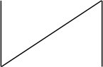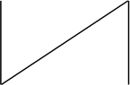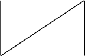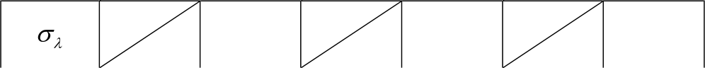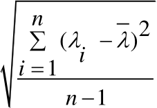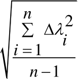

便等特点，尤其是在温度数字化、温度控制以及用微机进行温度实时讯号处理等方面优于其它传感器，所以它的应用越来越广泛。   一、 实验目的

1.了解  PN  结正向电压随温度变化的基本规律。  2.在恒流供电条件下，测绘  PN  结正向电压随温度变化的关系图线，并由此确定  PN  结的测温灵敏度和被测  PN  结材料的禁带宽度。

二、实验仪器

PN 结正向特性综合实验仪，DH-SJ5  温度传感器实验装置。

三、 实验简介

由  P  型半导体和  N  型半导体相互接触形成的空间电荷区，称为  PN  结。当外加电场与  PN  结空间电荷

区的内建电场方向相反时，外电场削弱内建电场，使  PN  结导通，此时加在  PN  结上的电压称为正向电压（图

4.4-1）。本实验研究  PN  结上的正向电压随温度变化的关系。由半导体理论，当以温度*t*  	o0 C时的正向电压	*V*（ ）为基准时，其它温度下的正向电压*F*0	*V*  满足*F**V**F**V**F*(0) *k*ln(*C I**F*) /*qt*，式中*C q*  分别为与  PN

结有关的参量、载流子的电荷量，当  PN  结制好后，两者均为常数。  ,*k I*  分别为玻尔兹曼常数、正向电流，*F* 实验中正向电流 	*F**I*  采用恒流源。即*V**F**V**F*(0)与温度*t*  成正比，比例系数*S*=*k*ln(*C I**F*) /*q*  称为温度传

感器的灵敏度系数。因此通过测量不同温度下的*V**F**V**F*(0)值，即可得到  PN  结作为温度传感器的灵敏度系

<table>
<tr><td>数 *S*  ；在半导体理论中，温度为*T*  </td><td>0K</td><td>时，载流子从价带顶跳到导带底所需的最小能量称为是禁带宽度，</td></tr>
<tr><td>禁带宽度</td><td>*E**g*(0)</td><td></td><td>*q V**F*</td><td>(0)</td><td></td><td>273.2 )</td><td>，因此通过测定</td><td>*t*  </td><td>o0 C</td><td>时的正向电压*V*（ ）及灵敏度系数 *S*  即可间接测*F*0</td></tr>
</table>

出禁带宽度。

外电场

<table>
<tr><td></td><td></td></tr>
<tr><td></td><td></td><td></td></tr>
<tr><td></td><td></td><td></td></tr>
</table>

| 势差*V**g*(0)的乘积，即*E**g*(0)*qV**g*(0)。根据式(4.4-4)，有 当*t*  0℃时，*T*  =273.2K,*V**F**V**F*(0),有 *V**g*(0)*V**F*(0)273.2*S* 所以 *E**g*(0)*qV**g*(0) 公式（4.4-14）即为禁带宽度的计算公式。  五、实验过程与步骤 | （4.4-12） （4.4-13） |
|---|---|

5.1 熟悉仪器结构及使用方法。实验仪器结构及连接方式如图 4.4-2 及图 4.4-3 所示（使用说明参见附录）。

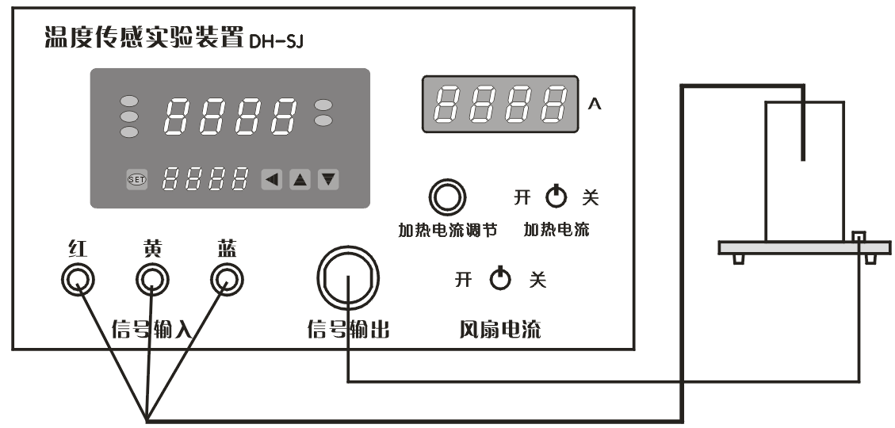

图  4.4-2 DH-SJ5  温度传感器实验装置及连接示意图

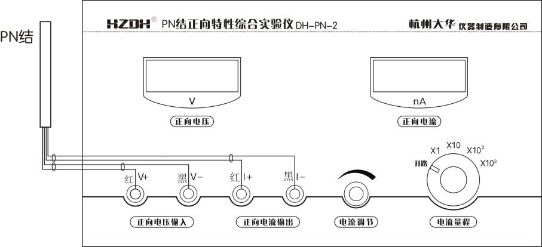

图 4.4-3 PN 结正向特性综合实验仪与 PN 结的连接示意图

实验前，将 DH-SJ 型温度传感器实验装置上的“加热电流”开关置“关”位置，将“风扇电流”开关

置“关”位置，接上加热电源线。插好  Pt100  温度传感器和  PN  结温度传感器，两者连接均为直插式。PN

结引出线分别插入  PN  结正向特性综合试验仪上的+V、-V  和+I、-I。注意插头的颜色和插孔的位置。打开电

源开关，温度传感器实验装置上将显示出室温  TR，记录下起始温度  TR。

注意：Pt100  的插头与温控仪上的插座颜色对应得相连接。红→红；黄→黄；蓝→蓝。

警告：在做实验中或做完实验后，禁止手触传感器的钢质护套，以免烫伤！

**5.2**  测量同一温度下，正向电压随正向电流的变化关系，绘制伏安特性曲线**(**选做**)**。

（1）在实验前先将仪器通电预热  10  分钟，保证仪器工作的稳定性。并以室温为基准，测量整个伏安

特性实验的数据。然后按如下操作进行实验。

（2）将  PN  结正向特性综合试验仪上的电流量程置于×1  档，调整电流调节旋钮，观察对应的  VF  值应

有变化的读数。可以按照数据记录表  4.4-1  的  VF  值来调节设定电流值，如果电流表显示值到达  1000，可以

改用大一档量程，记录下一系列电压、电流值于表  4.4-1。由于采用了高精确度的微电流源，这种测量方法

可以减小测量误差。

注意：在整个实验过程中，都是在室温下测量的。实际的  VF  值的起、终点和间隔值可根据实际情况微调。

**5.3**  在同一恒定正向电流条件下，测绘 **PN**  结正向压降随温度的变化曲线，确定其灵敏度，估算被测 **PN**  结

材料的禁带宽度。

（1）选择合适的正向电流  IF，并保持不变。一般选小于  100μA  的值，以减小自身热效应。

（2）将  DH-SJ  型温度传感器实验装置上的“加热电流”开关置“开”位置，根据目标温度，选择合适

的加热电流，在实验时间允许的情况下，加热电流可以取得小一点，如  0.3～0.6A  之间。

（3）记录对应的  VF  和  T  于表  4.4-2。为了更准确地记数，可以根据  VF  的变化，记录  T  的变化。

注意：在整个实验过程中，正向电流  IF  应并保持不变。设定的温度不宜过高，必须控制在  120℃以内。

六、数据记录与处理

表  4.4-1    同一温度下正向电压与正向电流的关系              T=                ℃ （选做）

<table>
<tr><td></td></tr>
<tr><td>（1）以公式</td><td>*I*  </td><td>*A*</td><td>exp(*BV**F*)</td><td>的正向电流  IF  和正向压降 *V**F*  为变量，根据表  4.4-1  测得的数据，以 *V**F*</td></tr>
<tr><td>为  x  轴数据，*I**F*  为  y  轴数据，用  Excel  拟合参数  A、B，再由  A=*Is*，估算出反向饱和电流；*B*  </td><td>*q*</td><td>*kT*</td><td>，求出</td></tr>
</table>

玻尔兹曼常数 *k* =          。

| 序号 | 1 | 2 | 3 | 4 | 5 | 6 | 7 | 8 |
|---|---|---|---|---|---|---|---|---|
| ***T*****/**℃ |  |  |  |  |  |  |  |  |
| ***V******F*****/V** |  |  |  |  |  |  |  |  |
| 序号 | 9 | 10 | 11 | 12 | 13 | 14 | 15 | 16 |
| ***T*****/**℃ |  |  |  |  |  |  |  |  |
| ***V******F*****/V** |  |  |  |  |  |  |  |  |
| 序号 | 17 | 18 | 19 | 20 | 21 | 22 | 23 | 24 |
| ***T*****/**℃ |  |  |  |  |  |  |  |  |

温度的测量以  Pt100  作为温度传感器，温控表内部使用  PID  控制温度，其相应的参数可以修改。温控

表的使用操作方法见图  4.4-4。

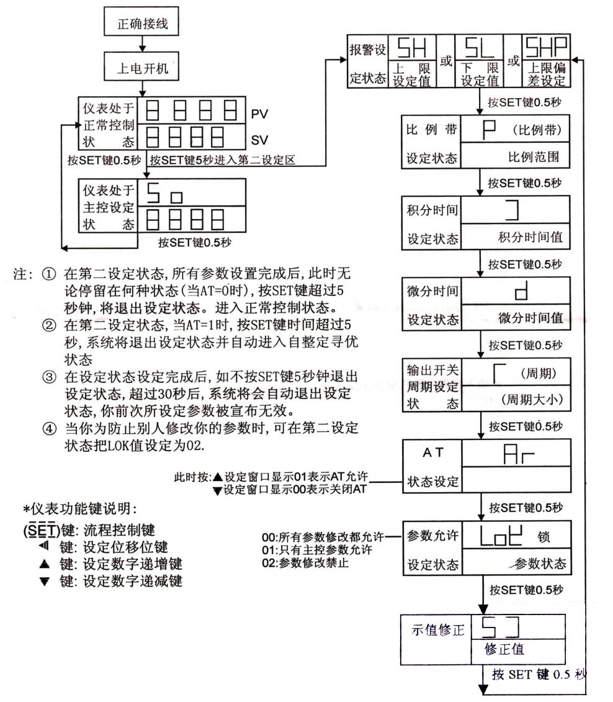

图  4.4-4    温控仪的使用方法

附加说明：

1）主控设定状态时，只要按“SET”键和三个方向功能键组合使用，调整好需要的温度即可，再按“SET”

键即可返回正常的控制显示状态

2)  第二设定状态一般情况下不需要更改，也不建议自行更改，如确需更改，长按“SET”键  5  秒，即可

进入设置菜单。

二）**DH-SJ**  温度传感器实验装置的使用    1、将  Pt  铂电阻传感器插入温度传感器实验装置的加热炉孔中。    2、控温“加热电流”开关置“关”位置，接上加热电源线和信号传输线，两者连接均为直插式。在连接和

拆除信号线时，动作要轻，否则可能拉断引线影响实验。

3、插上电源线，打开电源开关，预热几分钟，待温度传感器实验装置所示温度值稳定之后，此时显

示即为室温  TR，可记录下起始温度  TR。

4、“加热电流”开关置“开”位置，根据需要的温度，转动“加热电流调节”电位器，选择合适的加热电流

大小。目标温度高，加热电流适当大点，目标温度低，加热电流要小一点。

5、将  PN  结温度传感器插入温度传感器实验装置的加热炉孔中。

6、PN  结管上的有两组线共  4  个插头，将对应颜色的插头接入  PN  结实验仪上的相应颜色的插孔中。

7、实验结束后，或者需要降温时，接通“风扇电流”开关即可。

三）PN 结正向特性综合实验仪的使用

PN  结传感器与  PN  结实验仪的连接如图  4.4-2。“正向电流”数显表显示的是 PN 结的正向电流。“正

向电压”数显表显示的是 PN 结的实时正向电压。微电流源的有效量程分为  4  个档位，范围从  1nA～1mA

分段可调。开路档时正向电流源出为  0。电流量程档位与正向电流大小之间的关系是这样的：正向电流表

显示的数值×开关所处的档位值，例如，若正向电流表此时显示：100，电流量程开关所处的档位：×10，

那么此时的正向电流  I=100×10 =1000 nA，注意单位是  nA。电流表最大显示是  0～1999，电流量程档位×1，

×10，×102，×103 对应为  1.999μA，19.99μA，199.9μA，1.999mA。

注意事项

1、在选择电流量程时在保证测量范围的前提下尽量选择小档位，以提高精度。

2、为了保证微电流源的准确性，仪器内部显示电路与微电流源是不共地的，所以与常规电流源不同

的是：当负载开路时显示的电流信号不为零。这是正常的，并且也有一个好处是我们可以在不接负载时就

能预先设定需要的电流。

3、仪器出厂时已经校准。请不要用普通的万用表或其他仪器，直接测量或比对  PN  结的正向电压和正

向微电流，否则会得到失准的结果，原因是  PN  结实验时处于高阻状态。

4、仪器的电压表测量电压量程仅为  2V，请不要超量程使用或测量其他未知电压。

5、仪器的连接线要注意使用，有插口方向的要对齐插拔，插拔时不可用力过猛。

6、加热装置温升不应超过+120℃，否则将造成仪器老化或故障。

7、使用完毕后，一定要切断电源。并存放于干燥、无灰尘、无腐蚀性气体室内。

参考文献：  [1]  倪新蕾，梁海生，等.大学物理实验[M].广州：华南理工大学出版社,2005.   [2]  王青狮主编.  大学物理实验[M].  北京：科学出版社, 2010.

实验 **3.10** 空气比热容比的测量

理想气体的比热容比（又称绝热指数）是热力学理论及工程技术应用中的一个常用而且重要的物理量,

对气体比热容比的准确测量也是物理学基本测量之一。目前气体比热容比的常用测量方法有绝热膨胀法、

振动法、声速法、传感器法等，各方法都有自己的优缺点，其中绝热膨胀法是最常用的方法之一。本实验

正是采用绝热膨胀法来测定空气的比热容比。

一 实验目的

1. 观测热力学过程中气体状态的变化情况及基本物理规律。

2. 用绝热膨胀法测定空气的比热容比。

二 实验仪器与装置

| 如图  3.10-1  为绝热膨胀法测定空气比热容比的实验平台装置及接线图。本实验的仪器包括热学综合实验平台、空气比热容比附件和电阻箱等。  	实验温度的测量采用电流型半导体集成温度传感器。该传感器灵敏度高、线性好，在其与工作电源、取样电阻构成的串联回路中，如图  3.10-2  所示，回路电流与温度的关系为  1uA/。若取样电阻为  5K，可产生  5mV/的信号电压，接  0-2V  量程四位半数字电压表，可检测到最小  0.02温度变化。实验过程中，测量取样电阻两端的电压值，就可换算出传感器所在点的温度来。气体的压强 由气体压力传感器来测量，它由同轴电缆线输出信号，与仪器内的 | 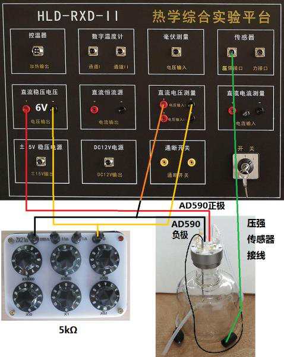 图 3.10-1 实验接线图 |
|---|---|

放大器及三位半数字电压表相接组成，测量气体压强的范围为

<table>
<tr><td>0-100KPa。</td><td>*C**P*</td><td>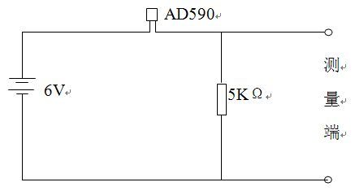</td><td>与定容</td></tr>
<tr><td>三 实验原理</td><td></td><td></td><td></td></tr>
<tr><td>理想气体的比热容比  γ  定义为气体的定压比热容</td><td></td><td></td><td></td></tr>
<tr><td>比热容</td><td>*C*  之比，即 *V*</td><td></td><td></td><td></td></tr>
<tr><td>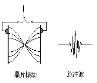</td><td>（3.10-1）</td><td></td><td>图  3.10-2  AD590 的测温电路</td><td></td></tr>
</table>

在热力学过程特别是绝热过程中，  是一个很重要的参数。

本实验的热力学系统是干燥空气，放在玻璃材质的贮气瓶中。实验时，首先打开贮气瓶的进气阀，关

| 闭放气阀，将一定量的原处于环境大气压强 | 0*P*  、室温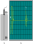的空气从进气阀处缓慢压入贮气瓶内，这时瓶内空 |
|---|---|

气压强增大，温度升高。然后关闭进气阀，瓶内空气将等容放热，直至其温度降为室温*T*  ，压强稳定，此0

时瓶内空气达到状态，其中*V*  是贮气瓶的体积。接着突然打开贮气瓶的放气阀，使瓶内空气与

1

大气相通，此时空气到达状态*II*(*P*0,*V*1*V*,*T*1)，其中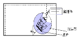是放气过程中从贮气瓶逸出的空气的体积，当听

到贮气瓶的放气声结束时迅速关闭放气阀。最后，贮气瓶内的空气将等容吸热，直到其温度恢复到室温  T0，

压强稳定，此时瓶内空气达到状态*III*(*P*2,*V*1,*T*0)。

从状态 *I*  到状态的放气过程很短，可以认为是一个绝热膨胀过程，满足理想气体的绝热方程为

| (*P*1 *P*0 | )1 |  | (*T*0*T*1 | ) | （3.10-2） |
|---|---|---|---|---|---|

从状态 *II*  到状态 *III*  是等容吸热过程，满足的理想气体状态方程为

<table>
<tr><td></td><td>*P*  *P*2</td><td>*T*1</td><td>( 3.10-3)</td></tr>
<tr><td>将(3.10-3)  式代入(3.10-2)  式,  消去</td><td></td><td>*T*0</td><td></td></tr>
<tr><td></td><td>*T*  ,  整理后可得</td><td></td></tr>
<tr><td></td><td>*T*0</td><td>lg</td><td>*P*0</td><td>（3.10-4）</td></tr>
<tr><td></td><td></td><td>lg</td><td>*P*1</td><td></td><td></td><td></td><td></td></tr>
<tr><td></td><td></td><td>lg</td><td>*P*1</td><td></td><td>lg</td><td>*P*2</td><td></td></tr>
</table>

根据（3.10-4）式,  只要测出环境大气压强0*P*  和绝热膨胀开始前瓶内空气状态稳定时的压强1*P*  ,  以及放气后

经过等容吸热瓶内空气状态稳定时的压强2*P*  ,  就可以计算出空气的比热容比  。

<table>
<tr><td>干燥空气是以氮气和氧气为主要成份的气体,</td><td>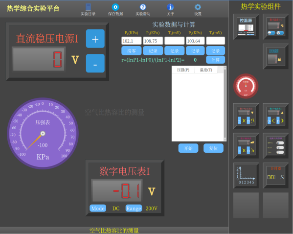</td><td>在温</td></tr>
<tr><td>度不太低、压强不太高的条件下,  可以近似认为</td><td></td><td>是双</td></tr>
<tr><td>原子理想气体,  其比热容比的理论值近似为</td><td></td><td>的 正</td></tr>
<tr><td></td><td>.140</td><td>。</td><td></td><td></td></tr>
<tr><td>四 实验内容和步骤</td><td></td><td></td></tr>
<tr><td>1  按图3.10-3所示的接线图接好线（请勿将AD590</td><td></td><td></td></tr>
<tr><td>负极接错），打开实验平台的电源（将平台右下</td><td></td><td>角 的</td></tr>
<tr><td>钥匙转动到“开”的位置即可）。</td><td></td><td></td></tr>
<tr><td>2  如图3.10-3所示，在平台的界面上，先点击“实</td><td>图  3.10-3  实验平台</td><td>验目</td></tr>
</table>

录”，选择“空气比热容比实验”，再从右侧“热学实验组件”中拖出直流稳压电源Ⅰ，压强表，数字电压表Ⅰ

模块。

3  调节直流稳压电源Ⅰ至6V，调节数字电压表Ⅰ的量程至2V档。

4  打开放气阀，观察压强表示数是否为0，否则使用压强表模块调零功能将其调为零。

5  先关闭放气阀，触摸平台界面右侧数据记录表格下的“开始”按钮，并打开进气阀。再用手挤压打气球，

向贮气瓶内压入适量的空气（建议压强值介于  30KPa  到  100之间），最后关闭进气阀。此时， 压力传

感器和  AD590  温度传感器将自动测量和显示贮气瓶内空气的压强和温度。当贮气瓶内空气的状态稳定时，

| 对应的压强值和温度值为 | 1*P*  和 | *T*  （室温）。 0 |
|---|---|---|

6  突然打开放气阀，使瓶内气体与大气相通，当听到放气声消失瞬间，迅速关闭放气阀（由于传感器显示

滞后，所以以放气声消失作为操作依据）。此时贮气瓶内空气压强降低至环境大气压强0*P*  。

| 7  当贮气瓶内空气的温度上升至室温*T*  且压强稳定时记下贮气瓶内气体的压强0 | 2*P*  ，同时触摸平台上的停止 |
|---|---|

按钮，停止记录瓶内空气的温度和压强。

8  查看所记录的数据，选择合适数据输入对应输入框中，触摸计算按钮即可算出所测空气的比热容比。将

对应的实验数据记录在表  3.10-1  内。

9  重复以上步骤，进行多次测量，求  的平均值和误差。

表  3.10-1  实验数据记录表

<table>
<tr><td>xB xA D 					A					H				L 		B 	C （105Pa）</td><td>1*P*  (105Pa)</td><td>1*T*  (mV)</td><td>2*P*  (105Pa)</td><td>(mV)</td><td></td><td>	 平均</td></tr>
<tr><td></td><td></td><td></td><td></td><td></td><td></td><td></td></tr>
<tr><td></td><td></td><td></td><td></td><td></td><td></td><td></td></tr>
<tr><td></td><td></td><td></td><td></td><td></td><td></td><td></td></tr>
<tr><td></td><td></td><td></td><td></td><td></td><td></td><td></td></tr>
<tr><td></td><td></td><td></td><td></td><td></td><td></td><td></td></tr>
</table>

五 实验注意事项

1  实验中打开放气阀放气时，当听到放气声结束应迅速关闭阀门，提早或推迟关闭，都将不满足实验

要求的条件，引入误差。由于数字电压表尚有滞后显示，如用计算机实时测量，发现此放气时间约零点几

秒，并与放气声产生消失很一致，所以用听声来决定阀门关闭时间更可靠些。

2  实验要求环境温度基本不变，如发生环境温度不断下降的情况，可在远离实验仪处适当加温，以保

证实验正常进行。

3  仪器密封装配后必须等胶水变干且不漏气，方可做实验。

4  打气球橡胶管插入前可先沾清水(或肥皂水)，然后轻轻推入，以防止断裂。

六 思考题

1  实验过程中，有哪些环节会引入实验误差，如何操作才能减小误差？

2  本实验是测室温下空气的比热容比，如果要测量不同温度下空气的比热容比，仪器该怎样改进？

3  试着画出实验过程中的*P*  *V*曲线图。 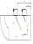

实验 **3.3**  共振法测量材料的杨氏模量

杨氏模量是固体材料的重要力学性质，它反映了固体材料抵抗外力产生拉伸（或压缩）形变的能力，

是选择机械构件材料的依据之一。杨氏模量的测量方法有多种，如拉伸法、弯曲法、共振法等等。拉伸法

常用于形变大、常温下的测量。但该方法使用的载荷较大，加载速度慢，有弛豫过程，不能真实地反映材

料内部结构的变化，且不适用于脆性材料，和材料在不同温度时的杨氏模量的测量。共振法不仅克服了拉

伸法的上述缺陷，而且更具有实用价值。它不仅适用于轴向均匀的杆（管）状金属材料，也可用于脆性材

料的杨氏模量与共振参数的检测。因此，共振法成为国家标准  GB/T2105-91  推荐使用的测量方法。

一、实验目的

4． 学习用共振法测量材料的杨氏模量；

5． 学习用外延法测量、处理实验数据；

6． 培养综合运用知识和使用常用实验仪器的能力。

二、实验仪器

FB2729A  型动态杨氏模量实验仪、多功能音频信号源、双踪示波器、电子天平、钢板尺、游标卡尺等。

三、实验原理

**1**．共振法测杨氏模量的物理基础

共振法测量杨氏模量是以自由梁的振动分析理论为基础的。根据棒的横振动方程

<table>
<tr><td></td><td>4*Y*</td><td></td><td>*S*</td><td></td><td>2*Y*</td><td>0</td><td>（3.3-1）</td></tr>
<tr><td>*x*</td><td>4</td><td></td><td>*EJ*</td><td>*t*</td><td>2</td><td></td><td></td></tr>
</table>

式中，Y  为棒位于 *x*  处的质元的振动位移；*E*  为棒的杨氏模量；S  为棒的横截面积；J  为棒的转动惯量；

为棒的密度；*x*  为质元的位置坐标；t  为时间变量。

分离变量法求解棒的横振动方程，另  Y(*x*，*t*) = X(*x*)·T(*t*)，代入方程（3.3-1）得

<table>
<tr><td>1</td><td>4 *d X*</td><td></td><td>*s*</td><td>1</td><td>2 *d T*</td><td></td><td>（3.3-2）</td></tr>
<tr><td>4 *X d x*</td><td></td><td>*EJ T dt*</td><td>2</td><td></td><td></td></tr>
</table>

可以看出，上式两边分别是 *x*  和 *t*  的函数，只有都等于一个任意常数时才有可能使等式成立。设这个

常数为 *K*4，得

<table>
<tr><td>4 *d X*</td><td></td><td>4 *K X*</td><td></td><td>0</td><td></td><td></td><td></td></tr>
<tr><td>4 *d x*</td><td></td><td></td><td></td><td></td><td>0</td><td></td><td>（3.3-3）</td></tr>
<tr><td>2 *d T*</td><td></td><td>4 *K EJ T* *s*</td><td></td><td></td><td></td><td></td></tr>
<tr><td>*dt*</td><td>2</td><td></td><td></td><td></td><td></td><td></td><td></td></tr>
</table>

解这两个线性常微分方程，得通解

| *Y x t*( , ) |  | ( | *Achkx*1 |  | *A shkx*2 |  | *B*1 | cos | *kx* |  | *B*2 | sin | *kx*)cos( |  | ) |  |
|---|---|---|---|---|---|---|---|---|---|---|---|---|---|---|---|---|

样棒作受迫横向振动，试样棒另一端的悬丝再把试样棒的机械振动传给换能器，将机械振动信号又变成电

信号。该信号经选频放大器的滤波放大，再送至示波器显示。

当信号源的频率不等于试样棒的固有频率时，试样棒不发生共振，示波器上几乎没有电信号波形或波

形幅度很小。当信号源的频率等于试样棒的固有频率时，试样棒发生共振，这时示波器上的波形幅度突然

增大，此时仪器读出的频率就是试样棒在该悬挂条件下的共振频率。

图  3.3-2

棒的横振动节点与振动级次有关。图  3.3-2  给出了 *n* = 1、2、3、4  时的振动波形。从 *n*  = 1  的图可以看

出，试样棒在作基频共振时存在两个节点，它们的位置距离其中一个端面分别为  0.224*L*  和  0.776*L*  处。理

论上悬挂点应取在节点处，此时试样棒的共振频率才是共振基频。

在实验上，由于悬丝对试样棒振动的阻尼，所检测到的共振频率大小是随悬挂点的位置而变化的。由

于压电换能器所拾取的是悬挂点的加速度共

| 振信号，而不是振幅共振信号，并且所检测到 的共振频率随悬挂点到节点的距离增大而增 大。若要直接测量试样棒的基频共振频率，只 有将悬丝挂在节点处。处于基频振动模式时， 试样棒上存在两个节点，它们的位置距离其中 的端面分别为  0.224*L*  和  0.776*L*  处。由于在节 点处的振幅几乎为零，很难激振和检测，所以 要想测得试样棒的基频共振频率，就需要采取 外延测量法。所谓外延测量法，就是所需要的 数据在测量数据范围之外，一般很难测量，为 了求得这个数值，采用作图外推求值的方法。 |  图  3.3-3  悬挂、支撑式动态杨氏模量测试台 |
|---|---|

就是说，先使用已测数据绘制出曲线，再将曲线按原规律延长到待求值范围，在延长部分求出所要的值。

值得注意的是，外延法只适用于在所研究范围内没有发生突变的情况，否则不能使用。

需要说明的是，试样棒的固有频率 *f*固  和基频共振频率 *f*共  是两个不同的概念，它们之间的关系为

<table>
<tr><td>*f*固</td><td></td><td>*f*</td><td>共</td><td>1</td><td></td><td>1</td><td>2</td><td>（3.3-7）</td></tr>
<tr><td></td><td></td><td></td><td></td><td></td><td></td><td>4*Q*</td><td></td><td></td></tr>
</table>

式中 *Q*  为试样棒的机械品质因数。对于悬挂法测量，一般 *Q*  值大于  50，基频共振频率和固有频率相

比只偏低  0.005％，所以在实验中可以用基频共振频率代替固有频率，用（3.3-6）式计算杨氏模量。

五、实验过程与步骤

（1）熟悉动态杨氏模量测试仪的结构及使用方法（图  3.3-3）。把实验仪器连接好，通电预热10分钟。

（2）测定试样的长度 *L*、直径 *d*  和质量 *m*，每个物理量各测  5  次，数据记录于表  3.3-1。计算试样棒的两

个节点位置（0.224*L*  和  0.776*L*），并在试样棒上标明。两个节点位置将作为试样棒悬挂点位置坐标的坐标

<table>
<tr><td>0.224*L*</td><td>10	30</td><td>0.224*L*</td></tr>
<tr><td></td></tr>
</table>

-30	-10*O*2020*O*-10-30

图  3.3-4  悬挂坐标标示

原点  O。在试样棒上标定测量共振频率时各悬挂点的位置（图  3.3-4）。

（3）如图  3.3-2  所示，将试样棒悬挂于两悬线上，两悬线挂点为-30mm，-30mm  处，调节横梁上活动支架

位置使悬线与试样棒轴向垂直，调节悬线长度使试样棒横向水平。待试样棒处于静止状态，再观察试样棒

安装是否合要求。

（4）待试样棒稳定之后，缓慢调节信号发生器频率旋钮，寻找试样棒的共振频率。当示波器荧屏上显示

的正弦波形幅度突然变大时，再调节信号发生器的频率微调旋钮，使波形振幅达到极大值，表明此时试样

棒处于共振状态。记录该位置的共振频率 *f*  。按照测量记录表格的要求，改变悬挂点和支架位置，测量在

不同悬挂状态下试样棒的共振基频，数据记录于表  3.3-2。

（5）“支撑式”：把试样棒从悬挂线上取下，轻放于测试台支撑式的激、拾振器的橡胶支撑刀上。把信号发

生器的输出与测试台的支撑式-输入相连，测试台的支撑式-输出与放大器的输入相接，放大器的输出与示

波器的  Y  输入相接。

（6）其余同“悬挂法”步骤。（选做）

六．数据记录和处理

1．实验测量数据记录

| 试样棒长度 *L*= | 103m  ；     试样棒质量 *m*= | 103  kg |
|---|---|---|

表  3.3-1  试样棒测量表 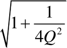

| 次数 | 1 | 2 | 3 | 4 | 5 |
|---|---|---|---|---|---|
| *d*  (×10-3m) |  |  |  |  |  |
| *L*  (×103m) |  |  |  |  |  |
| *m*  (×10-3kg) |  |  |  |  |  |

*d*  =

=

=

表  3.3-2  共振频率的测量

<table>
<tr><td>悬挂点位置 (mm)</td><td>25</td><td>20</td><td>15</td><td>10</td><td>5</td><td>-5</td><td>-10</td><td>-15</td><td>-20</td><td>-25</td></tr>
<tr><td>共 振 频 率 *f* (Hz)</td><td>1</td><td></td><td></td><td></td><td></td><td></td><td></td><td></td><td></td><td></td><td></td></tr>
<tr><td></td><td>2</td><td></td><td></td><td></td><td></td><td></td><td></td><td></td><td></td><td></td><td></td></tr>
<tr><td></td><td>3</td><td></td><td></td><td></td><td></td><td></td><td></td><td></td><td></td><td></td><td></td></tr>
<tr><td></td><td>*f*</td><td></td><td></td><td></td><td></td><td></td><td></td><td></td><td></td><td></td><td></td></tr>
</table>

2．用外延法求基频共振频率1*f*

以悬挂点位置为横坐标 *x*，共振频率 *f*  为纵坐标，在直角坐标纸上按作图规范作 *x*- *f*  图线，并从图线

确定试样棒的基频共振频率1*f*  。（当*x*0时，纵坐标 *f*  值即为基频1*f*  。）

3．根据所测量数据，计算试样棒杨氏模量 *E*  。

注意事项

1．试样棒不可随处乱放，保持清洁，拿放时应特别小心。

2．悬挂试样棒后，应移动悬挂横杆上的激振，拾振器到既定位置，使两根悬线垂直试样棒。

3．更换试样棒要细心，避免损坏激振，拾振传感器。

4．实验时，试样棒需稳定之后才可以进行测量。

思考题

1． 试讨论：试样的长度 *L*、直径 *d*、质量 *m*、共振频率 *f*  分别应该采用什么规格的仪器测量？为什么？

2． 估算本实验的测量误差。提示：可从以下几个方面考虑：

（1）仪器误差限；

（2）悬挂/支撑点偏离节点引起的误差。

|  |  |
|---|---|

附录一、多功能物理实验信号源面板图

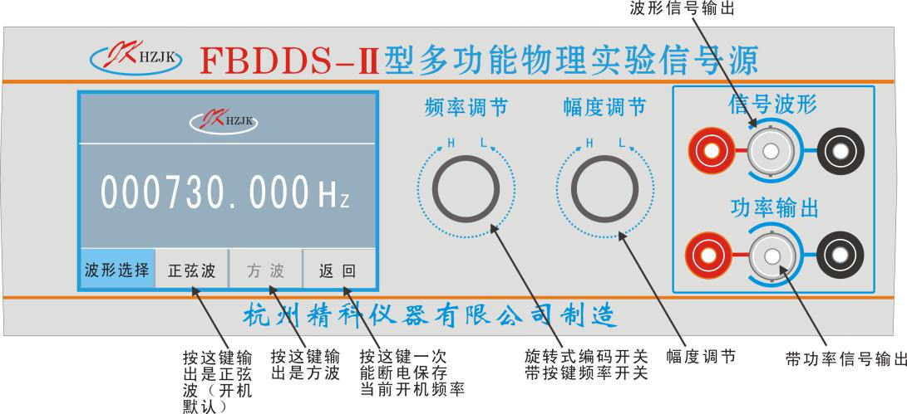

实验 **4.2** 迈克尔逊干涉仪的调整与使用

1881  年美国物理学家迈克尔逊（Albert Abrham Michlson,1852-1931）为了测量光速，依据分振幅产生

双光束实现干涉原理，精心设计了一种干涉测量装置——迈克尔逊干涉仪。迈克尔逊-莫雷（Morley，

1838-1923）用此仪器完成了在相对论中有重要意义的“以太”漂移实验，彻底否定了“以太”的存在，为爱因

斯坦提出的相对论提供了实验依据。迈克尔逊干涉仪能以极高的精度测量长度的微小变化，并可观察和分

析各种干涉现象。在光谱学方面，迈克尔逊利用其所设计的干涉仪发现了氢光谱以及水银和铊光谱的超精

细结构，为现代原子光谱、分子光谱和激光光谱学等学科的发展奠定了理论和实验的基础。在计量学方面，

迈克尔逊发现国际米原器长度即  1  米等于  1553163.5  倍的红镉谱线的波长（6438.4722A），国际计量局决定

以镉的波长测定国际米原器的长度，迈克尔逊的工作为人类获得的长度统一基准奠定了基础。因为迈克尔

逊对光学精密仪器，以及用之于光谱学和计量学研究所做的贡献，所以获得了  1907  年的诺贝尔物理学奖。

一、实验目的

（1）了解迈克尔逊干涉仪的结构、原理及调节方法；

（2）观察点光源的非定域干涉现象和扩展光源的等倾干涉和等厚干涉现象；

（3）利用迈克尔逊干涉仪测量  He-Ne  激光器的波长；

（4）利用等倾干涉条纹测定钠光灯黄双线波长差。

二、实验仪器

迈克尔逊干涉仪、He-Ne  激光器、低压钠灯、扩束镜、观察屏等。

三、实验原理

1.光路原理

M1

M2'

1

M2

B

| S  * | G1 | G2 | 2 |
|---|---|---|---|

A

E

眼睛

图  4.2-1  迈克尔逊干涉仪光路图 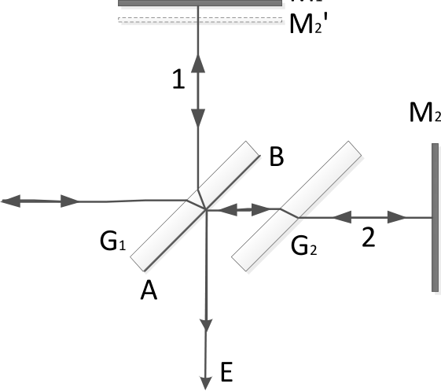

迈克尔孙干涉仪的光路原理图如图  4.2-1  所示。从光源  S  发出的光束入射到分光板  G1  上，G1  板的后表

面镀有半透明的金属膜  AB（镀银或铝），这个反射膜将入射光分成强度近似相等的反射光  1  和透射光  2，

这两束光分别垂直射向反射镜  M1  和  M2，经  M1  和  M2  反射后沿原光路返回到  G1后表面进行透射和反射，

沿着  E  方向传播的两束光产生会聚，由于这两束光频率相同，振动方向相同且相位差恒定（即满足干涉条

件），因此形成干涉。在光路中为了补偿  1  号光束在  G1  板中往返两次所多走的光程，在光路  G1  与反射镜

M2  间插入补偿板  G2，G2  板的材料性质、几何形状、厚度与  G1  相同，方向与  G1  板平行。

眼睛从  E  点向  G1  板看去，除了能看到  M1  镜对光源产生的像以外，还能看到  M2  在  G1  中的反射像  M2’。

对于观察者来说，由  M1  和  M2  反射所引起的干涉可以看成由  M1  和  M2’之间的空气层上下表面反射光所形

成的干涉。它的优越之处在于  M2’不是实物，因而可以通过任意改变  M1  或  M2  的位置，使得  M2’在  M1  之

前或之后，或使它们相交，或完全重叠和平行，进而根据薄膜干涉加以讨论。

2.点光源产生的非定域干涉

S1'

<table>
<tr><td>Z</td><td>L</td><td>2d</td><td>S2'</td><td>δ</td><td>M2</td><td>S'</td></tr>
<tr><td></td><td></td><td>d</td><td></td><td>M1</td><td></td><td></td></tr>
<tr><td></td><td></td><td></td><td></td><td>M2'</td><td></td><td></td></tr>
<tr><td></td><td></td><td>S</td><td>G1</td><td>G2</td><td>P</td><td></td></tr>
<tr><td></td><td></td><td></td><td></td><td>O</td><td></td><td></td></tr>
</table>

r

图  4.2-2  点光源的非定域干涉

可以用激光作为光源来观察迈克尔逊干涉仪的非定域干涉现象。如图  4.2-2  所示，用短焦距透镜  L  将

激光光束会聚成一个很高亮度的点光源  S，射向迈克尔逊干涉仪，点光源经平面镜  M1、M2  反射后，相当

于由两个点光源  S1’和  S2’发出的相干光束。S’是  S  的等效光源，是经半反射面  G1  所成的虚像。S1’是  S’经

M1  所成的虚像。S2’是  S’经  M2’所成的虚像。由图  4.2-2  可知，只要观察屏放在两点光源发出光波的重叠区

域内，都能看到干涉现象，故这种干涉称为非定域干涉。

|  | 如果在垂直于  S1’S2’连线的位置观察，则可以看到一组同心圆，而圆心就是  S1’S2’连线与观察屏的 |
|---|---|

焦点  O。由于同一级次干涉条纹上各点对虚光源的倾角相同，所以这一干涉条纹又称为点光源等倾干涉条

纹。 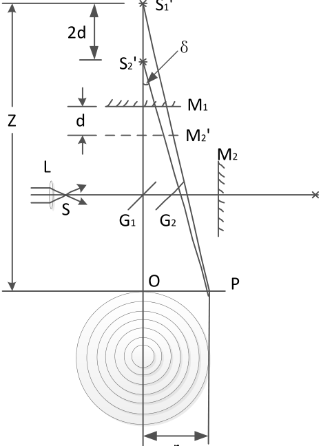

| 由图  4.2-2  可以计算出  S1’和  S2’到屏上任一点的光程差  α=*S*  '1 | *P* | -*S*  '2 | *P* | 。考虑到 | *d*   | *z* | ，且  δ  角很小， |
|---|---|---|---|---|---|---|---|

从图上可以看出

|  | 2 cos |  | 2 (1 |  | 1 | 2) | （4.2-1） |
|---|---|---|---|---|---|---|---|
|  |  |  |  |  | 2 |  |  |

若入射光是单色光，波长为  λ，则观察屏上明暗干涉条纹位置满足以下条件：

<table>
<tr><td></td><td>2 cos</td><td>   	2*k*</td><td></td><td>*k*</td><td>（明纹中心）</td><td>（k=1,2,3，…） （4.2-2）</td></tr>
<tr><td></td><td></td><td></td><td></td><td>1/ 2</td><td>（暗纹中心）</td><td></td></tr>
</table>

由明纹成立的条件可知，点光源非定域干涉的特点是：

（1）当  d、λ  一定时，具有相同倾角  δ  的所有光线的光程差相同，所以干涉情况也相同，对应于同一

级次，形成以光轴为中心的同心圆。

（2）当  d、λ  一定时，δ=0  时光程差最大，光程差  α=2d  最大，即圆心处的干涉级最高（K  最高）；δ≠0

时，δ  越大，干涉级次越低（k  值越小），对应的干涉条纹越往外。

（3）当  d、λ  一定时，d  逐渐减小，δ  也逐渐减小，即同一级次  k  的条纹，当  d  减小时，该级圆环往

回缩；反之，d  逐渐增加，干涉圆环向外冒。对于中央条纹，每冒出或者缩回一次，对应于反射镜  M1  移动

的距离为  λ/2。当缩回或冒出  N  次，则光程差变化  2Δd=Nλ（Δd  为  d  的变化量），

|  |   2 | *d* | （4.2-3） |
|---|---|---|---|
|  |  | *N* |  |

从仪器上读出，并数出相应的条纹变化条数 *N*，就可由上式测出光波的波长  λ。若将  λ  作为标准

值，测出冒出或消失 *N*  个圆环时  M1  移动的距离，与由（4.2-3）式算出的理论值比较，可以校正仪器传动

系统的误差。

3.扩展光源的定域干涉

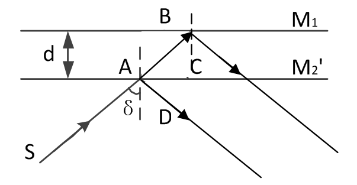

图  4.2-3  等倾干涉

（1）等倾干涉。调节迈克尔逊干涉仪的反射镜  M1  和反射镜  M2  互相垂直，即  M1  与  M2’互相平行。如

图  4.2-3  所示。由面光源上一点  S  发出的光，入射角为  δ，经过  M1  与  M2’反射后成互相平行的两束光，它

们的光程差的讨论结果与点光源非定域干涉类似，即

α=（+）―=2dcosδ                                  （4.2-4）

面光源上有无数个点  S  以同样的入射角  δ  入射，经过反射后都互相平行，它们在无穷远处相遇而产生

干涉，用眼睛观察观察同样可以看到一组同心圆干涉条纹。只不过这些条纹只能发生在空间某特定区域，

因此称为定域干涉。同时，各光点对于不同的入射角，干涉条纹的级次不同，所以称为等倾定域干涉。

<table>
<tr><td>模糊</td><td>清晰</td><td>再次模糊</td><td>光程差</td><td></td></tr>
<tr><td></td><td>2Δd</td><td></td><td></td><td></td></tr>
</table>

图  4.2-4  辐射能量分布与光程差的关系

钠光灯的黄光包括两条波长相近的谱线：λ1=588.996nm  和  λ2=589.593m  ，利用迈克尔逊干涉仪可以测

量其波长差。观测它们的等倾干涉条纹时，如果  λ2  的第 *k*1  级明条纹与  λ1  的第 *k*2  级暗条纹同时出现在等倾

干涉圆环状条纹的圆心，则此时光程差

|  |  | 2 | *d* |  | *k* |  |  | *k* |  |  | 1 |  |  | （4.2-5） |
|---|---|---|---|---|---|---|---|---|---|---|---|---|---|---|
|  |  |  |  |  |  |  |   |  | 2 |  | 2 |   | 1 |  |

这时  λ2  光的明条纹与  λ1  光的暗条纹重叠，两种光波的辐射能分布之和几乎处处相同，造成条纹在视

场中变模糊。如果移动  M1，可以看到条纹又逐渐变清晰。当  λ1  与  λ2  光的两个明条纹重合时，两种光波辐

射能分布之和出现了反差最大，视场中条纹最清晰。然后继续沿同一方向移动  M1，可以看到视场中的条

纹又会变得越来越不清晰。当  λ2  光的明条纹与  λ1  光的暗条纹再次重叠时，视场中的条纹再次模糊。这个

过程可用  λ1  光和  λ2  光的辐射能分布与光程差的关系来说明，如图  4.2-4  所示。这两次不清晰发生时，由于

M1  移动所附加的光程差正好满足：

<table>
<tr><td>*k*</td><td></td><td></td><td>*k*</td><td></td><td>1，即*k*</td><td></td><td></td><td>。                （4.2-6）</td></tr>
<tr><td>2</td><td></td><td></td><td></td><td></td><td>1</td><td></td><td></td><td></td></tr>
</table>

第二次模糊发生时的光程差

|  | ' |  | 2 | *d* |  | ( | *k* |  | *k*) |  | [*k* |  | (*k* |  | 1) | 1 | ] | （4.2-7） |
|---|---|---|---|---|---|---|---|---|---|---|---|---|---|---|---|---|---|---|
|  |  |  |  |  |  |  | 1 |  | 2 |  | 2 |  |  |  |  | 2 | 1 |  |

由（4.2-7）式减去（4.2-5）式并将（4.2-6）式带入，得

<table>
<tr><td>2(*d**d*)</td><td></td><td>*k*</td><td></td><td>(</td><td>*k*</td><td></td><td>1)</td><td></td><td> 12</td></tr>
<tr><td></td><td></td><td>2</td><td></td><td></td><td></td><td></td><td>1</td><td></td><td> 2</td><td></td><td> 1</td></tr>
</table>

设*d*'*d*Δ '为视场中的条纹连续出现两次模糊时  M1  所移动的距离，由上式可得 ：

<table>
<tr><td></td><td></td><td></td><td> 12</td><td></td><td>（4.2-8）</td></tr>
<tr><td>2</td><td></td><td>1</td><td>2</td><td>*d*</td><td>'</td><td></td></tr>
</table>

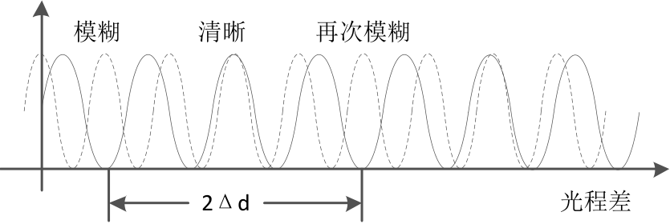

<table>
<tr><td>因为  λ1  与  λ2  的值很接近，可以认为</td><td>2</td><td></td><td>1</td><td></td><td>2</td><td>  ，于是有 0</td></tr>
<tr><td> </td><td></td><td>1</td><td>1</td><td></td><td></td><td></td><td></td><td></td><td></td></tr>
<tr><td></td><td></td><td>2</td><td></td><td></td><td>2</td><td></td><td></td><td></td><td></td></tr>
</table>

将（4.2-8）式中的  λ1λ2  用  替代，于是钠双线的波长差

|    				*d*			2 | ' 	 （4.2-9） |
|---|---|

故只需测出  Δd’，即可测出钠双线的波长差。

（2）等厚干涉。当  M1  与  M2  不垂直，也就是  M1  与  M2’不平行，而是有一个很小的夹角  θ  时，在  M1

和  M2’之间相当于有一个空气劈尖，用扩展光源照射时，就能出现等厚干涉条纹，它定域在空气劈尖附近。

由于夹角  θ  很小，仍可以用式（4.2-1）计算光程差，所以等厚干涉实际上是一种与倾角和空气层厚度有关

的干涉。

M2'

| M1 | θ | M1 |
|---|---|---|

M2'

图  4.2-5  劈尖干涉

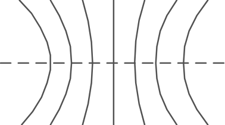

图  4.2-6  等厚干涉

当  M1  和  M2’相交时，其交线上的  d=0，则  α=0。考虑光线在空气劈尖的不同界面产生反射时的半波损

失，故在交线处为暗纹干涉，称为中央条纹。在交线两侧是两个对顶劈尖干涉，如图  4.2-5  所示。当夹角  θ

很小时，在交线附近的干涉条纹可近似为直线条纹，与中央暗纹平行。离中央条纹较远处，因受光线入射

角  δ  的影响较大而出现弯曲。随着视角  δ  的增加，θ  不变（即同一级次条纹的光程不变），就必须增大  d，

使观察到的同一级次条纹凹向两旁，如图  4.2-6  所示。

当用白光照射时，各种不同波长的光产生的干涉条纹明暗互相叠加，一般不出现干涉条纹。只有在

M1  和  M2’的交线上，对各种波长的光，其光程差均为  2  （反射时附加  2  ），故产生直线黑纹，即所谓的中

央条纹，两旁有对称分布的彩色条纹。d  稍大时，因对各种不同波长的光，满足明暗条纹的条件不同，所

产生的干涉条纹明暗互相重叠，结果就显不出条纹来。只有用白光才能判断出中央条纹，利用这一点可定

出  d=0  的位置。

当视场中出现中央条纹之后，在  M1  与  A  之间放入折射率为  nx、厚度为  D  的透明物体，则两光束光出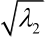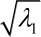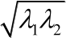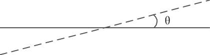

现光程差  α，有

|   | 2 (*D n*x |  | *n**o*) | （4.2-10） |
|---|---|---|---|---|

式中  no  为空气折射率。只有移动  M1  补偿由于插入透明物体而引起的光程差才能使两束光的光程差重新为

零，使中央明条纹出现，即

<table>
<tr><td></td><td>2 x</td><td></td><td>*x n**o*	*o*</td><td></td><td>2(</td><td>*n**x*</td><td></td><td>*n D**o*)</td><td></td><td></td><td>*n**o*</td><td>（4.2-11）</td></tr>
<tr><td></td><td></td><td></td><td></td><td></td><td></td><td></td><td>n</td><td>*x*</td><td></td><td> *D*</td><td></td><td></td><td></td></tr>
</table>

式中  x-xo  称为补偿距离。若已知透明物体的厚度  D，则可用上式测量透明物体的折射率  nx;反之，若已知

| 透明物体的折射率，则可以计算出被测透明物体的厚度  D。 |  |
|---|---|

四、仪器结构与调节

<table>
<tr><td>1</td><td></td><td>2</td><td></td><td>3</td></tr>
<tr><td></td><td></td><td></td><td></td><td></td><td></td></tr>
</table>

0.0002mm，微调范围为  0.5mm。直接读数就是将粗动测微手轮和微动手轮四位值相加。固定反射镜  M2（3），

分光板  G1（1）、补偿板  G2（7）,分别安装在平台上。它们与移动镜  M1  一起，构成了迈克尔逊干涉系统。

本装置在  M1  和  M2  反射镜的背面各装有两个倾角调节螺钉（2  和  5），可以缓慢的调节  M1  和  M2’间的

夹角，从而平稳的观察干涉条纹的变化。由于机械齿合等空隙的存在，所以在读数前要注意消除空回误差。

即将微动手轮朝着某一个方向连续转动直到所观察的干涉条纹开始出现连续变化时，才能开始读数，并且

在整个测量过程中微动手轮只能朝一个方向移动，不允许来回折返。

五、实验内容与步骤

特别提醒，迈克尔逊干涉仪属于精密光学仪器，调节时一定要谨慎小心，实验过程中不能用手触摸反

射镜、分光板、补偿板等光学器件表面。

1、迈克尔逊干涉仪的调节

（1）熟悉迈克尔逊干涉仪结构。调节光源高度，使光源大致与分光板等高，其方向与分光板成  45o

度角。

（2）调整光程差。调整转动粗动手轮，使移动镜  M1  和固定镜  M2  相对到分光板的距离基本相等。

（3）调节迈克尔逊干涉仪，使反射镜  M1  和反射镜  M2  互相垂直，即  M1  和  M2’相互平行。根据光源不

同，调节方法也略有差异。

①采用钠光灯作为光源时，为了方便观察，在钠光灯前加上一个毛玻璃片，毛玻璃片上画有“十”字。

取下观察屏  6（见图  4.2-7），用肉眼直接观察反射镜  M1，仔细调整  M1  和  M2  后的两只调节螺钉，使两个“十”

字严格的重合，这里的严格重合指的是两个“十”字必须是平行时的重合，如果是不平行时的重合就需要有

耐心的调节直到平行时的重合，如图  4.2-8  所示。调整到严格的重合后就可以看到同心圆环组成的干涉条

纹。

θ

| a | b |
|---|---|

a.平行时重合；b.非时平行重合图

4.2-8  两个重合的“十”字

②使用的  He-Ne  激光器时，应安装光屏  6，并在光屏上观察。打开激光器，使激光基本垂直  M2  面，

在光源前放一小孔光阑，调节  M2  上的两个螺钉（有时还需调节  M1  后面的两个螺钉），使从小孔出射的激

光束，经  M1  与  M2  反射后在毛玻璃上重合，这时能在毛玻璃上看到两排光点一一重合。去掉小孔光阑，换

上短焦距透镜而使光源成为发散光束，在两光束程差不太大时，在毛玻璃屏上可观察到干涉条纹，轻轻调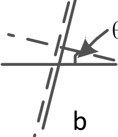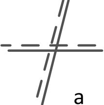

节  M2  后的螺钉，应出现圆心基本在毛玻璃屏中心的圆条纹。

2.测量激光或钠光波长

①保持调好的干涉仪状态不变。朝一个方向转动微动测微手轮，直至观察到干涉条纹开始连续变化（消

除空程差），然后记录数据。需要注意的是，在整个测试过程中微动测微手轮只能朝一个方向转，不能往

回转。

②中心每“生出”或“吞进”50  个条纹，记录一次数据，N  的总数要不小于  500  条，用逐差法处理数据求

出  λ  值。

3.测定钠双线的波长差

①保持调好的干涉仪状态不变。采用钠光灯作为光源。用眼睛直接在分光板  G1  与  M1  镜的延长线上向

M1  处观察。

②调节，直到  M1  干涉条纹的可见度最低，，记下  d1’；继续沿同一方向移动  M1  改变值  d’，直到视场中

再次可见度最低的现象，记下  d2’，则  Δd’=|d1’ – d2’|。再次改变  d’值，直到视场中又一次出现可见度最低

的现象，记下  d3’，用这种方法测出多个可见度最低的位置，并填入表格，用逐差法算出  Δd’，代入式（4.2-9）

求出  Δλ。

4.测量薄膜折射率或厚度

①光源为激光或钠灯，移动反射镜  M1  使同心圆环的圆心面积达到最大（占满整个视场），然后调节两

镜面倾角将圆心移除视场而且条纹粗稀。

②将光源换成日光灯，用眼睛直接从  E（见图  4.2-1）方向观察，缓慢转动微动测微手轮朝条纹由弯曲

到直的方向调节，直至观察到对称彩色干涉条纹出现在视场中心，记下此时反射镜  M2  所在的位置  xo。

③在反射镜M1和分光板  G1之间光路中放入厚度为D  的透明薄膜，则上述产生的彩色条纹的交线位置

被移出视场，沿光程差减小的方向继续移动反射镜  M2，直到对称彩色条纹再次出现在视场中央，此位置

| 即为  x。将所得到的数据代入到式（4.2-11），计算薄膜折射率或厚度。 |  |
|---|---|

六、数据记录及处理

表  4.2-1  激光（钠灯）波长测量

| 平面镜位 置 | *d*1 | *d*2 | *d*3 | *d*4 | *d*5 |
|---|---|---|---|---|---|
| x/mm |  |  |  |  |  |
| 平面镜位 置 | *d*6 | *d*7 | *d*8 | *d*9 | *d*10 |
| x/mm |  |  |  |  |  |

<table>
<tr><td>*i*</td><td></td><td></td><td></td><td></td><td></td></tr>
<tr><td>*d*5</td><td></td></tr>
</table>

表  4.2-2  钠光波长差的测量数据记录表（单位：mm）

<table>
<tr><td>测量次数</td><td>*d* 1</td><td>*d* 2</td><td>*d* 3</td><td>*d* 4</td></tr>
<tr><td>d/mm</td><td></td><td></td><td></td><td></td></tr>
<tr><td>测量次数</td><td>*d* 5</td><td>*d* 6</td><td>*d* 7</td><td>*d* 8</td></tr>
<tr><td>d/mm</td><td></td><td></td><td></td><td></td></tr>
<tr><td></td><td></td><td></td><td></td><td></td></tr>
<tr><td></td><td></td><td></td><td></td><td></td></tr>
<tr><td></td><td></td></tr>
</table>

表  4.2-3  测量薄膜的折射率  n

<table>
<tr><td></td></tr>
<tr><td></td></tr>
<tr><td>x（mm）</td><td></td><td></td><td></td><td></td><td></td></tr>
<tr><td>（mm）</td><td></td><td></td><td></td><td></td><td></td></tr>
</table>

参考文献

[1]郑庆华，王忠全。迈克尔逊干涉仪实验的物理思想。淮南师范学院学报，2012,14（5）：109-111

[2]周晓明。大学物理实验。华南理工大学出版社。2012.01

[3]陈明东。大学物理实验。华南理工大学出版社。2019.01

实验 **3.5** 光的衍射

光的衍射现象是光的波动性的一种表现。光的衍射决定了光学仪器的分辨本领。在现代光学技术中，

光的衍射在光谱分析、结构分析、成像等方面得到了越来越广泛的应用。因此，研究衍射现象及其规律，

在理论和实践上都有重要意义。

一 、实验目的 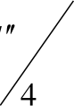

1  观察单缝衍射现象。

2  学习如何使用光电器件测量光强的分布。

3  测定单缝衍射的相对光强分布。

二 、实验仪器

GSZ-Ⅱ光学平台（配有光具座、氦氖激光器及电源、狭缝、观察屏、光电转换器、数字式灵敏检流计

等）

三 、实验原理

光波在传播的过程中遇到障碍物时，会绕过障碍物继续传播，到达沿直线传播所不能到达的区域，并

且形成明暗条纹，这种现象被称为光的衍射。研究表明，只有当障碍物的线度与光波的波长可以相比拟的

时候，衍射现象才明显的表现出来。借助惠更斯-菲涅耳原理可以描述光束通过不同形状的障碍物时产生的

衍射现象。

通常按照光源和观察屏到障碍物距离的不同，可以把衍射现象分为两大类。如果光源与观察屏之间的

距离或障碍物与观察屏之间的距离是有限的，这样的衍射称为菲涅耳衍射，又称近场衍射。它的光强分布

计算起来比较麻烦。如果光源到障碍物的距离以及障碍物到观察屏的距离均为无限大，即平行光入射，平

行光出射，这样的衍射称为夫琅和费衍射，又称远场衍射。夫琅和费衍射的光强分布容易计算，同时它也

有很多重要的应用，因此，这里我们只讨论夫琅和费衍射。

<table>
<tr><td>夫琅和费单缝衍射的原理如图  3.5-1  所示。在满足远场衍射条件（光源离单缝很远，即R</td><td></td><td>a2 ，其中4</td></tr>
<tr><td>R  为光源到单缝的距离，为单缝的宽度，λ  为入射光的波长；观察屏离单缝足够远，即*l*  </td><td>*a*2</td><td>，其中*l*</td></tr>
<tr><td></td><td>4</td><td></td></tr>
</table>

为单缝与观察屏之间的距离），单缝前后也可不用透镜，而获得夫琅和费衍射花样。本实验采用亮度强，

单色性好，发散角极小的氦氖激光器作为光源，就正好可以省去图  3.5-1  光路图中的透镜  L1  和  L2。实验光

路装置如图  3.5-2  所示。

| L1 | *B* | L2 | · | *p* |
|---|---|---|---|---|

a

*p**0*

| *R* | *A* | *l* |
|---|---|---|

图  3.5-1  夫琅和费单缝衍射的原理图 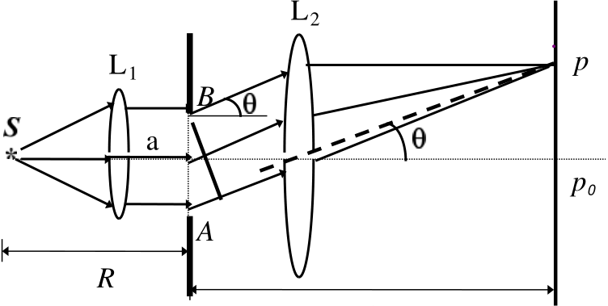

<table>
<tr><td>氦氖激光器                      单缝</td><td>光电转换器</td></tr>
<tr><td></td><td></td><td></td></tr>
</table>

图  3.5-2  夫琅和费单缝衍射实验装置图

设屏幕上处是中央亮条纹的中心，其光强为0I  。屏幕上与光轴成角的  P  处的光强为I  ，根据惠更

斯-菲涅耳原理，可导出

<table>
<tr><td></td><td>（3.5-1）</td></tr>
<tr><td>其中u</td><td></td><td>  sin</td><td></td><td>。由此可得</td></tr>
<tr><td></td><td></td><td></td><td></td><td></td></tr>
<tr><td>（1）当u  </td><td>0</td><td>，即时，</td><td>*I*  </td><td>0*I*</td><td>，其为中央主极大的光强，光强最大，衍射光的能量绝大部分都落</td></tr>
<tr><td>在中央明条纹上。在其他条件不变的情况下，</td><td>*I*  与0</td><td>a  成正比。</td></tr>
</table>

（2）当u*k*（*k*,1,2）时，*I*0，观察屏上对应的地方出现暗条纹， *k*  称为暗条纹的级次。

<table>
<tr><td>因为夫琅和费衍射时  很小，所以sin ，则暗条纹出现在 </td><td>*k*	的方向上。  	*a*</td></tr>
<tr><td>（3）中央亮条纹的角距 </td><td>2</td><td> 		是其他相邻暗条纹之间角距	*a*</td><td> </td><td></td><td>的两倍，所以中央亮条纹的宽度</td></tr>
<tr><td>0</td><td></td><td></td><td></td><td>*a*</td><td></td></tr>
</table>

是其他各级亮条纹宽度的两倍。

| （4）除了中央主极大光强以外，相邻两暗条纹间各有一次次极大光强出现在 | *d* | ( | sin2 | *u* | ) |  | 0 | 的位置。 |
|---|---|---|---|---|---|---|---|---|
|  | *du* |  | *u* |  |  |  |  |  |

其对应的具体位置和光强值见表  3.5-1，光强分布见图  3.5-3。

<table>
<tr><td>表  3.5-1  夫琅和费单缝衍射光强极大值及对应的位置</td></tr>
<tr><td></td><td>*I* /  *I*0</td></tr>
<tr><td></td><td>1</td><td></td></tr>
</table>

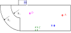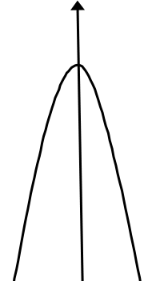

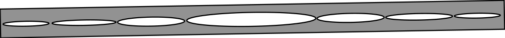

图  3.5-3  夫琅和费单缝衍射光强分布

| 四、 实验内容和步骤 **4.1**  观察夫琅和费单缝衍射现象 |  |
|---|---|

按图  3.5-2  安排实验光路，调节各光学元件等高共轴，使激光束垂直照射单缝，调节单缝的宽度和观

察屏到单缝的距离，使观察屏上出现清晰明显的衍射条纹，然后进行以下操作：

（1）改变单缝宽度，观察并记录衍射条纹的变化规律。

（2）改变单缝到观察屏之间的距离，观察并记录衍射条纹的变化规律。

（3）移去观察屏，换上光电转换器,使数字式灵敏检流计与之相连。调节光电转换器的移位螺钉，
