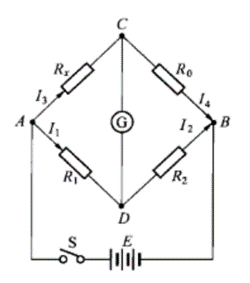

# 3.7 用惠斯登电桥测电阻

实验3.7  用惠斯登电桥测电阻

一、实验目的

（1）了解惠斯登电桥的原理和特点。

（2）学会使用惠斯登电桥测电阻。

二、实验仪器

FQJ型非平衡电桥。平衡指示仪（检流仪）、电阻箱、待测电阻、直流恒压电源。

三、实验原理

1.惠斯登电桥的线路原理

把待测电阻Rx与另外3个可变电阻R1、R2、R0连接成一个闭路的电阻四边形（如右图），电池E通过与四边形的两个相对顶端A和B相连，在另外另个相对顶端C和D之间接入检流计。这样连接的电路称为惠斯登电桥。电阻R1、R2、R0、Rx称为“桥臂”，接入检流计的对角线CD称为“桥”。检流计的作用是将“桥”的两端点的电位直接进行比较。当C、D两点电位相等时，检流计中无电流通过，电桥达到平衡，即VAC=VAD；IR1=IR2，IR0=IRx。可得

R1/R2=Rx/R0

Rx=(R1/R2)  R0=kR0（3.7-1）

式中，k=R1/R2称为比率。若R1、R2、R0（或k和R0）已知，Rx即可由上式求出。

2.电桥的灵敏度

公式（3.7-1）是在电桥平衡条件下导出来的，而电桥是否平衡，实际上是看检流计有无偏转来判断的。检流计的灵敏度总是有限的。如我们实验所用的检流计，指针偏转1格所对应的电流大约为10-6A，当通过它的电流比10-7A还要小时，指针的偏转小于0.1格，我们就很难察觉出来（数字检流仪小于10-8A）。假设电桥在R1/R2=1时调整到平衡，则有Rx=R0。这时，若把R0，改变一个量ΔR0，电桥就失去平衡，从而有电流IG流过检流计。但如果IG小到使检流计的偏转觉察不出来，我们就会认为电桥还是平衡的，因而得出Rx= R0+ΔR0。R0就是由于检流计灵敏度不够而带来的测量误差ΔRx。对此，我们引入电桥灵敏度S的概念，并定义为

S=Δn/((ΔRx)/Rx)  （3.7-2）

式中，ΔRx是在电桥平衡后Rx的微小改变量（实际上待测电阻Rx是不变的，改变的是电阻R0）；Δn是由于电桥偏离平衡而引起的检流计指针偏转的格数。S越大，说明电桥越灵敏，误差也就越小。例如，S等于1格除以1%，也就是当Rx改变1%时（实际上是R0改变1%时），检流计可以有1格的偏转。通常我们能觉察出1/5格的偏转，也就是说，当电桥平衡后，Rx只要改变0.2%，我们就可以觉察出来。这样，由于电桥灵敏度的限制所带来的误差是不会大于0.2%的。

如果由于检流计灵敏度不够，或通过它的电流太微弱而无法觉察出来，可以增加电源电压，微弱电流相应增大，从而使检流计指针发生较大的偏转。因此，检流计的灵敏度和电源电压的高低都对电桥灵敏度有影响。式（3.7-2）是对特定的电桥、检流计和电源电压而言的。可以证明，电桥灵敏度通用表达式为

S=(S1U)/(R1+R2+R0+Rx)+(2+R2/R1+Rx/R0) RG)  （3.7-3）

式中，S1=Δn/ΔIG为检流计灵敏度，U为电源电压。

可以证明，由于桥臂电阻所处位置的对称性，改变任一桥臂电阻得到的电桥灵敏度是相同的。在实验中，通常R0是可变的，因此有

S=Δn/(ΔR0/R0)  （3.7-4）

3.电桥的测量误差估算

当在符合仪器规定的参考条件下使用时，根据JJQ125-1986文件规定，电桥的基本误差极限可以用下式表示：

Elim=±α/100(RN/10+R0)∙k  （3.7-5）

式中，α为电桥的准确度等级；k为缩放因子，取电桥的比率；R0为测量盘示值；RN为基准值，各有效量程的基准值应为该量程内最大值的10的整数幂。例如量程为11111.1Ω，此量程的基准值为10000Ω。等级指数α不但反映了电桥中各标准电阻（比率k和测量臂R0）的准确度及检流计的灵敏度，而且还与测量范围、电源电压等因素有关（请参阅本实验附录）。

一般在实验中由电桥的灵敏度引入的误差ΔR 是这样估算的：在电桥平衡时，使R0改变ΔR0使检流计指针偏转的格数Δn=2，而人的眼睛能觉察到的界限是0.2格，所以取

ΔR=0.2×(ΔR0)/2  （3.7-6）

ΔR反映了平衡判断中可能包含的误差。ΔR越大，电桥越不灵敏。

测量结果的总误差可表示为

σR≈√(E2lim+(ΔR)2) （3.7-7）

四、实验内容与操作步骤

1.二段法测量

①首先熟悉电桥结构，再按仪器面板上的电路I连接电路元件。

②量程倍率设置：电桥的量程倍率可视被测电阻的大小自行设置。方法是：通过面板上的连线Ra和Rb与R1、R2两组接口来实现，如“×1”倍率，如书图3.7-2所示Ra挂空、R1的1000Ω孔用导线连接，Rb接R2，“1000”盘上打“1”，其余盘均为0；如“×10-1”倍率，连接R1孔的100Ω，Rb= R2=1000Ω；如“×10-2”倍率，连接R1=10Ω、Rb= R2=1000Ω……由此可组成下表中不同的量程倍率。

表3.7-1 FQJ型非平衡电桥用作惠斯登电桥时的相关参数选择

| 量程倍率 | 有效量程(Ω) | 准确度(%) | 基准电阻RN(Ω) | 电源电压(V) |
|---|---|---|---|---|
| ×10-2 | 10~111.111 | 0.5 | 100 | 5 |
| ×10-1 | 100~1111.111 | 0.3 | 1000 | 5、1.3 |
| ×1 | 1k~11.1111k | 0.2 | 10000 | 5、1.3 |
| ×10 | 10k~111.111k | 1 | 100000 | 15 |
| ×102 | 100k~111.111k | 2 | 1000000 | 15 |

③“功能、电压选择”开关置于平衡（5V）”或“平衡15V”（可按表3.7-1选择），并接通电源。

④按书图3.7-3所示接上被测电阻，R3测量盘打到等于被测电阻的标称值除以倍率的商的数字，旋下G、B按钮，调节R3使电桥平衡（电流表示值为0），则被测电阻阻值Rx=R1∙R3/R2=k∙R3。

调节R3使检流计G示值分别为±0.1μA，记下左偏和右偏电流表示值为±0.1μA时对应的电阻R3值，将测量数据记录于表3.7-2。

五、数据记录及数据处理

表3.7-2  二端法测电阻数据

<table>
<tr><td>**待测电阻**</td><td>**Rx1**</td><td>**Rx2**</td><td>**Rx3**</td><td>**Rx4**</td></tr>
<tr><td>**电阻标称值(Ω)**</td><td>**51**</td><td>**220**</td><td>**1.5k**</td><td>**22k**</td></tr>
<tr><td>**RN**</td><td>**100**</td><td>**1000**</td><td>**10000**</td><td>**100000**</td></tr>
<tr><td>**比率K**</td><td>**0.01**</td><td>**0.1**</td><td>**1**</td><td>**10**</td></tr>
<tr><td>**准确度等级α**</td><td>**0.5**</td><td>**0.3**</td><td>**0.2**</td><td>**1**</td></tr>
<tr><td>**R3(Ω)**</td><td>5171.10</td><td>2174.02</td><td>1543.00</td><td>2270.00</td></tr>
</table>

<table>
<tr><td>**平衡后将G数据有变化**</td><td>**-0.1μA**</td><td>**0.1μA**</td><td>**-0.1μA**</td><td>**0.1μA**</td><td>**-0.1μA**</td><td>**0.1μA**</td><td>**-0.1μA**</td><td>**0.1μA**</td></tr>
<tr><td>**ΔR3(Ω)**</td><td>20.00</td><td>20.00</td><td>3.98</td><td>3.00</td><td>2.40</td><td>3.00</td><td>26.04</td><td>9.90</td></tr>
<tr><td>**ΔR=KΔR3** **/1.732(Ω)**</td><td>0.12</td><td>0.12</td><td>0.23</td><td>0.17</td><td>1.38</td><td>1.73</td><td>150.35</td><td>57.16</td></tr>
<tr><td></td><td>0.12</td><td>0.20</td><td>1.56</td><td>103.76</td></tr>
<tr><td>**测量值KR3(Ω)**</td><td>51.71</td><td>217.40</td><td>1543.00</td><td>22700.0</td></tr>
<tr><td>**\|Elim\|(Ω)**</td><td>0.26</td><td>0.68</td><td>5.09</td><td>1227</td></tr>
<tr><td>**σR(Ω)**</td><td>0.29</td><td>0.71</td><td>5.32</td><td>1231.4</td></tr>
<tr><td>**Rx=KR3±σR**</td><td>51.71±0.29</td><td>217.40±0.71</td><td>1543.00±5.32</td><td>22700.0±1231.4</td></tr>
</table>

六、思考题及实验感想

1.使电桥测量误差增大的主要因素是什么？如何提高电桥的灵敏度？结合本实验附录进行分析。

①因素：连接导线电阻、接触点电阻都与被测电阻相串联，影响测量结果。当测量距离过长时，连接导线的电阻会进一步增大，从而使得测量误差进一步增大。

②：提高电桥的灵敏度：使用三端法，分别将连接导线电阻、接触点电阻分散到各桥臂，从而相对减小对待测电阻测量结果的影响。同时配合测试电阻板测量，能够实现远程测量。

2.为什么用电桥法测电阻较用伏安法测电阻准确？

电桥法不需要考虑电源、电压表和电流表的电阻对测量的影响；而伏安法需要考虑这些因素，会带来较大的偏差。
