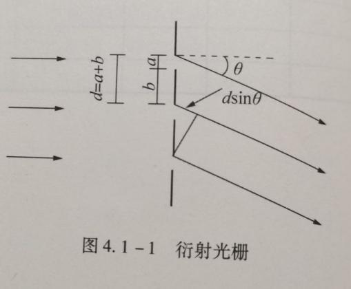
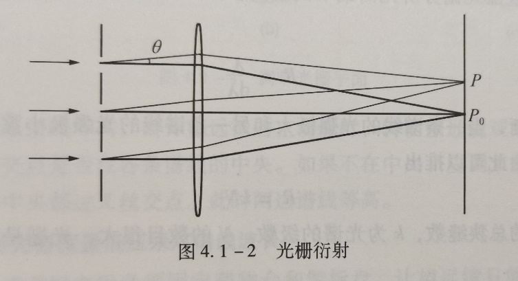
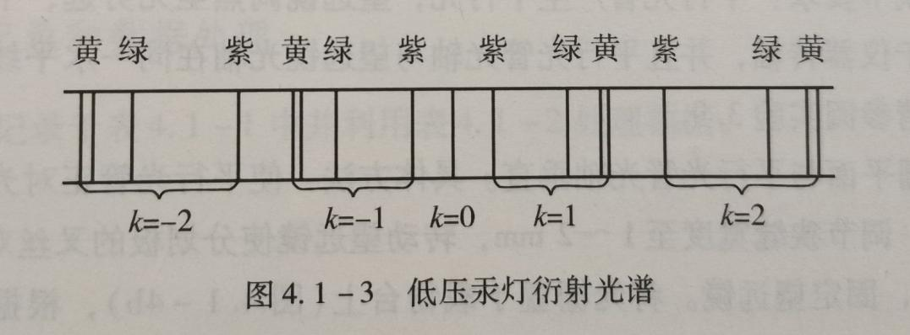
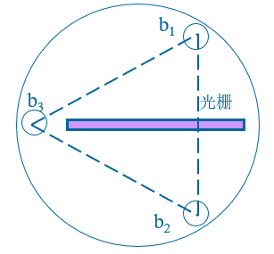
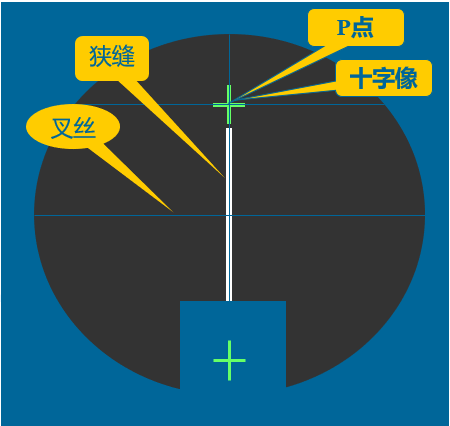
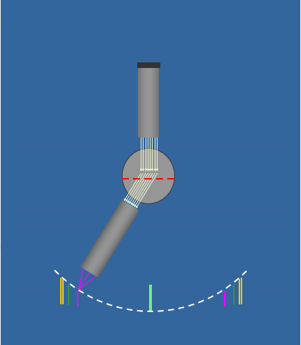

# 4.1 光栅的特性及光波波长的测定

4.1  光栅的特性及光波波长的测定

一、实验目的

（1）进一步掌握分光计的构造、使用和调节方法；

（2）观察光通过透射光栅的衍射现象，了解光栅的作用和基本特性；

（3）学会用光栅测定光栅常数、分辨本领、角色散率和未知光波波长。

二、实验仪器

分光计、平面镜、光栅、汞灯及其电源。

三、实验原理

1.光栅常数和光栅方程

衍射光栅是由大量等宽、等间距、平行排列的狭缝构成的光学元件。用于可见光区的光栅每毫米缝数可达几百到上千条。设缝宽为a，相邻狭缝间不透光部分的宽度为b，则缝间距d=a+b就称为光栅常数（图4.1 -1）。

根据夫琅禾费衍射理论，波长为λ的平行光東垂直投射到光栅平面上时，光波将在每条狭缝处发生衍射，各缝的衍射光在叠加处又会产生干涉，干涉结果取决于光程差。因为光栅各狭缝间距相等，所以相邻狭缝沿θ方向衍射光束的光程差都是dsinθ（图4. 1-1）。θ是衍射光束与光栅法线的夹角，称为衍射角。

在光栅后面放置一个会聚透镜，  使透镜光轴平行于光栅法线（图4.1-2），透镜将会使图4.1-2所示平面上衍射角为θ的光都汇聚在焦平面上的P点。根据多光束干涉原理，在θ满足下式时将产生干涉主极大，P点为亮点:

dsinθ=kλ(k =0，±1，±2，…) （4.1 - 1）

式中，k是级数，d是光栅常数。式（4. 1-1）称为光栅方程，是衍射光栅的基本公式。

由式（4.1-1）可知，θ=0对应中央主极大，P0点为亮点。中央主极大两边对称排列着±1级、±2 级等的主极大。实际光栅的狭缝数目很大，缝宽很小，所以当产生平行光的光源为细长的狭缝时，光栅的衍射图样将是平行排列的细锐亮线，这些亮线就是光源狭缝的衍射干涉条纹。

2.光栅光谱

当入射光为复色光时，由光栅方程可知，对给定常数d的光栅，只有在k=0即θ=0时，该复色光所包含的各种波长的中央主极大重合，在透镜的焦平面上形成明亮的中央零级亮线；对k的其他值，各种波长的主极大都不重合，不同波长的细锐亮线出现在衍射角不同的方位。由此形成的光谱称为光栅光谱。级数k相同的各种波长的亮线在零级亮线的两边按短波到长波的次序对称排列形成光谱，k＝1为一级光谱，k=2为二级光谱……各种波长的细锐亮线称为光谱线。图4.1 -3即为低压汞灯的衍射光谱。如果已知光栅常数d、级数k，精确测定光谱线的衍射角就可以确定光波的波长；反之，也可以由已知的波长确定光栅常数。

3.光栅的特性

角色散和分辨本领是光栅的两个重要特性。衍射光栅能将复色光按波长在透镜焦平面上分开成不同波长的谱线，说明衍射光栅有色散作用。衍射现象也使光谱线扩展为较宽的亮条纹，因而限制了光栅的分辨能力。根据理论推导，光栅的色散能力可以用角色散D表征：

D=dλ/dθ （4.1-2）

上式表示单位波长间隔的两条单色谱线间的角间距。将光栅方程（4.1-1）微分就可以得到光栅的角色散

D=k/dcosθ （4.1-3）

由方程（4.1 -3）可知，光栅常数越小，角色散越大；光谱的级次越高，角色散越大。

分辨本领R表征光栅分辨光谱细节的能力。如果光栅刚刚能将λ和λ+dλ两条谱线分开，则

R=λ/dλ （4.1 -4）

根据瑞利判断，当一条谱线的光强极大和另一条谱线的光强极小重合时，两条谱线刚好可以被分辨。由此可以推出

R=kN （4.1-5）

式中，N为光栅的总狭缝数，k为光谱的级数。N的数目很大，光栅是具有高分辨本领的光学元件。

四、实验内容与主要步骤

1.分光计的调整

分光计的调整要求：

（1）粗调要求：望远镜、平行光管同轴，且与主轴垂直。

（2）望远镜的调节要求：调节目镜：叉丝清晰；调节在载物台底角螺钉b1、b2：使平面玻璃反射的十字像清晰且与P点重合。

（3）平行光管调节要求：发出平行光，光栅刻痕与狭缝平行。调节狭缝使缝像清晰，再观察左右衍射谱线，调节b2使其等高，调节缝宽使两黄光谱线清晰。

2.实验现象的观察

3.实验要求

（1）以低压汞灯做光源，测量绿色谱线（λ=546.07nm）k=±1级的衍射角，求出光栅常数d，数据填在表1。

（2）测量“黄1”和“黄2”的k=±1级的衍射角，然后求出“黄1”和“黄2”光谱线的波长λ1，λ2，再求出该光栅的分辨本领、角色散率，数据填入表2。

五、数据记录及处理

表1

<table>
<tr><td>次数</td><td>右边第一级谱线</td><td>左边第一级谱线</td><td>φk d=kλ/sinφk(mm)</td></tr>
<tr><td></td><td>左窗V1</td><td>右窗V2</td><td>左窗V1’</td><td>右窗V2’</td><td></td></tr>
<tr><td>1</td><td>252°7′</td><td>72°7′</td><td>271°24′</td><td>91°24′</td><td>0.0032604</td></tr>
<tr><td>2</td><td>262°</td><td>82°</td><td>282°28′</td><td>102°28′</td><td>0.0030737</td></tr>
</table>

| d(mm) | 0.0031671 |
|---|---|

表2

<table>
<tr><td>次数</td><td>黄1</td><td>黄2</td><td>φk1</td><td>φk2</td><td>λ1= dsinφk1/k (nm)</td><td>λ2= dsinφk2/k (nm)</td><td>R=λ/Δλ</td><td>D=Δφ/Δλ</td></tr>
<tr><td>K=1</td><td>左窗V1</td><td>251°33′</td><td>251°38′</td><td>10°12′</td><td>10°13′</td><td>560.84</td><td>561.75</td><td>616.26</td><td>320.82</td></tr>
<tr><td></td><td>右窗V2</td><td>71°33′</td><td>71°30′</td><td></td><td></td><td></td><td></td><td></td><td></td></tr>
<tr><td>K=-1</td><td>左窗V1’</td><td>271°57′</td><td>271°56′</td><td></td><td></td><td></td><td></td><td></td><td></td></tr>
<tr><td></td><td>右窗V2’</td><td>91°57′</td><td>91°56′</td><td></td><td></td><td></td><td></td><td></td><td></td></tr>
</table>
