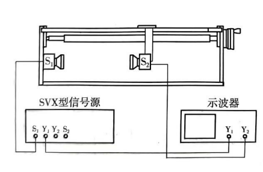
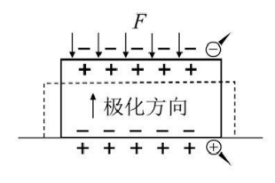
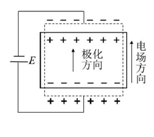
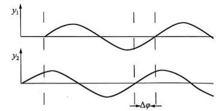
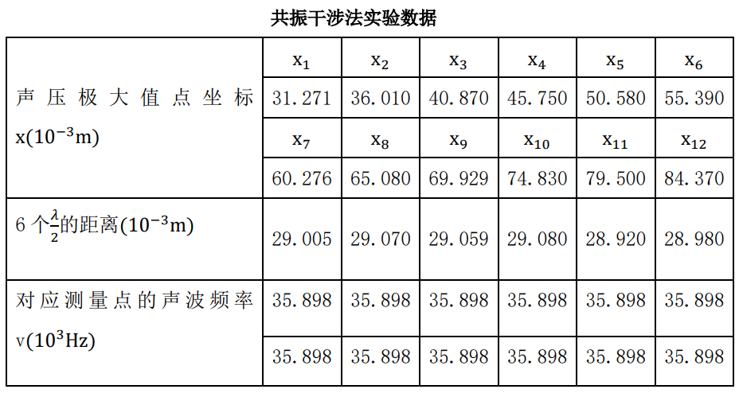

# 4.10超声波

大学物理实验报告

实验名称  超声波在介质中传播速度的测量

于博宇    202330451691  计科1班

1.实验目的：

1. 用相位比较法测量声速；

2. 用共振干涉法测量声速；

3. 通过实验了解作为传感器的压电陶瓷的功能；

4. 学习用逐差法处理实验数据。

2.实验仪器：

SV-DH系列声速测试仪，SVX-5型声速测试仪信号源，双踪示波器(20MHz)

3.简介：

实验基于波速等于波长乘以频率的关系(u = λ  ∙  v)测定波速。实验测试系统调试好后，超声波频率v可由信号源直接读出，因此本实验的重点内容是测量超声波的波长λ。实验利用如图所示测量系统测定超声波的波长，测量方法可分为共振干涉法和相位比较法。共振干涉法是利用超声波发射器S1和接收器S2间形成的驻波，利用驻波中节点处声压变化最大，即节点处输出振幅最大的电信号判断驻波的节点位置。通过测量驻波相邻节点的距离d即可得到超声波的波长λ=2d。相位比较法通过比较发射器S1和接收器S2信号的相位关系进行测量，当S1、S2信号相同时，示波器上S1、S2上的的李萨如图为“/”（或“\”）。移动接收器S2，当示波器上的李萨如图再次出现“/”（或“\”）时，测量接收器S2移动的距离即可得到此时声波的波长。

4.实验原理：

1. 压电陶瓷转换器：

- 正压电效应：当压电陶瓷片两端受到应力作用时，两端面形将产生电场强度E，这就是压电效应。𝐸  =  𝑔 ∙ T

      - 逆压电效应：当压电陶瓷片两端外加电压时，陶瓷片将产生伸缩成变，这就是逆压电效应。𝑆  =  𝑑 ∙ U

2. 发射波、反射波和驻波：

- 从发射源发出的一定频率的平面声波，称为发射波。发射波经过介质传播到达接收器，如果接收面与反射面严格平行，则在接收面上垂直反射平面波。发射波与反射波相互干涉，在一定条件下成的驻波。

设发射波的波动方程为  𝑦1 =  𝐴1 cos(𝜔𝑡 −  2𝜋/ 𝜆 𝑥) 反射波的波动方程为  𝑦2 =  𝐴2 cos(𝜔𝑡 + 2𝜋 /𝜆 𝑥) 两者叠加成的驻波，驻波方程为  𝑦  =  𝑦1 +  𝑦2 = (2𝐴  cos 2𝜋/ 𝜆 𝑥) cos  𝜔𝑡  式中，𝐴1 =  𝐴2 =  𝐴。 根据驻波方程，对应|cos 2𝜋/ 𝜆 𝑥| = 1的各点振幅最大，称为波腹；对应cos 2𝜋 /𝜆 𝑥  = 0的各点振幅最小(静止不动)，称为波节。相邻的两个波节点(或波腹点)间形的 距离为半个波长。 理论证明，振幅最大的点，声波的压强(简称声压)最小；相反，振幅最小处， 声压最大。

3. 声速的测量：

测量声速依据的原理可以是𝑢  =  𝜈𝜆  (𝜈为声波的频率，𝜆为声波的波长)，也可以是𝑢  =  𝐿/ 𝑡  (L 表示声音传播的距离,t 表示通过这段距离所需的时形)。根据不 同的原理，可以有三种方法测量声速：共振干涉法、相位比较法。

1)共振干涉法：声波在介质中的传播速度、频率和波长间形的关系为𝑢  =  𝜈𝜆。 据此，只要用实验方法测量出声波的频率𝜈和波长𝜆，就可以形接测出波速𝑢。在实验中，由于声波的频率可以从超声发生器信号源的频率计读出，因此测量声速 的关键是测定超声波在媒质中传播的波长𝜆。

前面提到，发射端超声换能器平面发出的发射波和接收端超声换能器接收平面反射的反射波在一定条件下会产生干涉成的稳定的驻波。这个条件就是发射平 面和接收平面间形的距离必须等于半波长的整数倍，即𝐿  =  𝑛 𝜆 /2 （n 为正整数）

因此，可以固定发射端换能器，沿着超声波传播的方向移动接收端换能器， 通过连续探测声压极大值点(驻波的波节点)位置就能测定超声波的波长(因为相 邻的两个声压极大值点间形的距离为半个波长)，而声压极大值点的位置可以通 过示波器所显示的波成的幅度变化来确定。

2)相位比较法：声波是机械振动状态在媒质中的传播，也是振动相位的传播。 所以声源的振动通过介质传播到达接收器时，接收波和发射波间形产生相位差，它与两换能器间形的距离 L 的关系为∆𝜑  = 2𝜋 ∙ 𝐿/ 𝜆。 两个交流电信号的相位差可以用示波器显示的波成观测，如图所示。  

特殊的相位差也可以用李萨如图形观察。将发送端和接收端换能器的电信号分别接入示波器的 x 轴输人端和 y 轴输人端，使示波 器处于𝑥 − 𝑦工作状态，示波器屏幕的光点将同时参与、y 两个方向的简谐振动。 两个同频率相互垂直的简谐振动合的可以得到不同成状的李萨如图形。若两个振 动的相位差∆𝜑  0 →  𝜋  → 2𝜋  的变化，则图形会由斜率为正的直变变为圆继而变到斜率为负的直变，再变为圆继后变为斜率为正的直变。因直变图形易于判断， 所以可选用李萨如图形为直变时的位置作为接收器的测量起点，每移动一个波长 就会重复出现同样斜率的直变。先用这种方法测出波长，再将声速计算出来。

5.实验过程与步骤：

1. 调整测量系统及谐振频率

连接测量变路，把信号源、示波器与发射换能器 A 和接收换能器B连接好。 调整发射换能器与接收换能器固定装置使两换能器的端面平面严格平行。调节信号源输出信号频率使间与换能器产生共振(即使信号源输出信号频率与换能器的固有频率相同)。方法是：使发射换能器与接收换能器移开一段距离， 开启信号源和示波器电源，选择示波器 y 轴合适的分度值，换能器工作在超声范围，谐振频率在 30~40kHz 间形，缓慢调节信号源输出信号频率使观察到的示波 器接收信号波成幅度最大(或观察信号源输出电压的变化使信号源输出电压在调节频率的过程中降到最小)。

2. 用共振干涉法测量超声波在空气中传播的波长

(1)移动接收换能器使两换能器间形的距离由小到大(或由大到小)，了解在

两换能器端面形所成的波概貌，以便确定测量区形。

(2)在选定的测量区形内移动接收换能器使间在距发射换能器合适的位置上

寻找声压极大值点的位置，记录此时接收换能器的位置坐标𝑥1和信号源显示的频

率值𝑣1；以此作为测量起点，沿着原方向而续移动接收换能器，连续探测声压极

大值点位置𝑥2、𝑥3、…、𝑥12 ，记录信号源相应的输出信号频率显示值𝑣2、

𝑣3、…、𝑣12。

(3)在实验操作过程中要注意三点：

①由于媒质对波能量的吸收,当接收器向远离发射器方向移动时,接收器所

接收的信号会逐渐减弱,这时应适当提高示波器的灵敏度(减小示波器 y 轴分度

值)或提高信号源的输出电压。相反,当接收器向靠近发射器方向移动时,接收器

所接收到的信号会不断增强,这时应适当降低示波器灵敏度(增大示波器 y 轴分

度值)或减小信号源的输出电压使示波器中所观察到的波成幅度大小适中。

②由于螺杆的空程,测量时接收换能器只能单方向移动,以避免由螺杆空程

所造成的位置坐标测量误差。

③调节信号源输出信号幅度和接收换能器信号增益使接收换能器在声压极

值点时输出电信号波成不失真。

3. 用相位比较法测量超声波在液体中传播的波长

(1)测量系统的调整:用相位比较法测量超声波在液体中传播的波长需要将 超声换能器置于空气槽中。

(2)调整谐振频率:切断输入示波器 x 轴(CH1)的信号,使示波器处在观察接 收器波成状态,将接收换能器移开发射换能器一定距离,缓慢调节信号源输出信 号频率使示波器显示的波成幅度最大。

(3)接通示波器 x 轴输入(CH1)信号,按下 x - y 转换开关,这时屏幕上出现 李萨如图成。全程移动接收换能器了解李萨如图成变化的概貌,记选择测量区形。 在距离发射换能器的适当位置调出图中  ∆φ  = 0 的李萨如图成【通过调节 x 轴 (CH1)和 y 轴(CH2)的分度值可以改变直变的倾率度】,记录接收器的位置坐标𝑥1 和信号源对应的频率值对𝑣1。沿原来方向而续移动接收器,连续探测∆φ = 0的李萨如图成,记录相应的坐标值𝑥2、𝑥3、…、𝑥9 。和与𝑥𝑖  对应的信号源频率𝑣2、  𝑣3、…、𝑣9。

6.数据记录与处理：

利用共振干涉法测量声波在空气中的传播速度：

首先用逐差法按L = xi+6  −  xi计算6个λ/2的距离；

然后计算得波长的平均值λ̅  = 2  ×  (29.005+29.07+29.059+29.08+28.92+28.98) / (6×6) = 9.673mm

标准差σλ̅  =  √∑(λi−λ̅)^2 / (6−1) = 0.02mm。

信号源所显示的超声波频率的平均值v̅  = 35.898, 标准差σv̅  = 0。

根据公式计算测量的声速值v̅  = v̅ ∙ λ̅  = 347.243m  ∙  s−1。

根据公式σut = √((σλ̅  /  λ̅)^2 + (σv̅  / v̅)^2)，计算得声速的标准差σt = 0.718m  ∙  s−1。

所以测量的超声波声速v = v̅ ± σt = 347.243 ±  0.718m  ∙  s−1。

7.个人拓展思考

目前我们所得出的数据，显然只是在普通学生实验环境下能够得到的声速，这与340m/s显然仍然存在误差，我们目前只通过多次测量取平均值来尽可能减少了误差。

我认为，多出来的那7m/s可能有讨论声音，桌椅碰撞声音造成。针对这种情况，我们可以采用滤波器来减少这些杂声的干扰，防止声波的互相扰乱。
