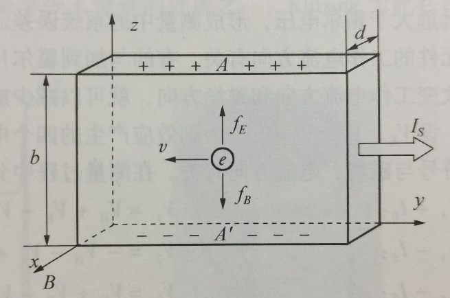

# 4.14 霍尔效应法测磁场

4.14  霍尔效应法测磁场

一、实验目的

（1）了解产生霍尔效应的物理过程及其副效应的产生原理和消除方法。

（2）学习应用霍尔效应测量磁场的原理和方法。

二、实验仪器

TH-H型霍尔效应组合仪。

三、实验原理

1.霍尔效应原理

霍尔效应是1879年由Johns Hopkins大学的研究生霍尔在研究载流导体在磁场中受力的性质时发现的。如上图所示，一块宽为b，厚为d的矩形半导体薄片（N型，载流子是电子），沿y方向加一恒定工作电流IS，沿x方向加上恒定磁场**B**，就有洛伦兹力**f**B，

**f**B=e**ν**×**B** （4.14-1）

式中，e为运动电荷的电量；**ν**为电荷运动的速度；**f**B=e**ν**×**B**指向z轴负方向。

在洛仑兹力的作用下，样品中的电子偏离原流动方向而向样品下方运动，并聚集在样品下方。随着电子向下偏移，在样品上方会多出带正电的电荷（空穴）。这样，在样品中形成了一个上正下负的霍尔电场EH，根据E=VH/b，在A、A’面间便有霍尔电压VH。当EH建立起来后，它会给运动的电荷施加一个与洛仑兹力方向相反的电场力fE=  eEH。随着电子在A’面继续积累，EH的电场力fE也逐渐增大。当fE、fH两力大小相等（即fE= fH）时，霍尔电场对电子的作用力与洛仑兹力相互抵消，电子的积累达到动态平衡，在A、A’间便形成一个稳定的霍尔电场EH。则有

EeH=eνB  （4.14-2）

eVH/b=eνB  （4.14-3）

设N型半导体的载流子浓度为n，流过半导体样品的电流密度为

j=enν （4.14 -4）

则                         ν=j/(ne)=IS/(bdne)  （4.14-5）

式中，b为半导体薄片的宽度；d为半导体薄片的厚度；e为载流子的电量。将式（4. 14 -5）代人式（4.14-3），并令RH= 1/(en)，可得

VH=ISB/(end)=RHISB/d  （4.14-6）

式中，RH称为霍尔系数。RH是反映霍尔效应强弱的重要参数，与材料中载流子的运动机理密切相关。

在实际应用中，式（4. 14-6）常写成

VH=KH·lS·B  （4.14-7）

式中，KH=RH/d称为霍尔元件的灵敏度，单位为mV/(mA·T)或mV/(mA·kGs)。

式（4.14-7）是在理想情况下才成立的。但在实际情况中，除霍尔效应外，还存在着其他因素引起的几种副效应（具体分析见实验附录）。这些副效应所产生的电压总和有时甚至远远大于霍尔电压，形成测量中的系统误差。实验分析表明，这些副效应有的与流过霍尔元件的工作电流方向有关，有的与加到霍尔片的磁场方向有关，在测量过程中只要按要求改变工作电流方向和磁场方向，就可以减少或消除这些副效应的影响。

设VE、VN、VRL和V0为副效应产生的四个电压（各电压的具体物理意义见附录），它们的符号与磁场、电流方向有关。在测量过程中分别改变电流I和磁场B的方向，有

+B，+IS：            V1=VH+VE+VN+VRL+V0                           （4.14-8）

+B，-IS：            -V2=VH-VE+VN+VRL-V0                                                                                                            （4.14-9）

-B，-IS：              V3=VH+VE-VN-VRL-V0                           （4.14-10）

-B，+IS：            -V4=-VH-VE-VN-VRL+V0                          （4.14-11）

将式（4.14-8）与式（4.14-9）相减，得

V1-(-V2) =2VH+2VE+2V0 （4.14-12）

将式（4.14-10）与式（4.14-11）相减，得

V3-(-V4) =2VH+2VE-2 V0 （4.14–13）

再将式（4.14-12）与式（4.14-13）相加得

V1-(-V2)+V3-(-V4)=4VH+4VE （4. 14- 14）

所以

VH=(V1+V2+V3+V4)/4-VE （4.14-15）

只要B不是太小，温差电压VE一般比VH小得多，在误差允许的范围内可以略去，故得

VH=(V1+V2+V3+V4)/4  （4.14-16）

2.应用霍尔效应判断半导体载流子类型

半导体材料有N型（电子型）和P型（空穴型）两种，前者载流子为电子，带负电；后者载流子为空穴，带正电。由上图可以看出，若载流子为N型，则A点电位高于A’点，VH>0。可见，知道载流子的类型后，可根据VH的正、负确定待测磁场的方向。同样，按上图所示的I和B的方向，若测得的VH<0，即A点电位高于A’点，则RH为负值，样品为N型；反之，则为P型。

四、实验内容与主要步骤

（1）测量霍尔元件的灵敏度KH。

先调节工作电流IS＝3.00mA，再设定励磁电流值（见表1），按顺序将B、IS（即IM和IS）换向，记录相应的V1，V2，V3，V4。计算出对应的VH和B，然后以B为横坐标，VH为纵坐标，描点绘制对应的关系曲线，根据曲线的斜率求出KH。

（2）根据所测得的VH的正负，判断样品的导电类型。

五、数据记录及处理

表1（对应TH-H型实验仪） IS=3.00mA K=4.23KGS/A

<table>
<tr><td>IM(mA)</td><td>V1(mV)</td><td>V2(mV)</td><td>V3(mV)</td><td>V4(mV)</td><td>B(T)</td><td>VH(mV)</td><td>KH</td></tr>
<tr><td></td><td>+IS、+B</td><td>+IS、-B</td><td>-IS、-B</td><td>-IS、+B</td><td></td><td></td><td></td></tr>
<tr><td>200</td><td>-0.77</td><td>0.07</td><td>-0.07</td><td>0.77</td><td>0.846</td><td>-0.42</td><td>-0.161</td></tr>
<tr><td>350</td><td>-1.08</td><td>0.38</td><td>-0.38</td><td>1.08</td><td>1.48</td><td>-0.73</td><td></td></tr>
<tr><td>500</td><td>-1.38</td><td>0.68</td><td>-0.69</td><td>1.38</td><td>2.12</td><td>-1.03</td><td></td></tr>
<tr><td>650</td><td>-1.69</td><td>0.99</td><td>-1.00</td><td>1.68</td><td>2.75</td><td>-1.34</td><td></td></tr>
<tr><td>800</td><td>-2.00</td><td>1.30</td><td>-1.31</td><td>2.00</td><td>3.38</td><td>-1.65</td><td></td></tr>
</table>

计算用的公式：B=KIM，VH=(V1-V2+V3-V4)/4，B=VH/(IKH)

由下图可得，KH=-0.161mV/(mA·T)，载流子为N型。
