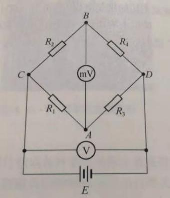
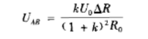
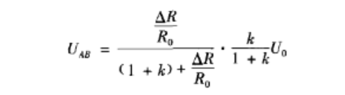
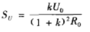
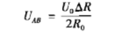
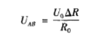
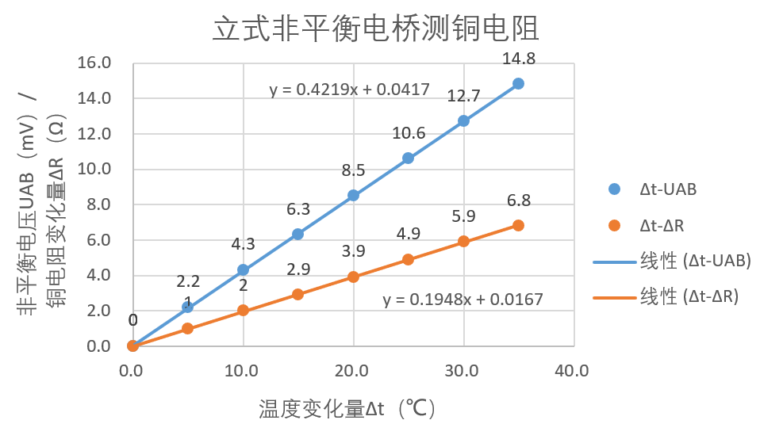

# 4.17 非平衡电桥电压输出特性

实验4.17  非平衡电桥电压输出特性研究

一、实验目的

（1）了解非平衡电桥的工作原理。

（2）研究非平衡电桥电压输出特性。

二、实验仪器

FQJ型非平衡电桥、电桥接线板、电阻箱、稳压电源、电压表等。

三、实验原理

（1）单臂输入时电桥电压输出特性。如左图是由四个桥臂电阻、直流电源和电压表组成的非平衡电路。当电桥平衡时，R1:R3=R2:R4，电路中A、B两点的电位差UAB=0。若此时使一个桥臂的电阻（如R4）增加很小的电阻ΔR，即R4=R0+ΔR，则电桥失去平衡，电路中A、B两点间存在一定的电势差UAB。该电势差即为电桥不平衡时的输出电压。

若电桥供电电源的电压为U0，根据串联电阻分压原理，上图以电路中C点为零电势参考点，则电桥的输出电压为：

UAB=UA-UB

=((R0+ΔR)/(R0+ΔR+R2)-R1/(R1+R3))∙U0

=((R3∙ΔR)/((R0+ΔR+R2)(R1+R3)))∙U0

=((R3∙ΔR)/(R0(1+ΔR/R0+R2/R0)(1+R1+R3)))∙U0  （4.17-1）

令电桥倍率K=R1/R3。根据电桥平衡条件，R3/R1=R4/R2，且当ΔR≪R0时，可略去分母中的微小项ΔR/R0，有

（4.17-2）

若ΔR/R0不能略去，则应为

（4.17-3）

定义SU=UAB/ΔR为电桥的输出电压灵敏度，则有

                                   （4.17-4）

由式（4.17-1）可知，当ΔR/R0≪1时,非平衡电桥的输出电压与ΔR呈线性关系。由式（4.17-4）可知，电桥的输出电压灵敏度由选择的电桥倍率K及供电电源电压决定。电桥供电一定，当K=1时，电桥输出电压灵敏度最大，且

Smax=U0/(4R0)  （4.17-5）

（2）双臂输入时电桥电压输出特性。在非平衡电桥中,若相邻臂内接入两个变化量相同而变化量符号相反的可变电阻，这种电桥电路称为半桥差动电路。例如，上图R4增加ΔR，而R2减少ΔR。

对于半桥差动电路，若电桥开始时是平衡的，则R1:R3=R2:R4。在对称情况下，R1=R3=R2=R4=R0，则半桥差动电路输出电压为

                      （4.17-6）

电桥的输出电压灵敏度为

SU=U0/(2R0)  （4.17-7）

（3）四臂输入时电桥电压输出特性。在非平衡电桥电路中,若电桥的四个臂均采用可变电阻，即将两个变化量符号相反的可变电阻接入相邻桥臂内，而将两个变化量符号相同的可变电阻接入相对桥臂内，这样构成的电桥电路称为全桥差动电路。例如，上图R1、R4各增加ΔR，R2、R3各减少ΔR。

对于全桥差动电路，通常采用对称元件，R1=R2=R3=R4=R0，ΔR1=ΔR2=ΔR3=ΔR4=ΔR。可以证明，全桥差动电路的输出电压为

                         （4.17-8）

电桥的输出电压灵敏度为

SU=U0/R0 （4.17-9）

2.用非平衡直流电桥测量电阻

根据式（4.17-2），得到

ΔR=((1+K)2R0UAB)/(KU0)  （4.17-10）

当K=1时，即R1=R3，则有

ΔR=((4UAB)/U0)∙R0 （4.17-11）

也就是说，由于某种原因使电阻R4的值发生变化时，可以通过非平衡电桥测出电桥在非平衡状态下的输出电压，再由式（4.17-11）求得R4从初始状态至某一瞬时的电阻变化量，从而得到R4的某一瞬时值。

四、实验内容与主要步骤

用非平衡电桥测量铜热电阻Cu50的温度特性

按照书图4.17-3电路将R4（电阻箱）换成铜热电阻Cu50（铜电阻仪器见附录图4.17-4），并预设好电阻箱：R1=R2=500Ω，R3≈55Ω。用平衡电桥测量铜热电阻在室温下的电阻值R：转换开关转至平衡—5V；调节R3使电桥平衡，此时记录R3和室温，R3即为室温下的铜电阻阻值Rx0。将功能转换开关转至非平衡—电压，保持各个电阻箱不变。从室温开始升温，每次变化5℃，测其非平衡电压输出UAB（mV），共测8个点。并求出阻值变化量ΔR和铜电阻的阻值R。

做出t-UAB和t-图，用图解法求出室温时的电阻值R0和温度系数α。

五、实验数据记录及处理

用非平衡电桥测量铜热电阻的温度特性

表4.17-2  测量记录

<table>
<tr><td>**表7-1** **用立式非平衡电桥测铜电阻**</td></tr>
<tr><td>**R1=R2=500.0Ω**</td><td></td><td></td><td>**U0=1300.0mV**</td></tr>
<tr><td>**室温下的铜电阻电阻值Rx0=**47.2</td><td>**K=R1/R3**</td><td>10.6</td><td>**(R3=** **Rx0)**</td></tr>
<tr><td>**温度/℃**</td><td>**非平衡电压UAB/mV**</td><td>**铜电阻变化量ΔR/Ω**</td><td>**铜电阻R/Ω**</td></tr>
<tr><td>**室温**</td><td>**0**</td><td>**0**</td><td>**(=Rx0)**</td></tr>
<tr><td>**室温+5**</td><td>2.2</td><td>1.0</td><td>48.2</td></tr>
<tr><td>**室温+10**</td><td>4.3</td><td>2.0</td><td>49.2</td></tr>
<tr><td>**室温+15**</td><td>6.3</td><td>2.9</td><td>50.1</td></tr>
<tr><td>**室温+20**</td><td>8.5</td><td>3.9</td><td>51.1</td></tr>
<tr><td>**室温+25**</td><td>10.6</td><td>4.9</td><td>52.1</td></tr>
<tr><td>**室温+30**</td><td>12.7</td><td>5.9</td><td>53.1</td></tr>
<tr><td>**室温+35**</td><td>14.8</td><td>6.8</td><td>54.0</td></tr>
</table>

∴R0=47.2Ω，α=0.2

六、实验感想

误差来源：

1.温度上升时的不稳定性和测量时不准确而引发的误差。

2.装置老化而使得电阻调节过程中出现无法避免的误差。
