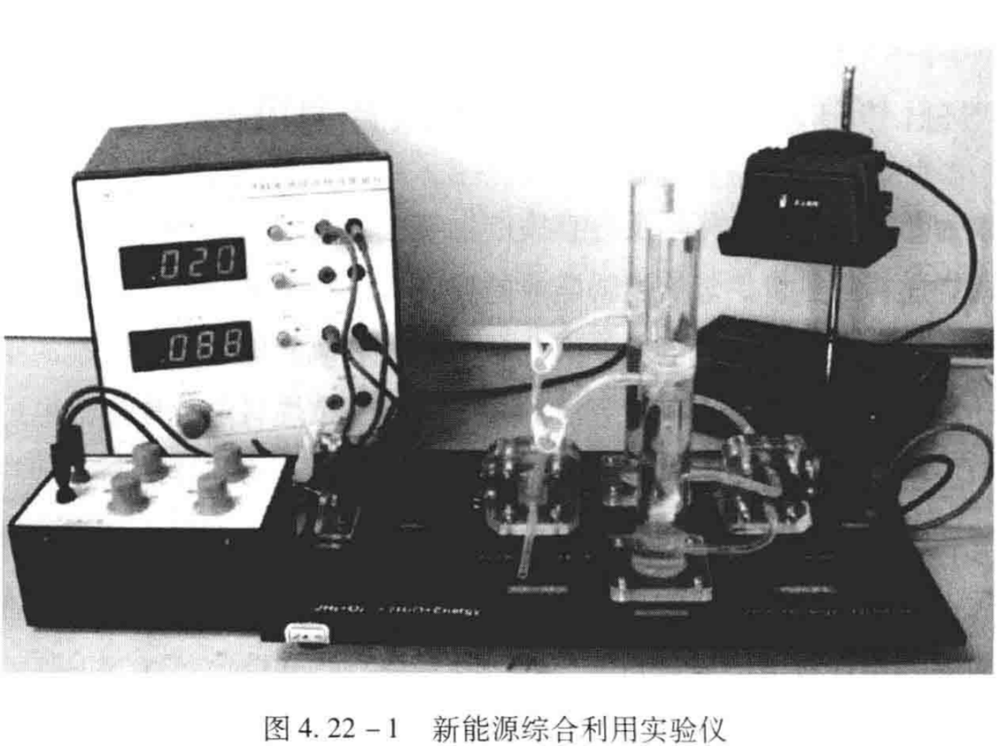
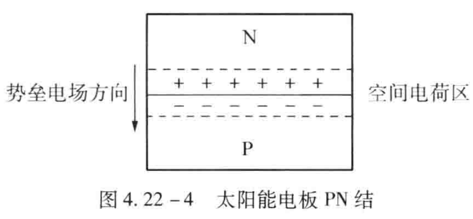
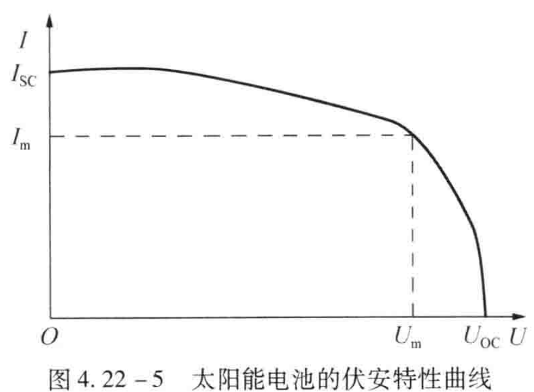
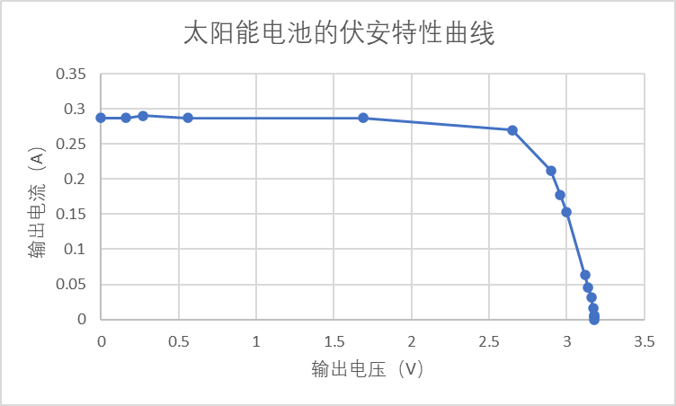
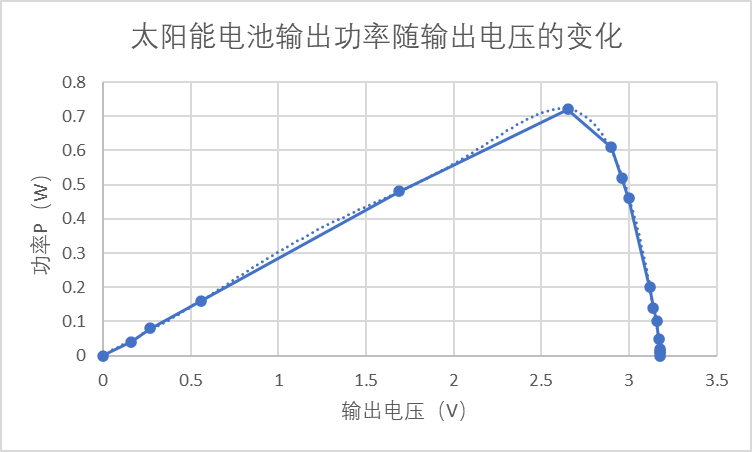

# 4.22 新能源的综合利用及探索（太阳能电池）

实验4.22  新能源的综合利用及探索（太阳能电池）

一、实验目的

（1）了解太阳能电池的原理。

（2）测量太阳能电池的输出特性，并绘制太能电池对应的伏安特性曲线和输出功率随输出电压的变化曲线，获取太阳能电池的填充因子等特性参数。

二、实验仪器

新能源综合利用实验仪、电池输出特性测试仪、太阳能电板、电阻箱。

三、实验原理

1.太阳能电池利用半导体PN结受光照射时的光伏效应发电。太阳能电池的基本结构就是一个大面积平面PN结。

P型半导体中有相当数量的空穴，几乎没有自由电子；N型半导体中有相当数量的自由电子，几乎没有空穴。当这两种半导体结合在一起形成PN结时，N区的电子（带负电）向P区扩散，P区的空穴（带正电）向N区扩散，在PN结附近形成空间电荷区与势垒电场。势垒电场会使载流子向扩散的反方向做漂移运动，最终扩散与漂移达到平衡使流过PN结的净电流为零。在空间电荷区内，P区的空穴被来自N区的电子复合，N区的电子被来自P区的空穴复合，使该区内几乎没有能导电的载流子，又称为结区或耗尽区。

当电池受到光照射时，部分电子被激发而产生电子-空穴对，在PN结区激发的电子和空穴分别被势垒电场推向N区和P区，使N区有过量的电子而带负电，P区有过量的空穴而带正电，PN结两端形成电压，这就是光伏效应，若PN结两端接入外电路，就可向负载输出电能。

2.太阳能电池的特性

在一定的光照条件下，改变太阳能电池负载电阻的大小，测量出输出电压yu 输出电流之间的关系。UOC代表开路电压，ISC代表短路电流，与最大功率对应的电压称为最大工作电压Um，对应的电流称为最大工作电流Im。表征太阳能电池特性的基本参数一般有光谱响应特性、光电转换效率、填充因子等。填充因子FF定义为：

FF=UmIm/(UOCISC)  （4.22-9）

它是评价太阳能电池输出特性好坏的一个重要参数，它的值越高，表明太阳能电池输出特性越趋近于矩形，电池的光电转换效率越高。

四、实验内容与主要步骤

1.熟悉整套装置的结构和使用方法

（1）新能源综合利用实验仪的构成包括太阳能电板、电阻箱等。

（2）电池输出特性测试仪可测量电流、电压，实验前需预热15min。测试仪各部分功能如下：

区域1，电流表部分：作为一个独立的电流表使用。其有两个档位：2A档和200mA档。可通过电流档位切换开关选择合适的电流档位测量电流。有两个测量通道：电流测量I和电流测量II。通过电流测量切换键可同时测量两条通道的电流。

区域2，电压表部分：作为一个独立的电压表使用。共有两个档位：20V档和2V档。可通过电压档位切换开关选择合适的电压档位测量电压。

2.太阳能电池的特性测量

①按实验要求连接好装置，将电流测量端口与可变负载串联后接入太阳能电池的输出端。电流表选择2A档位。

②将电压表并联到太阳能电池两端。电压表选择2V档位。

③保持光照条件不变，改变太阳能电池负载电阻的大小，测量输出电压和电流值，并计算输出功率，记录于表一中。

五、数据记录与处理

表一 太阳能电池输出特性的测量

| **外界电阻（欧）** | **0** | **0****.5** | **0****.9** | **1****.9** | **5.****9** | **9****.9** | **1****3.9** | **1****6.9** | **1****9.9** |
|---|---|---|---|---|---|---|---|---|---|
| **输出电压（伏）** | **0** | 0.16 | 0.27 | 0.56 | 1.69 | 2.65 | 2.90 | 2.96 | 3.00 |
| **输出电流（安）** | 0.287**(I****SC****)** | 0.287 | 0.290 | 0.290 | 0.287 | 0.270 | 0.212 | 0.177 | 0.153 |
| **功率P（瓦）** | 0 | 0.04 | 0.08 | 0.16 | 0.48 | 0.72 | 0.61 | 0.52 | 0.46 |
| **外界电阻（欧）** | **49.9** | **69.9** | **99.9** | **199.9** | **499.9** | **699.9** | **9****99.9** | **断路** |  |
| **输出电压（伏）** | 3.12 | 3.14 | 3.16 | 3.17 | 3.18 | 3.18 | 3.18 | 3.18 (UOC) |  |
| **输出电流（安）** | 0.063 | 0.045 | 0.032 | 0.016 | 0.006 | 0.004 | 0.003 | **0** |  |
| **功率P（瓦）** | 0.20 | 0.14 | 0.10 | 0.05 | 0.02 | 0.01 | 0.01 | 0 |  |

根据表一的实验数据作出所测太阳能电池的伏安特性曲线，做出该电池输出功率随输出电压的变化曲线。求出太阳能电池的开路电压UOC、短路电流ISC、最大输出功率Pm、最大工作电压Um、最大工作电流Im、填充因子FF。

由表中数据可知，UOC=3.18V，ISC=0.287A，Pm=0.72W，Um=3.18V，Im=0.290A。	FF=UmIm/(UOCISC)=(3.18×0.290)/(3.18×0.287)=1.01

六、对实验的感想

本实验在最开始，由于太久没有接触物理实验，在线路连接方面花费了不少的时间；对实验预习不足的话，会不知所措。测量短路电流时，电流表示数一直在变化，不够稳定。对于该物理量的测量应需等到太阳能电池输出电流稳定后进行测量，可先从电阻大的情况开始测量，再逐渐较小负载。
