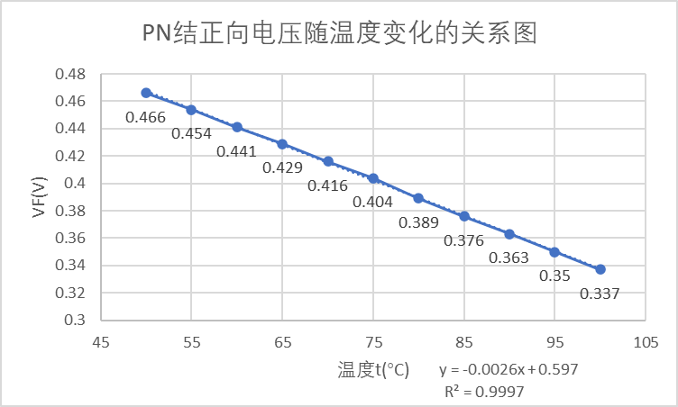

# 4.4 PN结正向电压温度特性研究

实验4.4 PN结正向电压温度特性研究

一、实验目的

（1）了解PN结正向电压随温度变化的基本规律。

（2）在恒流供电条件下，测绘PN结正向电压随温度变化的关系图线，并由此确定PN结的测温灵敏度和被测PN结材料的禁带宽度。

二、实验仪器

PN结正向特性综合实验仪、DH-SJ5温度传感器实验装置。

三、实验原理

1.PN结温度传感器的基本方程

根据半导体理论，理想PN结的正向电流IF与正向电压VF存在如下的近似关系：

IF=IneqVF/kT （4.4-1）

式中：q为电子的电量；T为热力学温度，In为反向饱和电流，它是一个和PN结材料的禁带宽度以及温度等有关的系数。

可以证明：

In=CTγeqVg0/kT （4.4-2）

式中：C和与PN结的结面积、掺杂浓度等有关的常数；k为玻尔兹曼常数；γ在一定温度范围内也是常数；Vg0为热力学温度0K时PN结材料的导带底与价带顶的电势差。对于给定的PN结，Vg0是一个定值。

将式（4.4-2）代入式（4.4-1），两边取对数，整理后可得：

VF=Vg0-(k/q)ln(C/IF)T-(Kt/q)lnTγ=V1+Vnr  （4.4-3）

其中

V1= Vg0-(k/q)ln(C/IF)T  （4.4-4）

Vnr=-(Kt/q)lnTγ  （4.4-5）

式（4.4-3）时PN结正向电压随电流和温度变化的表达式，它是PN结温度传感器的基本方程。

2.PN结的测温原理

根据式（4.4-3），对于给定的PN结材料，令PN结的正向电流IF恒定不变，则正向电压只随温度变化而变化。但是式（4.4-3）中出了线性项V1外，还包含非线性项Vnr。实验和理论证明，在温度变化范围不大时，Vnr远小于V1。对通常的硅PN结来说，在50~150℃的温度区间内，其非线性误差仍然很小。但当温度变化范围增大时，VF温度响应的非线性误差将有所增加。

综上所述，对给定的PN结材料，在允许的温度变化范围内，在恒流供电（IF不变）条件下，PN结的正向电压VF对温度的依赖关系取决于线性项V1，正向电压VF几乎随温度升高而线性下降，即

VF=Vg0-(k/q)ln(C/IF)T  （4.4-6）

上式是PN结测温的依据。

3.测量PN结材料的禁带宽度

PN结材料的禁带宽度Eg0定义为电子的电量q与热力学温度0K时PN结材料的导带底和价带顶的电势差Vg0的乘积，即Eg0=qVg0。根据式（4.4-4）有

Vg0=VF+(k/q)ln(C/IF)T

定义S=(k/q)ln(C/IF)为PN结温度传感器灵敏度，则有

Vg0=VF+S·T  （4.4-12）

当t=0℃时，T=273.2K，VF=VF0，有

Vg0= VF0+273.2S  （4.4-13）

所以

Eg0=qVg0=q(VF0+273.2S)  （4.4-14）

公式（4.4-14）即为禁带宽度的计算公式。

四、实验内容与主要步骤

1.调节正向电流恒定IF=80μA。

a.升温测量设置最高温度100℃-110℃之间，选择合适的加热电流，即温度不能升高太快，在实验时间允许的情况下，加热电流可以取得小一点。

数据记录表格为表一升温。

b.降温测量：将实验装置的“加热电流”关掉，“风扇开关”打开，记录初始温度t和正向电压VF，温度自然下降。

数据记录表格为表二降温。

2.在同一恒定正向电流条件下，测绘PN结正向压降随温度的变化曲线，确定其灵敏度，估算被测PN结材料的禁带宽度。

五、数据记录与处理

表二（降温） 同一IF下，正向电压与温度的关系      IF=          80          μA

| **序号** | **1** | **2** | **3** | **4** | **5** | **6** | **7** | **8** |
|---|---|---|---|---|---|---|---|---|
| **t****(****℃****)** | 100 | 95 | 90 | 85 | 80 | 75 | 70 | 65 |
| **V****F****(V)** | 0.337 | 0.350 | 0.363 | 0.376 | 0.389 | 0.404 | 0.416 | 0.429 |
| **序号** | **9** | **1****0** | **1****1** | **1****2** | **1****3** | **1****4** | **1****5** | **1****6** |
| **t****(****℃****)** | 60 | 55 | 50 |  |  |  |  |  |
| **V****F****(V)** | 0.441 | 0.454 | 0.466 |  |  |  |  |  |

（1）根据表二实验数据要求被测PN结正向压降随温度变化的灵敏度S。以t为横坐标，VF为纵坐标，作VF-t曲线，其斜率为S。这里的t单位为℃。可求出：传感器灵敏度S=        0.0026    mV/℃；Vg0=        1.307    V（-273.15℃）。

（2）估算被测PN结材料的禁带宽度。将实验所得的结果代入Eg0=qVg0= 1.307 eV，与公认值Eg0=1.21eV比较，并求相对误差。

解：

当t=-273.15℃时，VF=1.31V，即Vg0=1.31V

∴Eg0=1.31  > 1.21eV

相对误差为E=（Δx/μ）×100%=（1.31-1.21）/1.31×100%=7.63%

六、思考题

测量VF0的目的何在？为什么实验要求绘ΔV-t图线，而不是绘VF-T图线

答：
1. 求出公式中的常量值，有助于提高后续绘制图像的精确度。
1. ΔV-t图线能够经过原点，且能够提高数据绘图的精确度。纵坐标的单位长度表示的数据范围更小，使得图像更为直观。
