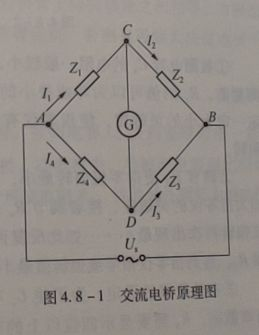
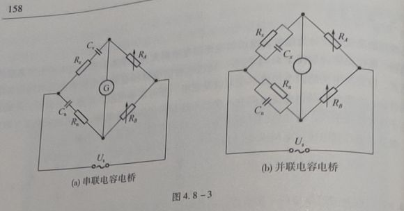
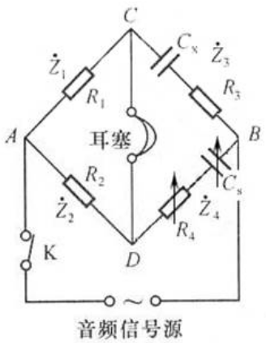
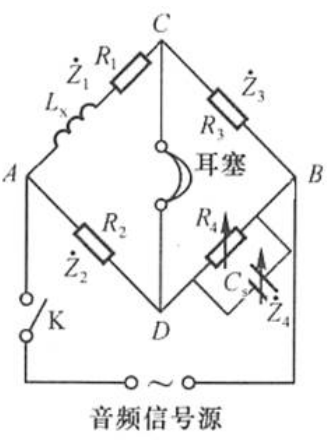
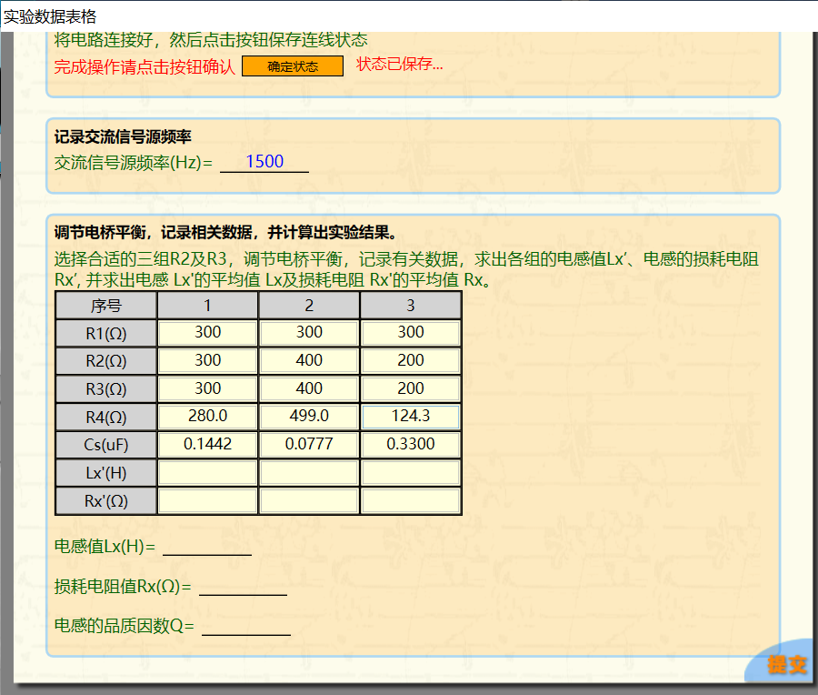
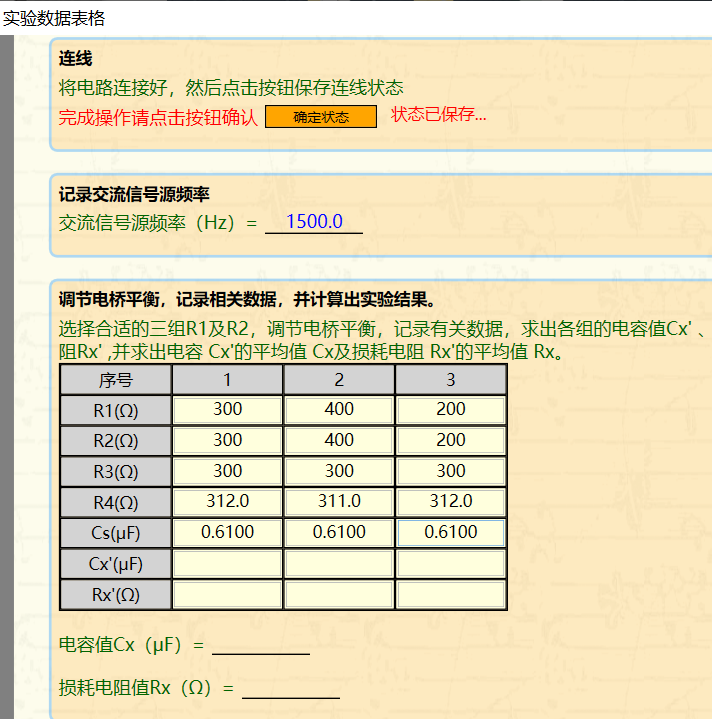

# 4.8 交流电桥综合设计性实验

4.8  交流电桥综合设计性实验

一、实验目的

（1）掌握交流电桥的特点和平衡的调节方法；

（2）学习用交流电桥测电容和电感及其损耗的方法。

二、实验仪器

FB305A型交流电桥、DH4518型交流电桥。

三、实验原理

交流电桥是阻抗比电桥（图4.8-1），通常用这种电桥来测量电容或电感。当电桥平衡时，其桥臂阻抗满足比例关系。因为桥臂阻抗为复数，所以要使交流电桥平衡，必须同时满足幅值平衡条件Z1·Z3=Z2·Z4和幅角平衡条件φ1+φ3=φ2+φ4，其中Z1，Z3，Z2，Z4，φ1，φ3；φ2，φ4分别为图4.8-1电桥中相应桥臂阻抗的幅值和幅角。因此，必须按照幅值条件和幅角条件来设计和调节交流电桥。本实验的内容是在了解交流电桥原理的基础上，设计简单的交流电桥来测量电容或电感。

常用的交流电桥分为阻抗比电桥和变压器电桥两大类。本实验中交流电桥指的是阻抗比电桥，其电路原理如图4.8- 1所示。交流电桥的电路和直流单电桥电路具有同样的结构形式，但交流电桥的四个桥臂不仅可以是电阻，还可以是电阻、电感、电容等元件或它们的组合。交流电桥采用交流电供电。交流平衡指示仪的种类很多，本实验采用高灵敏度的电子放大式指示仪，有足够的灵敏度。指示仪指零时，电桥达到平衡。

调节电桥各臂阻抗使电桥平衡（即**I0**＝0），则CD两点的电位相等，这时有

**Z1**/**Z2**＝**Z4**/**Z3**  （4.8- 1）

式(4.8-1)就是交流电桥的平衡条件。将各阻抗用复数形式表示有

**Z1**e|φ1|/**Z2**e|φ2|＝**Z4**e|φ4|/**Z3**e|φ3|

即要使电桥平衡，必须使下列方程组成立

**Z1**·**Z3**＝**Z2**·**Z4**

φ1+φ3＝φ2+φ4  （4.8-2）

方程组（4.8-2）是平衡条件的另一种表现形式。 可见，交流电桥的平衡必须同时满足两个条件：一是相对桥臂上阻抗幅模的乘积相等；二是相对桥臂上阻抗幅角之和相等。方程组（4.8-2）说明，交流电桥必须按照一定 的方式配置桥臂阻抗，否则有可能无法使电桥平衡。下面将介绍几种常用的交流电桥。

1.测量损耗小的电容电桥（串联电容电桥）

图4.8 -3a电路为用来测量损耗小的电容的电桥。被测电容Cx接到电桥的第一臂，它的损耗以等效串联电阻Rx表示，称为串联电容电桥。在电桥中，与被测电容相比较的标准电容Cn接入相邻的第四臂，同时与Cn串联一个可 变电阻Rn。桥的另外两臂为纯电阻RA及RB。当电桥调到平衡时:

Rx＝(RA/RB)Rn （4.8 -3）

Cx＝(RA/RB)Cn （4.8 -4）

被测电容的损耗因数D为

D=ωCxRx=ωCnRn  （4.8-5）

由此可知，要使电桥达到平衡，必须同时满足式（4.8-3）和式（4.8-4），因此需至少调节两个参数。如果改变Rn和Cn，便可以单独调节且互不影响地使电容电桥达到平衡。但通常标准电容是做成固定的，因此Cn不能连续可变。这时我们可以调节RB/RA比值使式（4.8-4）得到满足。但调节RB/RA的比值时又影响到式（4.8-3）的平衡。因此，要使电桥同时满足两个平衡条件，必须反复调节Rn和RB/RA等参数才能实现。

2.测量损耗大的电容电桥（并联电容电桥）

假如被测电容的损耗大，用上述电桥测量时，与标准电容相串联的电阻Rn必须很大，这将会降低电桥的灵敏度。因此当被测电容的损耗大时，宜采用图4.8 -3b所示的电容由桥电路进行测量，它的特点是标准电容Cn与电阻Rn是彼此并联的。根据电桥的平衡条件可以写成

RB·(1/((1/Rn)+jωCn))=RA·(1/((1/Rx)+jωCx))

整理后可得

Cx=(RB/RA)Cn  （4.8-6）

Rx=(RB/RA)Rn  （4.8-7）

其损耗因数为

D=1/(ωCxRx)＝1/(ωCnRn) （4.8-8）

交流电桥测量电容根据需要还有一些其他形式，可参看有关的书籍。

四、实验内容与主要步骤

1. 利用交流电桥测电感

按交流电桥测电感原理图连线，选择合适的三组R2及R3，调节电桥平衡，记录有关数据，求出各组的电感值Lx’、电感的损耗电阻Rx’, 并求出电感 Lx'的平均值 Lx及损耗电阻 Rx'的平均值 Rx。

2. 利用交流电桥测电容

按交流电桥测电容原理图连线，选择合适的三组R1及R2，调节电桥平衡，记录有关数据，求出各组的电容值Cx' 、电容的损耗电阻Rx' ,并求出电容 Cx'的平均值 Cx及损耗电阻 Rx'的平均值 Rx。

五、数据记录及处理

表一  交流电桥测电感  交流信号源频率(Hz)=1500.0

| 序号 | R1(Ω) | R2(Ω) | R3(Ω) | R4(Ω) | Cs(μF) | Lx’(H) | Rx’(Ω) |
|---|---|---|---|---|---|---|---|
| 1 | 300 | 300 | 300 | 280.0 | 0.1442 | 0.01298 | 21.4 |
| 2 | 300 | 400 | 400 | 499.0 | 0.0777 | 0.01243 | 20.6 |
| 3 | 300 | 200 | 200 | 124.3 | 0.3300 | 0.0132 | 21.8 |

电感值Lx(H)=    0.01287    ；损耗电阻值Rx(Ω)=    21.3    ；

电感的品质因数Q=    5.7    。

表二  交流电桥测电容 交流信号源频率(Hz)=1500.0

| 序号 | R1(Ω) | R2(Ω) | R3(Ω) | R4(Ω) | Cs(μF) | Cx’(H) | Rx’(Ω) |
|---|---|---|---|---|---|---|---|
| 1 | 300 | 300 | 300 | 312.0 | 0.6100 | 0.6100 | 12.0 |
| 2 | 400 | 400 | 300 | 311.0 | 0.6100 | 0.6100 | 11.0 |
| 3 | 200 | 200 | 300 | 312.0 | 0.6100 | 0.6100 | 12.0 |

电感值Cx(μF)=    0.6100    ；损耗电阻值Rx(Ω)=    11.7    。

电感第一组数据处理：

Lx’=  R2R3Cs=300×300×0.1442×10-6H=0.01298H

R=  R2R3/R4=300×300÷280.0Ω≈321.4Ω

Rx=R-R1=321.4-300Ω=21.4Ω

电感第二组数据处理：

Lx’=400×400×0.0777×10-6H=0.01243H

R=  R2R3/R4=400×400÷499.0Ω≈320.6Ω

Rx=R-R1=320.6-300Ω=20.6Ω

电感第三组数据处理：

Lx’=200×200×0.3300×10-6H=0.0132H

R=  R2R3/R4=200×200÷124.3Ω=321.8Ω

Rx=R-R1=321.8-300Ω=21.8Ω

∴Lx=0.01287H，Rx=21.3Ω

Q=ωLx/Rx=2×π×1500.0×0.01287÷21.3=5.7

电容第一组数据处理：

Cx=(R2/R1)Cs=300÷300×0.6100μF=0.6100μF

Rx=(R1/R2)R4-R3=300÷300×312.0-300Ω=12.0Ω

电容第二组数据处理：

Cx=(R2/R1)Cs=400÷400×0.6100μF=0.6100μF

Rx=(R1/R2)R4-R3=400÷400×311.0-300Ω=11.0Ω

电容第三组数据处理：

Cx=(R2/R1)Cs=200÷200×0.6100μF=0.6100μF

Rx=(R1/R2)R4-R3=200÷200×312.0-300Ω=12.0Ω

∴Cx=0.6100μF，Rx=11.7Ω

