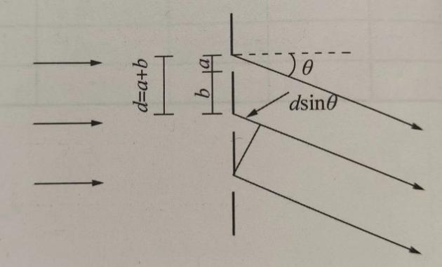
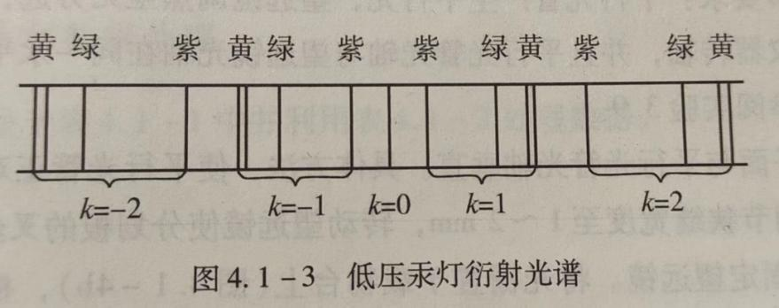
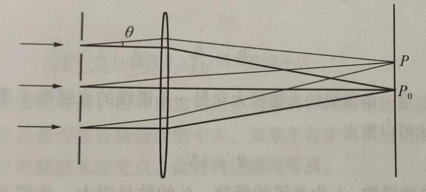
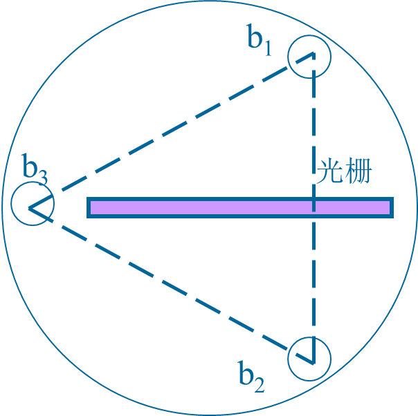
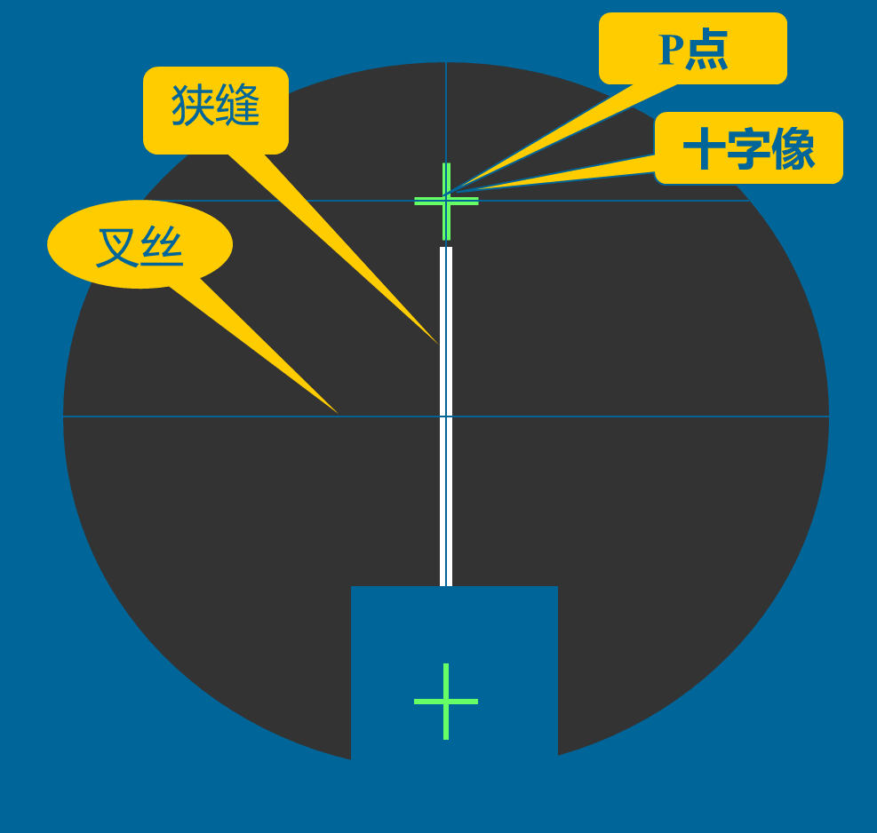
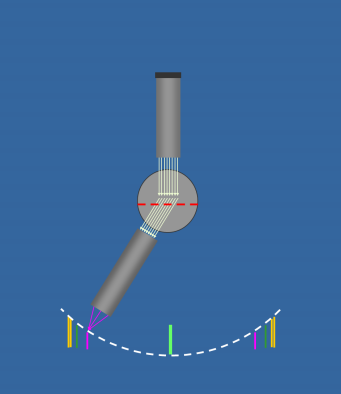
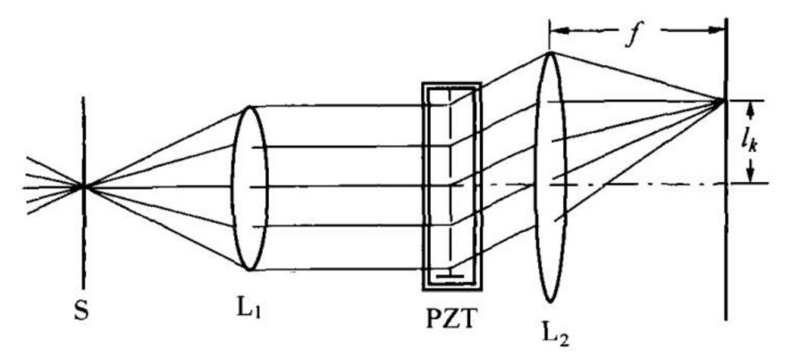

# 光栅的特性及光波波长的测定&超声光栅及其应用

**光栅的特性及光波波长的测定**

陈** 22计科全英创新班 2022********

**一、实验目的**

1.进一步掌握分光计的构造、使用和调节方法；

2.观察光通过透射光栅的衍射现象，了解光栅的作用和基本特性；

3.学会用光栅测定光栅常数、分辨本领、角色散率和未知光波波长。

**二、实验仪器**

分光计、平面镜、光栅、汞灯及其电源。

**三、实验原理**

**1.** **光栅简介**

衍射光栅是由大量等宽、等间距、平行排列的狭缝构成的光学元件。用于可见光区的光栅每毫米缝数可达几百到上千条。设缝宽为$a$，相邻狭缝间不透光部分的宽度为$b$，则缝间距就称为光栅常数$d=a+b$。

根据夫琅禾费衍射理论，波长为$\lambda$的平行垂直投射到光栅平面上时，光波将在每条狭缝处发生衍射，各缝的衍射光在叠加处又会产生干涉，干涉结果取决于光程差。因为光栅各狭缝间距相等，所以相邻狭缝沿$\theta$方向衍射光束的光程差都是$dsin\theta$。$\theta$是衍射光束与光栅法线的夹角，称为衍射角。

**2.光栅光谱简介**

当入射光为复色光时，由光栅方程可知，对给定常数$d$的光栅，只有在$k=0$即$\theta =0$时，该复色光所包含的各种波长的中央主极大重合，在透镜的焦平面上形成明亮的中央零级亮线；对$k$的其他值，各种波长的主极大都不重合，不同波长的细锐亮线出现在衍射角不同的方位。由此形成的光谱称为光栅光谱。级数$k$相同的各种波长的亮线在零级亮线的两边按短波到长波的次序对称排列形成光谱，$k=1$为一级光谱，$k=2$为二级光谱……各种波长的细锐亮线称为光谱线。如果已知光栅常数$d$、级数$k$,精确测定光谱线的衍射角就可以确定光波的波长；反之，也可以由己知的波长确定光栅常数。

**3.光栅方程**

在光栅后面放置一个会聚透镜，使透镜光轴平行于光栅法线,透镜将会使图1所示平面上衍射角为$\theta$的光都汇聚在焦平面上的$P$点。根据多光束干涉原理，在$\theta$满足下式时将产生干涉主极大，$P$点为亮点：

$$
dsin\theta =k\lambda
$$

式中，$k$是级数，$d$是光栅常数。该式称为光栅方程，是衍射光栅的基本公式。由该式可知，$\theta =0$对应中央主极大，${P}_{0}$点为亮点。中央主极大两边对称排列着$\pm$1级、$\pm 2$级等的主极大。实际光栅的狭缝数目很大，缝宽很小，所以当平行光产生的光源为细长的狭缝时，光栅的衍射图样将是平行排列的细锐亮线，这些亮线就是光源狭缝的衍射干涉条纹。

**4.光栅分辨本领R**

光栅分辨本领$R$表征光栅分辨光谱细节的能力。如果光栅刚刚能将$\lambda$和$\lambda +d\lambda$两条谱线分开，则：

$$
R=\frac {\lambda } {ⅆ\lambda }
$$

根据瑞利判断，当一条谱线的光强极大和另一条谱线的光强极小重合时，两条谱线刚好可以被分辨。由此可以推出：

$$
R=kN
$$

式中，$N$为光栅的总狭缝数，$k$为光谱的级数。$N$的数目很大，光栅具有高分本领。

**5.** **光栅色散角率D**

衍射光栅能将复色光按波长在透镜焦平面上分开成不同波长的谱线，说明衍射光栅有色散作用。衍射现象也使光谱线扩展为较宽的亮条纹，因而限制了光栅的分辨能力。根据理论推导，光栅的色散能力可以用色散$D$表征:

$$
D=\frac {ⅆ\theta } {ⅆ\lambda }
$$

上式表示单位波长间隔的两单色谱线间的角间距。将光栅方程微分就可以得到光栅的角色散

$$
D=\frac {k} {ⅆcos\theta }
$$

由上式可知，光栅常数越小，角色散越大；光谱的级次越高，角色散越大。

**四、实验内容**

1.分光计的调整

（1）粗调要求：望远镜、平行光管共轴，且与主轴垂直。

（2）望远镜的调节要求：

调节目镜：叉丝清晰；

调节载物台底角螺钉b1、b2：使平面玻璃反射的十字像清晰且与P点重合。
1. 平行光管调节要求：发出平行光，光栅刻痕与狭缝平行。调节狭缝位置使缝像清晰，再观察左右衍射谱线，调节b2使其等高，调节缝宽使两黄光谱线清晰。

2.实验现象的观察

3.实验要求

(1)以低压汞灯做光源，测量绿色谱线（λ=546.07nm）k=±1级的衍射角，求出光栅常数d，数据填在表1。

表1

<table>
<tr><td>次数</td><td>右边第一级谱线</td><td>左边第一级谱线</td><td>{\varphi }_{k}</td><td>d=\frac {k\lambda } {sin{\varphi }_{k}} $$</td></tr>
<tr><td></td><td>左窗${V}_{1}$</td><td>右窗${V}_{2}$</td><td>左窗${V}_{1}'$</td><td>右窗${V}_{2}'$</td><td></td><td></td></tr>
<tr><td>1</td><td></td><td></td><td></td><td></td><td></td><td></td></tr>
<tr><td>2</td><td></td><td></td><td></td><td></td><td></td><td></td></tr>
<tr><td>$\hat {d}$(mm)</td><td></td></tr>
</table>

（2）测量“黄1”和“黄2”的k=±1级的衍射角，然后求出“黄1”和“黄2”光谱线的波长λ1，λ2，再求出该光栅的分辨本领、角色散率，数据填入表2。

表2

<table>
<tr><td>次数</td><td>黄1</td><td>黄2</td><td>{\varphi }_{{k}_{1}}</td><td>{\varphi }_{{k}_{2}}</td><td>{\lambda }_{1}(nm)</td><td>{\lambda }_{2}(nm)</td><td>{R}_{1}</td><td>D(rad/nm)</td></tr>
<tr><td>K=1</td><td>左窗${V}_{1}$</td><td></td><td></td><td></td><td></td><td></td><td></td><td></td><td></td></tr>
<tr><td></td><td>右窗${V}_{2}$</td><td></td><td></td><td></td><td></td><td></td><td></td><td></td><td></td></tr>
<tr><td>K=-1</td><td>左窗${V}_{1}'$</td><td></td><td></td><td></td><td></td><td></td><td></td><td></td><td></td></tr>
<tr><td></td><td>右窗${V}_{2}'$</td><td></td><td></td><td></td><td></td><td></td><td></td><td></td><td></td></tr>
</table>

**五、实验总结**

本实验利用分光计，测量不同颜色光的衍射角。首先根据已知绿光的波长求出光栅常数，再结合黄光的衍射角求出它的波长。然后，根据同一级两处黄光的衍射角差异，求出光栅的分辨本领和角色散率。最终测得光栅常数d=3.376μm，两道黄光波长分别为579.47nm，576.56nm，光栅的分辨本领R=198.63，角色散率D=299.66×${10}^{-6}$rad/nm。

实验过程最大的难点是分光计的调节与使用，特别是我们因上学期课程安排，未进行分光计的相关操作讲解。所以在观察老师示范后，我又花了较多的时间研读分光计操作说明，按照步骤进行调整。期间也出现预料之外的情况，如把反光镜换成光栅后，十字标记就消失了，这一度花费了我很长时间去排查原因。另外，由于测量单位是角度，我对这样的游标尺读数比较陌生，也花了一定时间去适应。

**超声光栅及其应用**

陈** 22计科全英创新班 2022********

**一、实验目的**

1、了解超声光栅产生的原理和方法；

2、观察超声光栅的衍射现象；

3、掌握用超声光栅测量超声波速度的方法。

**二、实验仪器**

WSG—1型超声光栅声速仪（信号源、液体槽、锆钛酸铝陶瓷片），分光计，测微目镜，低压汞灯。

**三、实验原理**

**1.** **超声光栅**

超声波作为一种纵波在盛有液体的玻璃槽中传播时，液体被周期性地压缩与膨胀，其密度发生周期性的变化，形成疏密波。如果它被一个反射板或液槽的一个玻璃面反射，会反向传播。在一定条件下，前进波与反射波叠加而形成超声频率的纵向振动驻波。由于驻波的振幅可达到单一行波的两倍，加剧了波源和反射板之间液体的疏密变化。在某时刻，纵驻波任意波节两边的质点都涌向这个节点，使节点附近成为质点密集区，而相邻的波节处成为质点稀疏区。半个周期后，这个节点附近的质点又向两边散开变为稀疏区，相邻的波节处变为密集区。在这些驻波中，稀疏作用使液体折射率减小，而压缩作用使液体近射率增大。在距离等于波长$d$的两点，液体的密度相同，折射率也相同。

**2.** **超声光栅形成原理**

单色平行光沿着垂直于超声波传播方向通过上述液体时，因折射率周期性变化使光波的波阵面产生相应的相位差，经透镜聚焦，出现干涉条纹。这种现象与平行光通过平面光棚的情况相似。因为超声波的波长很短，只要槽宽能维持平面波，槽中液体就相当于一个衍射光栅。

**3.** **利用超声光栅衍射测量液体中的声速**

在调好的分光计上，由单色光源、平行光管中的可调狭缝$S$和汇聚透镜$L$组成平行光系统。让平行光管射出的平行光束垂直通过装有锆钛酸铅陶瓷片（或称$PZT$晶片）的液槽。在玻璃槽的另一侧用自准直望远镜中的物镜${L}_{\mathrm {2}}$和测微目镜组成测重望远镜系统。若振荡器输出的电信号使$PZT$晶片发生超声共振，且在液槽中形成稳定的超声驻波，则从测微目镜中即可观察到衍射光谱。行射光谱中亮条纹位置满足光栅方程

$$
dsin{\varphi }_{k}=\pm k\lambda \left ( {k=0,1,2,\ldots }\right )
$$

当${\varphi }_{k}$很小时，有

$$
sin{\varphi }_{k}=\frac {{l}_{k}} {f}
$$

式中，${l}_{k}$为衍射光谱零级至$k$级的距离，$f$为望远镜物镜的焦距。根据光栅方程可求得超声波的波长（即超声光栅的光栅常数）为

$$
d=\frac {k\lambda } {sin{\varphi }_{k}}=\frac {k\lambda f} {{l}_{k}}
$$

从而可以求得超声波在液体中的传播速度$u=dv=\frac {k\lambda fv} {{l}_{k}}$。

**四、实验内容**

1.调整分光计到使用状态；

2.将超声光栅盒放在分光计的载物台上并接好线，开启 光栅仪电源，调节其“频率调节旋钮”使望远镜中看到的衍射光谱级次最多而且明亮，转动游标盘使衍射光谱左右对称，级次谱线亮度一致；

3.调节测微目镜调焦手轮直至看清分化板十字准线，将望远镜目镜换成测微目镜，前后移动测微目镜使衍射条纹最清晰，旋转测微目镜，使目镜视场中分划板标尺与衍射条纹平行，固定测微目镜。

4.测微目镜沿一个方向逐级测量各种颜色光谱线位置的读数填入表1。

表1

<table>
<tr><td>透镜焦距f：</td><td>170mm</td><td>共振频率：11.59Mhz</td></tr>
<tr><td>级次</td><td>黄-1</td><td>黄+1</td><td>绿-1</td><td>绿+1</td><td>蓝-1</td><td>蓝+1</td></tr>
<tr><td>位置（mm）</td><td></td><td></td><td></td><td></td><td></td><td></td></tr>
<tr><td>lk（mm）</td><td></td><td></td><td></td></tr>
<tr><td>超声波的波长(μm)</td><td></td><td></td><td></td></tr>
<tr><td>超声波的速度（m·s-1）</td><td></td><td></td><td></td></tr>
<tr><td>超声波声速平均测量值(m·s-1)：</td><td>超声波声速理论值(m·s-1)：1495</td></tr>
<tr><td>相对误差：</td></tr>
</table>

1. 数据处理：完成表格1即可。

**五、实验总结**

本实验在上一实验的基础上，把光栅替换成含有超声波的水容器，形成超声光栅。与普通光栅相比，超声光栅形成的衍射角较小，难以直接测量。因此，我们使用测微目镜，用谱线到中心的距离与透镜焦距之比替换衍射角的正弦值，再进行计算。再结合超声波的共振频率，得到不同颜色光反映的超声波波长，进而得到超声波速度为m/s，与理论值的相对误差为%，实验效果较为不错。
