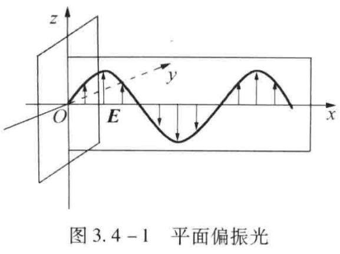
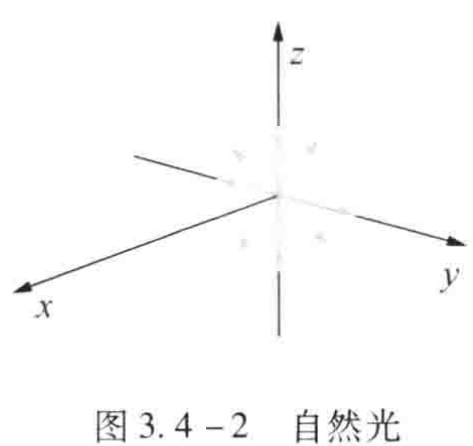
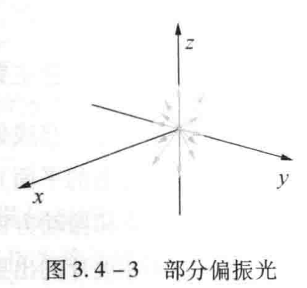
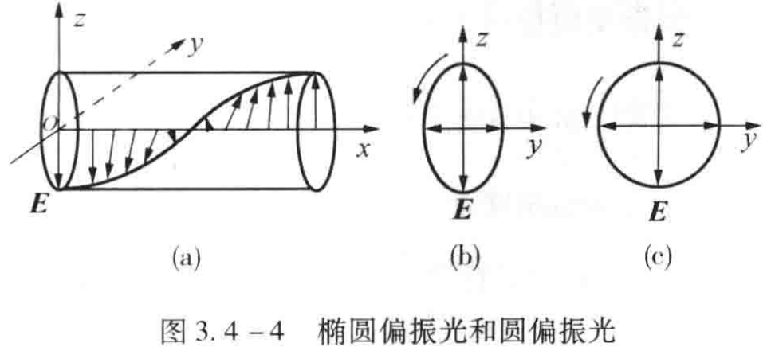
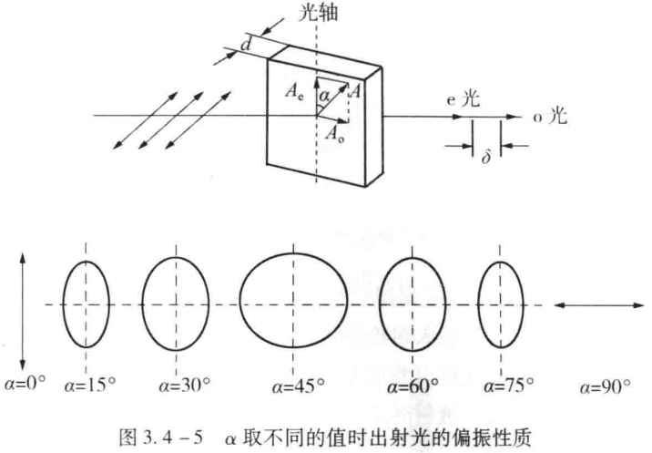
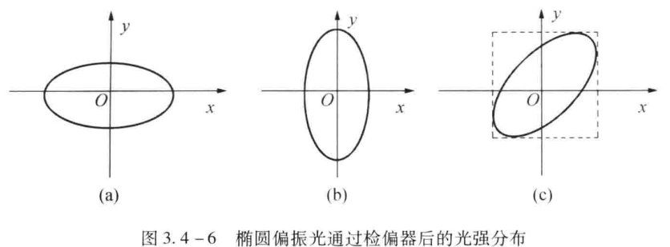
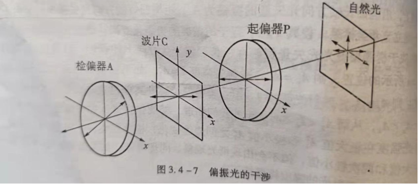
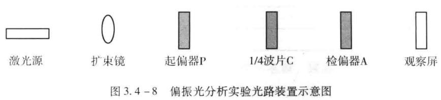
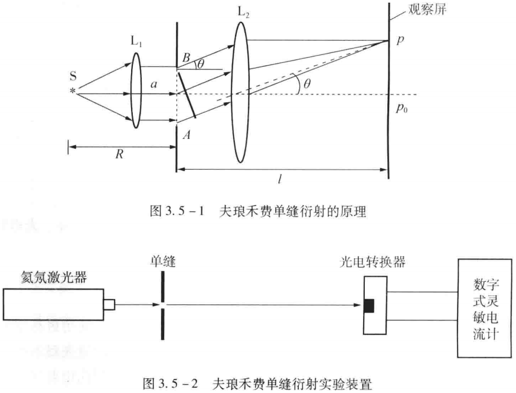
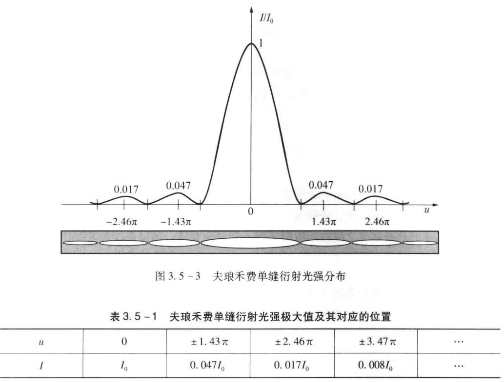

# 光的偏振特性研究&光的衍射实验报告

大学物理实验报告

实验名称 光的偏振特性研究
- 实验目的

(1)了解自然光和偏振光的定义及特性。

(2)观察光的偏振现象，了解偏振光的产生方法和检验方法。

(3)了解波片的作用和用波片产生椭圆和圆偏振光及其检验方法。

(4)观察偏振光的干涉和人为双折射现象。
- 实验仪器

GSZ-II光学平台(配有光具座、氦氖激光器及电源、扩束镜、偏振片、波片、观察屏等)。
- 实验原理

1.自然光与偏振光的定义

光波是一种电磁波,是电磁场中电振动矢量*E*和磁振动矢量*B*变化的传播。在传播过程中,光波的电振动矢量*E*和磁振动矢量*B*相互垂直,且两者均与光的传播方向垂直,因此光波是横波。在光与物质相互作用的过程中,起主要作用的是光波中的电振动矢量*E*所以我们将其称为光矢量,*E*的振动称为光振动。显然,通过波的传播方向且包含振动矢量的那个平面与其他不包括振动矢量的平面是有区别的。这种光矢量相对于光的传播方向分布的非对称性叫作光的偏振。

光的横波性只表明光矢量与光的传播方向垂直,而在与光传播方向垂直的平面内光矢量还可能有各种不同的振动状态。如果光在传播过程中光矢量的振动只限于某一确定平面内,则这种光称为平面偏振光,由于平面偏振光的光矢量在与波传播方向垂直的平面上的投影为一条直线,故又将其称为线偏振光，如图3.4-1所示。

任何一个普通发光体,从微观上看，都是由大量的发光原子或分子组成的。每个发光原子每次所发射的是一个平而偏振波列。大量发光原子或分子在同一时刻发出大量偏振波列、各波列的偏振方向及相位分布都是无规则的,光矢量可以分布在轴对称的一切可能的方位上，即光矢量对光的传播方向是轴对称分布的。另一方面,每个发光原子发光的持续时间约为10-8s,而一般观测时间总是比微观发光持续时间长得多，因此在观测时间内实际接收到的仍是大量的偏振波列,波列与波列之间相位彼此无关联，光矢量也是呈轴对称分布的。这种由普通光源所发射的光波,在光的传播方向上,任意一个场点，光矢量既有空间分布的均匀性,又有时间分布的均匀性。具有这种特点的光叫自然光，如图3.4-2所示。

				

如果由于某种原因，光波光矢量的振动在传播过程中只是在某一确定的方向上占有相对优势,则这种光波被称为部分偏振光，如图3.4-3所示。

椭圆偏振光指的是在光的传播方向上,任意一个场点光矢量既改变它的大小,又以一定的角速度转动它的方向，或者说光矢量的端点在垂直于光传播方向的平面内的投影是一个椭圆，如图3.4-4b所示。而圆偏振光是指在光的传播方向上,任意一个场点光矢量以一定的角速度转动它的方向,但大小不变,其光矢量的末端在垂直于光传播方向的平面内的投影是一个圆如图3.4-4c所示。

2.偏振光的产生

普通光源发出的光大多是自然光。从自然光中获取偏振光,需借助各种光学元件和实验方法。

从自然光中获得平面偏振光的过程叫起偏,用作起偏的光学元件叫起偏器。起偏的方法有多种,本实验采用具有二向色性的晶体来产生偏振光。某些晶体对不同方向振动的光矢量具有不同的吸收本领,这种选择性吸收称为二向色性。当自然光入射到二向色性晶体上时,透射光的光矢量仅在某一个特定方向上,该方向称为晶体的偏振化方向,也称作透振方向。实验室用的偏振片,就是利用晶体的二向色性产生偏振光的。当自然光人射到偏振片上时,透射光就成为平面偏振光。偏振片制作简单,成本低廉,且面积也能做得较大,是被普遍使用的偏振器。

自然界大多数光源发出的光是自然光,但有时也发出圆或椭圆偏振光。这里所谓椭圆或圆偏振光的“获得”,是特指利用偏振器件把自然光变成圆或椭圆偏振光。根据振动合成理论,两束传播方向相同、频率相同、振动方向相互垂直的平面偏振光,若其相位差合适便可登加成椭圆或圆偏振光。因此,在从自然光中获得平面偏振光后,采取适当的方法便能得到椭圆和圆偏振光。本实验主要采用一波片获得椭圆或圆偏振光。波片是光轴平行于晶面的各向异性的晶体薄片。当线偏振光垂直人射到一块波片上时,其振动面(由光振动方向与光的传播方向所确定的平面)与波片的光轴成a角,则在波片内人射光被分解成振动方向垂直于光轴的。光和振动方向平行于光轴的e光。它们在波片内的传播方向一致,但传播速度不同,因而在波片的出射面处,两者之间产生了相对相位差

δ=2πd|ne-no|/λ							（3.4-1）

其中,ne和n0分别为波片对o光和e光的折射率,λ为入射光的波长,d为波片的厚度。

这两束光合成为出射光,因而出射光的偏振性质取决于α和δ,一般情况下,出射光为椭圆偏振光。

当δ的值为2π的整数倍时,对应的波片为全波片，对应的出射光为线偏振光,振动方向与原入射光的振动方向相同;当δ的值为π的奇数倍时,对应的波片为1/2波片,对应的出射光仍为线偏振光,但振动面相对于原入射光的振动面转过了2α;当δ的值为π/2的奇数倍时,对应的波片为1/4波片。由于o光和e光的振幅是α的函数,所以线偏振光通过波片后的合成光的偏振状态也将随角度α的变化而不同，具体总结如下：

当α=0时，出射光为振动方向平行于1/4波片光轴的线偏振光；

当α=π/2时，出射光为振动方向垂直于1/4波片光轴的线偏振光；

当α=π/4时，出射光为圆偏振光；

当α为其他值时，出射光为椭圆偏振光，具体如图4.3-5所示

3.偏振光的检验

我们可以通过测定光束经过一些偏振器件后的光强分布特点来区分和检验各类偏振光。前面提到的偏振片既可以作为起偏器使用，也可以作为检偏器使用。偏振片用于检偏时,被称为检偏器。

(1)线偏振光通过检偏器后的光强分布。按照马吕斯定律,强度为I0的线偏振光通过检偏器,透射光的强度为

I=I0cos2a							（3.4-2）

其中,α为入射光的光振动方向与检偏器偏振化方向的夹角。显然,当以光的传播方向为轴旋转检偏器时,透射光的强度出现周期性变化。当a=0或π时,透射光的强度最大;当a=π/2或3π/2时，透射光的强度为0，这被称为消光现象。所以检偏器旋转一周,透射光的强度将发生强弱变化,并且会出现两次消光现象。这是线偏振光通过检偏器的特点。可以根据这个特点来判断入射光是否是线偏振光。
1. 椭圆偏振光和圆偏振光通过检偏器后的光强分布。设有一束椭圆偏振光垂直人射到一检偏器上,沿椭圆长轴方向光矢量的振幅为A1,沿椭圆短轴方向光矢量的振幅为A2。在检偏器上建立直角坐标系,使其x轴平行于检偏器的偏振化方向。透过检偏器的光矢量的振幅Ax取决于椭圆偏振光光矢量振幅在检偏器偏振化方向上的投影。如果检偏器转到如图3.4-6a所示的位置,则Ax=A2,透射光强度I=A12);如果检偏器转到如图3.4-6b所示的位置,则,Ax=A2,透射光强度1=A22;当检偏器转到其他位置时,如图3.4-6c所示，则A2<Ax<A1,从而A22<Ix<A12。由此我们知道,椭圆偏振光入射检偏器,让检偏器旋转,透射光强度在极大值A12和极小值A22之间连续变化,检偏器旋转一周透射光强度会出现两次极大值和两次极小值,但不会出现消光现象。同理可知,如果圆偏振光入射检偏器,让检偏器旋转,透射光的强度将保持不变。

(3)部分偏振光与自然光通过检偏器后的光强分布。由于自然光的光矢量相对光的传播方向呈轴对称分布，所以自然光入射检偏器，让检偏器旋转，透射光的强度不变，均为入射光强度的一半。部分偏振光可以看成是自然光和线偏振光的组合，所以部分偏振光入射检偏器，让检偏器旋转一周，透射光的光强会发生强弱变化，并出现两次极大值和两次极小值，但不会出现消光现象。

由此可见，仅用一个检偏器不能将自然光与圆偏振光、部分偏振光与椭圆偏振光区分开。这时需要将1/4波片与检偏器配合使用，才能将它们区分开。这主要是利用了圆偏振光和椭圆偏振光通过1/4波片后可以转变成线偏振光的特点

4.偏振光的干涉

由偏振光形成的干涉现象称为偏振光的干涉。偏振光干涉的经典装置如图3.4-7所示。单色自然光通过起偏器P后变成平面偏振光。单色平面偏振光通过波片C时,被分成传播方向、频率相同,相差恒定,但振动方向相互垂直的两束光。这两束光不能产生干涉，但通过检偏器A后就变成了两束传播方向、频率相同,相差恒定,振动方向相同的相干光。若波片C的厚度均匀,则从波片不同位置出来的两束光的光程差相同,观察屏上光班的亮度将是均匀的。此时以光的传播方向为轴转动检偏器A,观察屏上会有均匀的明暗变化。如果波片C的厚度不均匀,则从波片不同位置出来的两束光的光程差不同,观察屏上将出现明暗相间的干涉条纹。

如果将上述系统中的光源改为白光,当波片的厚度一定时,由于不同波长的光经过波片后被分成的两束光之间的相位延迟不同,所以通过检偏器A后的干涉效果不同,混合起来就呈现某种彩色,这种现象称为显色偏振。显色偏振是测定双折射极为灵敏的方法。此时以光的传播方向为轴转动检偏器A,观察屏上会有色彩的变化。
- 实验内容及操作步骤

1.偏振光分析

①按如图3.4-8依次放置各光学元件，并调节各元件等高共轴。先不放1/4波片C，转动起偏器P或检偏器A，使P和A的偏振化方向互相垂直（此时应观察到消光现象）。

②在P和A之间插入一波片C，转动C消光，然后将A转动360°，注意观察屏上光斑亮度的变化情况，判断这时从C出来的偏振光的偏振性质。

③再将C转动15°，然后同样将A转动360°并注意观察屏上光斑亮度的变化情况，判断这时从C出来的偏振光的偏振性质。

④依次将C转动30°,45°,60°,75°,90°，每次都将A转动360°，记录所观察到的现象，判断从1/4波片C出来的偏振光的偏振性质。完成实验，结果记录于表3.4-1。

2.观察偏振光的干涉及人为双折射现象

①同样按图3.4-8布置光路。用白光代替激光，移开观察屏。使起偏器P与检偏器A的偏振化方向互相垂直，即从检偏器A一侧迎光望去，视场应全黑。然后将厚度不均匀的玻璃劈插入P和A之间，则原来全黑的视场出现彩色干涉条纹。将P（或A）转90°，即由原来的正交系统变成平行系统，此时原来产生相长干涉（或相消干涉）的光变成相消干涉（或相长干涉），观察此时视场中干涉条纹颜色的变化情况。视场中同一厚度处前后两种颜色为互补色（能合成白色的任何两种颜色称为互补色）。

②在起偏器P和检偏器A之间插入一块各向同性的环氧树脂，并从侧面对其施加压力，观察人为双折射现象，注意不同大小的压力对干涉条纹的影响。根据干涉花样就可分析被观察材料内部的应力分布情况。工业上常用此方法来分析某些机械零件和工程构件在实际使用时内部应力的分布情况。
- 数据记录及数据处理（包括计算公式、计算步骤，误差分析）

表3.4-1  偏振光特性分析记录

| 1/4波片C转动角度 | 检偏器A转动360°观察到的现象 | 从1/4波片C出来的光的偏振性质 |
|---|---|---|
| 0° | 亮度发生变化，但不会消光，且出现2次极大值，极小值 | 椭圆偏振光 |
| 15° | 亮度发生变化，但不会消光，且出现2次极大值，极小值 | 椭圆偏振光 |
| 30° | 亮度发生变化，但不会消光，且出现2此极大值，极小值 | 椭圆偏振光 |
| 45° | 亮度不变 | 圆偏振光 |
| 60° | 亮度发生变化，但不会消光，且出现2次极大值，极小值 | 椭圆偏振光 |
| 75° | 出现2次消光现象 | 线偏振光 |
| 90° | 出现2次消光现象 | 线偏振光 |

- 对实验误差形成的原因进行分析并提出改进办法，或谈谈对该实验的感想

思考题：
1. 如何用实验的方法鉴别自然光与圆偏振光、偏振光与部分偏振光?

①用偏振片进行观察，若光强随偏振片的转动没有变化，这束光是自然光或圆偏振光。这时在偏振片之前放1/4玻片，再转动偏振片。如果强度仍然没有变化是自然光；如果出现两次消光，则是圆偏振光，因为1/4玻片能把圆偏振光变为线偏振光。

②如果用偏振片进行观察时，光强随偏振片的转动有变化但没有消光，则这束光是部分偏振光或椭圆偏振光。这时可将偏振片停留在透射光强度最大的位置，在偏振片前插入1/4玻片，使玻片的光轴与偏振片的投射方向平行，再次转动偏振片会若出现两次消光，即为椭圆偏振光，即椭圆偏振片变为线偏振光；若还是不出现消光，则为部分偏振光 。

③如果随偏振片的转动出现两次消光，则这束光是线偏振光。
1. 如何用光学的方法区分1/2波片与1/4波片?

1/2波片使出射光中，o光、e光的位相差增加π；1/4波片使出射光中，o光、e光的位相差增加π/2。
1. 在实验内容“1.偏振光分析”中，当检偏器P与起偏器A的偏振化方向互相垂直后，插入1/4波片C，必须将C转至消光位置才开始观察。这样做的目的何在?

让两个偏振器的偏振化方向的夹角为90°。

实验感想：

做实验前要多看课本，熟悉实验原理和实验步骤，否则在实验时需要用很多时间去看课本。做实验要保证环境满足实验要求，否则实验可能得不到想要的结果。

大学物理实验报告

实验名称 光的衍射

一、实验目的

(1)观察单缝衍射现象。

(2)学习如何使用光电器件测量光强的分布。

(3)测定单缝衍射的相对光强分布。

二、实验仪器

GSZ-II光学平台(配有光具座、氦氖激光器及电源、狭缝、观察屏、光电转换器、数字式灵敏检流计等)。
- 实验原理

光波在传播的过程中遇到障碍物时会绕过障碍物继续传播，到达沿直线传播所不能到达的区域，并且形成明暗条纹，这种现象称为光的衍射。研究表明，只有当障碍物的线度与光波的波长可以相比拟的时候，衍射现象才明显地表现出来。借助惠更斯-菲涅耳原理可以描述光束通过不同形状的障碍物时产生的衍射现象。

通常根据光源和观察屏到障碍物距离的不同，可以把衍射现象分为两大类。如果光源与观察屏之间的距离或障碍物与观察屏之间的距离是有限的，这样的衍射称为菲涅耳衍射，又称近场衍射。菲涅耳衍射的光强分布计算起来比较麻烦。如果光源到障碍物的距离以及障碍物到观察屏的距离均为无限大，即平行光入射，平行光出射，这样的衍射称为夫琅禾费衍射，又称远场衍射。夫琅禾费衍射的光强分布容易计算，同时它也有很多重要的应用，因此这里我们只讨论夫琅禾费衍射。

夫琅禾费单缝衍射的原理如图 3.5-1所示。在满足夫费衍射条件(光源离单缝很远，即R》a2/(4λ)，其中R为光源到单缝的距离，a 为单缝的宽度，入 为入射光的波长;观察屏离单缝足够远，即l》a2/(4λ)，其中l为单缝与观察屏之间的距离)下，单缝前后也可不用透镜而获得夫琅禾费衍射花样。本实验采用亮度强、单色性好、发散角极小的氦氖激光器作为光源，就可以省去图3.5-1 光路图中的镜L1和L2。实验光路装置如图3.5 -2 所示.

如图3.5-1所示，设屏幕上p0处是中央明条纹的中心，其光强为I0，屏幕上与光轴成θ角的p处的光强为I。根据惠更斯-菲涅耳原理，可导出

I = I0sin2u/u2								（3.5-1）

其中u=πasinθ/λ。由此可得：

①当u=0，即θ=0时，I=I0，其为中央主极大光强，光强最大。衍射光的能量绝大部分都落在中央明条纹上。在其他条件不变的情况下，I0与a2成正比。

②当u=kπ(k= 1，2，···)时，I=0，观察屏上对应的地方出现暗条纹。k称为暗条纹的级次。因为夫琅禾费衍射时θ很小，所以 sinθ≈θ，则暗条纹出现在θ=kλ/a的方向上。

③中央明条纹的角距Δθ0=2λ/a是其他相邻暗条纹之间角距

Δθ0=λ/a的两倍，所以中央明条纹的宽度是其他各级明条纹宽度的两倍。

④除了中央主极大光强以外，相邻两暗条纹间各有一次次极大光强出现在d(sin2u/u)du=0的位置。其对应的具体位置和光强值见表3.5-1，光强分布见图3.5-3。

- 实验内容及操作步骤

观察夫琅禾费单缝衍射现象

按图3.5-2安排实验光路，调节各光学元件至等高共轴，使激光束垂直照射单缝调节单缝的宽度和观察屏到单缝的距离使观察屏上出现清晰明显的衍射条纹，然后进行以操作:

①改变单缝宽度，观察并记录衍射条纹的变化规律。

②改变单缝到观察屏之间的距离，观察并记录衍射条纹的变化规律

③移去观察屏，换上光电转换器，使数字式灵敏检流计与之相连。调节光电转换器的多位螺钉，测出中央极大光强I0和k=±1，±2级的次极大光强，验证理论结果Ik/I0=0.047、0.017。

④观察夫琅禾费圆孔衍射现象。理论结果表明，夫琅禾费单缝衍射的±1级次极大光强还不到主极大光强的百分之五。当数字式灵敏电流计的数字显示为“1”时，表示此时已超出检流计量程，需减小单缝的宽度或者让光电转换器远离单缝
- 数据记录及数据处理（包括计算公式、计算步骤，误差分析）

表2    夫琅禾费衍射光强分布比测量

| 级数 | +2 | +1 | 0 | -1 | -2 |
|---|---|---|---|---|---|
| 光电流/nA | 37 | 119 | 4800 | 119 | 54 |

I1/I0=0.025，I2/I0= 0.009

六、对实验误差形成的原因进行分析并提出改进办法，或谈谈对该实验的感想

误差原因分析及改进方法：

误差原因分析：造成Ik/I0实际结果理论结果有较大差距的原因可能有：①没有控制好光源、单缝和光电转换器之间的距离②移动光电转换器从而接受±1，±2级的次级大光强时，移动幅度过大，导致光电流较小③由于实验时，门口有光透进来，干扰实验

改进方法：①严格控制三者之间的距离②在移动光电转换器时，要慢慢地扭动细准焦螺旋③保证实验室无光照影响

思考题：
1. 如何判断夫琅禾费衍射的远场条件是否得到满足?

波长*衍射屏接收屏距离》衍射平尺寸的平方
1. 如果入射光是复色光，衍射条纹将是什么样子?

中央条纹还是最亮的。不同颜色的光各自形成自己的亮条纹，波长越短的，亮条纹间距越窄。从而最终形成的条纹是彩色的。每个亮条类似彩虹，且近中心端为紫色等短波长光，远中心端为红色等长波长的光。
1. 若在单缝与观察屏之间放人折射率为n的透明介质，衍射条纹会发生什么变化?

衍射图样条纹定性上显然仍是明暗分布，改变的是条纹间距。条纹间距的公式中，缝的宽度和屏的距离都与介质无关，唯有波长会改变波在真空中的波速。V1和折射率为n的透明介质中波速V2关系如下：V1=nV2，又因为频率永远不变 所以条纹间距会变为真空中的1/n倍。
