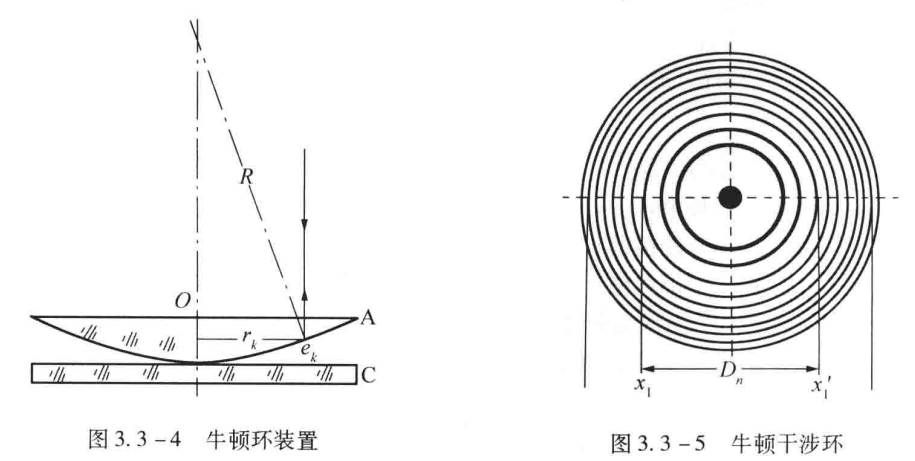
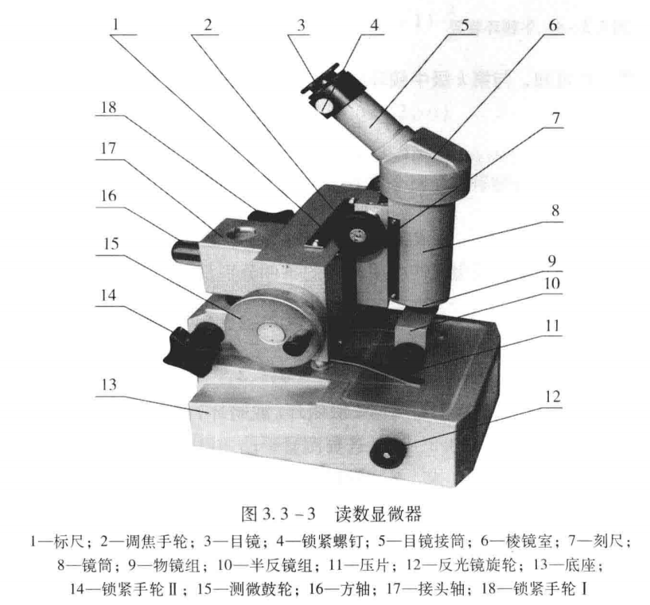
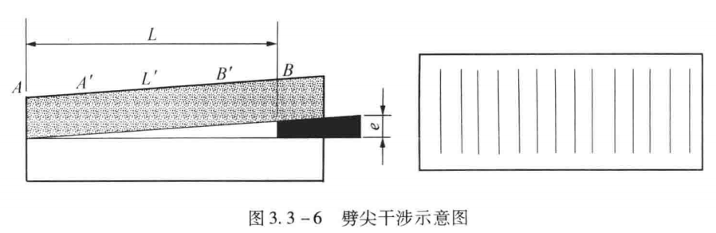

# 光的等厚干涉

大学物理实验报告

实验名称 光的等厚干涉
- 实验目的

（1）观察光的等厚干涉现象。

（2）利用牛顿环测量平凸透镜的曲率半径R。

（3）学习使用读数显微镜。
- 实验仪器

读数显微镜、牛顿环、劈尖、纳光灯、待测细丝。
- 实验原理

1.牛顿环

将一个曲率半径为R的平凸透镜A放在平板玻璃C上，凸面和平板玻璃接触，如图3.3-4所示。A、C间便形成一空气层，空气层由O向外逐渐变厚。如用单色光向正方向垂直入射，则空气层上下两界面上反射的光将发生干涉，在同一厚度处形成同一干涉条纹。这时在A的上方观察，便可看见中心是一暗斑，而周围有很多明暗相间、间隔逐渐减小的同心圆环，这些圆环称为牛顿干涉环，如图3.3-5所示。

由光路图分析可知，与第k级牛顿环相对应的两束相干光的光程差为

σk=2ek+λ/2   								（3.3-1）

式中，λ/2是光线从光疏介质射向光密介质发生反射引起的附加光程差。可知

R=(rk+(R-ek)2)1/2 								（3.3-2）

由相干光光程差分析可得由反射光产生明暗环的条件分别是

rk=√((2k-1)R*(λ/2))（k=0,1,2,…明环条件）        		（3.3-3）

式中，k是明环（或暗环）的级数；rk为第k级明环（或暗环）的半径；R是平凸透镜的曲率半径；λ是光波的波长。按式（3.3-2），若要测量平凸透镜的曲率半径R，如已知波长λ，测出某一级明环或暗环的半径，代入公式即可求出R。但因A与C间的接触点不可能是一个理想点，可能由于A、C间有尘埃烘托使A、C并未接触，或压力过大使A、C间形成大面积接触，这些情况都将使得每环半径rk发生变化，若仍然用公式（3.3-3）进行计算，必然造成较大的系统误差。假设用暗环进行测量，测出第m级和n级的暗环半径rm和rn，设这些数据都带有上述系统误差，但可以认为r是已测准的数据，误差主要是在级数m和n上。即在理想点接触时，本该是m+x暗环之处，看到的却是第m暗环；本该是n+x暗环处，看到的却是第n暗环。按式（3.3-3）有rm=((m+x)λR)1/2和rn=((n+x)λR)1/2，这两式是正确的，把它们平方后相减，即得rm2-rn2=(m-n)Rλ。若用环的直径来表示，则上式为

R=(Dm2-Dn2)/(4(m-n)λ)  		 				（3.3-4）

此时只涉及两环级数之差，而不取决于级数本身，从而消除了因级数不准带来的误差。用明环讨论也有同样的结论。

2.劈尖干涉

用两块光学平面玻璃板，使其一端接触，另一端夹一薄纸片或最细的漆包线。这样玻璃板之间就形成了一空气劈尖。当平行单色光垂直照射玻璃板时，劈尖上表面反射的光束和下表面反射的光束之间就存在一定的光程差，当此两光束相遇时就发生干涉，呈现出一组与两玻璃板交接线平行、间隔相等、明暗相间的干涉条纹。设单色光的波长为λ，在劈尖厚度为e处发生干涉的两束光线的光程差为

σ=2ne+λ/2								（3.3-5）

n为劈尖间媒介折射率。要形成暗条纹，光程差必须满足以下关系:

σ=2ne+λ/2=(2k+1)λ/2						（3.3-6）

则

e=kλ/(2n)	(k=0,1,2,...)						（3.3-7）

k为干涉级数。由式(3.3-7)可知，当k=0时，e= 0，即在两玻璃板交线处呈现零级暗纹。如在纸片上呈现k=N的暗条纹(即第N级暗纹)，则上式变为

e=Nλ/(2n)									（3.3-8）

此时e即为待测物的厚度:N为待测物的暗条纹级数，也就是零级暗纹至待测物之间的暗条纹总数。在 N不太多的情况下可以直接数出来。但N数目一般很大，故先测出单位长度暗条纹数N0，再测出两玻璃板交接线至待测物间的距离 L，则N=N0·L。于是

e=N0Lλ/(2n)								（3.3-9）

若劈尖间的媒介为空气，则n=1。
- 实验内容及操作步骤

1.熟悉仪器结构

仪器实物图如书图3.3-3所示，了解仪器使用方法。

2.测量平凸透镜的曲率半径

①调节目镜使分划板十字叉丝线清晰。

②将牛顿环仪放在读数显微镜的平台上，稍微移动整个显微镜，并绕主轴作微转动，使45°透光反射镜正对纳光灯，在目镜观察到一个最亮的视场时，移动牛顿环仪使其在显微镜筒的正下方。

③调节显微镜的调焦手轮使物镜接近牛顿环仪，然后在目镜中观察，并继续缓慢调节调焦手轮使镜筒自上而下移动直至观察到牛顿环最为清晰为止（书图3.3-5）。

④测量暗环直径D。为避免测微螺杆间隙所引起的空间误差，测量时必须使显微镜从左到右（或从右到左），分别记下叉丝线对准右（或左）边第20，…12，11个暗环（垂直叉丝线与条纹宽度中央相切）时显微镜的读数xi，再沿同方向继续移动镜筒，并记下左（或右）边第11，12，…，20个暗环的读数xi，将数据记录于表3.3-1。

3.利用劈尖干涉测量tanα值

①将劈尖放置于平台上，在读数显微镜上找到干涉条纹，调节调焦手轮使条纹清晰，移动劈尖使干涉条纹和叉丝竖线平行(即和读数标尺垂直)。干涉条纹如图3.3-6 所示。

②旋转测微鼓轮使叉丝沿某一方向移动，测出N条干涉暗条纹之间的总长度L。在不同位置分别测量10次。

- 数据记录及数据处理

表1 牛顿环测量表格

<table>
<tr><td>暗环级数n</td><td>暗环位置(mm)</td><td>Dn(mm)</td><td>暗环级数m</td><td>暗环位置(mm)</td><td>Dm(mm)</td></tr>
<tr><td></td><td>左</td><td>右</td><td></td><td></td><td>左</td><td>右</td><td></td></tr>
<tr><td>11</td><td>3.475</td><td>8.527</td><td>5.052</td><td>16</td><td>3.012</td><td>8.993</td><td>5.981</td></tr>
<tr><td>12</td><td>3.372</td><td>8.622</td><td>5.250</td><td>17</td><td>2.928</td><td>9.073</td><td>6.145</td></tr>
<tr><td>13</td><td>3.280</td><td>8.731</td><td>5.451</td><td>18</td><td>2.845</td><td>9.150</td><td>6.305</td></tr>
<tr><td>14</td><td>3.175</td><td>8.810</td><td>5.635</td><td>19</td><td>2.765</td><td>9.239</td><td>6.474</td></tr>
<tr><td>15</td><td>3.096</td><td>8.908</td><td>5.812</td><td>20</td><td>2.701</td><td>9.308</td><td>6.607</td></tr>
</table>

将上述所求得各暗环直径Di对半分成两组，按m-n=5分成5组代入公式R=(Dm2-Dn2)/(4(m-n)λ)算出R值，并计算和σ。已知钠光波长λ=589.3nm。

= 0.857 m，σR=√(Σ(ΔRi)2/n(n-1))=  0.006，R=±σR= 0.857±0.006 m

表2 劈尖测量表格

| 暗纹 | X1 | X2 | X3 | X4 | X5 | X6 | X7 | X8 | X9 | X10 |
|---|---|---|---|---|---|---|---|---|---|---|
| 位置(mm) | 1.150 | 1.337 | 1.540 | 1.723 | 1.958 | 2.149 | 2.368 | 2.565 | 2.798 | 3.004 |

测量相邻两条暗纹的空气薄膜厚度差为λ/2相邻两条暗纹距离s

将上述所测量到的暗纹位置分为五组，利用逐差法和公式tanα=(λ/2)/s计算每组的tanα值，并计算平均值和σ。已知钠光波长λ=589.3nm。

=  0.001  ，σ=  0.000  ，tanα=±σ=  0.001±0.000
- 对实验误差形成的原因进行分析并提出改进办法，或谈谈对该实验的感想

思考题：

1.试比较牛顿环与劈尖干涉条纹的异同点。若看到的牛顿环局部不圆，劈尖干涉条纹局部弯曲，这说明什么?

异同点：

（1）产生原因不同：牛顿环是在透明介质上空气膜中反射光的双面干涉现象，劈尖干涉是在一侧斜交银膜后形成的。

（2）物理形态不同：牛顿环是由于平行光垂直照射透明介质表面，在介质与空气接触面处由于折射率不同而产生的光程差所引起的明暗干涉现象；劈尖干涉则是利用银镜的反射和折射效应产生干涉条纹的。

当看到牛顿环局部不圆或劈尖干涉条纹局部弯曲时，说明光程差发生了变化。这可能是由于实验装置的松动或移位导致光路长度发生了微小的改变。此外，如果观察者眼睛出现了一定的问题，也可能会产生视觉上的错觉。

2.实验时应如何避免读数显微镜的空回误差？

观察牛顿环时单向计数，即一直从左向右移或从右向左移。

3.牛顿环中透射光的干涉环和反射光的干涉环有何不同？

干涉环都是明暗相间的圆环。透射光的环心是亮的，反射光的环心是暗的。

4.若用一个已知波长的光源、牛顿环来测量一个未知波长的光源，应如何测量？应用怎样的数据处理方法？

先使用已知波长的光源测量该牛顿环的曲率半径R，再使用未知波长的光源进行牛顿环实验。此时只有波长为未知量，将R代入公式便可求出未知波长光源的波长。

实验感想：

在尽可能规避尘埃烘托所带来的误差的基础上，可能还存在牛顿环环数不够清晰，以至于容易数错环数而导致误差产生；同时也可能存在读数误差。这两者或许会构成本次实验误差来源的一大部分。
