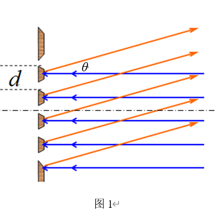
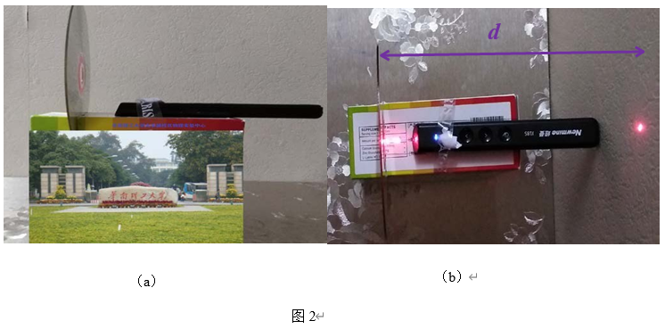

# 光盘轨距的测量及其容量估算

实验一 光盘轨距的测量及其容量估算

一、实验目的

（1）利用简易仪器测量物理参数的能力培养；

（2）了解反射光栅的特性，并利用反射光栅测量光栅常数或（光波长）。

二、实验仪器

激光笔，光碟片，其它简易器材。

三、实验原理

1.光栅原理

在光碟盘的数据面有一系列记录数据的同心圆轨迹，相邻同心圆间（螺旋线）的距离称为光盘的轨距。因此，光盘表面密布细小的划线，相当于微小的反射光栅。

波长λ的平行光束垂直投射到反射光栅平面上时（如图1），光波将在每条凸出面发生反射射，反射光在叠加处又会产生干涉，干涉结果决定于光程差。因为光栅各狭缝间距相等，所以相邻狭缝沿方向衍射光束的光程差都是dsinθ（图1）。θ是衍射光束与光栅法线的夹角，θ称为衍射角。

在光栅后面放置一个屏，在屏幕上，由多光束干涉原理，在θ满足下式时将产生干涉主极大为亮点：

dsinθ=kλ(k=0,±1,±2,…)  （1）

式中  k 是级数，d 是光栅常数。（1）式称为光栅方程，是衍射光栅的基本公式。

由（1）式可知，θ=0对应中央主极大，P0点为亮点。中央主极大两边对称排列着±1级、±2 级……主极大。实际光栅的狭缝数目很大，缝宽越小，所以当产生平行光的光源为细长的狭缝时，光栅图样将是平行排列的细锐亮线。

2.光栅特性

角色散和分辨本领是光栅的两个重要特性。衍射光栅能将复色光按波长在透镜焦平面上分开成不同波长的谱线，说明衍射光栅有色散作用。由于衍射现象，使光谱线扩展为较宽的亮条纹，因而限制了光栅的分辨能力，根据理论推导，光栅的色散能力可以用角色散  D 表征。

D=dθ/dλ  （2）

上式表示单位波长间隔的两条单色谱线间的角间距。将光栅方程（1） 微分就可以得到光栅的角色散

D=k/(dcosθ)  （3）

由方程（3）可知，光栅常数越小，角色散越大，光谱的级次越高，角色散越大。分辨本领 R 表征光栅分辨光谱细节的能力，如果光栅刚刚能将λ和λ+dλ 两条谱线分开，则

R=λ/dλ  （4）

根据瑞利判断，当一条谱线的光强极大和另一条谱线的极小重合时，两条谱线刚好可以被分辨。由此可以推出

R=kN  （5）

式中  N 为光栅的总狭缝数，k 为光谱的级数。N 的数目很大，可知光栅是具有高分辨本领的光学元件。

3.光盘的存储容量

向光盘写入数据时，光盘读写机构控制高功率密度的激光束，照射记录信息的介质薄膜，在介质膜上按数据的特点烧成有规律的小孔。小孔的直径约为  0.6μm，即使直径0.6μm范围内的介质发生不可逆物理、化学变化，这时小孔周围的反射率、折射率与周围不同，这样就把小孔作为二时制中的“1”，把没有变化的部分作为“0”，一个“1”或“0”记作为1个信息单位，称为1bit。

在数据写入光盘时，盘放置在由电动机带动旋转的机构上，激光器沿径向运动。激光烧出的小孔的分布轨迹呈螺线状（近似看成同心圆）。标准光盘最内圈和最外圈的轨迹半径分别为5cm和15cm，因此,一个光盘的存储信息量在1010bit以上。存储介质的容量一般用字节（Byte）表示，1Byte=8bits。

四、实验内容与主要步骤

1.实验装置的准备与搭建。将光盘（CD）、激光笔及支架装置按图（2.a）搭建好，光盘与水平面垂直。

2.开启激光，调整激光笔入射光线与光盘盘面垂直，在光盘和激光笔之间随便插一块玻璃板，调节激光笔，使得发射出光束的光斑与返回光斑重合，光束就垂直镜面了。调节光盘平面与屏幕平行。

3.测量光盘到屏幕的距离d。

4.开启激光，观察屏幕上的衍射光斑，找到 1,2,…各级衍射斑，测量 1,2级衍射斑与0级（因为激光笔挡住，看不见）的距离。

5.多次测量。并计算1,2级衍射光求出的光盘轨距，并用x=x±δ表示。用同样的方法测量DVD光盘的轨距。

五、数据记录及处理

表1 CD 光盘轨距测量

<table>
<tr><td>测量次数</td><td>1</td><td>2</td><td>3</td><td>4</td><td>5</td><td>平均</td></tr>
<tr><td>光盘到屏的 距离  d(cm)</td><td>20.00</td><td>25.00</td><td>30.00</td><td>35.00</td><td>40.00</td><td>30.00</td></tr>
<tr><td>1级衍射斑到 0级距离(cm)</td><td>8.84</td><td>10.86</td><td>12.96</td><td>15.08</td><td>17.18</td><td>12.98</td></tr>
<tr><td>2级衍射斑到 0级距离(cm)</td><td>26.43</td><td>31.28</td><td>38.45</td><td>46.38</td><td>53.44</td><td>39.20</td></tr>
<tr><td>光盘轨距 测量结果</td><td>1.637×10-6m</td></tr>
<tr><td>光盘容量</td><td>755.0MB</td></tr>
</table>

表2 DVD 光盘轨距测量

<table>
<tr><td>测量次数</td><td>1</td><td>2</td><td>3</td><td>4</td><td>5</td><td>平均</td></tr>
<tr><td>光盘到屏的 距离  d(cm)</td><td>20.00</td><td>25.00</td><td>30.00</td><td>35.00</td><td>40.00</td><td>30.00</td></tr>
<tr><td>1级衍射斑到 0级距离(cm)</td><td>22.45</td><td>27.78</td><td>34.92</td><td>43.66</td><td>50.78</td><td>35.92</td></tr>
<tr><td>光盘轨距 测量结果</td><td>0.8469×10-6m</td></tr>
<tr><td>光盘容量</td><td>2.96GB</td></tr>
</table>

CD光盘数据处理：

轨距1=1×650×√(12.98²+30.00²)÷12.98  nm≈1636.90nm

轨距2=2×650×√(39.20²+30.00²)÷39.20  nm≈1637.04nm

∴轨距=1637.00nm=1.637×10-6m

容量=π×0.058²-π×0.025²÷(0.83×10-6×1.637×10-6×8×1024×1024)MB≈755.0MB

DVD光盘数据处理：

轨距=1×650×√(35.92²+30.00²)÷35.92  nm≈846.88nm≈0.8469××10-6m

容量=π×0.06²-π×0.023²÷(0.4×10-6×0.8469×10-6×8×1024×1024)MB≈2.96GB
