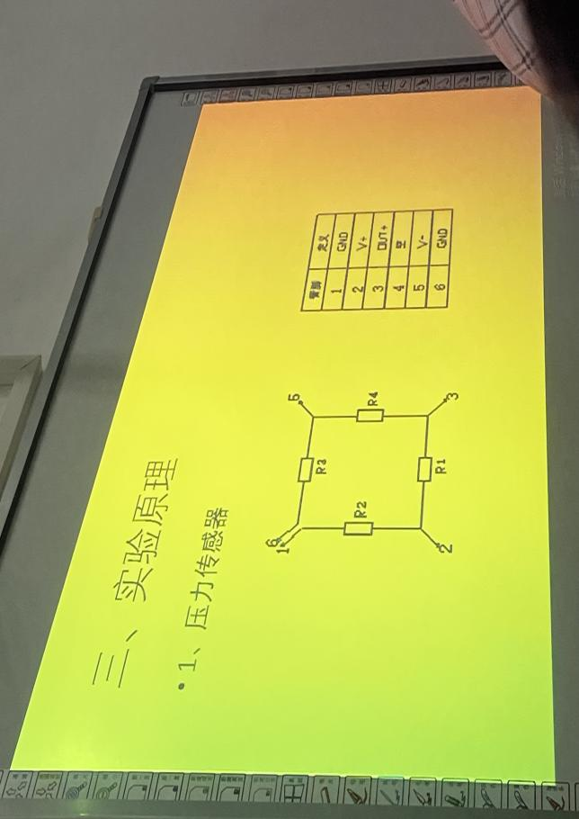

# 压力测人体脉搏

大学物理实验报告

实验名称 压力传感器测人体脉搏及血压

于博宇    202330451691  计科1班

**一、实验目的**

1、了解气体压力传感器的工作原理、测量气体压力传感器的特性。

2、用气体压力传感器、放大器和数字电压表来组装数字式压表，并用标准指针式压力表对其进行定标，完成数字或压力表的制作。

3、了解人体心律、血压的测量原理，利用压陌脉搏传感器测量脉搏波形、心跳频率，用自己组装的数字压打表采用柯氏音法测量人体血压。

**二、实验仪器**

•1.指针式压力表

•2.MPS3100气（体压力传感器；

•3.数字电压表；

•4.100ml注射器气体輸入裝置；

•5.压阻脉搏传感器；

•6.智能脉搏计数器

•7.血压袖套和听诊器血压测量装置；

•8.实验接插线

**三、实验原理**

**1、**

**2、心率和血压测量**

人体的心率血压是人的重要生理参数心跳的频率、脉搏的液形和

血压的高低是判断人身体健康的重要衣据。

1)心律、脉搏波与测量

心脏跳动的频率称为心律(次/分钟)心脏在周期性波动中挤压血管

引起动脉管壁的弹性形变,在血管处测量此应力液得到的就是脉搏波。

2)血压与测量

人体血压指的是动脉血管中脉动的血流对血管产生的侧向垂壁直

于血管壁的压力。主动脉血管中垂直于管壁的压力的峰值为收缩

压,谷值为舒张压。

**3、测量心率**

1)按图连线。

2)将压阻式脉搏传感器放在手臂脉搏最强处,插口与仪器脉搏传

感器插座连接,接上电源(+5V)、绑上血压袖套、稍加些压力80-

100左右。

3)按下“计次、保存”按键,仪器将会在规定的一分钟内自动测出

每分钟脉搏的次数并以数字显示测出的防搏次数。

**4.测量血压**

1)采用典型柯氏音法测量血压，将测血压套在上手处，并把医用听诊器插在袖套内脉搏处，2)血压袖套连接管用三通接入仪器进气口，用压气球向袖套压气至20kPa打开排气口缓慢排气，同时听诊器听脉音柯音),当听到第一次柯氏音时，记下压力表的读数为收缩压若气到听不到柯氏音时、那最后一次听到柯氏音时所对应的压力表数为舒张压,

3)如果舒张压读数不太肯定时，可以用压气球补气至舒张压读3来读出舒张上数之上，再次缓慢排气来读出舒张压数.

四、实验内容

1、气体压力传感器MPS3100的特性测量

(1)气体压力传感器MPS3100输入端加上实验电压(+5V),输出端

接数字电压表,通过注射器改变管路内气体压强。

(2)测出气体压力传感器的输出电压(4-32kPa测8点)。

(3)画出气体压力传感器的压强P与输出电压U的关系曲线(直线,

非线性≤0.3%FS),计算出气体压力传感器的灵敏度及相关系数。

2、数字式压力表的组装及定标

(1)连线

(2)琴键开关按在kPa档。

(3)反复调整气体压强为4kPa与32kPa

时放大器的零点与放大倍数,使放大器输出电压在气体压强为

4kPa时为40kPa,在气体压强为32kPa时为320kPa

组装好的数字式压力表可用于人体血压或气体压强的测量及数字

显示。

**3、心率和血压测量**

人体的心率血压是人的重要生理参数心跳的频率、脉搏的液形和

血压的高低是判断人身体健康的重要衣据。

1)心律、脉搏波与测量

心脏跳动的频率称为心律(次/分钟)心脏在周期性波动中挤压血管

引起动脉管壁的弹性形变,在血管处测量此应力液得到的就是脉搏波。

2)血压与测量

人体血压指的是动脉血管中脉动的血流对血管产生的侧向垂壁直

于血管壁的压力。王动脉血管中垂直于管壁的压力的峰值为收缩

压,谷值为舒张压。

**4、测量心率**

1)按图连线。

2)将压阻式脉搏传感器放在手臂脉搏最强处,插口与仪器脉搏传

感器插座连接,接上电源(+5V)、绑上血压袖套、稍加些压力80-

100左右。

3)按下“计次、保存”按键,仪器将会在规定的一分钟内自动测出

每分钟脉搏的次数并以数字显示测出的防搏次数。

**5、测量血压**

1)采用典型柯氏音法测量血压，将测血压套在上手处，并把医用听诊器插在袖套内脉搏处，2)血压袖套连接管用三通接入仪器进气口，用压气球向袖套压气至20kPa打开排气口缓慢排气，同时听诊器听脉音柯音),当听到第一次柯氏音时，记下压力表的读数为收缩压若气到听不到柯氏音时、那最后一次听到柯氏音时所对应的压力表数为舒张压,

3)如果舒张压读数不太肯定时，可以用压气球补气至舒张压读3来读出舒张上数之上，再次缓慢排气来读出舒张压数.

五、数据记录与处理

本小组调试如下：

| kPa | 4 | 8 | 12 | 16 | 20 | 24 | 28 | 32 |
|---|---|---|---|---|---|---|---|---|
| kPa | 40 | 81 | 122 | 161 | 199 | 240 | 281 | 319 |

脉搏测得：70次/min

低压62

高压94

六、个人拓展思考

实验环境在测量血压时还是过于喧闹，但这也是没有办法的事情，我认为如果能够用一个声音传感器来代替听诊器的声信号，那么实验精度会进一步提升。
