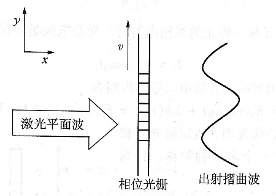
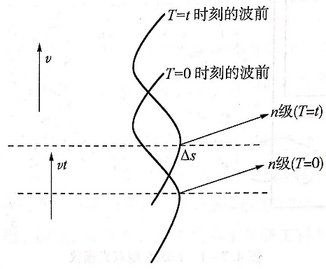
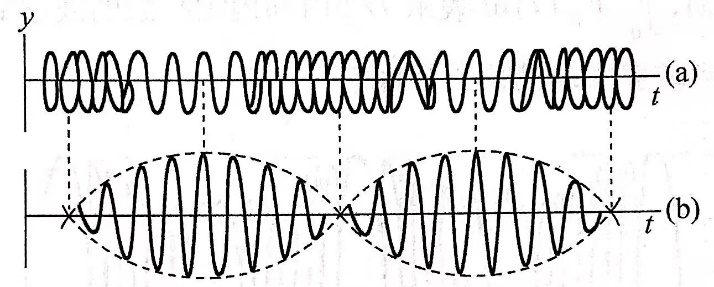

# 双光栅测微弱振动位移

大学物理实验报告

实验名称  双光栅测量微弱振动位移

于博宇    202330451691  计科1班

一.实验目的：

了解利用光的多普勒频移形成光拍的原理及测量光拍拍频的方法

学会精确测量微弱振动位移的一种方法

应用双光栅微弱振动测量仪测量音叉振动的微振幅

二.实验仪器：

- FB505型双光栅仪、双踪示波器

三．实验原理：

1.  移动光学相位光栅的多普勒频移：

   -  相位光栅指对单色光的光学性能（折射率）具有空间周期结构的光栅。当光入射于这种光栅时只改变出射光的相位，而不影响其振幅。当激光平面波垂直人射到相位光栅上时，由于相位光栅上不同的光密和光疏媒质部分对光波的相位延迟作用，使入射的平面波变成出射时的摺曲波阵面，如图所示。

由于光栅上单缝自身的衍射作用和缝之间的干涉作用，通过光栅后光的强度出现周期性的变化。在远场，我们可以用光栅衍射方程来表示主极大位置：

$$
\mathrm {dsin\theta =\pm k\lambda }
$$

整数k为主极大级数，d为光栅常数，$\mathrm {\theta }$为衍射角，$\mathrm {\lambda }$为光波波长。

如果光栅在y方向以速度v移动，则从光栅出射的光的波阵面也以速度v在y方向移动。因此，在不同时刻，对应于同一级的衍射，它从光栅出射时，在y方向也有一个vt的位移量，如图所示。

这个位移量对应于出射光波相位的变化量为$\mathrm {\Delta \phi (t)}$：

$$
\mathrm {\Delta \phi (t)=}\frac {\mathrm {2\pi }} {\mathrm {\lambda }}\mathrm {\Delta s=}\frac {\mathrm {2\pi }} {\mathrm {\lambda }}\mathrm {vtsin\theta =}\frac {\mathrm {2\pi }} {\mathrm {\lambda }}\mathrm {vt}\frac {\mathrm {k\lambda }} {\mathrm {d}}\mathrm {=2k\pi }\frac {\mathrm {v}} {\mathrm {d}}\mathrm {t=k}{\mathrm {\omega }}_{\mathrm {d}}\mathrm {t}
$$

若激光从一静止的光栅出射时，光波电矢量方程为

$$
\mathrm {E=}{\mathrm {E}}_{\mathrm {0}}\mathrm {cos}{\mathrm {\omega }}_{\mathrm {0}}\mathrm {t}
$$

而激光从相应移动光栅出射时，光波电矢量方程则为

$$
\mathrm {E=}{\mathrm {E}}_{\mathrm {0}}\mathrm {cos(}{\mathrm {\omega }}_{\mathrm {0}}\mathrm {t+\Delta \phi (t))=}{\mathrm {E}}_{\mathrm {0}}\mathrm {cos((}{\mathrm {\omega }}_{\mathrm {0}}\mathrm {+k}{\mathrm {\omega }}_{\mathrm {d}}\mathrm {)t)}
$$

2.  光拍的获得与检测：

-  光栅A按速度${\mathrm {v}}_{\mathrm {A}}$移动，起频移作用，而光栅B静止不动，只起衍射作用，故通过双光栅后射出的衍射光包含了两种以上不同频率成分而又平行的光束。由于双光栅紧贴，激光束具有一定宽度，故该光束能平行叠加，这样直接而又简单地形成了光拍。如图所示。

光电探测器能检测到的光拍信号的频率就是拍频${\mathrm {F}}_{\mathrm {拍}}$

$$
{\mathrm {F}}_{\mathrm {拍}}\mathrm {=}\frac {{\mathrm {\omega }}_{\mathrm {d}}} {\mathrm {2\pi }}\mathrm {=}\frac {{\mathrm {v}}_{\mathrm {A}}} {\mathrm {d}}\mathrm {=}{\mathrm {v}}_{\mathrm {A}}{\mathrm {n}}_{\mathrm {\theta }}
$$

其中${\mathrm {n}}_{\mathrm {\theta }}\mathrm {=1/d}$为光栅密度。本实验${\mathrm {n}}_{\mathrm {\theta }}$=100条/mm

3.  微弱振动位移量的测量：

${\mathrm {F}}_{\mathrm {拍}}$与光频率${\mathrm {\omega }}_{\mathrm {0}}$无关，且当光栅密度${\mathrm {n}}_{\mathrm {\theta }}$为常数时，只正比于光栅移动速度${\mathrm {v}}_{\mathrm {A}}$。如果把光栅粘在音叉上，则${\mathrm {v}}_{\mathrm {A}}$是周期性变化。所以光拍信号频率也是随时间变化而变化的，微弱振动的位移振幅为

$$
\mathrm {A=}\frac {\mathrm {1}} {\mathrm {2}}\int _{\mathrm {0}} ^{\mathrm {T/2}} \mathrm {v(t)dt}\mathrm {=}\frac {\mathrm {1}} {\mathrm {2}}\int _{\mathrm {0}} ^{\mathrm {T/2}} \frac {{\mathrm {F}}_{\mathrm {拍}}\mathrm {(t)}} {{\mathrm {n}}_{\mathrm {\theta }}}\mathrm {dt}\mathrm {=}\frac {\mathrm {1}} {\mathrm {2}{\mathrm {n}}_{\mathrm {\theta }}}\int _{\mathrm {0}} ^{\mathrm {T/2}} {\mathrm {F}}_{\mathrm {拍}}\mathrm {(t)dt}
$$

T为音叉振动周期，$\int _{\mathrm {0}} ^{\mathrm {T/2}} {\mathrm {F}}_{\mathrm {拍}}\mathrm {(t)dt}$为T/2时间内拍频波的波形数。故只要测得拍频波的波形数即可得到较弱振动的位移振幅。

波形数由完整波形数、波的首数、波的尾数三部分组成。

$$
\mathrm {波形数=整数波形数+}\frac {\mathrm {a}} {\mathrm {l}}\mathrm {+}\frac {\mathrm {b}} {\mathrm {l}}
$$

其中a、b分别为波群的首部和尾部的长度，l为一个完整波形的平均长度。

四.实验过程与步骤：

记录谐振频率和T/2内的波形数，计算音叉微弱振动位移的振幅A

五.数据记录与处理：

-

<table>
<tr><td>功率(W)</td><td>40.9</td></tr>
<tr><td>频率(Hz)</td><td>-0.3</td><td>-0.2</td><td>-0.1</td><td>507.132</td><td>+0.1</td><td>+0.2</td><td>+0.3</td></tr>
<tr><td>波形数</td><td>3.5</td><td>5.0</td><td>10.5</td><td>21.5</td><td>11.3</td><td>5.5</td><td>3.5</td></tr>
<tr><td>振幅A(mm)</td><td>0.0175</td><td>0.025</td><td>0.0525</td><td>0.1075</td><td>0.0565</td><td>0.0275</td><td>0.0175</td></tr>
</table>

六.个人拓展思考

-  如果把音叉加上防噪音的罩子会不会减少偶然误差呢？
