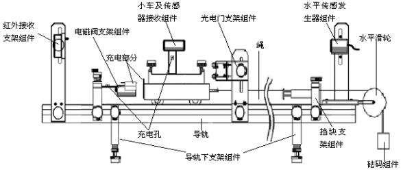
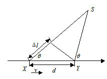

# 多普勒测声速

大学物理实验报告

实验名称  多普勒效应测量声速

于博宇    202330451691  计科1班

一.实验目的：

- 1.了解多普勒效应原理及其应用

2.熟悉多普勒超声综合实验仪的使用方法

3.利用多普勒超声综合实验仪测量声速和运动小车的速度

二.实验仪器：

- 多普勒效应综合实验仪****

三．实验原理：

1.  多普勒效应：

- 多普勒效应是物体辐射的波长因为波源和观测者的相对运动而产生变化。在运动的波源前面，波被压缩，波长变得较短，频率变得较高；在运动的波源后面时，会产生相反的效应。波长变得较长，频率变得较；波源的速度越高，所产生的效应越大。根据此效应，可以计算出波源循着观测方向运动的速度。

2.  多普勒频移具体物理关系式：

可以证明若接收体与波源相互靠近或相互远离的速度为v，波速为c，则接收体接收波的多普勒频率为${\mathrm {f}}^{\mathrm {'}}\mathrm {=f}\frac {\mathrm {c\pm }{\mathrm {v}}_{\mathrm {1}}} {\mathrm {c\mp }{\mathrm {v}}_{\mathrm {2}}}$，接收体和发射源的频率关系为：${\mathrm {f}}^{\mathrm {'}}\mathrm {=f}\frac {\mathrm {v\pm }{\mathrm {v}}_{\mathrm {0}}} {\mathrm {v\mp }{\mathrm {v}}_{\mathrm {s}}}$

其中，  ${\mathrm {f}}^{\mathrm {'}}$为接收到的频率，$\mathrm {f}$为发射源于该介质中的原始发射频率， v为波在该介质中的行进速度，${\mathrm {v}}_{\mathrm {0}}$为接收端相对于介质的移动速度，若接近发射源则前方运算符号为+号，反之则为−号；${\mathrm {v}}_{\mathrm {s}}$为发射源相对于介质的移动速度，若接近观察者则前方运算符号为−号，反之则为+号。

当移动台以恒定的速率v在长度为d，端点为X和Y的路径上运动时收到来自远端源S发出的信号，如图所示。

无线电波从源S出发，在X点与Y点分别被移动台接收时所走的路径差为

$$
\mathrm {\Delta l=dcos\theta =v\Delta tcos\theta }
$$

$\mathrm {\Delta t}$是移动台从X点运动到Y点所需的时间，$\mathrm {\theta }$是X和Y处与入射波的夹角。由于源端距离很远，可假设X、Y处的$\mathrm {\theta }$是相同的。所以，由于路径差造成的接收信号相位变化值为

$$
\mathrm {\Delta \varphi =}\frac {\mathrm {2\pi \Delta l}} {\mathrm {\lambda }}\mathrm {=}\frac {\mathrm {2\pi v\Delta t}} {\mathrm {\lambda }}\mathrm {cos\theta }
$$

则频率变化值多普勒频移${\mathrm {f}}_{\mathrm {d}}$为

$$
{\mathrm {f}}_{\mathrm {d}}\mathrm {=}\frac {\mathrm {1}} {\mathrm {2\pi }}\frac {\mathrm {\Delta \varphi }} {\mathrm {\Delta t}}\mathrm {=}\frac {\mathrm {v}} {\mathrm {\lambda }}\mathrm {cos\theta }
$$

由上式可看出，多普勒频移与移动台运动速度及移动台运动方向，与无线电波入射方向之间的夹角有关。若移动台朝向入射波方向运动，则多普勒频移为正（即接收频率上升）；若移动台背向入射波方向运动，则多普勒频移为负（即接收频率下降）。信号经不同方向传播，其多径分量造成接收机信号的多普勒扩散，因而增加了信号带宽.

3.  	反射式多普勒实验仪装置及如何用它来测声速和小车的速度：

声源和接收器在一条直线上,发射超声频率为f0,小车速率v远小于声速u，此时，声源静止，接收端小车速度为v，小车接收到声波的频率为${\mathrm {f}}^{\mathrm {'}}$，则

$$
{\mathrm {f}}^{\mathrm {'}}\mathrm {=(1+}\frac {\mathrm {v}} {\mathrm {u}}\mathrm {)}{\mathrm {f}}_{\mathrm {0}}
$$

小车将频率${\mathrm {f}}^{\mathrm {'}}$的声波反射回超声头接触端，此时相当于声源速度为v，接收端静止，超声头接收端接受到的频率

$$
\mathrm {\Delta f=}\frac {\mathrm {2v}} {\mathrm {u-v}}{\mathrm {f}}_{\mathrm {0}}
$$

根据多普勒效应，小车的速度v相近时的速度为正，相背离的速度为负。则

$$
\mathrm {u=}\frac {\mathrm {2}{\mathrm {f}}_{\mathrm {0}}\mathrm {+\Delta f}} {\mathrm {\Delta f}}\mathrm {v}
$$

$$
\mathrm {v=}\frac {\mathrm {\Delta f}} {\mathrm {\Delta f+2}{\mathrm {f}}_{\mathrm {0}}}\mathrm {u}
$$

超声接收器信号对红外波进行调制后发射，固定在运动导轨一端的红外接收端接收红外信号后，再将超声信号解调出来。由于红外发射/接收的过程中信号的传输是光速，远远大于声速，它引起的多普勒效应可忽略不计。

让小车以不同速度通过光电门，仪器自动记录小车通过光电门时的平均运动速度及与之对应的平均接收频率。

四.实验过程与步骤：

1.  测量声速

- 选择实验仪选项1声速测量，连续测量10组数据，求声速的平均值及其标准偏差

2.  测量小车速度

- 选择实验仪选项1小车速度测量，分别测量小车3个不同的速度，每个速度都连续测量10组数据，求各速度的平均值

五.数据记录与处理：

- 表1测量声速，初始频率${\mathrm {f}}_{\mathrm {0}}\mathrm {=40kHz}$

<table>
<tr><td>次数</td><td>1</td><td>2</td><td>3</td><td>4</td><td>5</td></tr>
<tr><td>\mathrm {\Delta f(Hz)}</td><td>66.25</td><td>66.07</td><td>66.30</td><td>66.10</td><td>66.29</td></tr>
<tr><td>车速v(m/s)</td><td>0.288</td><td>0.288</td><td>0.288</td><td>0.288</td><td>0.288</td></tr>
<tr><td>声速u(m/s)</td><td>348.06</td><td>349.01</td><td>347.80</td><td>348.85</td><td>347.85</td></tr>
</table>

<table>
<tr><td>次数</td><td>6</td><td>7</td><td>8</td><td>9</td><td>10</td></tr>
<tr><td>\mathrm {\Delta f(Hz)}</td><td>66.28</td><td>66.29</td><td>66.07</td><td>66.28</td><td>66.08</td></tr>
<tr><td>车速v(m/s)</td><td>0.288</td><td>0.288</td><td>0.288</td><td>0.288</td><td>0.288</td></tr>
<tr><td>声速u(m/s)</td><td>347.90</td><td>347.85</td><td>349.01</td><td>347.90</td><td>348.95</td></tr>
</table>

声速平均值$\overline {\mathrm {u}}\mathrm {=348.318m/s}$，标准偏差$\mathrm {\Delta u=\pm 0.5256m/s}$

表2测量小车速度

<table>
<tr><td>次数</td><td>1</td><td>2</td><td>3</td><td>4</td><td>5</td></tr>
<tr><td>\mathrm {\Delta }{\mathrm {f}}_{\mathrm {1}}\mathrm {(Hz)}</td><td>66.27</td><td>66.05</td><td>66.26</td><td>66.06</td><td>66.27</td></tr>
<tr><td>\mathrm {\Delta }{\mathrm {f}}_{\mathrm {2}}\mathrm {(Hz)}</td><td>56.49</td><td>56.33</td><td>56.52</td><td>56.33</td><td>56.51</td></tr>
<tr><td>\mathrm {\Delta }{\mathrm {f}}_{\mathrm {3}}\mathrm {(Hz)}</td><td>47.06</td><td>46.91</td><td>47.04</td><td>46.94</td><td>47.08</td></tr>
</table>

<table>
<tr><td>次数</td><td>6</td><td>7</td><td>8</td><td>9</td><td>10</td></tr>
<tr><td>\mathrm {\Delta }{\mathrm {f}}_{\mathrm {1}}\mathrm {(Hz)}</td><td>66.05</td><td>66.28</td><td>66.08</td><td>66.31</td><td>66.05</td></tr>
<tr><td>\mathrm {\Delta }{\mathrm {f}}_{\mathrm {2}}\mathrm {(Hz)}</td><td>56.33</td><td>56.49</td><td>56.32</td><td>56.44</td><td>56.28</td></tr>
<tr><td>\mathrm {\Delta }{\mathrm {f}}_{\mathrm {3}}\mathrm {(Hz)}</td><td>46.94</td><td>47.08</td><td>46.95</td><td>47.08</td><td>46.94</td></tr>
</table>

<table>
<tr><td>次数</td><td>1</td><td>2</td><td>3</td><td>4</td><td>5</td></tr>
<tr><td>{\mathrm {v}}_{\mathrm {1}}\mathrm {(m/s)}</td><td>0.288</td><td>0.287</td><td>0.288</td><td>0.287</td><td>0.288</td></tr>
<tr><td>{\mathrm {v}}_{\mathrm {2}}\mathrm {(m/s)}</td><td>0.246</td><td>0.245</td><td>0.246</td><td>0.245</td><td>0.246</td></tr>
<tr><td>{\mathrm {v}}_{\mathrm {3}}\mathrm {(m/s)}</td><td>0.205</td><td>0.204</td><td>0.205</td><td>0.204</td><td>0.205</td></tr>
</table>

<table>
<tr><td>次数</td><td>6</td><td>7</td><td>8</td><td>9</td><td>10</td></tr>
<tr><td>{\mathrm {v}}_{\mathrm {1}}\mathrm {(m/s))}</td><td>0.287</td><td>0.288</td><td>0.287</td><td>0.288</td><td>0.287</td></tr>
<tr><td>{\mathrm {v}}_{\mathrm {2}}\mathrm {(m/s)}</td><td>0.245</td><td>0.246</td><td>0.245</td><td>0.246</td><td>0.245</td></tr>
<tr><td>{\mathrm {v}}_{\mathrm {3}}\mathrm {(m/s)}</td><td>0.204</td><td>0.205</td><td>0.204</td><td>0.205</td><td>0.204</td></tr>
</table>

车速平均值$\overline {{\mathrm {v}}_{\mathrm {1}}}\mathrm {=0.2875m/s}$，  $\overline {{\mathrm {v}}_{\mathrm {2}}}\mathrm {=0.2455m/s}$，$\overline {{\mathrm {v}}_{\mathrm {3}}}\mathrm {=-0.2045m/s}$
