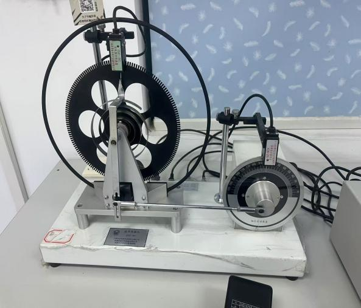
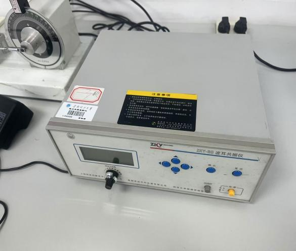
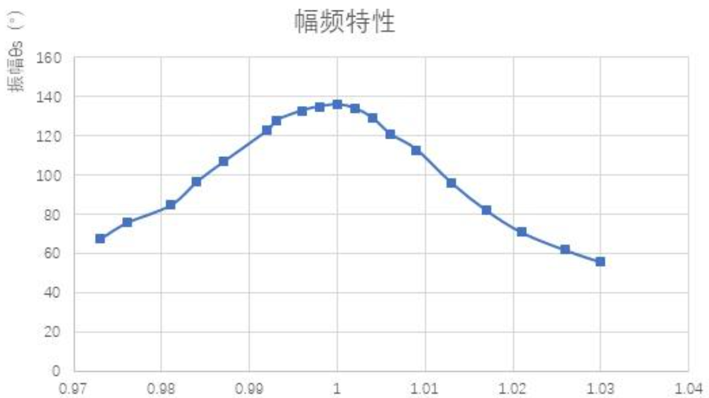
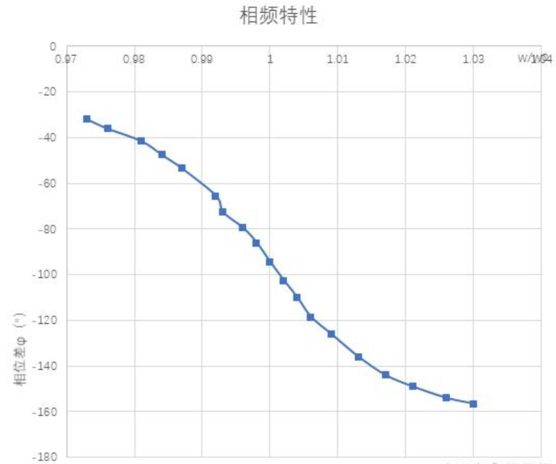

# 波尔共振

大学物理实验报告

实验名称 波尔共振

于博宇    202330453151    计科1班

一.实验目的：

-  1. 研究波尔共振仪中弹性摆轮受迫振动的幅频特性和相频特性。

2. 研究不同阻尼力矩对受迫振动的影响，观察共振现象。

3. 学习用频闪法测定运动物体的相位差。

二.实验仪器：

-  ZKY-BG型波尔共振仪；数据采集设备；
- 实验原理：

实验通过测定摆轮的振幅与摆动的周期关系，研究阻尼振动和受迫振动的物理规律。实验主要测定阻尼系数和受迫振动时的幅频和相频关系。系统在阻尼振动时，阻尼系数p、周期T和振幅$\mathrm {\theta }$满足关系式：

(j - i)ßT = In$\frac {\theta i} {\theta j}$

• 有机玻璃转盘提供周期性策动力

**3.1 自由振荡**

-  实验目的：测量摆轮的振幅与系统固有振动周期的关系。

实验操作：测量由仪器自动完成。操作仪器回看并记录数据。

3.2 阻尼振荡：

实验目的：测定阻尼系数B。

实验操作：选用阻尼2，测量由仪器自动完成。操作仪器回看并记录数据。

原理：系统在阻尼振动时，阻尼系数B、周期T和振幅$\mathrm {\theta }$满足关系式：

(j - i)ßT = In$\frac {\theta i} {\theta j}$

实验：通过测定摆轮A在第i次和第j次摆动时的振幅$\mathrm {\theta }$和读出摆动周期T就可测定阻尼系数。

3.3 受迫振荡

实验目的：测定受迫振动的幅频特性和相频特性曲线。

实验操作：调节强迫力周期旋钮，测量由仪器自动完成。操作仪器回看并记录数据。

四.实验数据记录与处理：

1.  自由振荡

<table>
<tr><td>1</td><td>2</td><td>3</td><td>4</td></tr>
<tr><td>振幅/度</td><td>固有周期/s</td><td>振幅/度</td><td>固有周期/s</td><td>振幅/度</td><td>固有周期/s</td><td>振幅/度</td><td>固有周期/s</td></tr>
<tr><td>160</td><td>1.567</td><td>160</td><td>1.566</td><td>160</td><td>1.566</td><td>160</td><td>1.565</td></tr>
<tr><td>158</td><td>1.567</td><td>155</td><td>1.567</td><td>158</td><td>1.566</td><td>155</td><td>1.566</td></tr>
<tr><td>155</td><td>1.568</td><td>150</td><td>1.568</td><td>156</td><td>1.567</td><td>153</td><td>1.566</td></tr>
<tr><td>152</td><td>1.568</td><td>145</td><td>1.569</td><td>153</td><td>1.567</td><td>151</td><td>1.567</td></tr>
<tr><td>150</td><td>1.568</td><td>143</td><td>1.569</td><td>150</td><td>1.568</td><td>148</td><td>1.567</td></tr>
<tr><td>148</td><td>1.568</td><td>141</td><td>1.569</td><td>148</td><td>1.568</td><td>146</td><td>1.567</td></tr>
<tr><td>145</td><td>1.569</td><td>139</td><td>1.57</td><td>144</td><td>1.569</td><td>144</td><td>1.568</td></tr>
<tr><td>140</td><td>1.57</td><td>137</td><td>1.57</td><td>141</td><td>1.569</td><td>142</td><td>1.568</td></tr>
<tr><td>138</td><td>1.57</td><td>135</td><td>1.571</td><td>139</td><td>1.569</td><td>140</td><td>1.569</td></tr>
<tr><td>136</td><td>1.57</td><td>133</td><td>1.571</td><td>137</td><td>1.57</td><td>138</td><td>1.569</td></tr>
</table>

1. 阻尼振荡

<table>
<tr><td>10T=18.890s</td><td>阻尼2</td></tr>
<tr><td>振幅/度</td></tr>
<tr><td>187</td></tr>
<tr><td>153</td></tr>
<tr><td>136</td></tr>
<tr><td>121</td></tr>
<tr><td>107</td></tr>
<tr><td>94</td></tr>
<tr><td>89</td></tr>
<tr><td>74</td></tr>
<tr><td>65</td></tr>
<tr><td>57</td></tr>
</table>

Tave= 1.889s

由i=j-5代入左表于下图公式得：

(j - i)ßT = In$\frac {\theta i} {\theta j}$

ß=（0.07282306348+

0.05736384877+0.06443512891+

0.06579177085+0.06579177085）/5=0.065241116572

故阻尼2阻尼系数约为0.06524
1. 受迫振荡

| 强迫力矩周期/s | 相位差/度 | 振幅测量值/度 | 固有频率/s | 圆频率/共振圆频率 |
|---|---|---|---|---|
| 16.370 | 32.0 | 68 | 1.592 | 0.973 |
| 16.301 | 36.0 | 76 | 1.592 | 0.976 |
| 16.235 | 41.5 | 85 | 1.592 | 0.981 |
| 16.165 | 47.5 | 97 | 1.591 | 0.984 |
| 16.113 | 53.5 | 107 | 1.591 | 0.987 |
| 16.029 | 65.5 | 123 | 1.590 | 0.992 |
| 15.994 | 72.5 | 128 | 1.589 | 0.993 |
| 15.960 | 79.5 | 133 | 1.589 | 0.996 |
| 15.928 | 86.0 | 135 | 1.589 | 0.998 |
| 15.893 | 94.5 | 136 | 1.589 | 1.000 |
| 15.859 | 102.5 | 134 | 1.589 | 1.002 |
| 15.827 | 110.0 | 129 | 1.589 | 1.004 |
| 15.791 | 118.5 | 121 | 1.589 | 1.006 |
| 15.756 | 126.0 | 113 | 1.589 | 1.009 |
| 15.689 | 136.0 | 96 | 1.589 | 1.013 |
| 15.622 | 144.0 | 82 | 1.589 | 1.017 |
| 15.556 | 149.0 | 71 | 1.589 | 1.021 |
| 15.490 | 154.0 | 62 | 1.589 | 1.026 |
| 15.424 | 156.5 | 56 | 1.589 | 1.030 |

五.个人拓展思考

- 在研究受迫振动中，由于我们求的是两个频率之比值，我们完全可以简化实验表格，省略求频率的过程，而是用周期的反比去表示这个最终结果，这也有利于我们减小误差。
