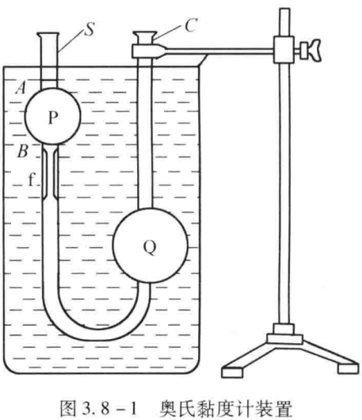
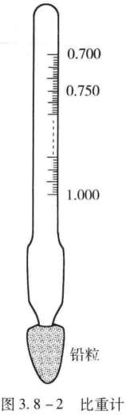
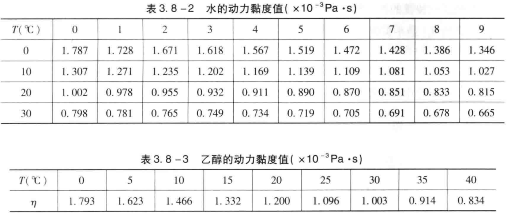
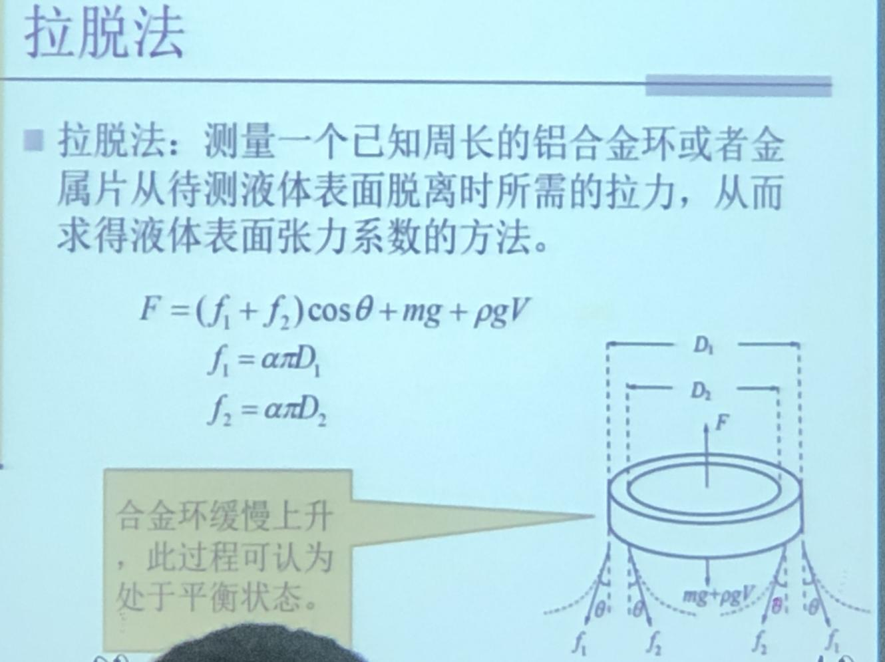
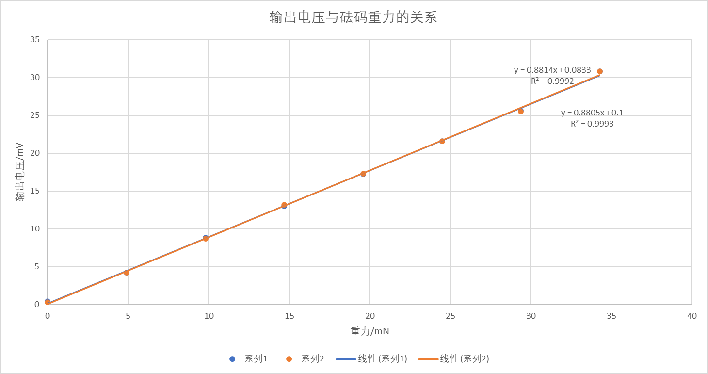

# 液体动力粘度的测量 用拉脱法测定液体表面张力系数

大学物理实验报告

实验名称液体粘滞系数的测量  用拉脱法测定液体表面张力系数
- 实验目的

（1）学习利用泊肃叶定律测量液体粘滞系数的原理；

（2）掌握用奥氏黏度计测定液体粘滞系数的方法；

（3）熟练运用秒表测量时间、量杯量取液体、温度计测量温度的基本操作；

（4）了解实验方法中比较法的优点；

（5）进一步理解液体黏滞性的意义。

（6）掌握用拉脱法测量液体表面张力系数
- 实验仪器

奥氏黏度计、温度计、比重计、蒸馏水、移液管、吸球、玻璃缸、支架、胶管、力敏传感器、平衡臂、计时器等。
- 实验原理

（一）测量液体粘滞系数

奥氏黏度计的形状如图3.8-1所示，是一个U形玻璃管。P泡位置较高，为测定泡；Q泡位置较低，为下储泡。P泡上下各有一刻痕线A和刻痕线B。B下是一段截面积相等的毛细管f。

当黏度为η的液体在半径为r、长为L的细管f中定常流动时，若细管两端的压强差为Δp，根据泊肃叶定律，流经毛细管的流量（单位时间流过f管一个截面的体积）为

V/t=πr4Δp/(8ηL)  （3.8-1）

由上式可得

η=(πr4Δp/(8VL))·t （3.8-2）

从式（3.8-2）可知，如测得r、Δp、V、L、t五个量，便可算出此液体在所处温度下的粘滞系数η。但这几个量中有几个是不易测得的，而且只要有一个量误差较大，就会使得η值很不准确。因此本实验利用奥氏黏度计，采用比较法进行测量。

实验室，常以黏度已知的蒸馏水作为比较的标准。取黏度为η1，的蒸馏水和粘滞系数为η2的待测液体分别注入黏度计，并使之上升到A处，测出两种液体从刻痕线A降至B的时间t1和t2，两次测量中流过AB的体积相同，细管的半径r、长度L相同，由式（3.8-2）可得

η1=(πr4Δp1/(8VL))·t1

η2=(πr4Δp2/(8VL))·t2

根据方程组（3.8-3，上式）有

η1/η2=(Δp1/Δp2)·(t1/t2)  （3.8-4）

设两种液体的密度分别为ρ1和ρ2，因为在两次测量中，两种液面高度差变化相同，则压强差之比为

Δp1/Δp2=(ρ1gΔh)/(ρ2gΔh)=ρ1/ρ2  （3.8-5）

代入式（3.8-4）得

η2=(ρ2t2/(ρ1t1))·η1 	（3.8-6）

用比重计分别测出ρ1和ρ2值，从书表3.8-2中根据水的温度查出相应温度下的粘滞系数η1值，则据式（3.8-6）可求得待测液体的粘滞系数η2。

比重计是利用浮力原理制成的一种直接测量液体密度的器具，它的外形如书图3.8-2所示。在玻璃管的下端装有铅粒，上半部细玻璃管内部标有分度值，每小格代表0.005g/cm³。比重计浸入液体中，当重力与浮力平衡时，比重计即静止地浮在液体中，这时从标尺刻度值便可直接读出液体的密度。

（二）用拉脱法测定液体表面张力系数

表面张力：表面张力是存在于液体表面上任何一条分界线两侧间的液体的相互作用拉力，其方向沿液体表面，且恒与分界线垂直，大小与分界线的长度成正比，即：

F=αL

其中α称为液体的表面张力系数。

拉脱法：测量一个已知周长的铝合金环或者金属片从待测液体表面脱离时所需的拉力，从而求得液体表面张力系数的方法。

F=（f1+f2）cosθ+mg+ρgV

f1=απD1

f2=απD2

合金环临拉脱时满足：F1=απ(D1+D2)+mg

合金环脱离液体界面后：F2=mg

液体表面张力系数为：α=(F1+F2)/[π(D1+D2)]

而F=U/K，则α=(U1+U2)/[Kπ(D1+D2)]

U1，U2分别为合金环拉脱时和拉托后的电压表示数值。

力敏传感器：力敏传感器通过四个压敏电阻集成为非平衡电桥，粘贴在弹性横梁上。当弹性横梁负重在外力作用下产生弯曲时，应变片产生应力，使电桥产生非平衡电压输出。输出电压与应力的关系为：U=KF
- 实验内容及操作步骤

（一）测量液体粘滞系数

（1）将玻璃烧杯内注入一定量的清水，作为恒温槽；用少量水将奥氏黏度计内部清晰干净；从粗管口注入4mL液体。

（2）测量液体不同温度时的粘滞系数。

①调整好仪器至目标温度；

②用吸球使液面上升到上侧刻痕以上；然后取下吸球，测量液面从上侧刻痕下降到下侧刻痕所需时间t，重复3次，并记录于表1中。

（二）用拉脱法测定液体表面张力系数

（1）准备实验仪器，将毛细管插入液体中，使其上升到一定高度。

（2）挂上砝码容器，逐个放上已知质量的小砝码，记录力敏传感器的示数于表3，再逐个取下已知质量的小砝码，记录力敏传感器示数于表3，计算出力敏传感器的K值。

（3）将盛水器皿加入水，并挂上金属环，将水没过金属环的下侧。

（4）打开力敏传感器的自动记录功能，缓慢将盛水器皿下降，直到水膜破裂。

（5）记录F1和F2于表4中，并重复5次。
- 数据记录及数据处理

（一）测量液体粘滞系数

表1 粘滞系数测量

| 测量次数 下降时间/s 被测液体 | 45°纯净水t1 （作为已知溶液） ρ1=0.9902g/cm3 η1=0.599×10-3Pa·s | 50°纯净水t2 （作为未知溶液） ρ2=0.9880/cm3 | 55°纯净水t3 （作为未知溶液） ρ3=0.9857/cm3 |
|---|---|---|---|
| 1 | 48.36 | 45.77 | 41.77 |
| 2 | 48.44 | 45.01 | 41.51 |
| 3 | 48.35 | 45.33 | 41.58 |
| 均值 | 48.38 | 45.37 | 41.62 |

由公式η2=(ρ2t2/(ρ1t1))·η1可得：

（1）50℃下，纯净水的粘滞系数：2=0.560×10-3Pa·s，相对误差为0.98%；

（2）55℃下，纯净水的粘滞系数：3=0.513×10-3Pa·s，相对误差为0.94%。

（二）用拉脱法测量液体表面张力系数

表2 合金环内外径测量

| n | 1 | 2 | 3 | 4 | 5 |
|---|---|---|---|---|---|
| 外径D1/mm | 3.464 | 3.340 | 3.398 | 3.396 | 3.410 |
| 内径D2/mm | 3.318 | 3.302 | 3.316 | 3.324 | 3.318 |

表3 力敏传感器电压变化

| 砝码质量/g | 0.0 | 0.5 | 1.0 | 1.5 | 2.0 | 2.5 | 3.0 | 3.5 |
|---|---|---|---|---|---|---|---|---|
| 输出电压/mV（放） | 0.4 | 4.2 | 8.8 | 13.0 | 17.2 | 21.6 | 25.6 | 30.8 |
| 输出电压/mV（取） | 0.3 | 4.2 | 8.7 | 13.2 | 17.3 | 21.6 | 25.5 | 30.8 |

表4 液体表面张力系数的测定

<table>
<tr><td>温度T=30°C</td></tr>
<tr><td>测量次数</td><td>U1/mV</td><td>U2/mV</td><td>ΔU/mV</td><td>αi/（10-3Nm-1）</td></tr>
<tr><td>1</td><td>137.3</td><td>125.9</td><td>11.4</td><td>0.613</td></tr>
<tr><td>2</td><td>137.2</td><td>125.4</td><td>11.8</td><td>0.635</td></tr>
<tr><td>3</td><td>137.2</td><td>125.5</td><td>11.7</td><td>0.630</td></tr>
<tr><td>4</td><td>137.0</td><td>125.5</td><td>11.5</td><td>0.619</td></tr>
<tr><td>5</td><td>137.0</td><td>125.3</td><td>11.7</td><td>0.630</td></tr>
</table>

利用表2的数据可以算出外径1=3.402mm，2=3.316mm

利用表3的数据以及公式U=KF以及下图可知出K1=0.881V/N，K2=0.880V/N,K=(K1+K2)/2=0.881V/N。

利用表4的数据以及公式张力系数α=(U1-U2)/[Kπ(1+2)]可一次计算出

α1=0.613x10-3Nm-1，α2=0.635x10-3Nm-1，

α3=0.630x10-3Nm-1，α4=0.619x10-3Nm-1，

α5=0.630x10-3Nm-1，

平均值  =0.625x10-3Nm-1，标准差s=0.0072x10-3Nm-1

故张力系数α=(0.625±0.0072)x10-3Nm-1
- 对实验误差形成的原因进行分析并提出改进办法，及对该实验的感想

思考题：

1.为什么要取相同体积的待测液体和蒸馏水进行测量?

这么做能够保证两种液体的高度差相同，方便简化。

2.为什么实验过程中要将黏度计浸在水中?

保持恒温，减少温度对黏度的影响。

3.测量过程中为什么必须使黏度计铅垂？

重力是液体流动的重要因素之一。将黏度计保持铅垂可以确保液体在测量过程中受到准确的重力作用，从而更好地模拟实际流动条件。

通过保持黏度计铅垂，可以提高测量结果的一致性和可重复性。如果黏度计的角度	不稳定或有偏差，每次测量可能会得到不同的结果，这会影响对液体粘度的准确评	估。

总之，保持黏度计铅垂有助于确保测量的准确性、模拟实际流动条件，以及提高测量结果的一致性和可重复性。这是为了获得可靠的液体粘度测量数据而采取的一项重要措施。

4.用比较法测量液体的动力黏度有什么好处?用式η2=(ρ2t2/(ρ1t1))·η1求η要保证	哪些实验条件?

利用已知的标准量作为参考，通过比较公式来测量某未知量。该方法可使实验操作过程大为简化，不仅减少了测量量，且单位不必国际化，计算更简单，从而提高了测量的精度。需要注入相同体积的液体，流过相同体积的时间。

实验感想：

在做测量液体粘滞系数实验的时候，要小心不要把U型管弄坏，要控制挤压吸球的力度，否则可能会使水像喷泉一样喷出。且在计时的时候要非常专注，否则容易导致时间过大或过小。

在做测量液体张力系数实验的时候，要小心地慢慢地调整台面高度，测量出水膜破裂前和破裂后的电压。注意，不能水膜一破裂就停止测量，否则可能会没有测量到水膜破裂后的电压。
