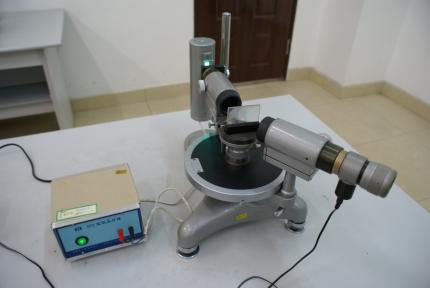
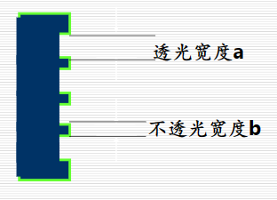
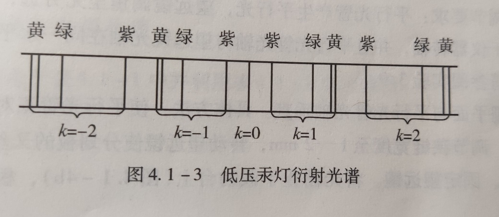
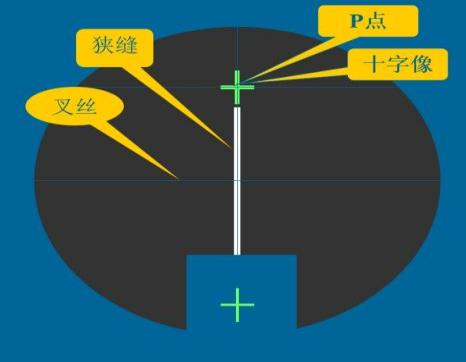
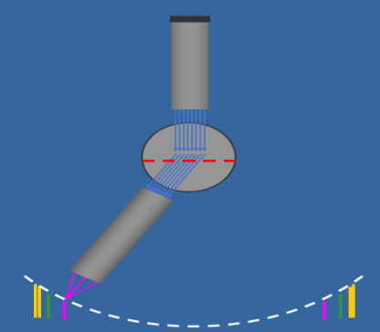

# 物理实验字体模板

大学物理实验报告

实验名称  光栅特性及光波波长的测定

于博宇    202330451691  计科1班

一.实验目的：

-  1.进一步掌握分光计的构造、使用和调节方法；

2.观察光通过透射光栅的衍射现象，了解光栅的作用和基本特性；

3.学会用光栅测定光栅常数、分辨本领、角色散率和未知光波波长。

二.实验仪器：

-  分光计、平面镜、光栅、 汞灯及其电源

三．实验原理：

1.  光栅：

-  衍射光栅是由大量等宽、等间距、平行排列的狭缝构成的光学元件。用于可见光区的光栅每毫米缝数可达几百到上千条。设缝宽为a，相邻狭缝间不透光部分的宽度为b，则缝间距d=a+b就称为光栅常数。如右图：

2.  光栅光谱：

-  当入射光为复色光时，由光栅方程可知，对给定常数d的光栅，只有在k=0即θ=0时，该复色光所包含的各种波长的中央主极大重合，在透镜的焦平面上形成明亮的中央零级亮线;对k的其他值，各种波长的主极大都不重合，不同波长的细锐亮线出现在行射角不同的方位。由此形成的光谱称为光栅光谱。级数k相同的各种波长的亮线在零级亮线的两边按短波到长波的次序对称排列形成光谱，k=1为一级光谱，k=2为二级光谱.....各种波长的细锐亮线称为光谱线。图4.1-3即为低压汞灯的射光谱。如果已知光栅常数d、级数，精确测定光谱线的衍射角就可以确定光波的波长;反之，也可以由已知的波长确定光栅常数。

3.  光栅方程：

sinθ=kλ/d或dsinθ=kλ称为光栅公式。它表明不同波长的同级主极强出现在不同方位，长波的衍射角较大，短波的衍射角小。
1. 光栅分辨本领R

光栅分辨本领是光栅分辨光谱线的能力。

R=λ/△λ=kN=kb/d
1. 光栅色散角率

当复色光通过棱镜时，不同波长的光折射率不同，折射角也不同，发生色散。设棱镜的折射率为n=n(λ),此时偏向角ε也就是λ的函数ε=ε(λ)；

当入射角φ_1恒定时，存在dε/dλ=dε/dn·dn/dλ,即称为棱镜的角色散 D。

当光线对棱镜的入射角等于出射角时，偏向角θ最小，也将这一特殊位置的角色散称为棱镜的角色散。

四.实验过程与步骤：

1.  分光计的调整

-  分光计的调整要求：

（1）粗调要求：望远镜、平行光管共轴，且与主轴垂直。

（2）望远镜的调节要求：调节目镜：叉丝清晰；调节载物台底角螺钉b1、b2：使平面玻璃反射的十字像清晰且与P点重合。

（3）平行光管调节要求：发出平行光，光栅刻痕与狭缝平行。调节狭缝位置使缝像清晰，再观察左右衍射谱线，调节b2使其等高，调节缝宽使两黄光谱线清晰。

2.  实验现象的观察

五.数据记录与处理：

- （1）以低压汞灯做光源，测量绿色谱线（λ=546.07nm）k=±1级的衍射角，求出光栅常数d，数据填在表1。

<table>
<tr><td>次数</td><td>右边第一级谱线</td><td>左边第一级谱线</td><td>{\varphi }_{k}</td><td>$$$d=\frac {k\lambda } {sin{ \varphi }_{k}}$（mm）</td></tr>
<tr><td></td><td>左窗V1</td><td>右窗V2</td><td>左窗V1’</td><td>右窗V2’</td><td></td><td></td></tr>
<tr><td>1</td><td>234°3’  55°6’</td><td>252°42’  72°50’</td><td>${\varphi }_{k}$=9.0958°d=0.0034543</td></tr>
<tr><td>$\hat {d}$ (mm)</td><td>0.0034543</td></tr>
</table>

-（2）测量“黄1”和“黄2”的k=±1级的衍射角，然后求出“黄1”和“黄2”光谱线的波长λ1，λ2，再求出该光栅的分辨本领、角色散率，数据填入表2

<table>
<tr><td>次数</td><td>黄1</td><td>黄2</td><td>{\varphi }_{{k}_{1}}</td><td>{\varphi }_{{k}_{2}}</td><td>${\lambda }_{1}=\frac {d sin {\varphi }_{{k}_{1}}} {k}$(nm)</td><td>${\lambda }_{2}=\frac {d sin {\varphi }_{{k}_{2}}} {k}$(nm)</td><td>{R}_{1}=\frac {\hat {\lambda }} {\mathrm {\Delta }\lambda }</td><td>D=\frac {\mathrm {\Delta }\varphi } {\mathrm {\Delta }\lambda }</td></tr>
<tr><td>K=1</td><td>左窗V1</td><td>253°19’</td><td>253°20’</td><td>9.5°24.5’</td><td>9.75°13’</td><td>594.39</td><td>597.85</td><td>344.57</td><td>294.08</td></tr>
<tr><td></td><td>右窗V2</td><td>73°21’</td><td>73°20’</td><td></td><td></td><td></td><td></td><td></td><td></td></tr>
<tr><td>K=-1</td><td>左窗V1’</td><td>233°30’</td><td>233°3’</td><td></td><td></td><td></td><td></td><td></td><td></td></tr>
<tr><td></td><td>右窗V2’</td><td>53°32’</td><td>53°38’</td><td></td><td></td><td></td><td></td><td></td><td></td></tr>
</table>

-      通过使用低压汞灯作为光源，测量绿色谱线（λ = 546.07 nm）k=±1级的衍射角，计算得出光栅常数 。这一结果表明，所使用的光栅能够有效地实现对不同波长光的衍射分离，并且符合光栅理论的预期。

六.个人拓展思考

-      本实验利用光栅的衍射特性，通过已知的波长和测得的衍射角计算光栅常数。光栅能够将不同波长的光分开，使得观察到的光谱具有良好的分辨率，这对于光学实验和分析非常重要。
