# 磁谐振无线电能传输

磁谐振无线电能传输

一、实验目的

（1）学习LC谐振电路的原理，应用数字示波器调试LC谐振电路；

（2）研究磁耦合谐振式无线电能传输效率，优化磁耦合谐振无线电能传输的参数。

二、实验仪器

磁耦合谐振式无线电能传输仪、数字示波器、信号发生器、直流恒压电源。

三、实验原理

将高频交流信号的功率放大，通过LC发射线圈传导至LC接收线圈，之后整流滤波、稳压电路，最后传输至负载。

LC发射线圈与LC接收线圈有一个M关系，为发射线圈和接收线圈之间的互感系数。

当发射线圈和接收线圈的磁场频率及相位相同，能量的传输效率达到最大，达到磁耦合谐振。

磁耦合谐振式无线电能传输原理，如下图所示。

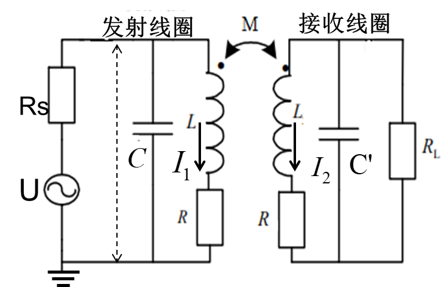

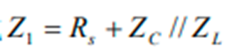发射端

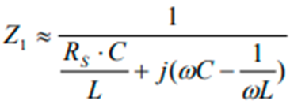

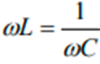谐振（虚部为0）

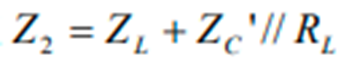接收端

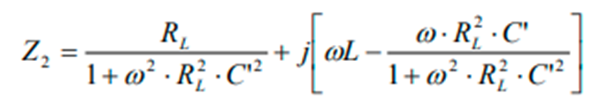

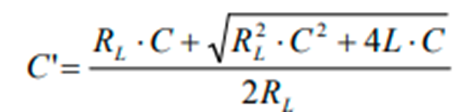谐振

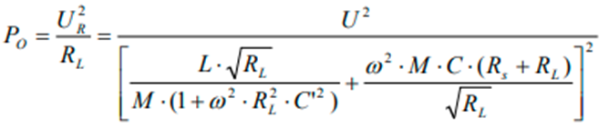

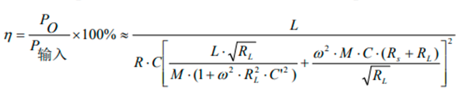

实验测量示意图

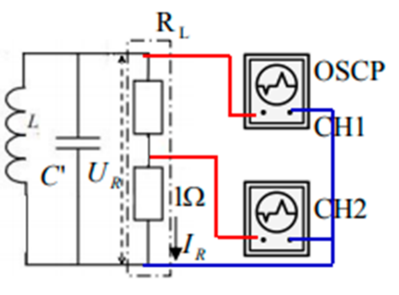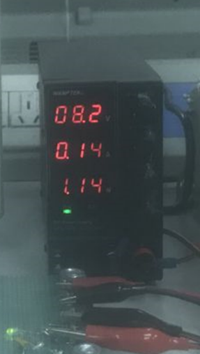

输入功率为：黑色恒压源上功率示数；输出功率为：CH1信号(IR)与CH2(UR)信号相乘对时间的积分除以时间即：

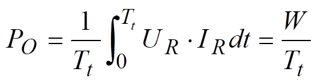

四、实验内容与主要步骤

1.系统谐振频率的调试

调节发射线圈平面与接收线圈平面平行，。

将恒压电源输出电压调节为8V；用信号发生器输出Vpp=5V，f=38KHz正弦信号；

细调该频率，使示波器上CH1通道信号的电压峰峰值达到最大，恒压电源输出电流最小（输出功率最小），此时为系统的谐振状态。

2.调节好谐振，记录发射端输入功率

将两线圈初始位置调节为3厘米，调节到谐振状态，示波器显示正确的CH1和CH2通道信号，记下。

3.接收端、负载输出功率测量

按下示波器上M键 → 选择（高级数学）→ 按屏右侧菜单（编辑函数）→ 编辑Intg(CH1*CH2) → 确定，得到红色线表示的数学计算结果。

用菜单测量得到的峰峰值为积分表达式的结果，即W。

把光标线调节到屏幕的两端，测量屏幕左端到右端的时间Tt。

4.改变两线圈的距离，重复以上2、3步骤。

5.正确关闭电源。

LC线圈处于谐振状态时，突然关电源将造成过压或过流而损坏仪器，所以必须先将信号发生器输出信号峰峰值调至小于0.5V，过10秒后再断开仪器电源！

五、数据记录与处理

1.数据记录表格

| 两线圈间距/cm | 3 | 4 | 5 | 6 | 7 | 8 | 9 | 10 | 11 | 12 |
|---|---|---|---|---|---|---|---|---|---|---|
| 发射端输入功率P输入(W) | 1.44 | 1.12 | 0.96 | 0.88 | 0.72 | 0.72 | 0.64 | 0.64 | 0.64 | 0.64 |
| 接收端输出功W(μJ) | 28.8 | 21.2 | 17.2 | 12.0 | 9.40 | 7.40 | 5.60 | 3.68 | 3.20 | 2.44 |
| 接收端输出功所用时间T(μs) | 99.8 | 99.8 | 99.8 | 99.8 | 99.8 | 99.8 | 99.8 | 99.8 | 99.8 | 99.8 |
| 接收端输出功率P0=W/T(W) | 0.29 | 0.21 | 0.17 | 0.12 | 0.09 | 0.07 | 0.06 | 0.04 | 0.03 | 0.02 |
| 传输效率ŋ=P输入/P0 | 20% | 19% | 18% | 14% | 12% | 10% | 8% | 6% | 5% | 4% |

2.作出输出功率和传输效率随距离变化的曲线并分析。

输出功率和传输效率都随着间距的扩大而减小。当间距越来越大时，传输效率的下降速度逐渐变缓；当间距变大时，传输效率的下降速率基本上不变。

六、误差分析及实验感想

总体来说实验比较轻松，误差可能会来源于间距定位失误，并没有完全严格控制间距。示波器使用较为轻松，能够很快地得出结果。
