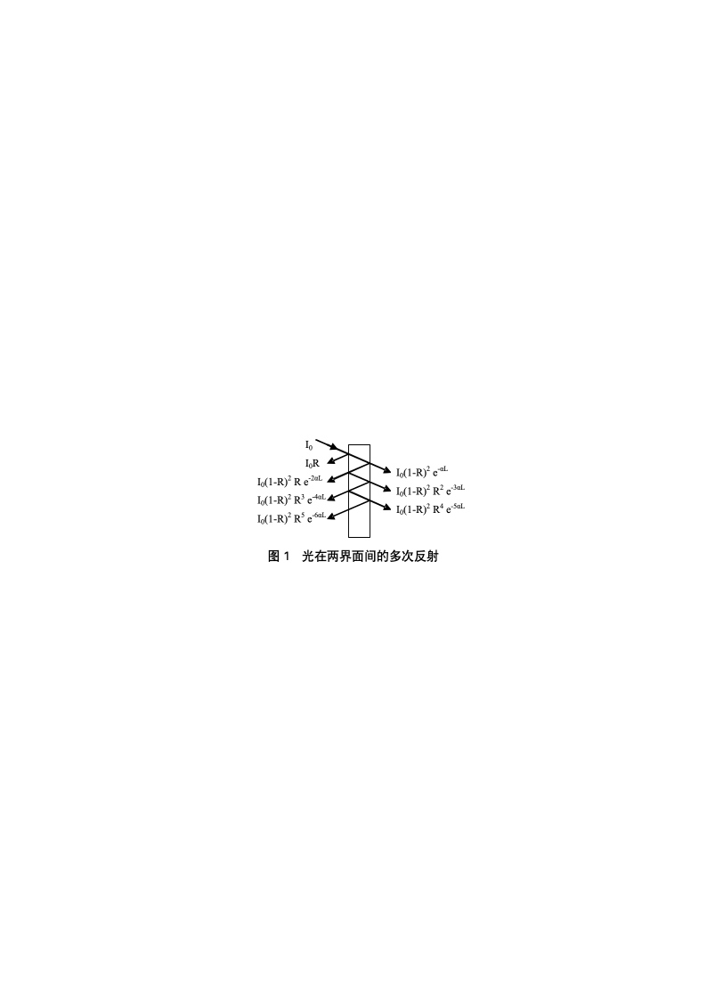
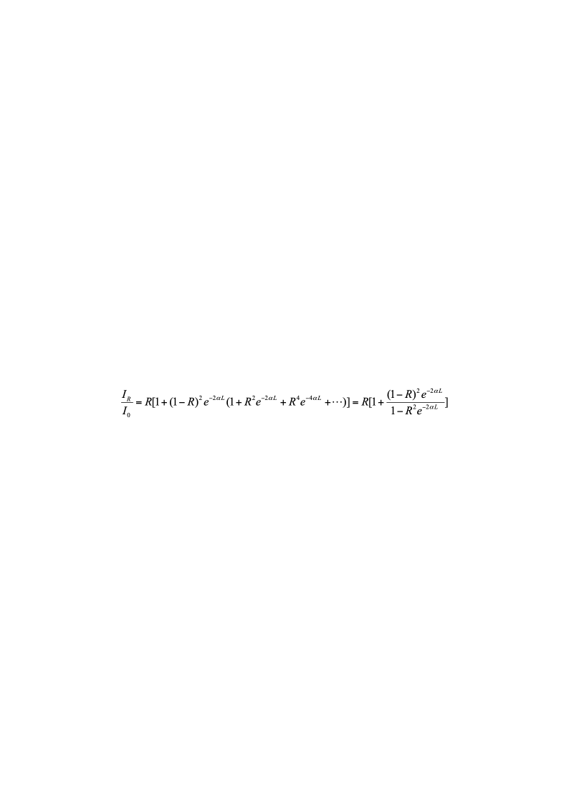
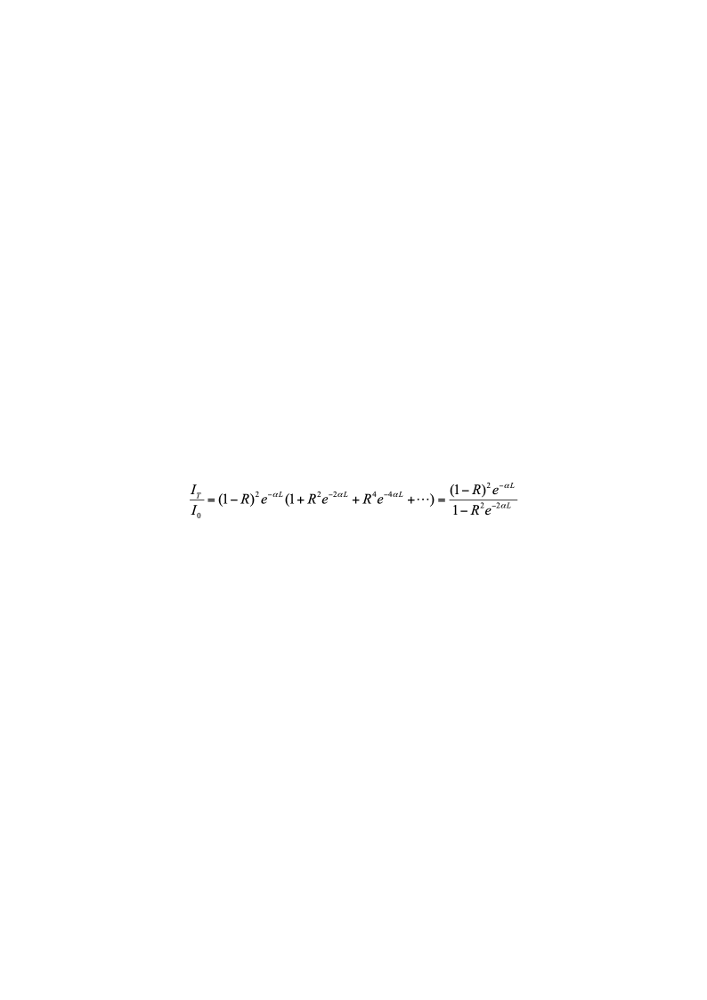
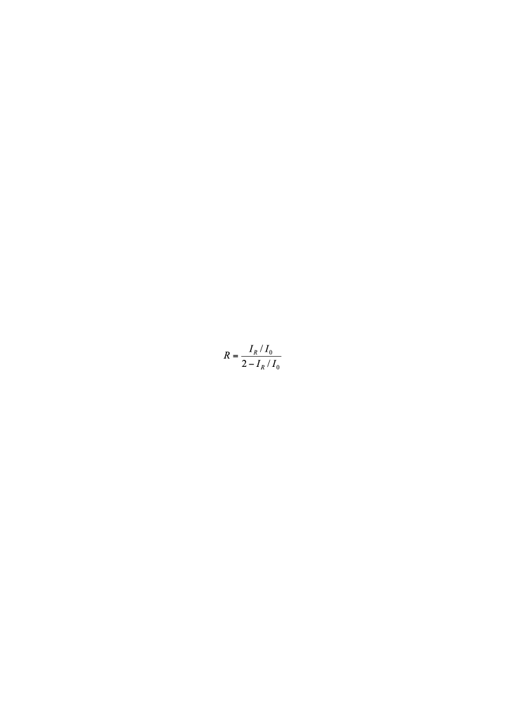
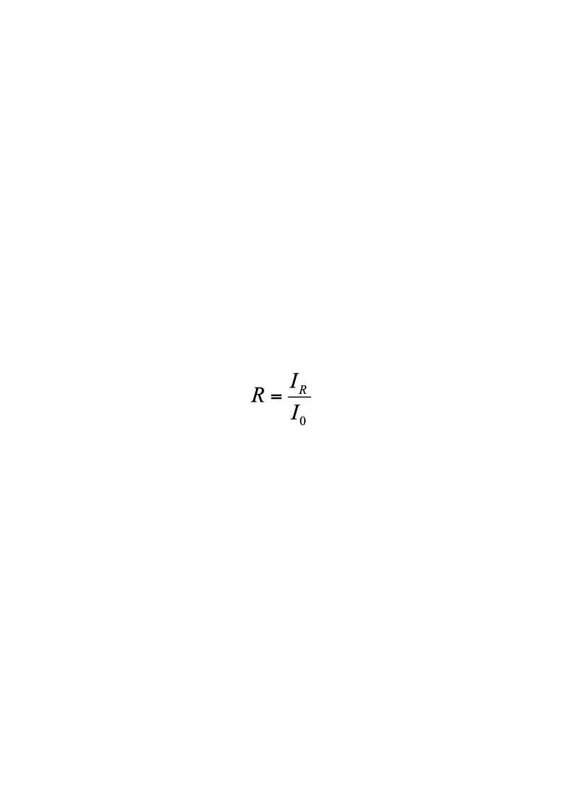
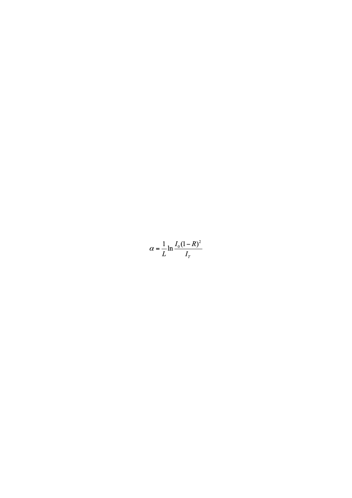
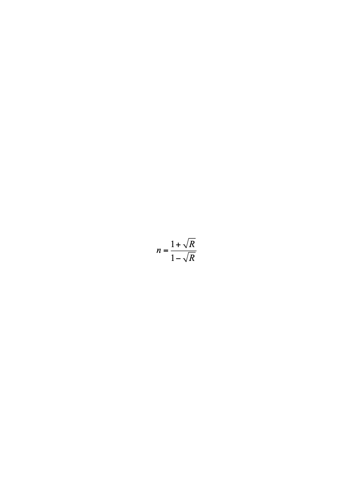
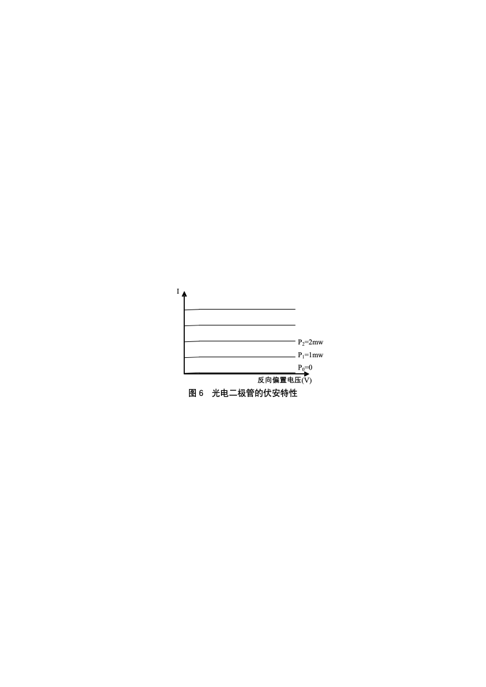
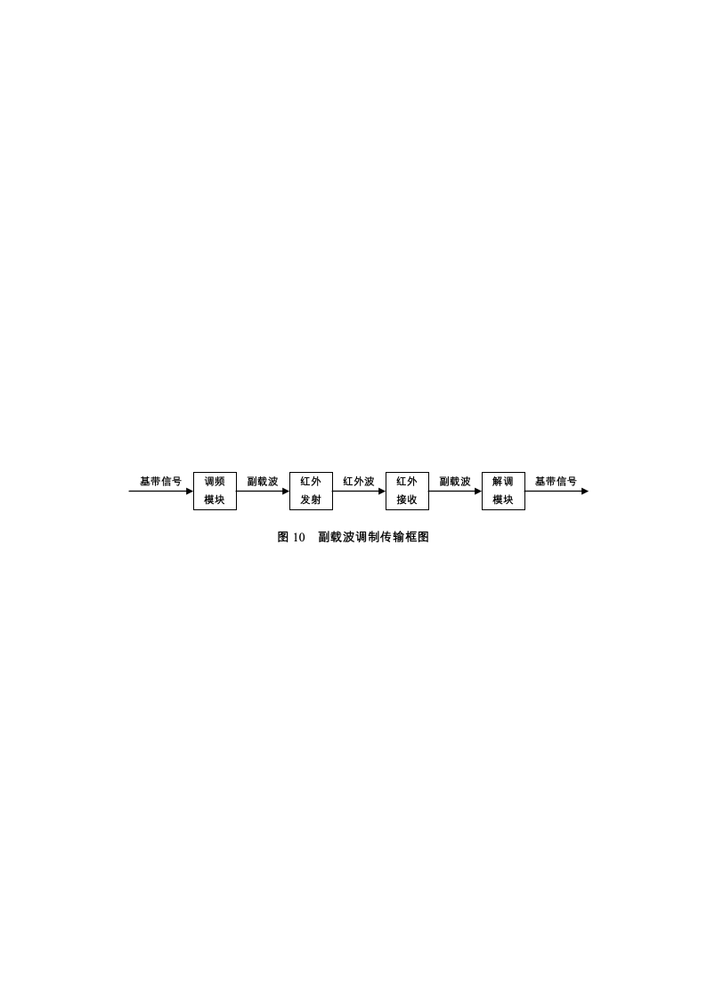
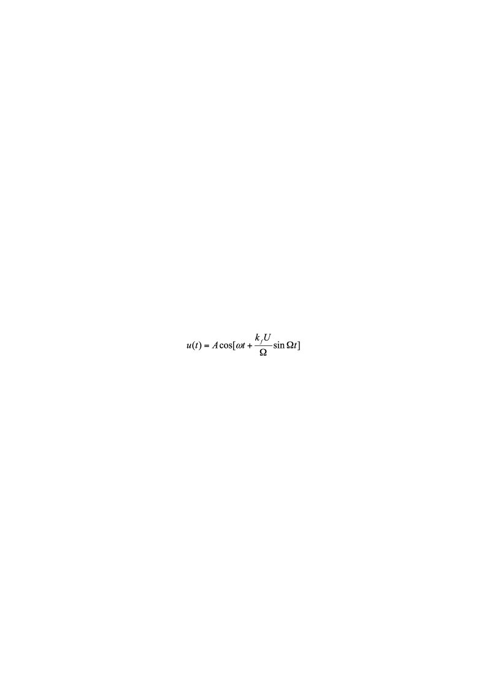

# 红外物理特性及应用

红外通信特性实验

**【实验目的】**
1. 了解红外通信的原理及基本特性。
1. 测量部分材料的红外特性。
1. 测量红外发射管的伏安特性，电光转换特性。
1. 测量红外发射管的角度特性。
1. 测量红外接收管的伏安特性。
1. 基带调制传输实验。
1. 副载波调制传输实验。
1. 音频信号传输实验。
1. 数字信号传输实验。

**【实验原理】**
1. 红外通信

在现代通信技术中，为了避免信号互相干扰，提高通信质量与通信容量，通常用信号对载波进行调制，用载波传输信号，在接收端再将需要的信号解调还原出来。不管用什么方式调制，调制后的载波要占用一定的频带宽度，如音频信号要占用几千赫兹的带宽，模拟电视信号要占用8兆赫兹的带宽。载波的频率间隔若小于信号带宽，则不同信号间要互相干扰。能够用作无线电通信的频率资源非常有限，国际国内都对通信频率进行统一规划和管理，仍难以满足日益增长的信息需求。通信容量与所用载波频率成正比，与波长成反比，目前微波波长能做到厘米量级，在开发应用毫米波和亚毫米波时遇到了困难。红外波长比微波短得多，用红外波作为载波，其潜在的通信容量是微波通信无法比拟的，红外通信就是用红外波作为载波的通信方式。

红外传输的介质可以是光纤或空间，本实验采用空间传输。
1. 红外材料

光在光学介质中传播时，由于材料的吸收、散射，会使光波在传播过程中逐渐衰减，对于确定的介质，光衰减d*I*与材料的衰减系数*α*，光强*I*，传播距离d*x*成正比：

										（1）

对上式积分，可得：

										（2）

式中*L*为材料的厚度。

材料的衰减系数是由材料本身的结构及性质决定的，且不同的波长衰减系数不同。普通的光学材料由于在红外波段衰减较大，通常并不适用于红外波段。常用的红外光学材料包括：石英晶体及石英玻璃（它在0.14~4.5um的波长范围内都有较高的透射率），半导体材料及它们的化合物如锗、硅、金刚石、氮化硅、碳化硅、砷化镓，磷化镓，氟化物晶体如氟化钙、氟化镁，氧化物陶瓷如蓝宝石单晶(Al2O3）、尖晶石(MgAl2O4)、氮氧化铝、氧化镁、氧化钇、氧化锆，还有硫化锌、硒化锌以及一些硫化物玻璃、锗硫系玻璃等。

光波在不同折射率的介质表面会反射，入射角为零或入射角很小时反射率：

										（3）

由（3）式可见，反射率取决于界面两边材料的折射率。由于色散，材料在不同波长的折射率不同。折射率与衰减系数是表征材料光学特性的最基本参数。

由于材料通常有两个界面，测量到的反射与透射光强是在两界面间反射的多个光束的叠加效果，如图1所示。

反射光强与入射光强之比为：

			（4）

在推导中，用到无穷级数1+*x*+*x*2+*x*3+  ···  = (1－*x*)-1。透射光强与入射光强之比为：

			（5）

原则上，测量出*I*0、*I*R、*I*T，联立（4）、（5）两式，可以求出*R*与*α*（不一定是解析解）。

下面讨论两种特殊情况下求*R*与*α*。

对于衰减可忽略不计的红外光学材料，*α*=0，e –*α**L*=1，此时，由（4）式可解出：

									（6）

对于衰减较大的非红外光学材料，可以认为多次反射的光线经材料衰减后光强度接近零，对图1中的反射光线与透射光线都可只取第一项，此时：

										（7）

									（8）

已知空气的折射率为1，求出反射率后，可由（3）式解出材料的折射率：

										（9）
1. 发光二极管

红外通信的光源为半导体激光器或发光二极管，本实验采用发光二极管。

发光二极管是由P型和N型半导体组成的二极管。P型半导体中有相当数量的空穴，几乎没有自由电子。N型半导体中有相当数量的自由电子，几乎没有空穴。当两种半导体结合在一起形成P-N结时，N区的电子（带负电）向P区扩散，P区的空穴（带正电）向N区扩散，在P-N结附近形成空间电荷区与势垒电场。势垒电场会使载流子向扩散的反方向作漂移运动，最终扩散与漂移达到平衡，使流过P-N结的净电流为零。在空间电荷区内，P区的空穴被来自N区的电子复合，N区的电子被来自P区的空穴复合，使该区内几乎没有能导电的载流子，又称为结区或耗尽区。

当加上与势垒电场方向相反的正向偏压时，结区变窄，在外电场作用下，P区的空穴和N区的电子就向对方扩散运动，从而在PN结附近产生电子与空穴的复合，并以热能或光能的形式释放能量。采用适当的材料，使复合能量以发射光子的形式释放，就构成发光二极管。采用不同的材料及材料组分，可以控制发光二极管发射光谱的中心波长。

图3、图4分别为发光二极管的伏安特性与输出特性。从图3可见，发光二极管的伏安特性与一般的二极管类似。从图4可见，发光二极管输出光功率与驱动电流近似呈线性关系。这是因为：驱动电流与注入PN结的电荷数成正比，在复合发光的量子效率一定的情况下，输出光功率与注入电荷数成正比。

发光二极管的发射强度随发射方向而异。方向的特性如图5，图5的发射强度是以最大值为基准，当方向角度为零度时，其发射强度定义为100%。当方向角度增大时，其放射强度相对减少，发射强度如由光轴取其方向角度一半时，其值即为峰值的一半，此角度称为方向**半值角**，此角度越小即代表元件之指向性越灵敏。

一般使用红外线发光二极管均附有透镜，使其指向性更灵敏，而图5（a）的曲线就是附有透镜的情况，方向半值角大约在±7°。另外每一种型号的红外线发光二极管其幅射角度亦有所不同，图5 (b)所示之曲线为另一种型号之元件，方向半值角大约在±50°。
1. 光电二极管

红外通信接收端由光电二极管完成光电转换。光电二极管是工作在无偏压或反向偏置状态下的PN结，反向偏压电场方向与势垒电场方向一致，使结区变宽，无光照时只有很小的暗电流。当PN结受光照射时，价电子吸收光能后挣脱价键的束缚成为自由电子，在结区产生电子－空穴对，在电场作用下，电子向N区运动，空穴向P区运动，形成光电流。

红外通信常用PIN型光电二极管作光电转换。它与普通光电二极管的区别在于在P型和N型半导体之间夹有一层没有渗入杂质的本征半导体材料，称为I型区。这样的结构使得结区更宽，结电容更小，可以提高光电二极管的光电转换效率和响应速度。

图6是反向偏置电压下光电二极管的伏安特性。无光照时的暗电流很小，它是由少数载流子的漂移形成的。有光照时，在较低反向电压下光电流随反向电压的增加有一定升高，这是因为反向偏压增加使结区变宽，结电场增强，提高了光生载流子的收集效率。当反向偏压进一步增加时，光生载流子的收集接近极限，光电流趋于饱和，此时，光电流仅取决于入射光功率。在适当的反向偏置电压下，入射光功率与饱和光电流之间呈较好的线性关系。

图7是光电转换电路，光电二极管接在晶体管基极，集电极电流与基极电流之间有固定的放大关系，基极电流与入射光功率成正比，则流过R的电流与R两端的电压也与光功率成正比。
1. 光源的调制

对光源的调制可以采用内调制或外调制。内调制用信号直接控制光源的电流，使光源的发光强度随外加信号变化，内调制易于实现，一般用于中低速传输系统。外调制时光源输出功率恒定，利用光通过介质时的电光效应，声光效应或磁光效应实现信号对光强的调制，一般用于高速传输系统。本实验采用内调制。

图8是简单的调制电路。调制信号耦合到晶体管基极，晶体管作共发射极连接，流过发光二极管的集电极电流由基极电流控制，R1、R2提供直流偏置电流。图9是调制原理图，由图9可见，由于光源的输出光功率与驱动电流是线性关系，在适当的直流偏置下，随调制信号变化的电流变化由发光二极管转换成了相应的光输出功率变化。
1. 副载波调制

由需要传输的信号直接对光源进行调制，称为基带调制。

在某些应用场合，例如有线电视需要在同一根光纤上同时传输多路电视信号，此时可用N个基带信号对频率为*f*1、*f*2…*f*N的N个副载波频率进行调制，将已调制的N个副载波合成一个频分复用信号，驱动发光二极管。在接收端，由光电二极管还原频分复用信号，再由带通滤波器分离出副载波，解调后得到需要的基带信号。

对副载波的调制可采用调幅，调频等不同方法。调频具有抗干扰能力强，信号失真小的优点，本实验采用调频法。

图10是副载波调制传输框图。

如果载波的瞬时频率偏移随调制信号m(t)线性变化，即：

									（10）

则称为调频，*k*f是调频系数，代表频率调制的灵敏度，单位为2πHz/V。

调频信号可写成下列一般形式：

							（11）

式中为载波的角频率，为调频信号的瞬时相位偏移。下面考虑两种特殊情况：

（1）、假设m(t)为电压为V的直流信号，则（11）式可以写为：

								（12）

（12）式表明直流信号调制后的载波仍为余弦波，但角频率偏移了*k*f*V*。

（2）、假设*m(t)=**Ucos**Ω**t*，则（11）式可以写为：

								（13）

可以证明，已调信号包括载频分量ω和若干个边频分量ω±nΩ，边频分量的频率间隔为Ω。

任意信号可以分解为直流分量与若干余弦信号的叠加，则（12）、（13）两式可以帮助理解一般情况下调频信号的特征。

**【实验内容与步骤】**
1. 发光二极管的伏安特性与输出特性测量

将红外发射器连接到发射装置的“发射管”接口，接收器连接到接收装置的“接收管”接口（在所有的实验进行中，都不取下发射管和接收管），通电。

将红外发射器与接收器相对放置，连接“电压源输出”到发射模块“信号输入2”，将发射端设置为“电压源”模式，并将电压设置为5V，微调接收端受光方向，使显示值最大。将发射系统显示窗口设置为“发射电流”，接收系统显示窗口设置为“光功率计”。

调节电压源，改变发射管电流，记录发射电流与接收器接收到的光功率（与发射光功率成正比）。将发射系统显示窗口切换倒“正向偏压”，记录与发射电流对应的发射管两端电压。

改变发射电流，将数据记录于表  1中。

注：仪器实际显示值可能无法精确的调节到表  1中设定值，应按实际调节的发射电流数值为准。

表 1  发光二极管伏安特性与输出特性测量

| 正向偏压(V) |  |  |  |  |  |  |  |  |  |  |
|---|---|---|---|---|---|---|---|---|---|---|
| 发射管电流(mA) | 0 | 5 | 10 | 15 | 20 | 25 | 30 | 35 | 40 | 45 |
| 光功率(mW) |  |  |  |  |  |  |  |  |  |  |

以表  1数据作所测发光二极管的伏安特性曲线和输出特性曲线。

讨论所作曲线与图3、图4所描述的规律是否符合。
1. 光电二极管伏安特性的测量

连线方式同实验1。

调节发射装置的电压源，使光电二极管接收到的光功率分别如表2第1列所示。

设置接收显示为“反向偏压”，调节接收模块的“反向偏压调节”旋钮使反向偏压至设定值，切换显示状态至“光电流”，测量与反向偏置电压对应的光电流，记录于表  2中。

改变反向偏压，重复上述测量。

在不同输入光功率时，重复上述测量。

表 2  光电二极管伏安特性的测量

<table>
<tr><td>反向偏置电压(V)</td><td>0</td><td>1.00</td><td>2.00</td><td>3.00</td><td>4.00</td><td>5.00</td></tr>
<tr><td>P=0</td><td>光电流(μA)</td><td></td><td></td><td></td><td></td><td></td><td></td></tr>
<tr><td>P=0.100mW</td><td></td><td></td><td></td><td></td><td></td><td></td><td></td></tr>
<tr><td>P=0.200mW</td><td></td><td></td><td></td><td></td><td></td><td></td><td></td></tr>
</table>

以表  2数据，作光电二极管的伏安特性曲线。

讨论所作曲线与图6所描述的规律是否符合。
1. 发光管的角度特性测量

将红外发射器与接收器相对放置，固定接收器。将发射系统显示窗口设置为“电压源”，将接收系统显示窗口设置为“光功率计”。连接“电压源输出”到发射模块“信号输入2”，微调接收端受光方向，使显示值最大。增大电压源输出，使接收的光功率大于4mW。

以最大接收光功率点为0°，记录此时的光功率，以顺时针方向（作为正角度方向）每隔5°（也可以根据需要调整角度间隔）记录一次光功率，填入表  3中。再以逆时针方向（作为负角度方向）每隔5°记录一次光功率，填入表  3中。

表 3  红外发光二极管角度特性的测量

| 转动角度 | -30° | -25° | -20° | -15° | -10° | -5° | 0° | 5° | 10° | 15° | 20° | 25° | 30° |
|---|---|---|---|---|---|---|---|---|---|---|---|---|---|
| 光功率(mW) |  |  |  |  |  |  |  |  |  |  |  |  |  |

根据表 3中的数据，以角度为横坐标，光强为纵坐标，作红外发光二极管发射光强和角度之间的关系曲线，并得出方向半值角（光强超过最大光强60%以上的角度）。
1. 部分材料的红外特性测量

将红外发射器与接收器相对放置，连接“电压源输出”到发射模块“信号输入2”（注意按极性连接），向发射管输入直流信号。将发射系统显示窗口设置为“电压源”。接收系统显示窗口设置为“光功率计”。

在电压源输出为0时，若光功率计显示不为0，即为背景光干扰或0点误差，记下此时显示的背景值，以后的光强测量数据应是显示值减去该背景值。

调节电压源，使初始光强*I**0**>*4mW，微调接收器受光方向，使显示值最大。

按照表  4样品编号安装样品（样品测试镜厚度都为2mm），测量透射光强*I**T*。

将接收端红外接收器取下，移到紧靠发光二极管处安装好，微调样品入射角与接收器方位，使接收到的反射光最强，测量反射光强*I**R*。将测量数据记入表  4中。

表 4  部分材料的红外特性测量                                   初始光强I0＝      (mW)

| 材料 | 样品厚度(mm) | 透射光强IT (mW) | 反射光强IR (mW) | 反射率R | 折射率n | 衰减系数α (/mm) |
|---|---|---|---|---|---|---|
| 测试镜01 |  |  |  |  |  |  |
| 测试镜02 |  |  |  |  |  |  |
| 测试镜03 |  |  |  |  |  |  |

说明：1＃镜片可见与红外都透光，衰减可忽略不计（*α*=0）。2＃镜片不透可见光，透红外光，对红外光的衰减可忽略不计。3＃镜片对可见光有部分透过率，对红外光衰减严重。

对衰减可忽略不计的红外光学材料，用（6）式计算反射率，（9）式计算折射率。

对衰减严重的材料，用（7）式计算反射率，（8）式计算衰减系数，（9）式计算折射率。
1. 基带（幅度）调制传输实验

发射管和接收管的连接方式不变。

将信号发生器信号输出接入发射装置“信号输入端1”，要求信号频率低于100kHz。将“电压源输出”连接到发射模块“信号输入2”，调节电压源为2.5V左右，以提供直流偏置。

将发射装置信号输入“观测点”接入双踪示波器的其中一路，观测输入信号波形。将接收装置信号输出端的“观测点”接入双踪示波器的另一路，观测经红外传输后接收模块输出的波形。

观测信号经红外传输后，波形是否失真，频率有无变化，记入表  5中。

调节信号发生器输出幅度，当幅度超过一定值后，可观测到接收信号明显失真（参见图9），记录信号不失真对应的输入电压范围于表  5中。

转动接收器角度以改变接收到的光强，或在红外传输光路中插入衰减板，用遮挡物遮挡，观测对输出的影响，记入表  5中，并对表  5结果作定性讨论。

表 5  基带调制传输实验

<table>
<tr><td>发光二极管调制电路输入信号</td><td>光电二极管光电转换电路输出信号</td></tr>
<tr><td>波形</td><td>频率(kHz)</td><td>不失真输入电压范围</td><td>波形</td><td>频率(kHz)</td><td>信号失真度描述</td><td>衰减对输出的影响</td></tr>
<tr><td>正弦波</td><td></td><td></td><td></td><td></td><td></td><td></td></tr>
</table>

1. 副载波调制传输实验
- 观测调频电路的电压频率关系

将发射装置中的“电压源输出”接入V-F变换模块的“V信号输入”，用直流信号作调制信号。根据调频原理，直流信号调制后的载波角频率偏移*k*f*V*。将F信号输出的“频率测量”接入示波器，观测输入电压与F信号输出频率之间的V-F变换关系。调节电压源，通过在示波器上读输出信号的周期来换算成频率（也可以直接用频率计读频率）。将输出频率*f*V随电压的变化记入表  6中。

表 6  调频电路的*f*-V关系

| 输入电压(V) | 0 | 0.2 | 0.4 | 0.6 | 0.8 | 1.0 | 1.2 | 1.4 | 1.6 | 1.8 | 2.0 |
|---|---|---|---|---|---|---|---|---|---|---|---|
| 输出频率*f*V(kHz) |  |  |  |  |  |  |  |  |  |  |  |

以输入电压作横坐标，输出角频率*ω**V* *=2**π**f**V*为纵坐标在坐标纸上作图。直线的斜率为调频系数*k*f，求出*k*f。
- 副载波调制传输实验

通过信号发生器，将频率约为1kHz，幅度Vp-p小于5V的正弦信号接入发射装置V-F变换模块的“外信号输入”，再将V-F变换模块“F信号输出”接入发射模块“信号输入2”，用副载波信号作发光二极管调制信号。

此时接收装置接收信号输出端输出的是经光电二极管还原的副载波信号，将“接收信号输出”接入F-V变换模块“F信号输入”，在“V信号输出”输出经解调后的基带信号。

用示波器观测基带信号（将“外信号观测”接入示波器），以及经调频，红外传输后解调的基带信号波形（F-V变换模块的“观测点”），传输后的频率可以从F信号输入的“频率测量”处测得。将观测情况记入表  7中。

表 7  副载波调制传输实验

<table>
<tr><td>基带信号</td><td>红外传输后解调的基带信号</td></tr>
<tr><td>幅度(V)</td><td>频率(kHz)</td><td>幅度</td><td>频率(kHz)</td><td>信号失真程度</td><td>衰减对输出的影响</td></tr>
<tr><td></td><td></td><td></td><td></td><td></td><td></td></tr>
<tr><td></td><td></td><td></td><td></td><td></td><td></td></tr>
<tr><td></td><td></td><td></td><td></td><td></td><td></td></tr>
<tr><td></td><td></td><td></td><td></td><td></td><td></td></tr>
</table>

改变输入基带信号的频率（400～5KHz）和幅度，转动接收器角度使输入接收器的光强改变，观测F-V变换模块输出的波形。

基带调制是幅度调制，基带传输实验中，衰减会使输出幅度减小，传输过程的外界干扰容易使信号失真。副载波传输采用频率调制，解调电路的输出只与接收到的瞬时频率有关，可以观察到在一定的范围内，衰减对输出几乎无影响，表明调频方式抗外界干扰能力强，信号失真小。

对表  7结果作定性讨论。
1. 音频信号传输实验

将发射装置“音频信号输出”接入发射模块信号输入端；

将接收装置“接收信号输出”端接入音频模块音频信号输入端。

倾听音频模块播放出来的音乐。定性观察位置没对正，衰减，遮挡等外界因素对传输的影响，陈述你的感受。
1. 数字信号传输实验

若需传输的信号本身是数字形式，或将模拟信号数字化（模数转换）后进行传输，称为数字信号传输，数字传输具有抗干扰能力强，传输质量高；易于进行加密和解密，保密性强；可以通过时分复用提高信道利用率；便于建立综合业务数字网等优点，是今后通信业务的发展方向。

本实验用编码器发送二进制数字信号（地址和数据），并用数码管显示地址一致时所发送的数据。

将发射装置数字信号输出接入发射模块信号输入端，接收装置接收信号输出端接入数字信号解调模块数字信号输入端。

设置发射地址和接收地址，设置发射装置的数字显示。可以观测到，地址一致，信号正常传输时，接收数字随发射数字而改变。地址不一致或光信号不能正常传输时，数字信号不能正常接收。

在改变地址位和数字为的时候，也可以用示波器观察改变时的传输波形（接发射模块的“观测点”），这样可以加深对二进制数字信号传输的理解。
