# 莫尔效应及光栅传感实验&红外物理特性及其应用

大学物理实验报告

实验名称            莫尔效应及光栅传感实验

一、实验目的
1. 理解莫尔现象的产生机理
1. 了解光栅传感器的结构
1. 观察直线光栅、径向圆光栅、切向圆光栅的莫尔条纹并验证其特性
1. 用直线光栅测量线位移
1. 用圆光栅测量角位移

二、实验仪器

光栅传感实验仪

三、实验原理

1.莫尔条纹现象

两只光栅以很小的交角相向叠合时,在相干或非相干光的照明下，在叠合面上将出现明暗相间的条纹，称为莫尔条纹。莫尔条纹现象是光栅传感器的理论基础，它可以用粗光栅或细光栅形成。栅距远大于波长的光栅叫粗光栅，栅距接近波长的光栅叫细光栅。

2.直线光栅

两只光栅常数相同的光栅，其刻划面相向叠合并且使两者栅线有很小的交角θ，则由于挡光效应（光栅常数d >20μm）或光的衍射作用（光栅常数d <10μm），在与光栅刻线大致垂直的方向上形成明暗相间的条纹，如图 1所示。

$$
d/2
$$

图 1  直线光栅莫尔条纹

若主光栅与副光栅之间的夹角为*θ*，光栅常数为*d*，由图 1的几何关系可得出相邻莫尔条纹之间的距离*B*为：

$B=\frac{d}{2\sin\frac{\theta}{2}}-\frac{d}{\theta}$	（1）

式中θ的单位为弧度。由上式可知，当改变光栅夹角θ，莫尔条纹宽度B也将随之改变。

当两光栅的光栅常数不相等时，莫尔条纹方程及莫尔条纹间隔的表达式推导见附录1

直线光栅的莫尔条纹有如下主要特性：

1.同步性

在保持两光栅交角一定的情况下，使一个光栅固定，另一个光栅沿栅线的垂直方向运动，每移动一个栅距*d*，莫尔条纹移动一个条纹间距*B*，若光栅反向运动，则莫尔条纹的移动方向也相反。

2.位移放大作用

当两光栅交角*θ*很小时，相当于把栅距*d*放大了1/*θ*倍，莫尔条纹可以将很小的光栅位移同步放大为莫尔条纹的位移。例如当*θ*＝0.06度＝π/3000弧度时，莫尔条纹宽度比光栅栅距大近千倍。当光栅移动微米量级时，莫尔条纹移动毫米量级。这样就将不便检测的微小位移转换成用光电器件易于测量的莫尔条纹移动。测得莫尔条纹移动的个数*k*就可以得到光栅的位移Δ*L*为Δ*L*=*kd*。

3.误差减小作用

光电器件获取的莫尔条纹是两光栅重合区域所有光栅线综合作用的结果。即使光栅在刻画过程中有误差，莫尔条纹对刻画误差有平均作用，从而在很大程度上消除栅距的局部误差的影响，这是光栅传感器精度高的重要原因。

3.径向圆光栅

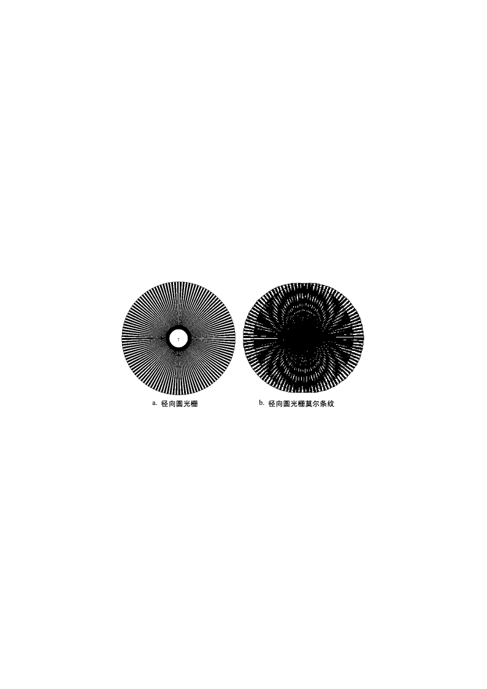

图  2    径向圆光栅及径向圆光栅莫尔条纹

径向圆光栅是指大量在空间均匀分布且指向圆心的刻线形成的光栅，相邻刻线之间的夹角α称为栅距角。图 2a是径向圆光栅，图 2b是两只栅距角相同（即α1=α2=α），圆心相距2S的径向圆光栅相向叠合产生的莫尔条纹。

若两光栅的刻划中心相距为2S，在以两光栅中心连线为x轴，两光栅中心连线的中点为原点的直角坐标系中，莫尔条纹满足如下方程：

	（2）

径向圆光栅莫尔条纹方程的推导见附录2。

径向圆光栅的莫尔条纹有如下特点：

1.当其中一只光栅转动时，圆族将向外扩张或向内收缩。每转动1个栅距角，莫尔条纹移动一个条纹宽度。用光电器件测得莫尔条纹移动的个数k就可以得到光栅的角位移Δθ=kα。用径向圆光栅测量角位移具有误差减小作用。

2.莫尔条纹是由上下2组不同半径，不同圆心的圆族组成。上半圆族的圆心位置为

，下半圆族的圆心位置为。条纹的曲率半径为$\frac{S\sqrt{\tan^2{k}\alpha+1}}{\tan{k}\alpha}$。

3.k越大，莫尔条纹半径越小，条纹间距也越小，所以靠近传感器中心的莫尔条纹不易

分辨，半径最小值为S。

4.两光栅的中心坐标（S，0）和（-S，0）恒满足圆方程，所有的圆均通过两光栅的中

心。

切向圆光栅

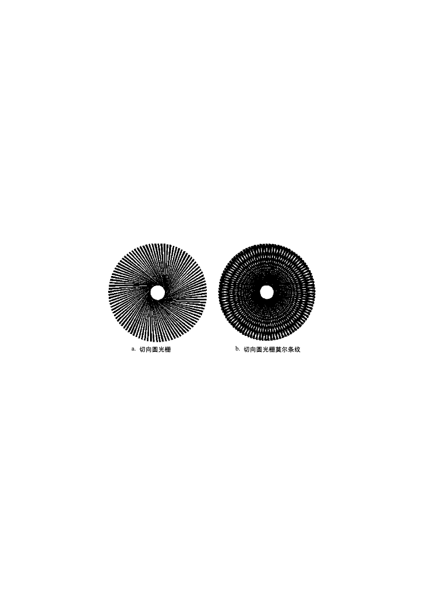

图  3    切向圆光栅与切向圆光栅莫尔条纹

切向圆光栅是由空间分布均匀且都与一个半径很小的圆相切的众多刻线构成的圆光栅。当如图 3a的两只切向圆光栅相向叠合时，两只光栅的切线方向相反。图 3b是两只小圆半径相同，栅距角相同的切向圆光栅相向叠合产生的莫尔条纹。

两只小圆半径均为r，栅距角均为α的切向光栅相向同心叠合，其莫尔条纹满足的方程为：

$x^2+y^2=\left(\frac{2r}{k\alpha}\right)^2$	（3）

切向圆光栅莫尔条纹方程的推导见附录3。

切向圆光栅的莫尔条纹有如下特点：

1.当其中一只光栅转动时，圆族将向外扩张或向内收缩。每转动1个栅距角，莫尔条纹移动一个条纹宽度。用光电器件测得莫尔条纹移动的个数k就可以得到光栅的角位移Δθ=kα，用切向圆光栅测量角位移具有误差减小作用。

2.莫尔条纹是一组同心圆环，圆环半径为R=2r/kα，相邻圆环的间隔为ΔR=2r/k2α。

3.k越大，莫尔条纹半径越小，条纹间距也越小，所以靠近传感器中心的莫尔条纹不易分辨。

4.光栅传感器

光栅传感器由光源系统，光栅系统，光电转换及处理系统组成，如图  4所示。

图  4    光栅传感器系统组成示意图

光源系统给光栅系统提供照明。

光栅系统主要用于产生各种类型的莫尔条纹，在实用的光栅传感器中，为了达到高测量精度，直线光栅的光栅常数或圆光栅的栅距角都取得很小，学生实验系统重在说明原理，为使视觉效果更直观，光栅常数或栅距角都取得比较大。

光电转换及处理系统用于检测莫尔条纹的变化并经适当处理后转换为位移或角度的变换。在实用的光栅传感器中，光电器件检测到的莫尔条纹强度变化经细分电路处理，能分辨出若干分之一的条纹移动，经数字化后直接显示位移值或将位移量反馈到控制系统。学生实验系统重在说明原理，为使视觉效果更直观，我们用监视器将莫尔条纹放大后显示。

四、实验内容及操作步骤
1. 实验前准备工作

打开仪器后面的电源开关，主光栅板的背光灯点亮。

安装副光栅滑座，使副光栅滑座底部的方形凹槽对应读数装置滑块上的方形凸块。
1. 观察直线光栅的莫尔条纹特性

安装好直线副光栅，使其0刻度线与角度读数盘0刻度大致对齐，摇动手轮，使直线主副光栅位置对齐。

转动副光栅座，改变主副光栅之间的夹角θ，观察莫尔条纹宽度的变化。

转动手轮移动副光栅，观察莫尔条纹的移动方向。反向移动副光栅，观察莫尔条纹移动方向的变化，验证莫尔条纹的同步性及位移放大作用。
1. 利用直线光栅测量线位移

安装摄像头，连接好视频接头，监视器上将显示主光栅的放大图像。按仪器介绍中的方法调整好摄像头。

使主光栅和副光栅成一定夹角θ，使监视器上出现约3条莫尔条纹图案。

转动手轮，使副光栅滑座移动到主光栅基座最右端，然后反向转动手轮使副光栅沿轨道运动，莫尔条纹随之移动。每移动5个莫尔条纹，记录副光栅的位置于表 1中（或记录于软件对应实验表格，注：软件各功能介绍请详见对应《软件使用手册》，下同）。注意：为防止回程差对实验的影响，记录副光栅位置时，百分手轮须朝同一方向进行旋转。

计算k为5，10，15……时对应的位移ΔLk，填入表 1中。

以k为横坐标，位移ΔLk为纵坐标作图。若为线性关系，且直线斜率为d，即验证了关系式ΔLk=kd，说明可以由条纹移动数测量线位移。

已知光栅常数值为d=0.500mm，将由直线斜率求出的光栅常数d与之比较，求相对误差。

注：若将实验数据记录在软件中，在输出实验报告时，将在实验报告中体现上述计算值，下同。
1. 观察径向圆光栅的莫尔条纹特性

由于监视器显示的是莫尔条纹局部放大图，为便于观察莫尔条纹全貌，先取下摄像头。

安装好径向副光栅，调节两光栅中心距，使之出现莫尔条纹，观察莫尔条纹图案的对称性。摇动手轮改变两光栅中心距，观察圆半径的变化。

转动副光栅，观察莫尔条纹的移动方向。反向转动副光栅，观察莫尔条纹移动方向的变化。

将你看到的莫尔条纹特性与实验原理中阐述的特性比较，加深理解。
1. 利用径向圆光栅莫尔条纹测量角位移

安装摄像头，调节摄像头的位置，让摄像头监视主副光栅接近边缘的地方，直到监视器上出现清晰的莫尔条纹。

沿同一方向转动副光栅，每移动5个莫尔条纹记录副光栅的角位置于表 2中。

计算θ为5，10，15……时对应的角位移Δθk，填入表 2中。

以k为横坐标，角位移Δ为纵坐标作图。若为线性关系，且直线斜率为α，即验证了关系式Δθ=kα，说明可以由条纹移动数测量角位移。

已知栅距角的准确值为α=1.0º，将由直线斜率求出的栅距角值α与之比较，求相对误差。
1. 观察切向圆光栅莫尔条纹特性

观察主、副光栅的切向是否相反。

由于监视器显示的是莫尔条纹局部放大图，为便于观察莫尔条纹全貌，先取下摄像头。

安装好切向副光栅，转动手轮使主副切向光栅基本同心，观察莫尔条纹图案的特性。

转动副光栅，观察莫尔条纹的移动方向。反向转动副光栅，观察莫尔条纹移动方向的变化。

将你看到的莫尔条纹特性与实验原理中阐述的特性比较，加深理解。
1. 利用切向圆光栅莫尔条纹测量角位移

安装摄像头，调节摄像头的位置，让摄像头监视主副光栅接近边缘的地方，直到监视器上出现清晰的莫尔条纹。

沿同一方向转动副光栅，每移动5个莫尔条纹记录副光栅的角位置于表 3中。

计算θ为5，10，15……时对应的角位移Δθk，填入表 3中。

以k为横坐标，角位移Δθk为纵坐标作图。若为线性关系，且直线斜率为α，即验证了关系式Δθ=kα，说明可以由条纹移动数测量角位移。

已知栅距角的准确值为α=1.0º，将由直线斜率求出的栅距角值α与之比较，求相对误差。

五、数据记录及数据处理

1.	利用直线光栅测量线位移

表  1    用直线光栅测量线位移

| 条纹移动数k | 0 | 5 | 10 | 15 | 20 |
|---|---|---|---|---|---|
| 副光栅位置读数Lk(mm) | 172.33 | 175.84 | 177.52 | 180.21 | 182.71 |
| 位移ΔLk=\|Lk–L0\| | 0 | 3.51 | 5.19 | 7.88 | 10.38 |
| 条纹移动数k | 25 | 30 | 35 | 40 | 45 |
| 副光栅位置读数Lk(mm) | 185.22 | 187.71 | 190.22 | 193.71 | 195.22 |
| 位移ΔLk=\|Lk–L0\| | 12.89 | 15.38 | 17.89 | 21.38 | 22.89 |

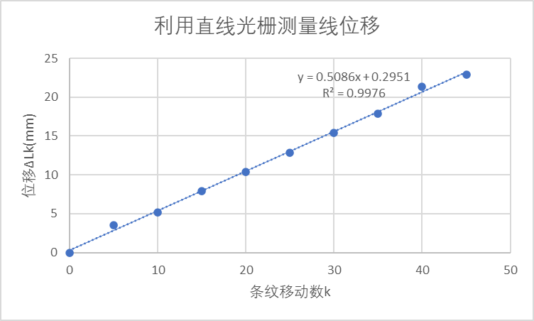

相对误差为(0.5086-0.5)/0.5086=0.0169

2.	利用径向圆光栅莫尔条纹测量角位移

表  2    用径向圆光栅测量角位移

| 条纹移动数k | 0 | 5 | 10 | 15 | 20 |
|---|---|---|---|---|---|
| 副光栅角位置读数θk(º) | 0 | 5 | 10 | 15 | 20 |
| 角位移Δθk=θk–θ0 | 0 | 5 | 10 | 15 | 20 |
| 条纹移动数k | 25 | 30 | 35 | 40 | 45 |
| 副光栅角位置读数θk(º) | 25 | 30 | 35 | 40 | 45 |
| 角位移Δθk=θk–θ0 | 25 | 30 | 35 | 40 | 45 |

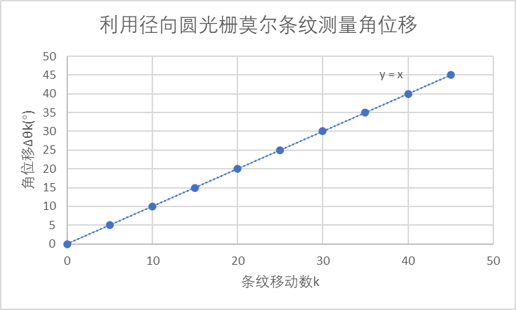

相对误差为(1-1)/1=0

3.	利用切向圆光栅莫尔条纹测量角位移

表  3    用切向圆光栅测量角位移

| 条纹移动数k | 0 | 5 | 10 | 15 | 20 |
|---|---|---|---|---|---|
| 副光栅角位置读数θk(º) | 0 | 4.9 | 10 | 15 | 20 |
| 角位移Δθk=θk–θ0 | 0 | 4.9 | 10 | 15 | 20 |
| 条纹移动数k | 25 | 30 | 35 | 40 | 45 |
| 副光栅角位置读数θk(º) | 25 | 30 | 35 | 40 | 45 |
| 角位移Δθk=θk–θ0 | 25 | 30 | 35 | 40 | 45 |

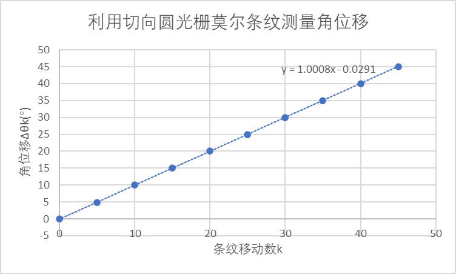

相对误差为(1.0008-1)/1.0008=0.000799

六、对实验误差形成的原因进行分析并提出改进办法，或谈谈对该实验的感想

实验误差形成原因以及改进方法：

1.	人为原因，可能没有正确地移动整数条纹，导致距离、角度等出现偏差。改进方法为：做实验时保持专注。

2.	设备原因，在实验时，我发现当顺时针转动后，再逆时针转动，会出现转动旋钮，但是镜头没有发生移动的情况。改进方法为：更换设备，提高旋钮摩擦力。

实验感想：

1.	这个实验比较考验实验人员的专注力和洞察力，一旦多移动一条条纹，那么实验结果将会发生比较大的变化。

大学物理实验报告

实验名称         红外物理特性及其应用

一、实验目的

1.	了解红外通信的原理及基本特性。

2.	测量红外发射管的伏安特性，电光转换特性。

3.	测量红外发射管的角度特性。

4.	测量红外接收管的伏安特性。

5.	测量部分材料的红外特性。

二、实验仪器

红外物理特性及应用实验仪发射系统、红外物理特性及应用实验仪接收系统

三、实验原理

1.	发光二极管

红外通信的光源为半导体激光器或发光二极管，本实验采用发光二极管。

发光二极管是由P型和N型半导体组成的二极管。P型半导体中有相当数量的空穴，几乎没有自由电子。N型半导体中有相当数量的自由电子，几乎没有空穴。当两种半导体结合在一起形成P-N结时，N区的电子（带负电）向P区扩散，P区的空穴（带正电）向N区扩散，在P-N结附近形成空间电荷区与势垒电场。势垒电场会使载流子向扩散的反方向作漂移运动，最终扩散与漂移达到平衡，使流过P-N结的净电流为零。在空间电荷区内，P区的空穴被来自N区的电子复合，N区的电子被来自P区的空穴复合，使该区内几乎没有能导电的载流子，又称为结区或耗尽区。

当加上与势垒电场方向相反的正向偏压时，结区变窄，在外电场作用下，P区的空穴和N区的电子就向对方扩散运动，从而在PN结附近产生电子与空穴的复合，并以热能或光能的形式释放能量。采用适当的材料，使复合能量以发射光子的形式释放，就构成发光二极管。采用不同的材料及材料组分，可以控制发光二极管发射光谱的中心波长。

2.1发光二极管的伏安及输出特性

图3、图4分别为发光二极管的伏安特性与输出特性。从图3可见，发光二极管的伏安特性与一般的二极管类似。从图4可见，发光二极管输出光功率与驱动电流近似呈线性关系。这是因为：驱动电流与注入PN结的电荷数成正比，在复合发光的量子效率一定的情况下，输出光功率与注入电荷数成正比。

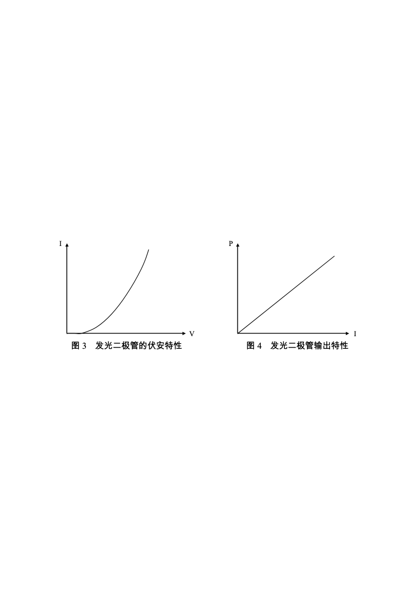

2.2发光二极管的方向特性

发光二极管的发射强度随发射方向而异。方向的特性如图5，图5的发射强度是以最大值为基准，当方向角度为零度时，其发射强度定义为100%。当方向角度增大时，其放射强度相对减少，发射强度如由光轴取其方向角度一半时，其值即为峰值的一半，此角度称为方向**半值角**，此角度越小即代表元件之指向性越灵敏。

一般使用红外线发光二极管均附有透镜，使其指向性更灵敏，而图5（a）的曲线就是附有透镜的情况，方向半值角大约在±7°。另外每一种型号的红外线发光二极管其幅射角度亦有所不同，图5 (b)所示之曲线为另一种型号之元件，方向半值角大约在±50°。

3.	光电二极管

红外通信接收端由光电二极管完成光电转换。光电二极管是工作在无偏压或反向偏置状态下的PN结，反向偏压电场方向与势垒电场方向一致，使结区变宽，无光照时只有很小的暗电流。当PN结受光照射时，价电子吸收光能后挣脱价键的束缚成为自由电子，在结区产生电子－空穴对，在电场作用下，电子向N区运动，空穴向P区运动，形成光电流。

红外通信常用PIN型光电二极管作光电转换。它与普通光电二极管的区别在于在P型和N型半导体之间夹有一层没有渗入杂质的本征半导体材料，称为I型区。这样的结构使得结区更宽，结电容更小，可以提高光电二极管的光电转换效率和响应速度。

图6是反向偏置电压下光电二极管的伏安特性。无光照时的暗电流很小，它是由少数载流子的漂移形成的。有光照时，在较低反向电压下光电流随反向电压的增加有一定升高，这是因为反向偏压增加使结区变宽，结电场增强，提高了光生载流子的收集效率。当反向偏压进一步增加时，光生载流子的收集接近极限，光电流趋于饱和，此时，光电流仅取决于入射光功率。在适当的反向偏置电压下，入射光功率与饱和光电流之间呈较好的线性关系。

图7是光电转换电路，光电二极管接在晶体管基极，集电极电流与基极电流之间有固定的放大关系，基极电流与入射光功率成正比，则流过R的电流与R两端的电压也与光功率成正比。

4.	光源调制

对光源的调制可以采用内调制或外调制。

内调制用信号直接控制光源的电流，使光源的发光强度随外加信号变化。

外调制时光源输出功率恒定，利用光通过介质时的电光效应，声光效应或磁光效应实现信号对光强的调制，一般用于高速传输系统。本实验采用内调制。

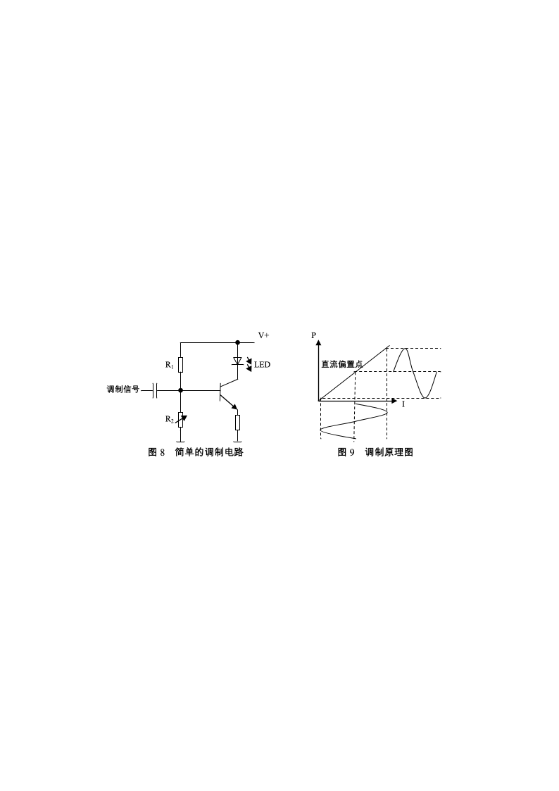

图8是简单的调制电路。调制信号耦合到晶体管基极，晶体管作共发射极连接，流过发光二极管的集电极电流由基极电流控制，R1、R2提供直流偏置电流。图9是调制原理图，由图9可见，由于光源的输出光功率与驱动电流是线性关系，在适当的直流偏置下，随调制信号变化的电流变化由发光二极管转换成了相应的光输出功率变化。

5.	副载波调制

由需要传输的信号直接对光源进行调制，称为基带调制。

对副载波的调制可采用调幅，调频等不同方法。调频具有抗干扰能力强，信号失真小的优点，本实验采用调频法。

四、实验内容及操作步骤

1.	发光二极管的伏安特性与输出特性测量

将红外发射器连接到发射装置的“发射管”接口，接收器连接到接收装置的“接收管”接口（在所有的实验进行中，都不取下发射管和接收管），通电。

将红外发射器与接收器相对放置，连接“电压源输出”到发射模块“信号输入2”，将发射端设置为“电压源”模式，并将电压设置为5V，微调接收端受光方向，使显示值最大。将发射系统显示窗口设置为“发射电流”，接收系统显示窗口设置为“光功率计”。

调节电压源，改变发射管电流，记录发射电流与接收器接收到的光功率（与发射光功率成正比）。将发射系统显示窗口切换倒“正向偏压”，记录与发射电流对应的发射管两端电压。

改变发射电流，将数据记录于表 1中。

以表 1数据作所测发光二极管的伏安特性曲线和输出特性曲线。

讨论所作曲线与图3、图4所描述的规律是否符合。

2.	光电二极管伏安特性的测量

连线方式同实验1。

调节发射装置的电压源，使光电二极管接收到的光功率分别如表2第1列所示。

设置接收显示为“反向偏压”，调节接收模块的“反向偏压调节”旋钮使反向偏压至设定值，切换显示状态至“光电流”，测量与反向偏置电压对应的光电流，记录于表  2中。

改变反向偏压，重复上述测量。

在不同输入光功率时，重复上述测量。

以表  2数据，作光电二极管的伏安特性曲线。

讨论所作曲线与图6所描述的规律是否符合。

3.	发光管的角度特性测量

将红外发射器与接收器相对放置，固定接收器。将发射系统显示窗口设置为“电压源”，将接收系统显示窗口设置为“光功率计”。连接“电压源输出”到发射模块“信号输入2”，微调接收端受光方向，使显示值最大。增大电压源输出，使接收的光功率大于4mW。

以最大接收光功率点为0°，记录此时的光功率，以顺时针方向（作为正角度方向）每隔5°（也可以根据需要调整角度间隔）记录一次光功率，填入表  3中。再以逆时针方向（作为负角度方向）每隔5°记录一次光功率，填入表  3中。

根据表  3中的数据，以角度为横坐标，光强为纵坐标，作红外发光二极管发射光强和角度之间的关系曲线，并得出方向半值角（光强超过最大光强60%以上的角度）。

五、数据记录及数据处理

1.	发光二极管的伏安特性与输出特性测量

表  1    发光二极管伏安特性与输出特性测量

| 正向偏压(V) | 0 | 1.16 | 1.20 | 1.22 | 1.25 | 1.27 | 1.29 | 1.30 | 1.32 | 1.34 |
|---|---|---|---|---|---|---|---|---|---|---|
| 发射管电流(mA) | 0 | 5 | 10 | 15 | 20 | 25 | 30 | 35 | 40 | 45 |
| 光功率(mW) | 0 | 0.78 | 2.01 | 3.26 | 4.56 | 5.88 | 7.12 | 8.26 | 9.41 | 10.38 |

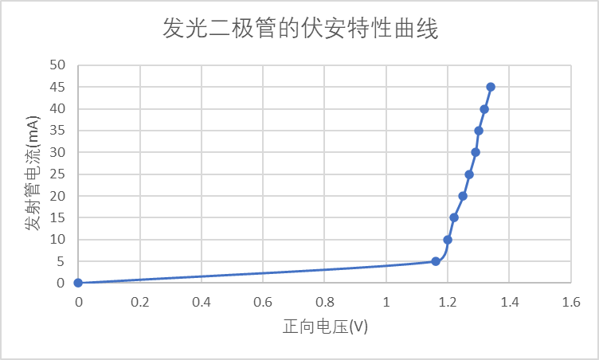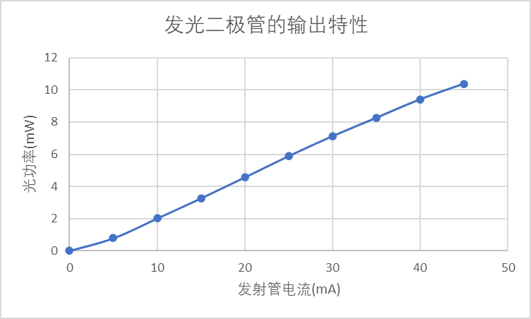

发光二极管的伏安特性曲线与图3差别略大，发光二极管的输出特性曲线与图4符合。

2.	光电二极管伏安特性的测量

表  2    光电二极管伏安特性的测量

<table>
<tr><td>反向偏置电压(V)</td><td>0</td><td>1.00</td><td>2.00</td><td>3.00</td><td>4.00</td><td>5.00</td></tr>
<tr><td>P=0</td><td>光电流(μA)</td><td>0</td><td>0</td><td>0</td><td>0</td><td>0</td><td>0</td></tr>
<tr><td>P=0.100mW</td><td></td><td>2.45</td><td>2.56</td><td>2.60</td><td>2.63</td><td>2.66</td><td>2.73</td></tr>
<tr><td>P=0.200mW</td><td></td><td>6.06</td><td>6.25</td><td>6.33</td><td>6.40</td><td>6.50</td><td>6.55</td></tr>
</table>

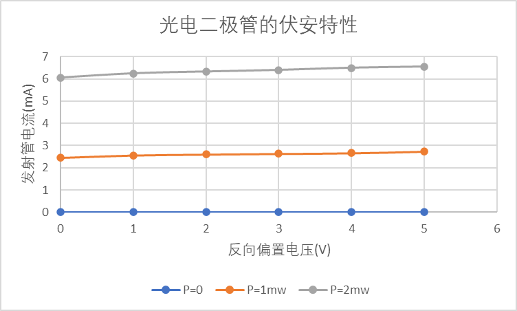

所作曲线基本与图6所描述的规律符合

3.	发光管的角度特性测量

表  3    红外发光二极管角度特性的测量

| 转动角度 | -10° | -8° | -6° | -4° | -2° | 0° | 2° | 4° | 6° | 8° | 10° |
|---|---|---|---|---|---|---|---|---|---|---|---|
| 光功率(mW) | 0.01 | 0.24 | 1.03 | 2.22 | 5.77 | 8.17 | 7.67 | 5.95 | 3.28 | 1.62 | 1.27 |

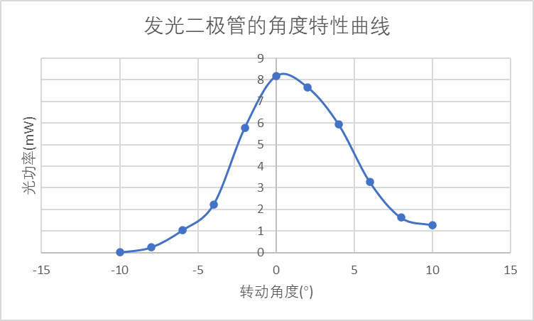

半值角的光功率为8.17mW×60%=4.902mW，可得半值角约为(3.6°, 4.6°)

六、对实验误差形成的原因进行分析并提出改进办法，或谈谈对该实验的感想

实验误差形成的原因及改进办法：

1.	设备原因，无法整数倍地调整电压，导致数据有一定误差。改进办法：无。

实验感想：

本实验精细度较高，一点点的偏差就可能导致严重的数据错误，因此进行此实验的时候要格外注意。
