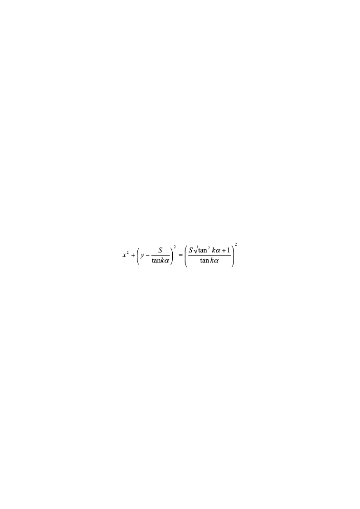
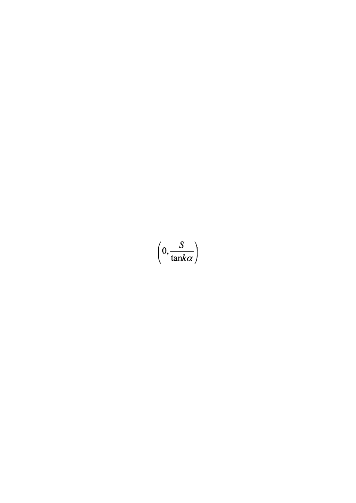
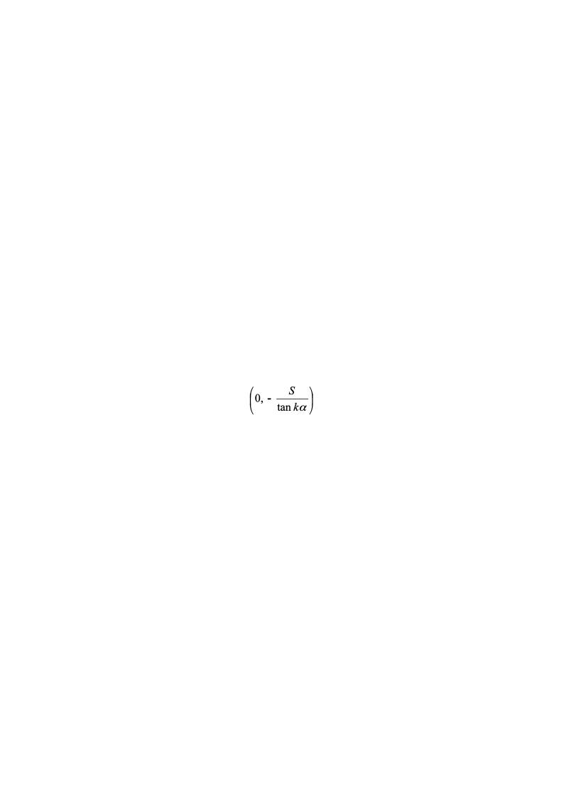
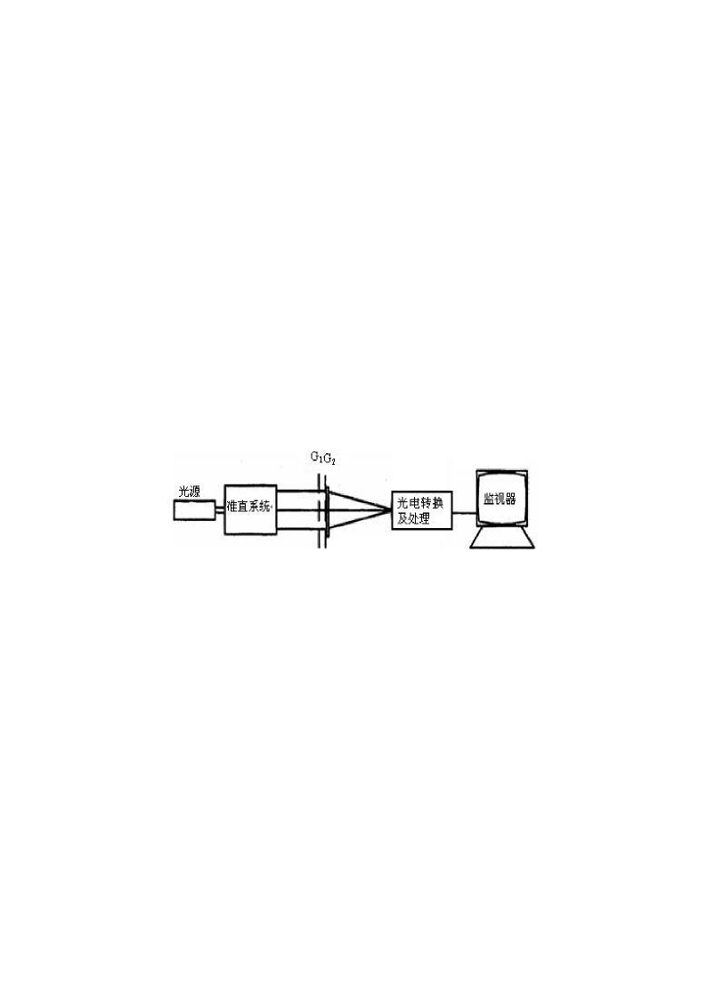

# 莫尔效应及光栅传感实验

莫尔效应及光栅传感实验

实验目的
1. 理解莫尔现象的产生机理
1. 了解光栅传感器的结构
1. 观察直线光栅、径向圆光栅、切向圆光栅的莫尔条纹并验证其特性
1. 用直线光栅测量线位移
1. 用圆光栅测量角位移

实验原理
1. 莫尔条纹现象

两只光栅以很小的交角相向叠合时,在相干或非相干光的照明下，在叠合面上将出现明暗相间的条纹，称为莫尔条纹。莫尔条纹现象是光栅传感器的理论基础，它可以用粗光栅或细光栅形成。栅距远大于波长的光栅叫粗光栅，栅距接近波长的光栅叫细光栅。

**直线光栅**

两只光栅常数相同的光栅，其刻划面相向叠合并且使两者栅线有很小的交角*θ*，则由于挡光效应（光栅常数*d* >20μm）或光的衍射作用（光栅常数*d* <10μm），在与光栅刻线大致垂直的方向上形成明暗相间的条纹，如图  1所示。

$$
d/2
$$

图 1  直线光栅莫尔条纹

若主光栅与副光栅之间的夹角为*θ*，光栅常数为*d*，由图  1的几何关系可得出相邻莫尔条纹之间的距离*B*为：

$B=\frac{d}{2\sin\frac{\theta}{2}}-\frac{d}{\theta}$	（1）

式中*θ*的单位为弧度。由上式可知，当改变光栅夹角*θ*，莫尔条纹宽度*B*也将随之改变。

当两光栅的光栅常数不相等时，莫尔条纹方程及莫尔条纹间隔的表达式推导见附录1

直线光栅的莫尔条纹有如下主要特性：
  1. 同步性

在保持两光栅交角一定的情况下，使一个光栅固定，另一个光栅沿栅线的垂直方向运动，每移动一个栅距*d*，莫尔条纹移动一个条纹间距*B*，若光栅反向运动，则莫尔条纹的移动方向也相反。
  1. 位移放大作用

当两光栅交角*θ*很小时，相当于把栅距*d*放大了1/*θ*倍，莫尔条纹可以将很小的光栅位移同步放大为莫尔条纹的位移。例如当*θ*＝0.06度＝π/3000弧度时，莫尔条纹宽度比光栅栅距大近千倍。当光栅移动微米量级时，莫尔条纹移动毫米量级。这样就将不便检测的微小位移转换成用光电器件易于测量的莫尔条纹移动。测得莫尔条纹移动的个数*k*就可以得到光栅的位移Δ*L*为Δ*L*=*kd*。
  1. 误差减小作用

光电器件获取的莫尔条纹是两光栅重合区域所有光栅线综合作用的结果。即使光栅在刻画过程中有误差，莫尔条纹对刻画误差有平均作用，从而在很大程度上消除栅距的局部误差的影响，这是光栅传感器精度高的重要原因。

**径向圆光栅**

径向圆光栅是指大量在空间均匀分布且指向圆心的刻线形成的光栅，相邻刻线之间的夹角*α*称为栅距角。图  2a是径向圆光栅，图  2b是两只栅距角相同（即*α*1=*α*2=*α*），圆心相距2*S*的径向圆光栅相向叠合产生的莫尔条纹。

图 2  径向圆光栅及径向圆光栅莫尔条纹

若两光栅的刻划中心相距为2*S*，在以两光栅中心连线为x轴，两光栅中心连线的中点为原点的直角坐标系中，莫尔条纹满足如下方程：

		（2）

径向圆光栅莫尔条纹方程的推导见附录2。

径向圆光栅的莫尔条纹有如下特点：
1. 当其中一只光栅转动时，圆族将向外扩张或向内收缩。每转动1个栅距角，莫尔条纹移动一个条纹宽度。用光电器件测得莫尔条纹移动的个数*k*就可以得到光栅的角位移Δ*θ*=*k**α*。用径向圆光栅测量角位移具有误差减小作用。
1. 莫尔条纹是由上下2组不同半径，不同圆心的圆族组成。上半圆族的圆心位置为，下半圆族的圆心位置为。条纹的曲率半径为$\frac{S\sqrt{\tan^2{k}\alpha+1}}{\tan{k}\alpha}$。
1. *k*越大，莫尔条纹半径越小，条纹间距也越小，所以靠近传感器中心的莫尔条纹不易分辨，半径最小值为*S*。
1. 两光栅的中心坐标（*S*，0）和（-*S*，0）恒满足圆方程，所有的圆均通过两光栅的中心。

**切向圆光栅**

切向圆光栅是由空间分布均匀且都与一个半径很小的圆相切的众多刻线构成的圆光栅。当如图  3a的两只切向圆光栅相向叠合时，两只光栅的切线方向相反。图  3b是两只小圆半径相同，栅距角相同的切向圆光栅相向叠合产生的莫尔条纹。

图 3  切向圆光栅与切向圆光栅莫尔条纹

两只小圆半径均为*r*，栅距角均为*α*的切向光栅相向同心叠合，其莫尔条纹满足的方程为：

$x^2+y^2=\left(\frac{2r}{k\alpha}\right)^2$		（3）

切向圆光栅莫尔条纹方程的推导见附录3。

切向圆光栅的莫尔条纹有如下特点：
1. 当其中一只光栅转动时，圆族将向外扩张或向内收缩。每转动1个栅距角，莫尔条纹移动一个条纹宽度。用光电器件测得莫尔条纹移动的个数*k*就可以得到光栅的角位移Δ*θ*=*k**α*，用切向圆光栅测量角位移具有误差减小作用。
1. 莫尔条纹是一组同心圆环，圆环半径为*R*=2*r*/*k**α*，相邻圆环的间隔为Δ*R=*2*r*/*k*2*α*。
1. *k*越大，莫尔条纹半径越小，条纹间距也越小，所以靠近传感器中心的莫尔条纹不易分辨。
1. 光栅传感器

光栅传感器由光源系统，光栅系统，光电转换及处理系统组成，如图  4所示。

图 4  光栅传感器系统组成示意图

光源系统给光栅系统提供照明。

光栅系统主要用于产生各种类型的莫尔条纹，在实用的光栅传感器中，为了达到高测量精度，直线光栅的光栅常数或圆光栅的栅距角都取得很小，学生实验系统重在说明原理，为使视觉效果更直观，光栅常数或栅距角都取得比较大。

光电转换及处理系统用于检测莫尔条纹的变化并经适当处理后转换为位移或角度的变换。在实用的光栅传感器中，光电器件检测到的莫尔条纹强度变化经细分电路处理，能分辨出若干分之一的条纹移动，经数字化后直接显示位移值或将位移量反馈到控制系统。学生实验系统重在说明原理，为使视觉效果更直观，我们用监视器将莫尔条纹放大后显示。

实验内容与步骤
1. 实验前准备工作

打开仪器后面的电源开关，主光栅板的背光灯点亮。

安装副光栅滑座，使副光栅滑座底部的方形凹槽对应读数装置滑块上的方形凸块。
1. 观察直线光栅的莫尔条纹特性

安装好直线副光栅，使其0刻度线与角度读数盘0刻度大致对齐，摇动手轮，使直线主副光栅位置对齐。

转动副光栅座，改变主副光栅之间的夹角*θ*，观察莫尔条纹宽度的变化。

转动手轮移动副光栅，观察莫尔条纹的移动方向。反向移动副光栅，观察莫尔条纹移动方向的变化，验证莫尔条纹的同步性及位移放大作用。
1. 利用直线光栅测量线位移

安装摄像头，连接好视频接头，监视器上将显示主光栅的放大图像。按仪器介绍中的方法调整好摄像头。

使主光栅和副光栅成一定夹角*θ*，使监视器上出现约3条莫尔条纹图案。

转动手轮，使副光栅滑座移动到主光栅基座最右端，然后反向转动手轮使副光栅沿轨道运动，莫尔条纹随之移动。每移动5个莫尔条纹，记录副光栅的位置于表  1中（或记录于软件对应实验表格，注：软件各功能介绍请详见对应《软件使用手册》，下同）。注意：为防止回程差对实验的影响，记录副光栅位置时，百分手轮须朝同一方向进行旋转。

表 1  用直线光栅测量线位移

| 条纹移动数*k* | 0 | 5 | 10 | 15 | 20 |
|---|---|---|---|---|---|
| 副光栅位置读数*L**k*(mm) |  |  |  |  |  |
| 位移Δ*L**k*=\|*L**k*–*L*0\| |  |  |  |  |  |
| 条纹移动数*k* | 25 | 30 | 35 | 40 | 45 |
| 副光栅位置读数*L**k*(mm) |  |  |  |  |  |
| 位移Δ*L**k*=\|*L**k*–*L*0\| |  |  |  |  |  |

计算*k*为5，10，15……时对应的位移Δ*L**k*，填入表  1中。

以*k*为横坐标，位移Δ*L**k*为纵坐标作图。若为线性关系，且直线斜率为*d*，即验证了关系式Δ*L**k*=*kd*，说明可以由条纹移动数测量线位移。

已知光栅常数值为*d*=0.500mm，将由直线斜率求出的光栅常数*d*与之比较，求相对误差。

注：若将实验数据记录在软件中，在输出实验报告时，将在实验报告中体现上述计算值，下同。
1. 观察径向圆光栅的莫尔条纹特性

由于监视器显示的是莫尔条纹局部放大图，为便于观察莫尔条纹全貌，先取下摄像头。

安装好径向副光栅，调节两光栅中心距，使之出现莫尔条纹，观察莫尔条纹图案的对称性。摇动手轮改变两光栅中心距，观察圆半径的变化。

转动副光栅，观察莫尔条纹的移动方向。反向转动副光栅，观察莫尔条纹移动方向的变化。

将你看到的莫尔条纹特性与实验原理中阐述的特性比较，加深理解。
1. 利用径向圆光栅莫尔条纹测量角位移

安装摄像头，调节摄像头的位置，让摄像头监视主副光栅接近边缘的地方，直到监视器上出现清晰的莫尔条纹。

沿同一方向转动副光栅，每移动5个莫尔条纹记录副光栅的角位置于表  2中。

表 2  用径向圆光栅测量角位移

| 条纹移动数*k* | 0 | 5 | 10 | 15 | 20 |
|---|---|---|---|---|---|
| 副光栅角位置读数*θ**k*(º) |  |  |  |  |  |
| 角位移Δ*θ**k*=*θ**k*–*θ*0 |  |  |  |  |  |
| 条纹移动数*k* | 25 | 30 | 35 | 40 | 45 |
| 副光栅角位置读数*θ**k*(º) |  |  |  |  |  |
| 角位移Δ*θ**k*=*θ**k*–*θ*0 |  |  |  |  |  |

计算*θ*为5，10，15……时对应的角位移Δ*θ**k*，填入表  2中。

以*k*为横坐标，角位移Δ*θ**k*为纵坐标作图。若为线性关系，且直线斜率为*α*，即验证了关系式Δ*θ*=*k**α*，说明可以由条纹移动数测量角位移。

已知栅距角的准确值为*α*=1.0º，将由直线斜率求出的栅距角值*α*与之比较，求相对误差。
1. 观察切向圆光栅莫尔条纹特性

观察主、副光栅的切向是否相反。

由于监视器显示的是莫尔条纹局部放大图，为便于观察莫尔条纹全貌，先取下摄像头。

安装好切向副光栅，转动手轮使主副切向光栅基本同心，观察莫尔条纹图案的特性。

转动副光栅，观察莫尔条纹的移动方向。反向转动副光栅，观察莫尔条纹移动方向的变化。

将你看到的莫尔条纹特性与实验原理中阐述的特性比较，加深理解。
1. 利用切向圆光栅莫尔条纹测量角位移

安装摄像头，调节摄像头的位置，让摄像头监视主副光栅接近边缘的地方，直到监视器上出现清晰的莫尔条纹。

沿同一方向转动副光栅，每移动5个莫尔条纹记录副光栅的角位置于表  3中。

表 3  用切向圆光栅测量角位移

| 条纹移动数*k* | 0 | 5 | 10 | 15 | 20 |
|---|---|---|---|---|---|
| 副光栅角位置读数*θ**k*(º) |  |  |  |  |  |
| 角位移Δ*θ**k*=*θ**k*–*θ*0 |  |  |  |  |  |
| 条纹移动数*k* | 25 | 30 | 35 | 40 | 45 |
| 副光栅角位置读数*θ**k*(º) |  |  |  |  |  |
| 角位移Δ*θ**k*=*θ**k*–*θ*0 |  |  |  |  |  |

计算*θ*为5，10，15……时对应的角位移Δ*θ**k*，填入表  3中。

以*k*为横坐标，角位移Δ*θ**k*为纵坐标作图。若为线性关系，且直线斜率为*α*，即验证了关系式Δ*θ*=*k**α*，说明可以由条纹移动数测量角位移。

已知栅距角的准确值为*α*=1.0º，将由直线斜率求出的栅距角值*α*与之比较，求相对误差。

注意事项
1. 使用前应首先详细阅读说明书。
1. 为保证使用安全，三芯电源线须可靠接地。
1. 仪器应在清洁干净的场所使用，避免阳光直接暴晒和剧烈颠震。
1. 切勿用手触摸光栅表面。如果光栅被弄脏，建议用清水加少量的洗洁精清洗然后晾干。
1. 测量时应注意回程差。
1. 测量时应尽量避免光栅的垂直上方有其他直射光源。
1. 光栅片是玻璃材质，易碎，勿以硬物击之，同时避免摔碎。
