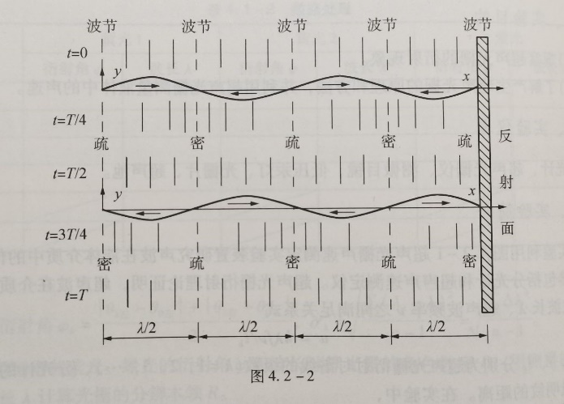
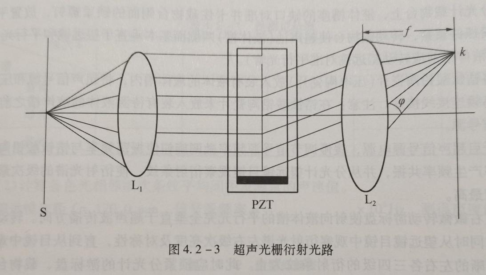

# 超声光栅

大学物理实验报告

实验名称  超声光栅及其应用

于博宇    202330451691  计科1班

一.实验目的：

- 1 了解超声光栅产生的原理和方法；

2 观察超声光栅的衍射现象；

3 掌握用超声光栅测量超声波速度的方法。

二.实验仪器：

- WSG—1型超声光栅声速仪（信号源、液体槽、锆钛酸铝陶瓷片），分光计，测微目镜，低压汞灯

三．实验原理：

   - 超声波作为一种纵波在盛有液体的玻璃槽中传播时，液体被周期性地压缩与膨胀，其密度发生周期性的变化，形成疏密波。如果它被一个反射板或液槽的一个玻璃面反射，又会反向传播。在一定条件下，前进波与反射波叠加而形成超声频率的纵向振动驻波。由于驻波的振幅可达到单一行波的两倍，加剧了波源和反射板之间液体的疏密变化。在某一时刻，纵驻波任一波节两边的质点都涌向这个节点，使节点附近成为质点密集区，而相邻的波节处成为质点稀疏区。半个周期后，这个节点附近的质点又向两边散开变为稀疏区，相邻的波节处变为密集区。在这些驻波中，稀疏作用使液体折射率减小，而压缩作用使液体折射率增大。在距离等于波长d的两点，液体的密度相同，折射率也相同。在t和t +T/2（T为超声波振动周期）两时刻振幅y、液体疏密分布和折射率n的变化如图4.2-2所示。

单色平行光沿若垂直于超声波传播方向通过上述液体时，因折射率周期性变化使光波的波阵面产生相应的相位差，经透镜聚焦，出现干涉条纹。这种现象与平行光通过平面光栅的情况相似。因为超声波的波长很短，只要槽宽能维持平面波，槽中液体就相当于一个行射光栅。图4.2-2中的波长即相当于光栅常数d。

在调好的分光计上，由单色光源、平行光管中的可调狭缝S和汇聚透镜L1组成平行光系统。图4.2-3为超声光栅衍射光路。让平行光管射出的平行光束垂直通过装有锆钛酸铅陶瓷片（或称PZT晶片）的液槽。在玻璃槽的另一侧用自准直望远镜中的物镜L2和测微目镜组成测微望远镜系统。若振荡器输出的电信号使PZT晶片发生超声共振，且在液槽中形成稳定的超声驻波，则从测微目镜中即可观察到衍射光谱。衍射光谱中亮条纹位置调足光栅方程

dsinφk= kλ(k =0，±1，±2，…)

当φk很小时，有

sinφk＝lk/f(sinφk≈tanφk) （4.2 - 1）

式中，lk为衍射光谱零级至k级的距离，f为望远镜物镜的焦距。根据光栅方程可求得超声波的波长（即超声光栅的光栅常数）为

d=kλ/sinφk＝kλf/lk （4.2-2）

从而可以求得超声波在液体中的传播速度u：

u= dν=kλfν/lk （4.2-3）

也可以表示为

u＝λfν/Δlk （4.2 -4）

式中，ν为超声共振驻波频率（由信号源频率计读出，12MHz左右），Δlk为同一色光相邻级次条纹间距。

四.实验过程与步骤：

1.  分光计的调整

-  1 调整分光计到使用状态；

2 将超声光栅盒放在分光计的载物台上并接好线，开启 光栅仪电源，调节其“频率调节旋钮”使望远镜中看到的衍射光谱级次最多而且明亮，转动游标盘使衍射光谱左右对称，级次谱线亮度一致；

3 调节测微目镜调焦手轮直至看清分化板十字准线，将望远镜目镜换成测微目镜，前后移动测微目镜使衍射条纹最清晰，旋转测微目镜，使目镜视场中分划板标尺与衍射条纹平行，固定测微目镜。

4 测微目镜沿一个方向逐级测量各种颜色光谱线位置的读数填入表1。

五.数据记录与处理：

-  表1

<table>
<tr><td>透镜焦距f：</td><td>170mm</td><td>共振频率：</td><td>11.28MHz</td></tr>
<tr><td>级次</td><td>黄-1</td><td>黄+1</td><td>绿-1</td><td>绿+1</td><td>蓝-1</td><td>蓝+1</td></tr>
<tr><td>位置（mm）</td><td>4.535</td><td>6.121</td><td>4.681</td><td>5.998</td><td>4.751</td><td>5.785</td></tr>
<tr><td>$l_k$（mm）</td><td>0.793</td><td>0.6585</td><td>0.517</td></tr>
<tr><td>超声波的波长</td><td>0.124</td><td>0.132</td><td>0.143</td></tr>
<tr><td>超声波的速度</td><td>1402.53</td><td>1493.89</td><td>1613.45</td></tr>
<tr><td>超声波声速平均测量值（m·s-1：1503.29）</td><td>超声波声速理论值（m·s-1）：1495</td></tr>
<tr><td>相对误差：0.55%</td></tr>
</table>

- 衍射特性：

超声光栅能够有效地控制入射光的衍射角度和强度，根据不同的超声频率，可以调节衍射效率和光束的分布

六.个人拓展思考

-  超声光栅是一种具有重要科研价值和应用前景的光学元件，通过深入研究其特性和应用，可以推动相关领域的发展。进一步的研究应集中在优化材料选择、提高衍射效率和拓展实际应用场景上。
