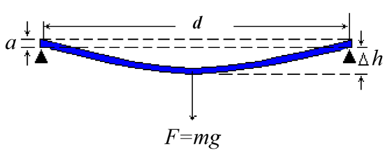
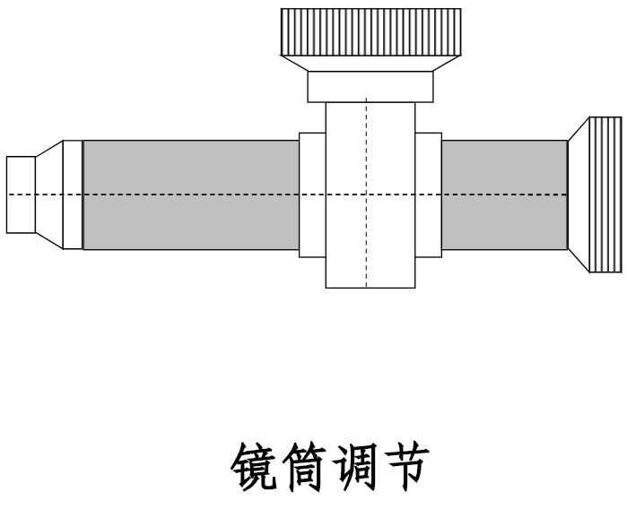
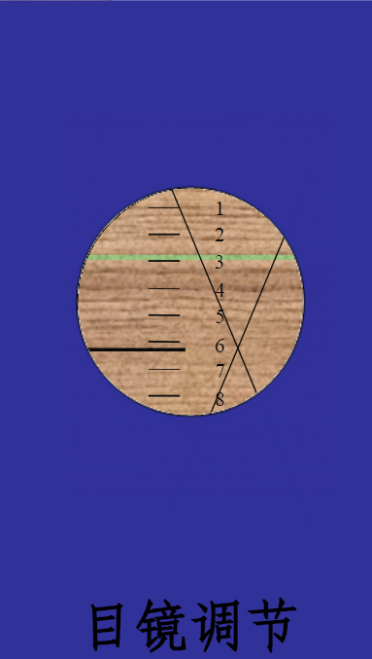
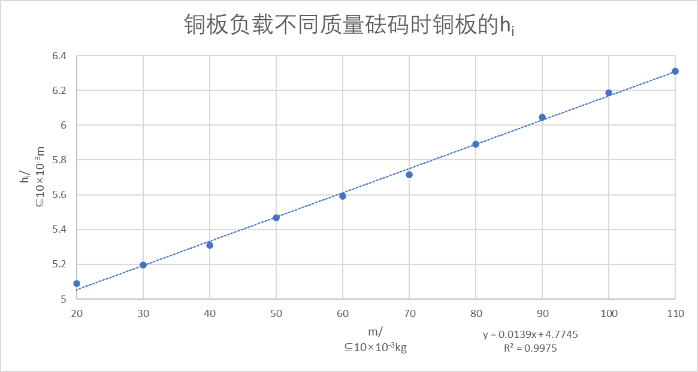

# 超声波材料检测&弯曲法测杨氏模量实验报告

大学物理实验报告

实验名称  超声波材料检测
- 实验目的

（1）了解超声波的产生和接收的方法；

（2）了解超声探测的原理和方法；

（3）测量超声波在样品中的传播速度、波长及频率。
- 实验仪器

数字示波器、样品。
- 实验原理

（1）超声波的产生

超声波是一种波长很短，频率很高的声波，频率范围在2×104~1012Hz。

超声波被用于探测、超声成像及超声焊接、钻孔、固体的粉碎、去锅垢、清洗、灭菌等很多方面。

通常使用压电陶片和磁致伸缩材料产生超声波。

（2）超声波的接收

超声波作用于压电晶片，使晶片产生形变和极化（正压电效应），晶片两端产生振荡的电压。电压经过放大后输出至示波器。

（3）直探头延迟和试块纵波声速的测量

探头的延时t：探头晶片发射的超声波到达试块上表面的时间

t=2t1-t2

试块中超声波的声速c

c=2L/(t2-t1)

t0：超声波发射的初始时刻（设为0）

t1：超声波在试块底面后第一次发射然后到达探头的时间

t2：超声波在试块地面经过两次反射然后到达探头的时间

L：试块的高度（45mm）

（4）声波的波长和频率

放大试块地面第一次反射的脉冲声波的波形，测量3或4个波形周期的时间。

计算超声波的周期T，频率f，波长λ。

λ=cT=c/f
- 实验内容及操作步骤

1.利用底面回波，测量直探头的延迟和试块的纵波声速。

改变探头的位置，重复测量5次，求声速的平均值和不确定度。

2.测量脉冲超声波纵波的频率和波长。

移动探头的位置，重复测量5次，求频率和波长的平均值和不确定度。
- 数据记录及数据处理（包括计算公式、计算步骤，误差分析）

| 测量次数 | Δt（t2-t1）/μs | T（N=3）/μs |
|---|---|---|
| 1 | 14.1 | 1.27 |
| 2 | 14.0 | 1.28 |
| 3 | 14.3 | 1.20 |
| 4 | 14.2 | 1.29 |
| 5 | 14.3 | 1.30 |

（1）

Δt的平均值为：14.18μs，标准差为0.117μs

则声速为6346.97m/s，不确定度为58.54

声速的测量结果为6346.97±58.54(m/s)。

（2）

T（N=1）的平均值为0.42μs，则频率为2380952.38Hz，波长为2785.56μm。

T（N=1）的标准差为0.05μs，则频率为20000.00Hz，波长为23.40μm。

频率的测量结果为2380952.38±20000.00Hz，波长的测量结果为2785.56±23.40μm。
- 对实验误差形成的原因进行分析并提出改进办法，或谈谈对该实验的感想

误差分析：

（1）示波器上判断极大值位置模糊，较难判断。

（2）时间存在延迟，但未进行计算，则可能会导致实验误差出现。

大学物理实验报告

实验名称  弯曲法测杨氏模量

一、实验目的

（1）学习用弯曲法测量金属的杨氏模量。

（2）掌握用最小二乘法及逐差法处理数据。

二、实验仪器

直尺、螺旋测微器、游标卡尺、读数显微镜、黄铜板、砝码、电压表。

三、实验原理

1.杨氏模量

杨氏模量是描述固体材料抵抗形变能力的物理量。一条长度为L、截面为S的金属丝在力F作用下伸长ΔL。F/S叫应力，其物理意义是金属丝单位截面积所受到的力；ΔL/L叫应变，其物理意义是金属丝单位长度所对应的伸长量。应力与应变的比称为杨氏模量：

E=(F/S)/(ΔL/L)

2.弯曲法测量杨氏模量E原理

E=d3mg/(4a3bΔh)

d为两刀口之间的距离；a为梁的厚度；b为梁的厚度；m为所加砝码的质量，g为重力加速度；Δh为梁中心由于重物P的作用而下降的距离。

四、实验内容与主要步骤

（1）用直尺测量两柱刀口间的距离d一次，并估算误差；用螺旋测微器测量铜板不同部位的厚度a五次，取平均值；用游标卡尺测量黄铜板不通过位置的宽度b五次，取平均值。将以上数据记录于表一。

（2）调节读数显微镜。

（3）测量黄铜的杨氏模量，将铜板放在仪器上，加不同质量的砝码，记录铜板中心的高度位置。

注意事项：

1.要防止空回误差，测量时必须使侧位鼓轮单向移动；

2.调好零记下读数显微镜的初始读数后，要防止铜杠杆和显微镜的位置有任何有移动；

3.要等待砝码架稳定后再读数。

五、数据记录与处理

表一 测量d，a，b

| d | a1 | a2 | a3 | a4 | a5 | b1 | b2 | b3 | b4 | b5 |
|---|---|---|---|---|---|---|---|---|---|---|
| 22.09 | 0.963 | 0.945 | 0.949 | 0.963 | 0.967 | 2.206 | 2.246 | 2.246 | 2.208 | 2.210 |

表二 测量铜板负载不同质量砝码时铜板的hi

| i | 1 | 2 | 3 | 4 | 5 | 6 | 7 | 8 | 9 | 10 |
|---|---|---|---|---|---|---|---|---|---|---|
| m/ ⊆10-3kg | 20.00 | 30.00 | 40.00 | 50.00 | 60.00 | 70.00 | 80.00 | 90.00 | 100.00 | 110.00 |
| hi/ ⊆10-3m | 5.090 | 5.195 | 5.310 | 5.467 | 5.592 | 5.716 | 5.890 | 6.045 | 6.187 | 6.310 |

逐差法及最小二乘法计算杨氏模量E

最小二乘法：

a的平均值为：0.957mm，b的平均值为：2.223cm

曲线斜率k=d3g/(4a3bE)，则E=9.8x1010N/m2。

逐差法：

Δh1：0.626mm，E1：10.8×1010N/m2

Δh2：0.695mm，E2：9.8×1010N/m2

Δh3：0.735mm，E3：9.2×1010N/m2

Δh4：0.720mm，E4：9.4×1010N/m2

Δh5：0.718mm，E5：9.5×1010N/m2

则E=9.74×1010N/m2

六、实验感想

误差分析：

（1）个人主观误差，如目镜的校准、螺旋测微器的读数等。

（2）标尺基本铅直，但显微镜和竖线可能存在倾斜状况。

（3）砝码缺口若始终朝一个方向，则会导致砝码倾斜，测量失败。除此之外，增添或拿去砝码需要轻拿轻放，稍有震动可能导致位置偏移。
