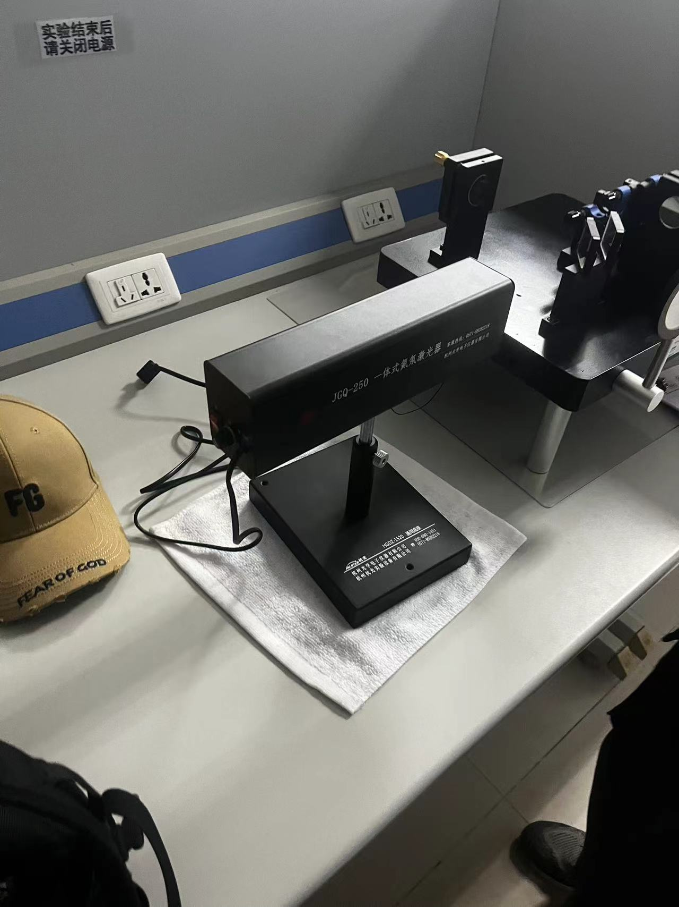

# 迈克尔逊干涉仪

大学物理实验报告+思考

实验名称 迈克尔逊干涉仪的调整与使用

于博宇    202330451691  计科1班

1.实验目的：

（1）了解迈克尔逊干涉仪的构造原理和调整方法。

（2）观察点光源的非定域干涉条纹的特征和扩展光源的等倾干涉和等厚干涉图样。

（3）测量钠光波长。

2.实验仪器：

迈克尔逊干涉仪，JCQ-250一体式氦氖激光器

3.实验原理：

1.光路原理

迈克尔逊干涉仪是用分振幅法产生双光束干涉的仪器，光路原理如右图所示。从光源S发出的一束光射在分光板G1上，G1板的后表面AB镀有半反射金属膜（镀银或铝），这个反射膜将一束光分成光强近似相等的反射光1和透射光2，它们分别垂直射到反射镜M1和M2上，经反射后沿原路返回到G1进行透射和反射，二者再汇集成一束光，沿垂直于接收屏E的方向传播。因为这两束光频率相同、振动方向相同且相位差恒定（即满足干涉条件），所以透过观察屏或肉眼可直接观察到干涉条纹。光路中另一面板G2与G1，平行，其材料和厚度与G1完全相同，以补偿光束1在G1中往返两次多走的光程。G2称为补偿板。

从E和G1板看去，除直接看到M1镜外，还可以看到M2在G1中的反射像M2’。对于观察者来说，M1和M2所引起的干涉可以看成由M1和M2’间形成的空气层所引起的干涉。因此在讨论干涉问题时，这个空气层就成为重点。它的优越之处在于M2’不是实物，因而可以任意改变M1和M2’之间的距离，使M2’在M1之前或之后，或使它们相交，或完全重叠，进而根据薄膜干涉加以讨论。

**2.仪器结构与调节**

迈克尔逊干涉仪结构如书图4.12-1所示。整个机械装置固定在有三个调节螺钉的铸铁底座上。导轨内装有螺距为1 mm的精密丝杆，它的一端与齿轮系统相连接，转动鼓轮（粗调手轮9或微调鼓轮12）可以使骑在丝杆上的反射镜M1沿导轨移动，其位置由导轨侧面的毫米标尺、读数窗7及微调鼓轮读出。粗调手轮9共100分度，分度值为0.01 mm，每转一周，M1在导轨上移动1 mm；微调鼓轮12共100分度，分度值为10-4mm,每转一周M1移动0.01 mm。因此，仪器最小分度值为10-4mm，可估读到10-5mm。反射镜M1的位置坐标x为标尺、粗调手轮、微调鼓轮的读数之和。例如标尺读数稍大于32 mm，粗调手轮读数稍大于0.62 mm,微调鼓轮读数为42.5格，则M1反射镜位置坐标值x= 32.62425 mm。

反射镜M1和M2的后部各装有三个调节螺钉，用以调节其平行度和倾斜方向。反射镜M2下方还装有两个方向互相垂直的微调螺杆，用以精细地调节M2的方位。

在读数和测量时，转动微调鼓轮12时，粗调手轮9随着转动，但转动粗调手轮9时，微调鼓轮12并不随之转动。因此，在测量前应先将微调鼓轮12沿某方向旋转至零，然后以同方向转动粗调手轮9使之与某一刻度对齐，这样才能使二者读数相互吻合。为了避免空回误差，在调整好零点以后，应将微调鼓轮按原方向转几圈直到干涉条纹能均匀转动后才开始读数测量，并应保持微调鼓轮单方向旋转。

**3.点光源的非定域干涉**

用激光作光源可以观察到迈克尔逊干涉仪的非定域干涉现象。

如书图4. 12 -3所示，用短焦距透镜L将激光束会聚成一个高强度点光源S人射到干涉仪上，S’是点光源S经G1的半反射面所成的虚像。S1’是S’经M1所成的虚像，S2’是S’经M2所成的虚像，所以接收屏观察者所看到的干涉条纹犹如虚光源S1’和S2’发出的球面波，它们在空间处处相干。把观察屏E放在不同的空间位置都可以看到干涉图样，故称为非定域干涉。

如果在垂直于S1’S2’连线的位置观察，则可以看到一组同心圆，而圆心就是S1’S2’的连线与观察屏的交点0。由于同一级次干涉条纹上各点对虚光源的倾角相同，所以这一干涉条纹又称为点光源等倾干涉条纹。

由图可计算出S1’和S2’到屏上任一点P的光程差δ：

δ  = S1P-S2’P = 2dcosi  （4.12-1）

若入射光是波长为λ的单色光，则观察屏上明暗干涉条纹位置满足以下条件：

2dcosi = kλ （明纹，k= 1,2,3,…）

2dcosi = (2k + 1)λ/2  （暗纹，k=1,2,3,…）（4.12 -2）

由明条纹成立条件可知，点光源非定域等倾干涉的特点是:

（1）当d、λ一定时，具有相同倾角i的所有光线的光程差相同，所以干涉情况也相同，对应于同一级次，形成以光轴为中心的同心圆环。

（2）当d、λ一定时，i=0为同心圆环中心，光程差δ=2d为最大，k为最高级次；i≠0时，i越大，k值越小（级次越低），对应的干涉条纹越往外。

（3）当k、λ一定时，d逐渐减小，i也逐渐减小，即同一级次k的条纹，当d减小时，该级圆环内缩；反之，d逐渐增大，干涉圆环向外冒。对于中央条纹，每外冒或内缩一次，对应于反射镜M1移动距离为λ/2。当内缩或外冒N次，则光程差变化2Δd=Nλ（Δd为d的变化量），

λ  = 2Δd/N  （4.12-3）

由式（4.12-3），若已知波长λ，可精确测出M1移动的距离；反之，可求出光波的波长λ。

4.实验过程与步骤：

（1）熟悉迈克尔逊干涉仪的结构。迈克尔逊干涉仪的结构及说明如书图4.12-1所示。

（2）调节迈克尔逊干涉仪。调节要求：调节迈克尔逊干涉仪，应使M1反射镜的法线和M2反射镜的法线互相垂直，即使M1和M2’互相平行。

①调零光程差：由于低压汞灯发出的光的相干长度很小，为使从M1和M2两反射镜反射回来的两束光能够产生干涉，应首先移动反射镜M1 （转动粗调手轮9）使其到分光板G1的距离与定镜M2到补偿板G2的距离基本相等。

②使黑“十”重合：调节低压汞灯（光源）的高度使之能较好地入射到干涉仪的M2反射镜。取下毛玻璃屏10，用眼睛直接观察M1反射镜，此时可观察到如书图4.12-7所示的视场，有两个灯管像和三个黑“十”。在三个“十”中，1是光源毛玻璃的“十”在分光板G1的像，这个“十”的位置不会因为调节反射镜M1和M2的调节螺钉而变化。另外两个“十”（2和3）的位置则会因为调节反射镜M1和M2的调节螺钉而发生变化。调节反射镜M1和M2的调节螺钉使两个可动“十”重合，此时可观察到如书图4.12 -8所示的视场。

③使干涉条纹变彩色：继续微调反射镜M1和M2的调节螺钉使书图4.12-8视场中的干涉条纹不断变疏、变粗，彩色变深。此时可适当调节水平拉簧螺钉8和底座水平螺钉11予以配合，直至呈现如书图4.12-9所示的视场。这说明M1反射镜和M2反射镜的法线处于良好的垂直位置，即M1和M2’已严格平行。

④判断手轮转动方向：轻轻转动粗调手轮9，细心观察书图4.12-9视场中干涉条纹间距和彩色深浅的变化。若条纹间距变疏、条纹变粗变直、彩色变深，则反射镜M1向着使两束光的光程差变小的方向移动；反之，两束光的光程差增大。

（3）测量钠光波长。

①保持调好的干涉仪状态不变，关闭低压汞灯和手电筒，改用He-Ne激光作为光源（安装在干涉仪上的光纤引导），此光源为发散的点光源。升起毛玻璃屏10。

②沿顺时针方向调节粗调手轮9使M1和M2’拉开适当距离，此时由反射镜M1和M2’反射至毛玻璃屏的两東光的光程差增大，干涉条纹变细变密，即可在屏上观察到同心圆环的干涉条纹，如书图4.12-12所示。

③转动微调鼓轮12使同心圆环的干涉条纹的圆心能连续不断地冒出（或收缩），选择任意测量起点，记录反射镜M1的位置坐标x0，沿着原方向缓慢转动微调鼓轮使圆心不断冒出（或收缩），每冒出（或收缩）500次，记录一次M1反射镜的位置坐标xi，直至冒出（或收缩）500次。将数据记录于表4.12-2中。

**5.数据记录与处理：**

表4.12-2  测量钠光波长

| N | 50 | 100 | 150 | 200 | 250 |
|---|---|---|---|---|---|
| x(mm) | 0.064 | 0.088 | 0.1077 | 0.1215 | 0.1302 |
| N | 300 | 350 | 400 | 450 | 500 |
| x(mm) | 0.1584 | 0.1657 | 0.1867 | 0.2025 | 0.2178 |
| \|Δx\|(mm) | 0.0944 | 0.0777 | 0.079 | 0.081 | 0.0876 |

其中|Δx|=|xi+5-xi|。用逐差法处理数据，求钠光波长、测量标差和相对误差。

注意：迈克尔逊干涉仪是精密仪器，调节要细心，动作要轻，严禁触摸光学元件的光学平面。

数据处理过程：

计算|Δx|的平均值：

|Δx|=(0.0944+0.0777+0.079+0.081+0.0876)÷5 mm=0.08394mm

计算钠光波长λ：

λ=2|Δx|/N=2×0.08394÷250  mm≈0.0006715mm=671.5nm

计算|Δx|的标准差σ|Δx|：

σ|Δx|=√(((0.0944-0.08394)²+(0.0777-0.08394)²+(0.079-0.08394)²+

(0.081-0.08394)²+(0.0876-0.08394)²)÷4))mm=√（（0.0001094116+0.0000389376+0.0000244036+0.0000086436+0.000013003236）÷4)= 0.0069987356358131mm≈0.006999mm

计算λ的标准误差：

σλ=2σ|Δx|/N=2×0.006999÷250  mm≈0.00005599mm=55.99nm≈60.0nm

λ±σλ=671.5±60.0nm

计算相对误差：

钠光波长为589.3nm，则绝对误差为671.5-589.3nm=82.2nm，相对误差为82.2÷589.3×100%≈13.95%

6.个人拓展思考

上课时老师提到迈克尔逊干涉仪应用十分广泛，听说可以测空气折射率水滴厚度等，那么我们可以思考一下，我们要改变什么变量来测呢？

迈克尔逊是通过加入地球速度作为变量来测以太的，如果想测空气折射率，我们显然要对空气进行改变并测量改变前后干涉条纹的变化。

那么我们可以增加一个气室，改变它的气压，因为使用迈克尔逊干涉仪产生等倾干涉条纹，我们只需要观察干涉条纹的变化，从而计算出空气的折射率。

**实验步骤：**
1. 调整迈克尔逊干涉仪，确保光路正确，激光器发射的光束垂直入射至分光板。
1. 调整反射镜，使激光束在分光板上下两排光点重合，形成干涉条纹。
1. 将气室放入光路中，调整反射镜，使干涉条纹规则且稳定。
1. 通过打气方法增加气室内的粒子数量，观察干涉条纹的变化。
1. 记录干涉条纹变化的圈数以及相应的气压变化。

**数据处理：**

1.记录室温和气室长度。

2.记录压强变化和对应的干涉条纹变化圈数。

3.使用公式计算空气折射率：𝑛=1+𝑝0(1+𝑎𝑡)Δ𝑝𝑁2𝜆𝐿*n*=1+2*λLp*0​(1+*at*)Δ*pN*​  其中  𝑝0*p*0​  是环境气压，𝑡*t*  是温度，Δ𝑝Δ*p*  是压强变化，𝑁*N*  是条纹变化圈数，𝜆*λ*  是激光波长，𝐿*L*  是气室长度。

公式是上网搜的，具体实践得带情况而论。
