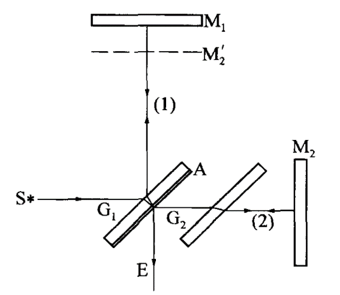
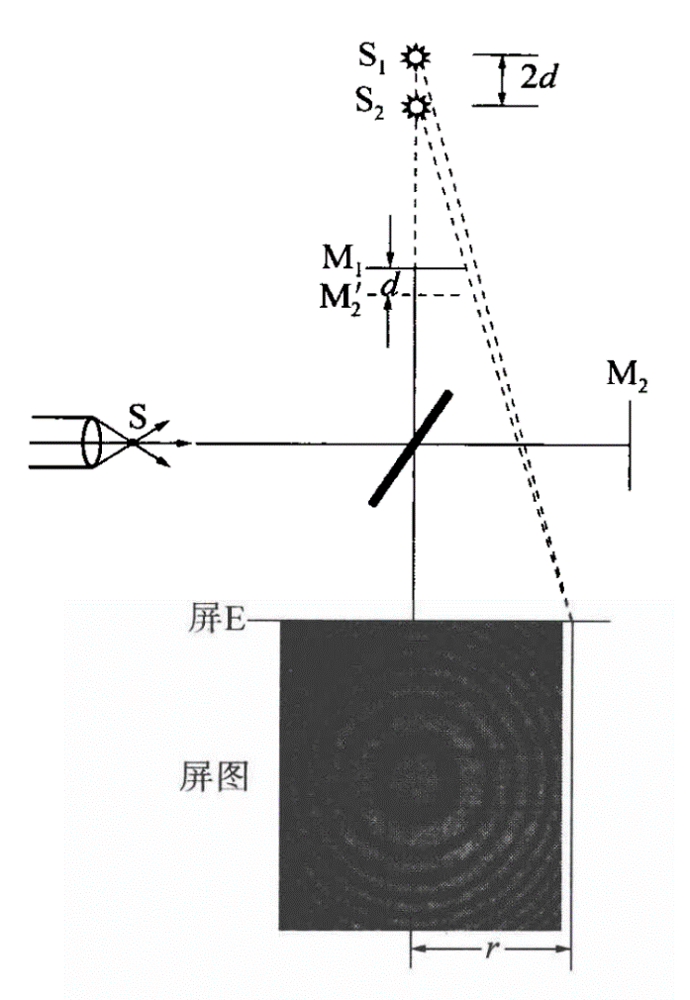
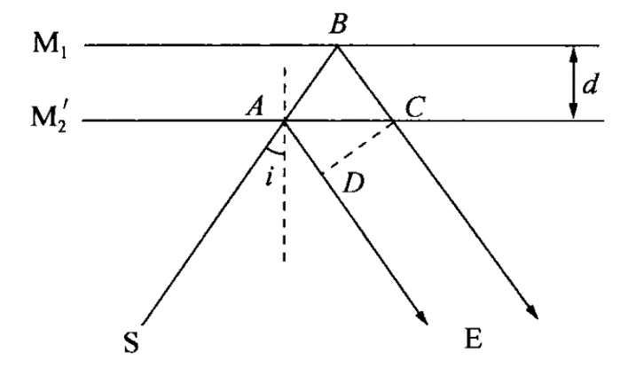
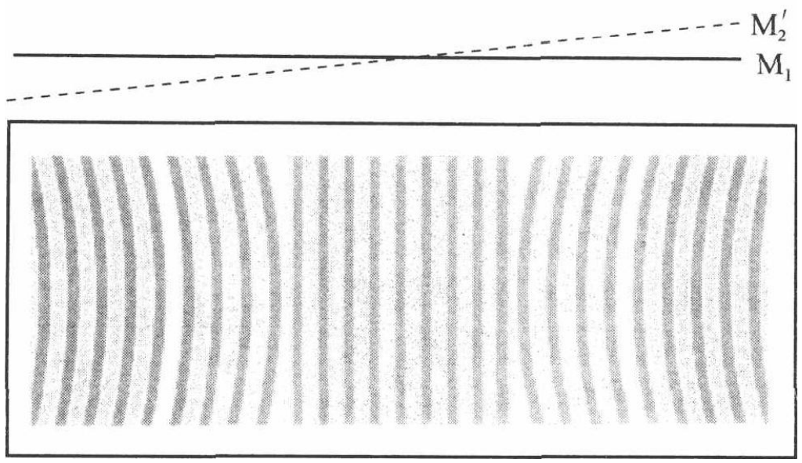
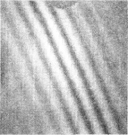

# 1迈克尔逊干涉仪

**2022/9/19** **迈克尔逊干涉仪的调整与使用**

（  21级计算机科学与技术全英创新班 陆俊安  10号）
- **实验目的**

1.了解迈克尔逊干涉仪的构造原理和调整方法。

2.观察点光源的非定域干涉条纹的特征和扩展光源的等倾干涉和等厚干涉图样。

3.测量He - Ne激光波长和玻片折射率。
- **实验仪器**

迈克尔逊干涉仪、He-Ne激光器、低压汞灯、波片、手电筒（白光光源）等。
- **实验原理**

**光路原理：**
- 从光源S发出的光束首先经分光板G1后表面半透明金属膜A的反射和透射被分成光强近似相等的双光束反射光1和透射光2。
- 用反射镜M1和M2将双光束再反射回来，再次经G后表面的透射和反射,两者沿E方向传播部分光在此方向汇集,从而产生干涉。
- 平面镜G1与G2严格平行,其材料性质、几何形状和厚度等都与G完全相同，它存在的目的就是要使穿过G2的光束2和光束1穿过G1的光程完全相同，从而保证从仪器上读数即可直接测量光束1和光束2在空气中的光程差。因此G2称为补偿板。
- 利用迈克尔逊干涉仪进行的所有测量都在于对E方向所产生的光干涉进行调整和观察。光路结构中M2’是人眼从E方向观察时因为视觉效应产生的M2虚像。由M1和M2反射光所产生的干涉,都可以看成就是M1和M2'间空气层上下表面反射光所引起的干涉。而且由于M2’并非实物,因而通过任意移动M1或M2位置可使M2’在M1之前或之后,或完全重叠和平行，还可通过M1或M2背面的三个倾角调节螺钉使它们从任意方向倾斜相交,相当于薄膜、等倾和等厚等各种情况的实效测量,体现了迈克尔逊干涉仪的巧妙之处。

**迈克尔逊干涉仪的干涉类型：**

对仪器光路中E方向所产生的干涉条纹进行调整和观察,是迈克尔逊干涉仪进行测量的全部意义所在。出现什么样的干涉条纹,不外乎取决于M1和M2是否平行,使用什么样的光源以及它们之间距离的大小。

1.非定域干涉

用凸透镜将激光器发出的平行光会聚后将是一个很强的单色点光源S。如果将M和M2调到刚好互相垂直,且分束镜G1分别与光源方向、M1和M2成45°夹角,则M1和M2’处于标准的平行状态,经分束和M1、M2反射后的光束因为光反射效应,等效于从M1和M2’后面两个虚光源S1和S2发出的球面波相干光束，而且S1和S2之间的距离是M1和M2’间距d的两倍。

两光波在空间相遇处处相干，观察屏放在不同空间位置都可以看到干涉图样，故称为非定域干涉。

如图所示,沿S1和S2相重合方向观察将看到一组同心圆环形干涉条纹。S1和S2连线方向两光程差即为2d,当移动M使d减小,可看到圆环向内收缩,圆环一个个地缩进圆心；反之,可看到干涉圆环向外扩展,圆环一个个从圆心冒出。每变化一个圆环对应S1和S2之间改变一个波长的距离。连续测量N个圆环的变化,从仪器读数装置读出相应改变的距离,由下面公式便可得到光波的波长。

$$
2\mathrm {∆}d=N\lambda
$$

2.等倾干涉

同样在M1和M2’处于标准的平行状态下,将单色点光源S换成扩展的面光源,面光源上每一点光源Si以不同的角度人射空气层上下表面和M2’口而所有倾角相同的光都具有相同的光程差，用眼同样可以看到一组同心圆干涉条纹,只不过这些干涉条纹只在空间某些特定的区域发生,故称为等倾定域干涉。改变M1和M2’的间距,同样可以看到圆环的“冒出”或“缩进”。由M1和M2’反射的光束1、2的光程差为

$$
\delta =\left ( {\hat {AB}+\hat {BC}}\right )-\hat {AC}=2dcosi
$$

3.等厚干涉

在劈尖相交处$d=0$,出现的是与M1和M2’交线一样并且重合的直线干涉条纹,然而只是在交线附近才可以看到直线等厚干涉条纹。对于离开交线处某一干涉条纹，因为等厚光程差δ保持不变，随着离开交线处的d不断增大，入射角i也增大，$cosi$变小，则必须再增加d的厚度，干涉条纹将朝厚度d增加的方向弯曲,而凸向交线方向,如下图所示。

4.白光干涉现象

将上面等厚干涉的单色扩展光源换成白光扩展光源,则只有在M1和M2’交线附近接近于零的范围内可看到以交线暗条纹对称分布的彩色条纹。通过改变M1和M2’的间距，当看到类似右图对称分布的彩色条纹时,说明已找到M1和M2’的交线位置x0。此时将折射率为nx、厚度为D的薄膜插入M1前光束1的光路中，由于nx>n0(n0为空气折射率) ,因此等效于光束1的光程加大,结果是M1和M2’相交的线位置被改变,彩色条纹被移出视场。逐步减小M1和M2’的间距,当再看到对称分布的彩色条纹出现,重新找到M1和M2’交线位置x,便有

$$
2\left ( {x-{x}_{0}}\right ){n}_{0}=2({n}_{x}-{n}_{0})D
$$

$$
{n}_{x}=\frac {\left ( {x-{x}_{0}}\right ){n}_{0}} {D}+{n}_{0}
$$

若已知薄膜厚度D,便可得其折射率nx,反之亦然。

**四、实验步骤**

（一）熟悉迈克尔逊干涉仪的结构

（二）调节迈克尔逊干涉仪

1)使${M}_{1}$和${M}_{2}$的法线相互垂直

2)调零光程差：

调节粗调手轮，使${M}_{1}$到分光板${G}_{1}$的距离与定镜${M}_{2}$到补偿板${G}_{1}$的距离基本相等，此时从${M}_{1}$和${M}_{2}$反射回来的光束的光程大约相等；

3)调节使得黑十字重合：

用钠光灯直接照亮${G}_{1}$，从$E$处观察，可看到两个较亮的灯头像，调节${M}_{1}$和${M}_{2}$的六个镜面调节螺钉，使两个可移动的“十”字重合，此时应可看到明暗相间的环状条纹

（三）测量钠光波长

①将同心圆环调到视场中央后,应先消除读数装置中由于机械啮合等因素带来的空回影响，即朝某一方向转动微调手轮直至干涉条纹开始连续变化，然后才能开始记录测量数据。测量过程不允许有来回折返。

②每次测量50个圆心“冒出”或“缩进”变化，记录一次数据，连续测量10组。用逐差法处理数据，计算光波波长、测量不确定度和相对不确定度。

**五、数据处理**

测量结果如下：

<table>
<tr><td>N</td><td>0</td><td>50</td><td>100</td><td>150</td><td>200</td><td>250</td></tr>
<tr><td>x/mm</td><td>0.32560</td><td>0.34440</td><td>0.35940</td><td>0.37243</td><td>0.38900</td><td>0.40451</td></tr>
<tr><td>N</td><td>300</td><td>350</td><td>400</td><td>450</td><td>500</td><td>550</td></tr>
<tr><td>x/mm</td><td>0.41955</td><td>0.43492</td><td>0.45000</td><td>0.46563</td><td>0.48090</td><td>0.49610</td></tr>
<tr><td>\left \| {\Delta x}\right \|/mm</td><td>0.09395</td><td>0.09052</td><td>0.09060</td><td>0.09320</td><td>0.09190</td><td>0.09159</td></tr>
</table>

其中$\left | {\Delta x}\right |=\left | {{x}_{i+5}-{x}_{i}}\right |$，取$\left | {\hat {\Delta x}}\right |$根据公式$\lambda =\frac {2\Delta x} {N}$以及测量误差的传递原理，计算得钠光波长$\lambda =613.1\pm 3.8\left ( {nm}\right )$。已知钠光的实际波长为$\lambda =589.3nm$，则计算出相对误差为$2.47\%$

**六、结论及分析**

经计算，本次实验测得钠光波长$\lambda =613.1\pm 3.8\left ( {nm}\right )$，与理论值有所偏差。经过对实验过程的反思，认为可能原因是前几次操作不熟练，产生了计数上的误差且可能产生了读数上的粗大误差等。
