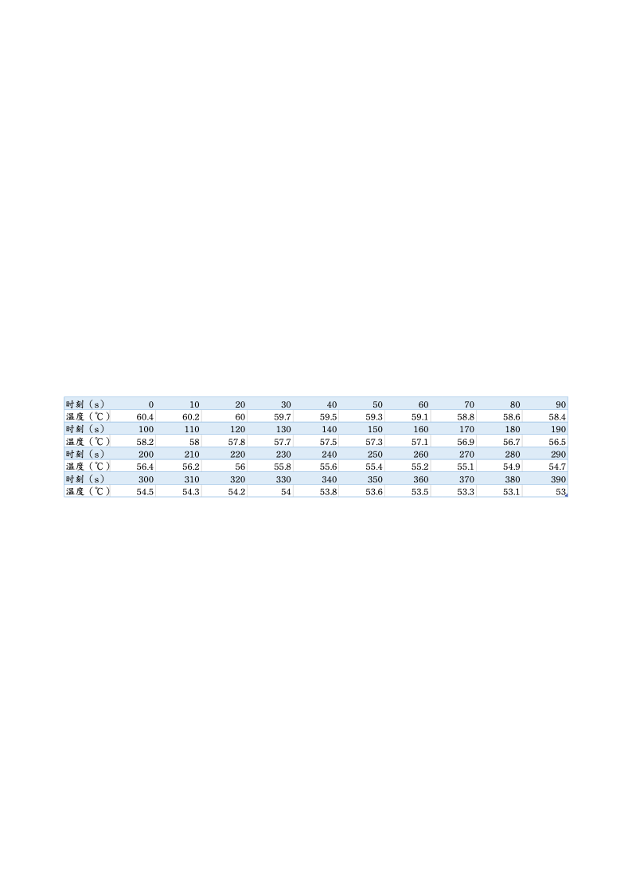
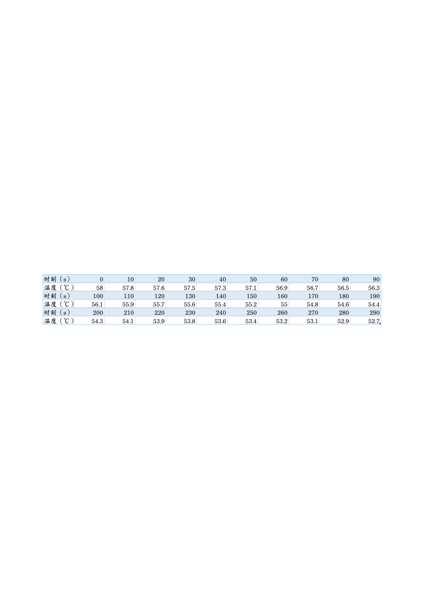
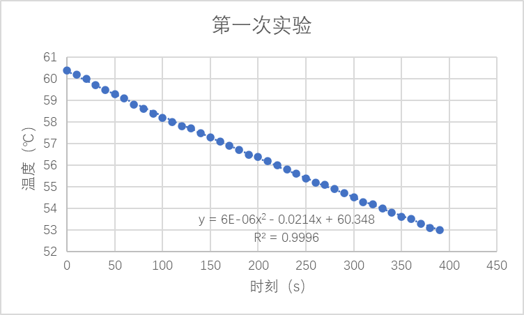
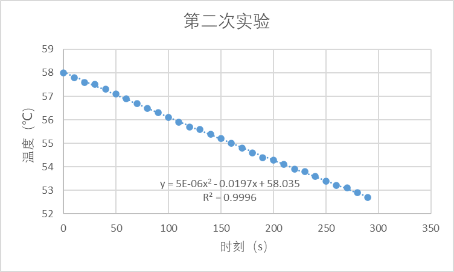
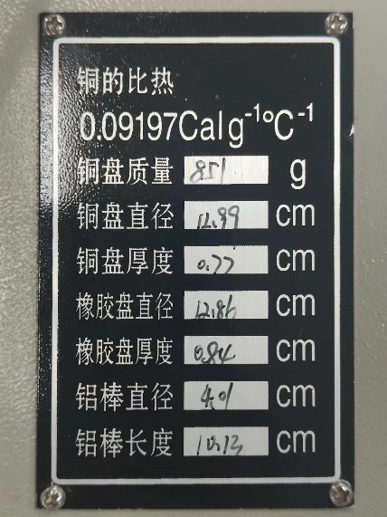

# 2固体导热系数的测量

**2022/10/17** **固体导热系数的测量**

（ 21级计算机科学与技术全英创新班 陆俊安 10号）

**一、实验目的**

1.学习用稳态法测量不良导体和金属导体的导热系数。

2.学习用物体散热速率求热传导速率的方法。

**二、实验仪器**

导热系数测定仪、游标卡尺、待测样品（铝棒）等。

**三、实验原理**

测量导热系数的方法一般分为稳态法和动态法两类。在稳态法中，先利用热源对样品加热，样品内部的温差使热量从高温向低温处传导，样品内部各点的温度将随加热快慢和传热快慢的影响而变动。适当控制实验条件和实验参数可使加热和传热过程达到平衡状态，则待测样品内部可以形成稳定的温度分布，根据这一温度分布就可以计算出材料的导热系数。平板稳态法测量导热系数$\lambda$的理论公式为

$$
\lambda =mc\frac {\mathrm {\Delta }T} {\mathrm {\Delta }t}\mathrm {\cdot }\frac {2{H}_{B}} {{T}_{1}-{T}_{2}}\mathrm {\cdot }\frac {{D}_{P}+{H}_{P}} {{D}_{P}+2{H}_{P}}\mathrm {\cdot }\frac {1} {{\pi D}_{B}^{2}}
$$

其中$m$，$c$，${D}_{P}$，${H}_{P}$为已知量，分别为散热盘$P$的质量、比热容、直径和厚度；${D}_{B}$，${H}_{B}$为待测圆盘材料的直径和厚度，可用游标卡尺测量；${T}_{1}$，${T}_{2}$为达到稳定状态时，发热盘$C$和散热盘$P$的温度，可用温度传感器直接读出；$\mathrm {\Delta }T/\mathrm {\Delta }t$为停止加热后，系统的散热速率，也就是本实验测量过程的关键参量。

**推导**

热传导是在物体内部（包括固体、液体、气体）或在相互接触的物体之间热量传递的一种形式。设通过物体横截面积$S$传递的热流量（在单位时间内通过物体横截面积$S$传导的热量）为$\frac {dQ} {dt}$，热传导的基本规律遵从傅立叶导热方程

$$
\frac {dQ} {dt}=-\lambda S\frac {dT} {dx}
$$

其中热流量$\frac {dQ} {dt}$的单位为$W$，负号表示热流量沿温度降低的方向传递；$\frac {dT} {dx}$为温度梯度（温度沿热流方向的空间变化率），单位$K/m$；$\lambda$为导热系数，单位为$W/m\cdot K$，是表征材料热传导性能的物理量，其物理意义是在温度梯度为$1K/m$时通过物体单位横截面积所传递的热流量。

根据傅立叶导热方程，当物体热传导达到平衡状态，在物体内部取两个与热传导方向垂直，彼此相距$H$, 温度分别为${T}_{1}$，${T}_{2}$的平行平面（设${T}_{1}>{T}_{2}$），若平面的面积为$S$，材料导热系数为$\lambda$，则热传导所传递的热流量

$$
\frac {dQ} {dt}=\lambda S\frac {{T}_{1}-{T}_{2}} {H}
$$

在支架上先放上圆铜盘$P$，在$P$的上面放上待测样品$B$（圆盘形的不良导体），再把带发热器的圆铜盘$C$放在$B$上。发热器通电后，热量从$C$盘传到$B$盘，再传到$P$盘。由于$C$、$P$盘都是良导体，其温度即可以分别代表$B$盘上下表面温度${T}_{1}$、${T}_{2}$。${T}_{1}$和${T}_{2}$分别由插入$C$、$P$盘边缘的温度传感器测量。如果测量出圆盘$B$的直径为${D}_{B}$，厚度为${H}_{B}$，则上式可以转化为

$$
\frac {dQ} {dt}=\frac {{\pi \lambda {D}_{B}^{2}(T}_{1}-{T}_{2})} {4{H}_{B}}
$$

则测量导热系数的关键是测量热传导的热流量（亦即热传导速率） $\frac {dQ} {dt}$

当热传导达到稳定状态时，${T}_{1}$和${T}_{2}$的值不变，于是通过$B$盘上表面的热流量与由圆铜盘$P$向周围环境散热的热流量相等，因此可通过铜盘$P$在稳定温度${T}_{2}$时的散热速率来求出热流量（热传导速率）$\frac {dQ} {dt}$。实验方法是在读得稳定时的${T}_{1}$和${T}_{2}$后，将$B$盘（待测物体）移去，而使盘$C$的底面与铜盘$P$直接接触。当盘$P$的温度上升到高于稳定时的${T}_{2}$值若干摄氏度后，再将圆盘$C$移开让铜盘$P$自然冷却。观察其温度$T$随时间的变化情况，然后由此求出铜盘$P$在温度为${T}_{1}$时的冷却速率$\frac {\mathrm {\Delta }T} {\mathrm {\Delta }t}\left | {\frac {} {T={T}_{2}}}\right$，则圆盘$P$在${T}_{2}$温度时的散热速率为

$$
\frac {\mathrm {\Delta }Q} {\mathrm {\Delta }t}=mc\frac {\mathrm {\Delta }T} {\mathrm {\Delta }t}\left | {\frac {} {T={T}_{2}}}\right
$$

式中，$m$为圆盘$P$的质量，$c$为圆盘$P$材料的比热容。这样求出来的$\frac {\mathrm {\Delta }T} {\mathrm {\Delta }t}$是圆盘全部表面暴露在空气中时的冷却速率，其散热表面积为$2\times \frac {\pi {D}_{P}^{2}} {4}+\pi {D}_{P}{H}_{P}$（其中${D}_{P}$、${H}_{P}$分别为圆盘$P$的直径和厚度）。然而，在观察测试样品的稳态传热时，$P$盘的上表面是被样品覆盖着的。考虑到物体的冷却速率与它的表面积成正比，则稳态时圆盘$P$的散热速率表达式为

$$
\frac {dQ} {dt}=mc\frac {\mathrm {\Delta }T} {\mathrm {\Delta }t}\cdot \frac {{D}_{P}+{H}_{P}} {{D}_{P}+2{H}_{P}}
$$

在稳定的热传导平衡状态下，$B$盘的热传导速率等于P盘的散热速率，于是有

$$
\frac {{\pi \lambda {D}_{B}^{2}(T}_{1}-{T}_{2})} {4{H}_{B}}= mc\frac {\mathrm {\Delta }T} {\mathrm {\Delta }t}\cdot \frac {{D}_{P}+{H}_{P}} {{D}_{P}+2{H}_{P}}
$$

整理后得

$$
\lambda =mc\frac {\mathrm {\Delta }T} {\mathrm {\Delta }t}\mathrm {\cdot }\frac {2{H}_{B}} {{T}_{1}-{T}_{2}}\mathrm {\cdot }\frac {{D}_{P}+{H}_{P}} {{D}_{P}+2{H}_{P}}\mathrm {\cdot }\frac {1} {{\pi D}_{B}^{2}}
$$

若实验采用温差热电偶测温，仪器直接读出的是对应于测量温度下的电势，可以通过查表转换成对应温度，或者直接用读出的$V$代替$T$。

**四、实验步骤**

1.记录实验用的待测样品的尺寸等相关数据。

2.按照实验要求安装好实验仪器：连接加热盘和散热盘的传感器，将待测物体夹在两盘中间，对仪器进行细调使得两盘与物体间能紧密贴合。

3.将加热温度设置为80℃，通电加热直到加热盘与散热盘的传感器上显示的温度稳定（衡量标准采取散热盘每分钟温度变化小于0.2℃每分钟），记录稳态下加热盘和散热盘的温度。

4.撤下样品，将加热盘与散热盘直接贴合，将散热盘直接加热到与稳态温度相差3~5℃，然后移开加热盘，每十秒记录一次散热盘温度传感器显示的温度，记录数据并绘制曲线，作出在稳态温度点的切线并根据斜率计算冷却速率。

**五、数据处理**

第一次实验

第二次实验

考虑到总体的数据是曲线变化的，本人在兼顾计算简便性和准确性的情况下采用了二阶多项式拟合。两次实验是基于散热盘稳定时为55.3℃来进行的，则由数据分别计算得  $\frac {\mathrm {\Delta }T} {\mathrm {\Delta }t}=\mathrm {-0.02074}\mathrm {℃}\mathrm {/}\mathrm {s}$  和  $\frac {\mathrm {\Delta }T} {\mathrm {\Delta }t}=\mathrm {-0.01915}\mathrm {℃}\mathrm {/}\mathrm {s}$，取平均值后为$\frac {\mathrm {\Delta }T} {\mathrm {\Delta }t}=\mathrm {-0.019945}\mathrm {℃}\mathrm {/}\mathrm {s}$

实验时测得稳定状态时发热盘温度为76.6℃，散热盘温度为55.3℃，实验室给出铜的比热容为0.09197Calg-1℃-1铜盘质量为851g，铜盘直径为12.99cm，铜盘厚度为0.77cm，待测物体（铝棒）直径为4.01cm，长度为10.13cm。

**六、结论及分析**

根据公式测得导热系数:

$$
\lambda =mc\frac {\mathrm {\Delta }T} {\mathrm {\Delta }t}\mathrm {\cdot }\frac {2{H}_{B}} {{T}_{1}-{T}_{2}}\mathrm {\cdot }\frac {{D}_{P}+{H}_{P}} {{D}_{P}+2{H}_{P}}\mathrm {\cdot }\frac {1} {{\pi D}_{B}^{2}}=2.78 Cal/(smK)=11.63 W/(mK)
$$
