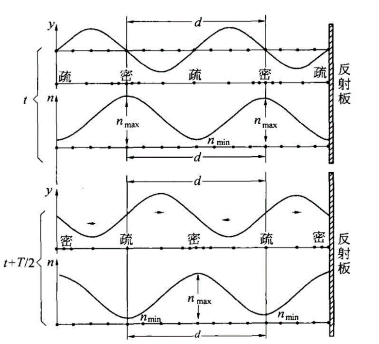
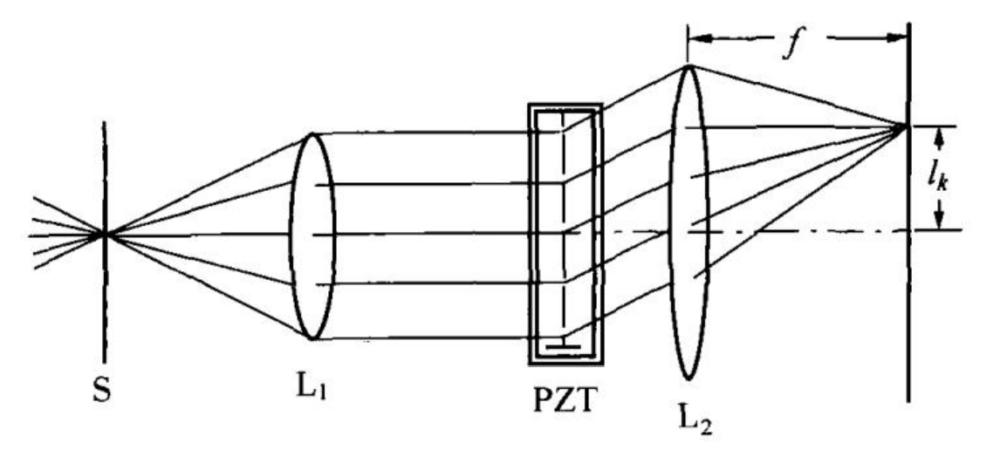
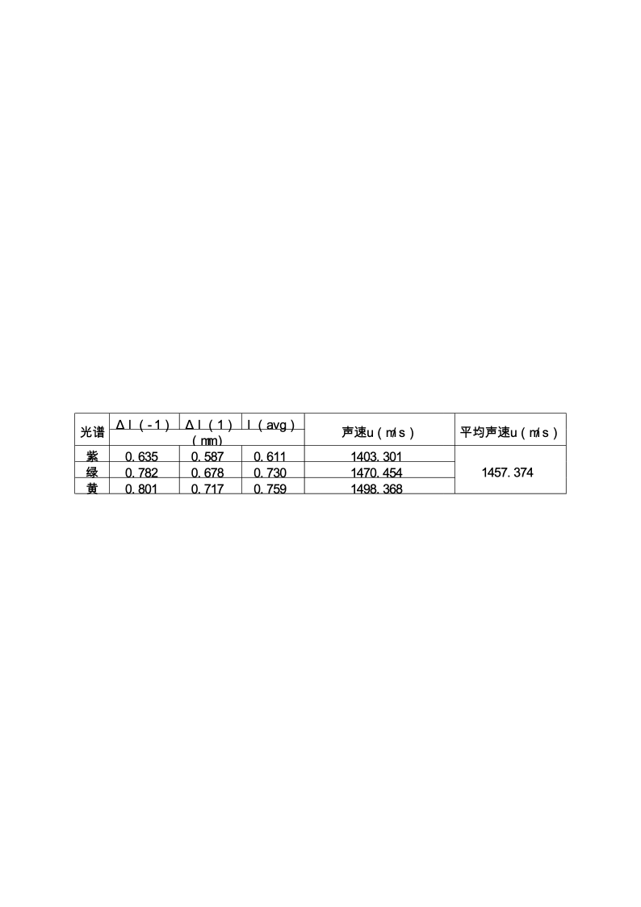

# 3超声光栅及其应用

**4.2** **超声光栅及其应用**

2021级 计算机全英创新班 陆俊安 2022/10/31

**一、实验目的**

了解超声光栅产生的原理和方法；

观察超声光栅的衍射现象；

掌握用超声光栅测量超声波速度的方法。

**二、实验仪器**

超声光栅仪、分光计、测微目镜、低压汞灯、光栅片、超声池。

**三、实验原理**

超声波作为一种纵波在盛有液体的玻璃槽中传播时，液体被周期性地压缩与膨胀，其密度发生周期性的变化，形成疏密波。如果它被一个反射板或液槽的一个玻璃面反射，会反向传播。在一定条件下，前进波与反射波叠加而形成超声频率的纵向振动驻波。由于驻波的振幅可达到单一行波的两倍，加剧了波源和反射板之间液体的疏密变化。在某时刻，纵驻波任意波节两边的质点都涌向这个节点，使节点附近成为质点密集区，而相邻的波节处成为质点稀疏区。半个周期后，这个节点附近的质点又向两边散开变为稀疏区，相邻的波节处变为密集区。在这些驻波中，稀疏作用使液体折射率减小，而压缩作用使液体近射率增大。在距离等于波长$d$的两点，液体的密度相同，折射率也相同。

单色平行光沿着垂直于超声波传播方向通过上述液体时，因折射率周期性变化使光波的波阵面产生相应的相位差，经透镜聚焦，出现干涉条纹。这种现象与平行光通过平面光棚的情况相似。因为超声波的波长很短，只要槽宽能维持平面波，槽中液体就相当于一个衍射光栅。

在调好的分光计上，由单色光源、平行光管中的可调狭缝$S$和汇聚透镜$L$组成平行光系统。让平行光管射出的平行光束垂直通过装有锆钛酸铅陶瓷片（或称$PZT$晶片）的液槽。在玻璃槽的另一侧用自准直望远镜中的物镜${L}_{\mathrm {2}}$和测微目镜组成测重望远镜系统。若振荡器输出的电信号使$PZT$晶片发生超声共振，且在液槽中形成稳定的超声驻波，则从测微目镜中即可观察到衍射光谱。行射光谱中亮条纹位置满足光栅方程

$$
dsin{\varphi }_{k}=\pm k\lambda \left ( {k=0,1,2,\ldots }\right )
$$

当${\varphi }_{k}$很小时，有

$$
sin{\varphi }_{k}=\frac {{l}_{k}} {f}
$$

式中，${l}_{k}$为衍射光谱零级至$k$级的距离，$f$为望远镜物镜的焦距。根据光栅方程可求得超声波的波长（即超声光栅的光栅常数）为

$$
d=\frac {k\lambda } {sin{\varphi }_{k}}=\frac {k\lambda f} {{l}_{k}}
$$

从而可以求得超声波在液体中的传播速度$u=dv=\frac {k\lambda fv} {{l}_{k}}$。

**四、实验步骤**

1. 调整分光计

调节平行光管产生平行光，望远镜调焦至无穷远，平行光管光轴、望远镜光轴垂直于仪器转轴，并且平行光管光轴与望远镜光轴在同一水平线上。

2.  利用超声光栅测量超声波在液体中的传播速度

①将液体注入液体槽内，液体侧面高于刻度线，将超声光栅盒放在分光计的载物台上，转动载物台使槽两面垂直于望远镜和平行光光管的光轴。

②把压电陶瓷片放入装有液体的液体槽内，接好线，开启光栅仪电源，调节其“频率调节”旋钮使望远镜中看到的衍射光谱级次最多而且明亮，转动游标盘使衍射光谱左右对称，级次谱线亮度一致。

③左右微微转动游标盘使射向液体槽的平行光完全垂直于超声波传播方向，同时从望远镜目镜中观察衍射光谱左右级次的亮度以及对称性。

④调节测微目镜调焦手轮直至看清分化板十字准线，将望远镜目镜换成测微目镜，前后移动测微目镜使衍射条纹最清晰，旋转测微目镜，使目镜视场中分划板标尺与衍射条纹平行，固定测微目镜。

⑤测量：沿一个方向逐级测量各种颜色光谱线位置的读数，避免空程误差，并记录数据。

**五、数据处理**

各种颜色光谱线位置的读数数据如下表所示：

<table>
<tr><td>级次$k$ 光谱</td><td>-1</td><td>0</td><td>1</td></tr>
<tr><td>紫光</td><td>3.908 mm</td><td>4.543 mm</td><td>5.130 mm</td></tr>
<tr><td>绿光</td><td>3.761 mm</td><td></td><td>5.221 mm</td></tr>
<tr><td>黄光</td><td>3.742 mm</td><td></td><td>5.260 mm</td></tr>
</table>

望远镜焦距$f=700mm$，信号源频率为$v=11.56MHz$，光波波长取实验4.1的结果，紫光取$436.30mm$，绿光取$546.22mm$，黄光取$578.7mm$。计算得结果如下。

**六、结论及分析**

本次实验，测得超声波平均测量值为$1457.374m/s$，相比于理论值$1500m/s$相对误差较大，有$2.84\mathrm {％}$。观察数据可以发现黄光测得的水中声速与理论值较为接近，而紫光和绿光的测量值较低。一般该实验产生误差的原因可能有实验装置有震动或是试验时间过长导致液体温度升高，但似乎都不太符合此次实验出现的误差情况。由于写分析时间隔实验的时间有些久，记不清当时自己时怎么操作的了，猜测可能是实验中存在操作不当或是读数时出现操作不当的问题。
