# 4交流电桥

**4.8** **交流电桥综合设计性实验**

2021级 计算机全英创新班  陆俊安  2022/11/28

**一、实验目的**

1.  掌握交流电桥的特点和平衡的调节方法；

2.  学习用交流电桥测电容和电感及其损耗的方法。

**二、实验仪器**

信号发生器（充当交流电源，为电路提供一定频率和大小的交流电压）、电源开关、电阻箱、待测电感、待测电容、电容箱、扬声器（用来判断交流电桥是否平衡的电学仪器，当有电流通过扬声器的时候扬声器会振动发声）

**三、实验原理**

在实际的电信号中，大量存在着不同频率的交流信号(或脉冲信号)因此,实际的元器件均表现为电抗特性,而非纯电阻.惠斯登电桥的四个臂如改为电抗元件(电阻、电感、电容或它们的组合)，就是交流电桥。它有着比惠斯登电桥更广泛的用途，可用于测量元件的交流电阻、电感、电容、磁性材料磁导率、电容的介质损耗等。还可利用交流电桥的平衡条件与频率的相关性来衡量测量频率，它是测量仪器中常用的基本电路之一（如电感测试仪、Q 表等）。    **交流电桥的平衡条件**

交流电桥的基本结构

交流电桥的电路和直流单电桥电路具有同样的结构形式，但交流电桥的四个桥臂可以不仅是电阻，还可以是电阻、电感、电容等元件或它们的组合。 交流电桥采用交流电供电。交流平衡指示仪的种类很多，本实验中采用扬声器，当扬声器不振动发声时，电桥达到平衡。

调节电桥各臂阻抗使电桥平衡(即${\overrightarrow {I}}_{0}=0$，则$cd$两点的电位相等，这时有

$$
\frac {{\overrightarrow {Z}}_{1}} {\overrightarrow {{Z}_{2}}}=\frac {{\overrightarrow {Z}}_{4}} {{\overrightarrow {Z}}_{3}}
$$

上式就是交流电桥的平衡条件。将各阻抗用复数形式表示有

$$
\frac {{Z}_{1}{ⅇ}^{i{\varphi }_{1}}} {{Z}_{2}{ⅇ}^{i{\varphi }_{2}}}=\frac {{Z}_{4}{ⅇ}^{i{\varphi }_{4}}} {{Z}_{3}{ⅇ}^{1{\varphi }_{3}}}
$$

即要使电桥平衡，必须使下列方程组成立

$$
\left \{ {\begin {gathered} {Z}_{1}\cdot {Z}_{3}={Z}_{2}\cdot {Z}_{4} \\ {\varphi }_{1}+{\varphi }_{3}={\varphi }_{2}+{\varphi }_{4} \end {gathered}}\right
$$

方程组是平衡条件的另一种表现形式。可见，交流电桥的平衡必须同时满足两个条件:一是相对桥臂上阻抗幅模的乘积相等;二是相对桥臂上阻抗幅角之和相等。方程组说明，交流电桥必须按照一定的方式配置桥臂阻抗，否则有可能无法使电桥平衡。

**电感的测量**

利用已知电容器来测电感，可用下所示的麦克斯韦—维恩电桥或海氏电桥；图中 R1、R2、R3、R4 为交流电阻箱，Cs 为标准电容箱，Rx 为电感的损耗电阻，Lx 为待测电感。

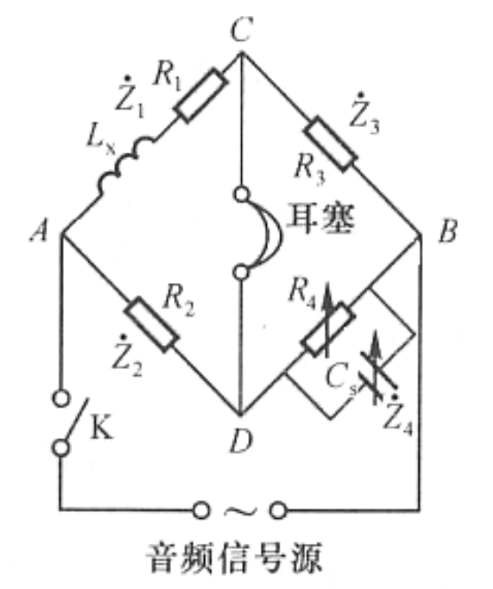

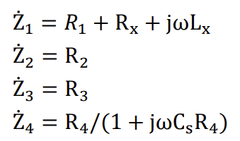

由此可得：

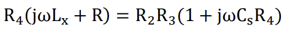

由实部和虚部分别相等，则有：

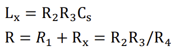

由上求出 R 后即可求出电感的损耗电阻 Rx：

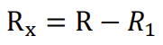

对一定的电感量，损耗电阻越小，则该电感器在电路中储存的能量比起它所损耗的能量就越大。故 Rx 的大小直接影响着电感器质量。电感器的品质因素 Q可用来表示这种特性：

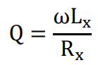

式中 ωLx 为电感器的感抗。

**电容器的电容量的测量**

最简单的测电容器电容的电桥电路如图。图中 R1、R2、R3、R4 为交流电阻箱，Cs 为标准电容箱，Rx 为待测电容的损耗电阻，Cx  为待测电容。

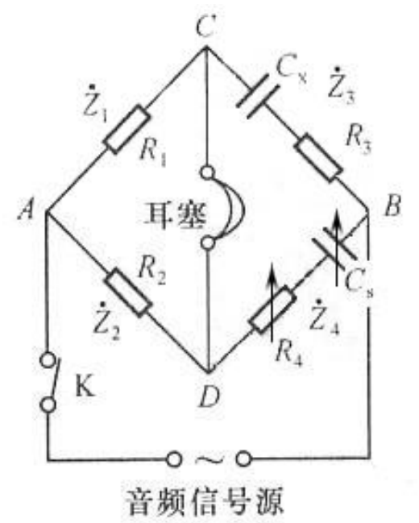

由此可得：

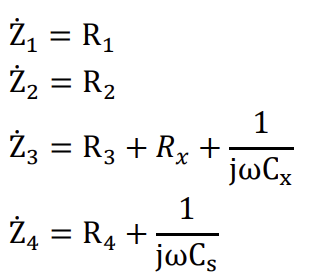

并有：

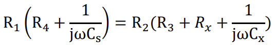

电桥平衡时可求出电容大小及电容的损耗电阻大小：

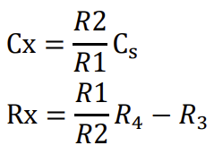

在选定 R1/R2 的值后，可分别调节 Cs 和 R4，使之平衡。

**四、实验步骤**

(1) 利用交流电桥测电感

根据实验电路图，正确连线；选择合适的三组 R2 及 R3，调节 R4 电阻箱阻值及电容箱电容 Cs 大小至电桥平衡，即扬声器不在工作状态，记录有关数据，根据公式求出各组的电感值 Lx’、电感的损耗电阻 Rx’,并求出电感 Lx'的平均值 Lx 及损耗电阻 Rx'的平均值 Rx。

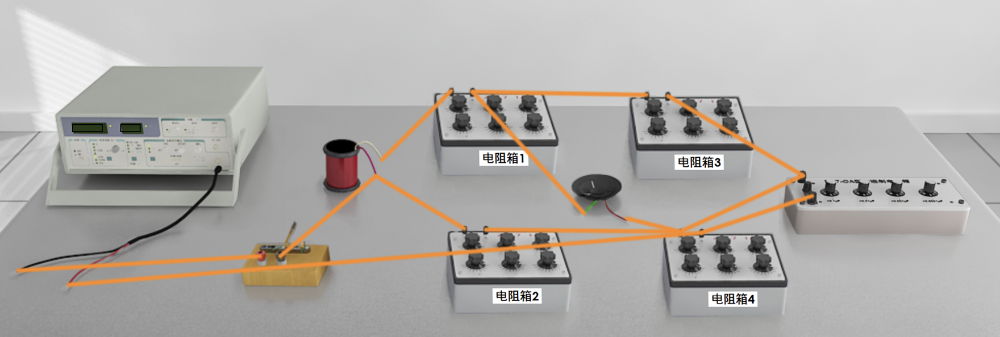

(2) 利用交流电桥测电容

根据实验电路图，正确连线；选择合适比例的三组 R2 及 R1，调节 R4 电阻箱阻值及电容箱电容 Cs 大小至电桥平衡即扬声器不在工作状态，记录有关数据，根据公式求出各组的电容值  Cx' 、电容的损耗电阻 Rx' ,并求出电容  Cx'的平均值Cx  及损耗电阻 Rx'的平均值 Rx。

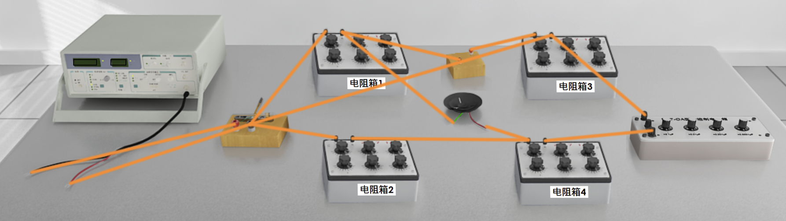

(3) 记录数据

程序提供记录数据表格，在做实验的过程中，可以把测量数据和计算数据填到数据表格中去。

**五、数据处理**

(1) 利用交流电桥测电感

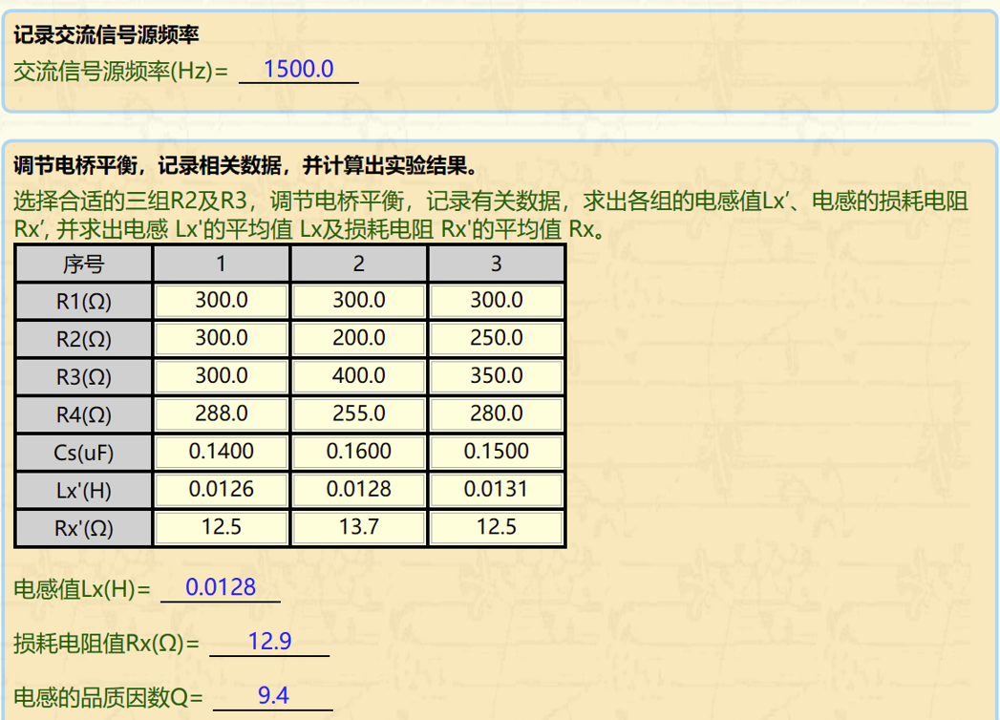

(2) 利用交流电桥测电容

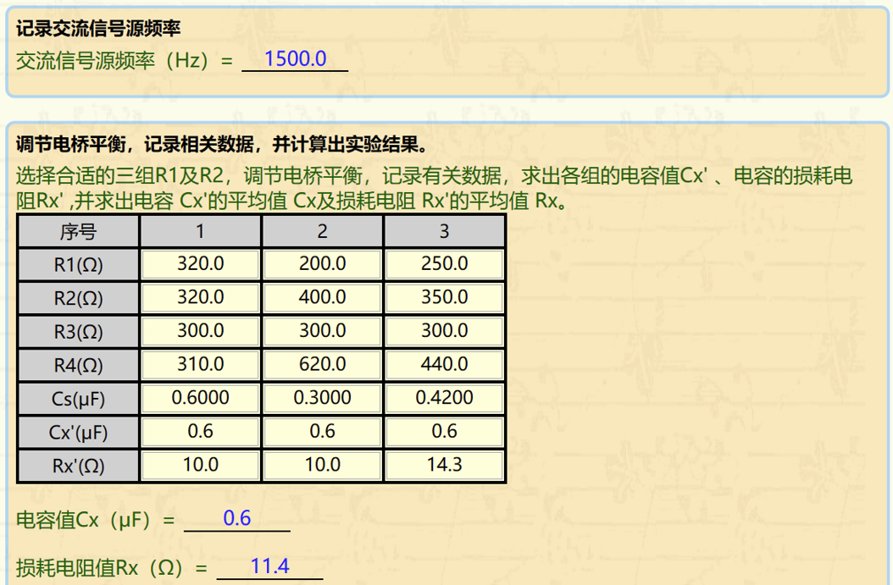

**六、结论及分析**

本次实验测得的数据较为稳定，但仍会有一些小偏差。经过思考认为可能是实验中交流平衡指示仪的精度不够大而产生了误差，因为在实验操作过程中，平衡指示仪可以在一段范围内表现出平衡状态，而这个区间中无论选哪个值作为平衡都似乎是合理的，从而产生了误差。
