# 4交流电桥

<!-- slide: 1 -->

<!-- slide: 2 -->

- 1、掌握交流电桥的特点和平衡的调节方法；
- 2、学习用交流电桥测电容和电感及其损耗的方法。

<!-- slide: 3 -->

- 二 实验原理
- 基本概念：
- 在直流电路中，电路元件对电流的阻碍叫
- 在交流电路中，电路元件（电阻，电感，电容）对电流的阻碍叫
- 电感：          （感抗）
- 电容：           （容抗）
- 电阻：
- 感抗和容抗统称为电抗。

<!-- slide: 4 -->

- 1 交流电桥的原理

- 与直流单电桥线路具有同样的结构形式；四个桥臂可以是电阻、电感、电容几种阻抗元件的组合；采用交流电供电；用高灵敏度的电子放大式指零仪，当其指零时，电桥达到平衡。

> 备注：桥臂源一个用交流，一个用直流2，直流电桥用来测量电阻，直流电压，直流电流交流电桥可测量电阻，电容，电感，交流电压，交流电流
交流电桥在测量时除了要满足阻抗模相等的条件，还要满足一定的阻抗角条件，即体现在测量实践中就是必须调节两个元件方能使电桥平衡，而直流电桥只需调整一个参数即可。2、若想改变一个四臂直流电桥的性质是不可能的，它们只能做数量上的变化。但对于交流四臂电桥来说，它的复数桥臂可以是R,L,C组成的各种各样的串并联线路.即交流电桥四臂的组成具有多样性。3、直流电桥的平衡仅决定于各臂间的数量关系，而对于交流电桥就不同了，很容易想像出这样的交流电桥，不论参数间遨的关系做怎样调节，它无论如何都不会平衡. 即:交流电桥只有当各臂中参数做一定的布置时才有可能平衡，这种布置是根据幅角平衡条件得出的

<!-- slide: 5 -->

- 2 交流电桥的平衡条件
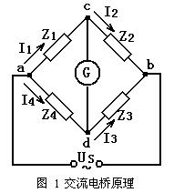
- 调节各臂阻抗使电桥平衡, 这时有        ,
- 这相当于下列两式同时成立
- 将各阻抗用复数形式表示              ,
- 交流电桥的平衡条件：
- ①相对桥臂上阻抗幅模的乘积相等；
- ②相对桥臂上阻抗幅角之和相等。

<!-- slide: 6 -->

- 3 测量损耗小的电容电桥（串联电容电桥）
- 平衡时：
- 被测电容的损耗因数
- 实验时，因为  不能连续可调，所以要先调节     使
- 式（3.1）得到满足，再调节   使（3.2）得到满足。
- 要反复调节各参数，电桥才能最终平衡。
- （3.2）
- （3.1）
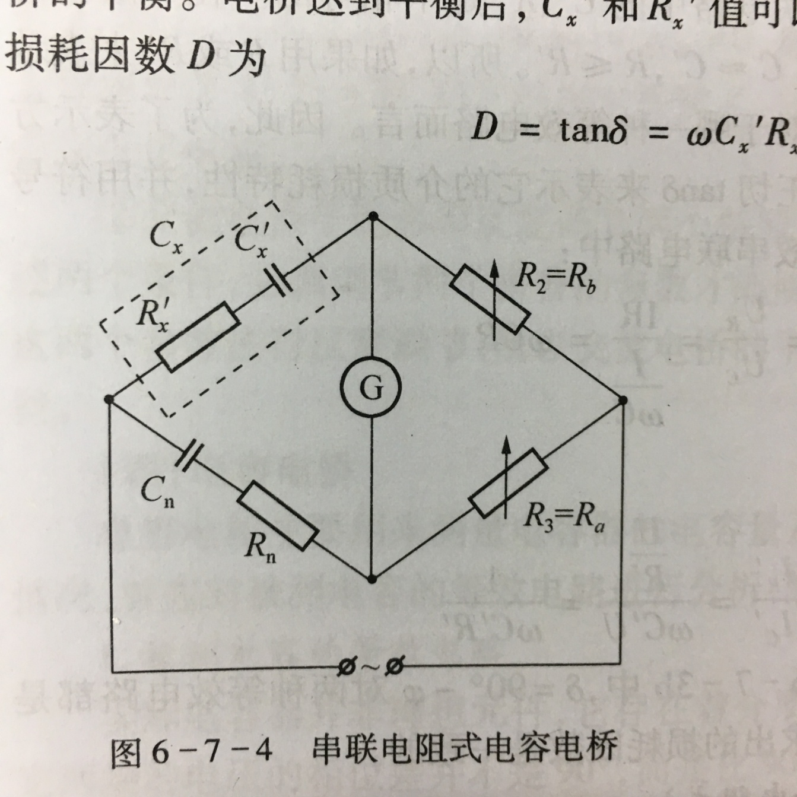

<!-- slide: 7 -->

- 4 测量损耗大的电容电桥（并联电容电桥）
- 平衡时：
- 其损耗因数为
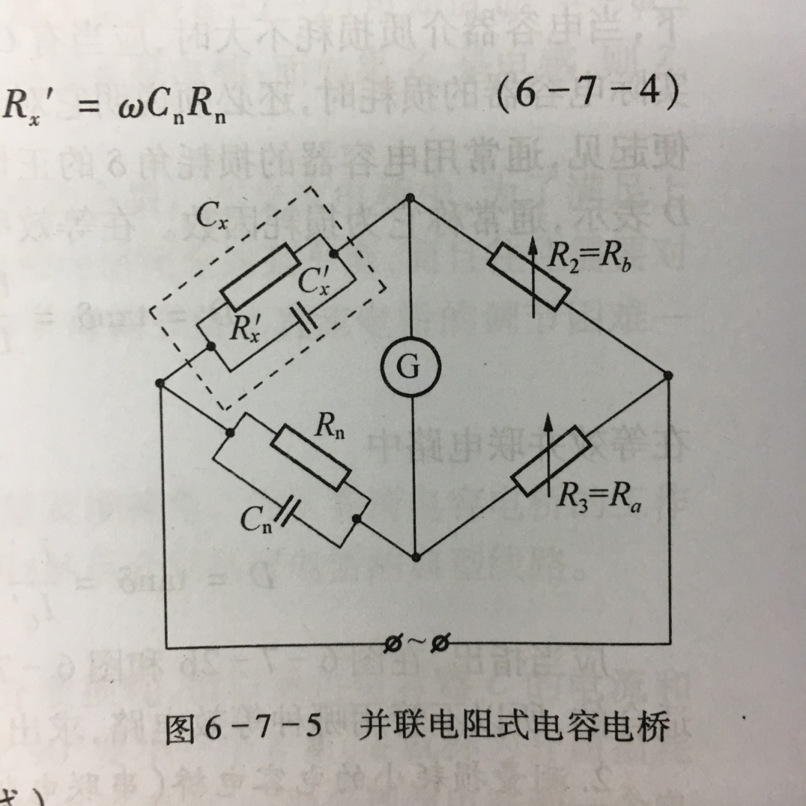

<!-- slide: 8 -->

- 5 测量高Q值电感的电感电桥(海氏电桥)
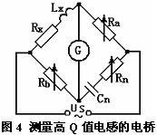
- 实际的电感线圈除了电抗 XL=ωL外，还有有效电阻R，两者之比为电感线圈的品质因数        。
- 平衡时：
- 品质因数

<!-- slide: 9 -->

- 6 测量低Q值电感的电感电桥(麦克斯韦电桥)
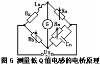
- 平衡时：
- 品质因数

<!-- slide: 10 -->

- 三 实验仪器
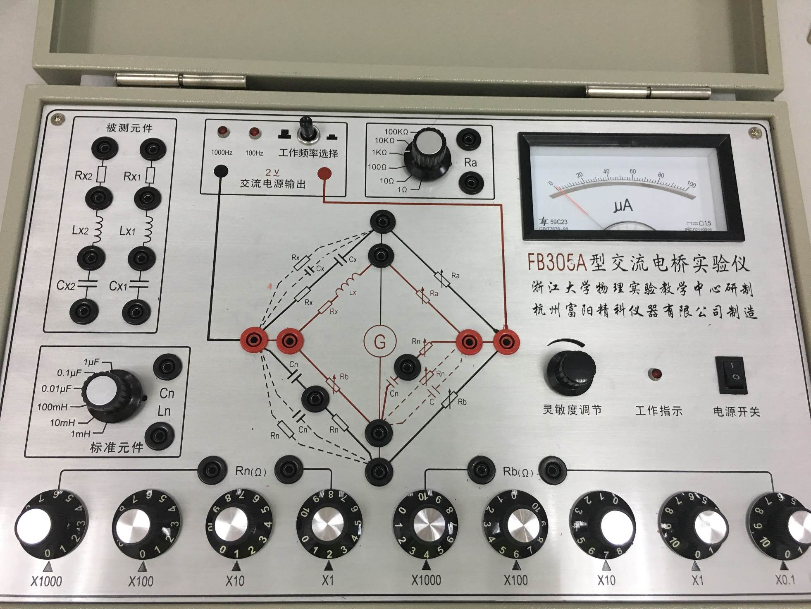

<!-- slide: 11 -->

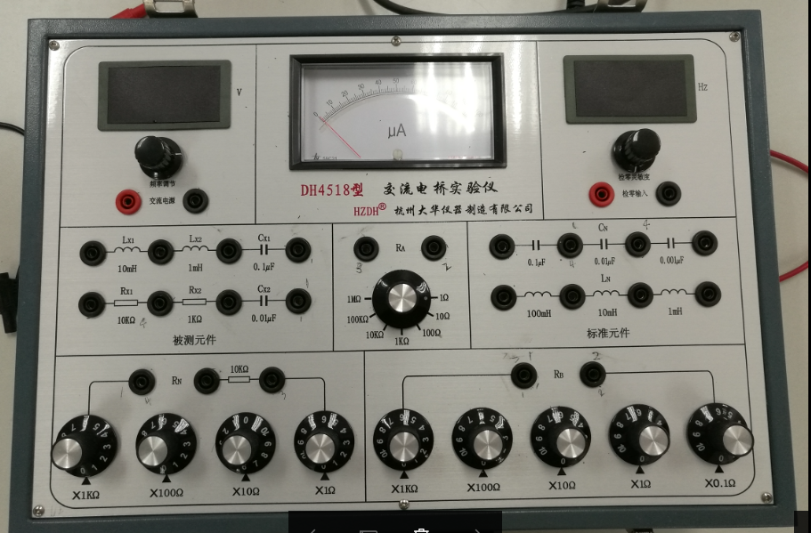

<!-- slide: 12 -->

- 四 实验内容
- 1、使用合适的电容桥路测量两个待测电容的电容量Cx及其损耗电阻Rx，并计算对应的损耗因数D（变换Ra Rb的值，测2组数据）
- 2、使用合适的桥路分别测量两个待测电感的电感量及其损耗电阻，并计算对应的品质因数Q值。（选做）

<!-- slide: 13 -->

- 资料卡片：

| Cx1 | 100 μF | Rx1 | 0.3Ω |
|---|---|---|---|
| Cx2 | 4.7 μF | Rx2 | 400 Ω |

- FB305A仪器
- DH4518仪器

| Cx1 | 0.1 μF | Rx1 | 10 kΩ |
|---|---|---|---|
| Cx2 | 0.01 μF | Rx2 | 80 Ω |

<!-- slide: 14 -->

|  | Ra  Ω | Rb Ω | Rn Ω | Cn μF | Cx μF | Rx Ω | D |
|---|---|---|---|---|---|---|---|
| 1 |  |  |  |  |  |  |  |
| 2 |  |  |  |  |  |  |  |

- 仪器类型：                               号仪器
- 联电容电桥电路测Cx1，参考值
- 联测电容电桥电路Cx2，参考值

|  | Ra  Ω | Rb Ω | Rn Ω | Cn μF | Cx μF | Rx Ω | D |
|---|---|---|---|---|---|---|---|
| 1 |  |  |  |  |  |  |  |
| 2 |  |  |  |  |  |  |  |

<!-- slide: 15 -->

| Cx1 | 100 μF | Rx1 | 0.3 Ω |
|---|---|---|---|

- FB305A仪器
- Cn是标准元件，可供选择0.001、 0.01、0.1、1μF
- FB305A Cn 推荐设置为1μF
- DH4518 Cn 推荐设置为0.1 、 0.01μF

<!-- slide: 16 -->

- 开机前一定将灵敏度调到最小（往左旋到底）
- 预设Rn ，设定一定大小的灵敏度，使指零仪有一定的偏转
- 设定Cn和Ra ，调整Rb ，使指零仪偏转最小，再适当加大指零仪的灵敏度，接着调节Rn使指零仪偏转再次出现最小……，如此反复调节，直到指零仪指零或偏转值最小为止
- 注意：

<!-- slide: 17 -->

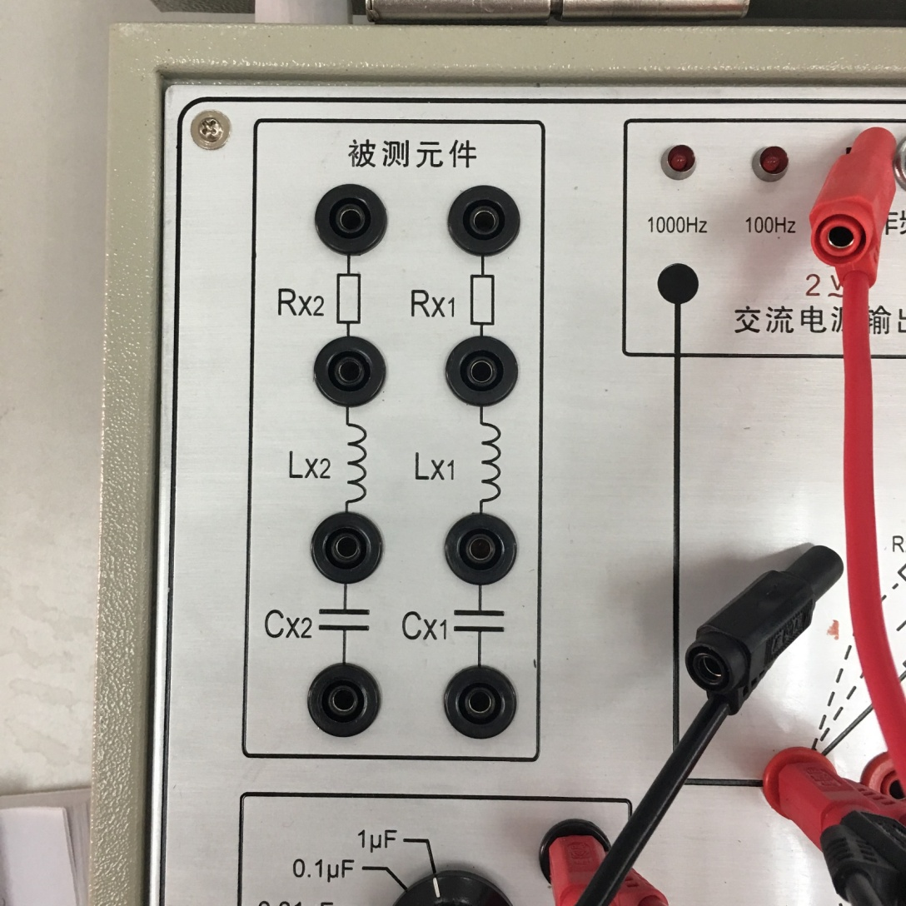
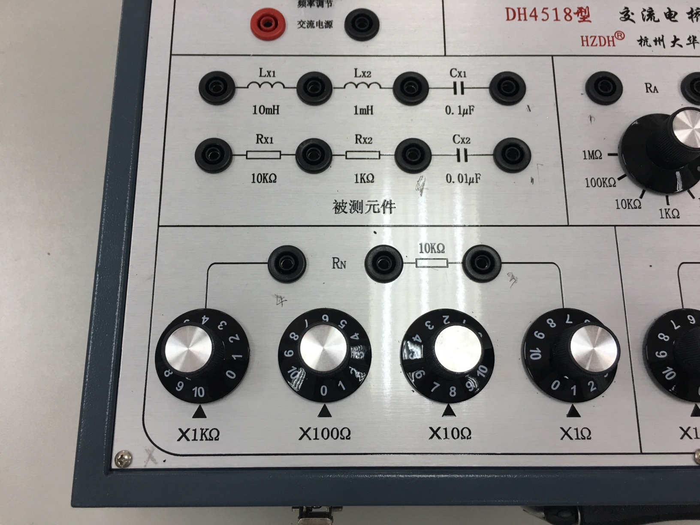

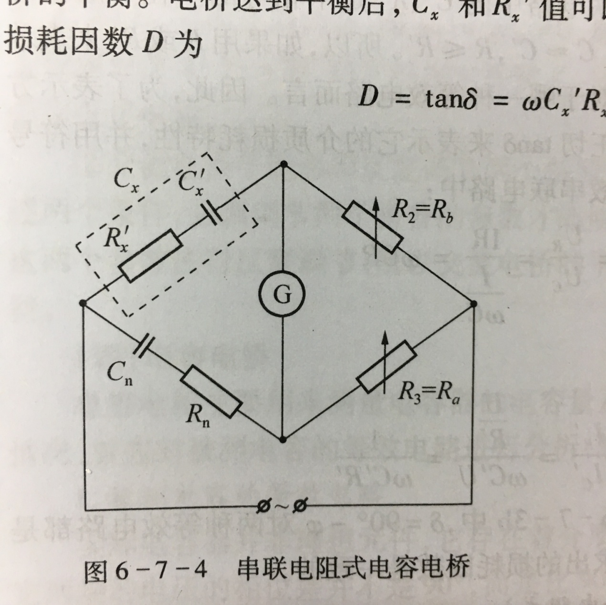

<!-- slide: 18 -->

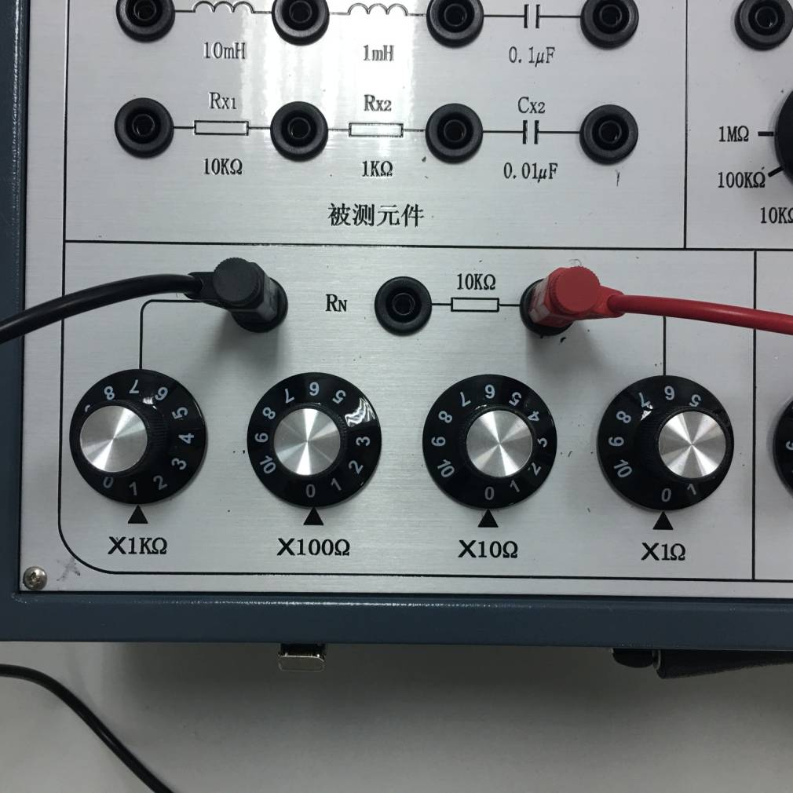
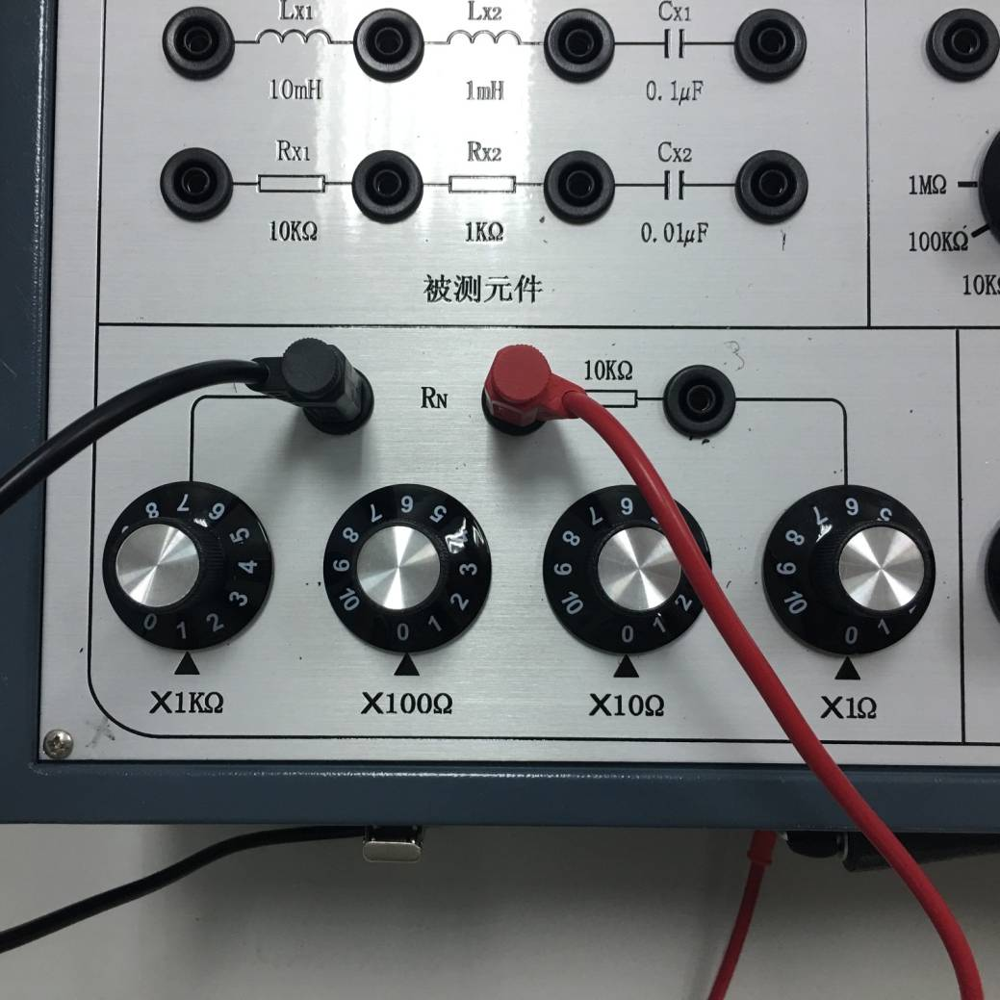
- Rn的读数是？

<!-- slide: 19 -->

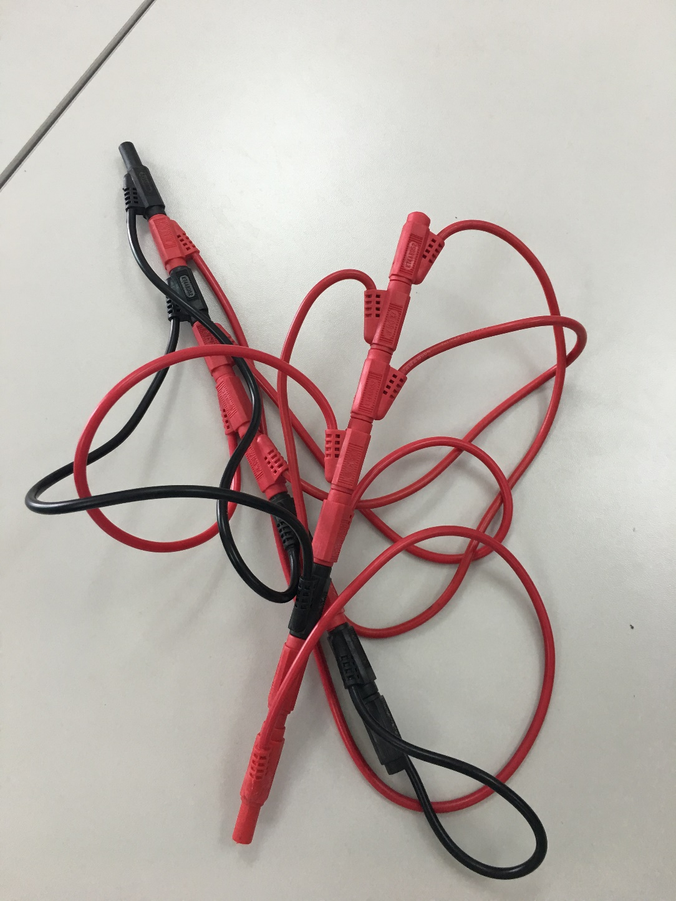
