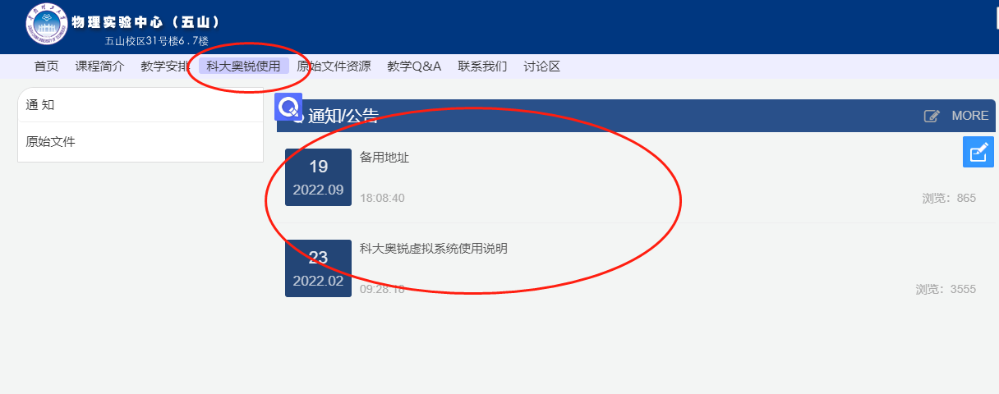
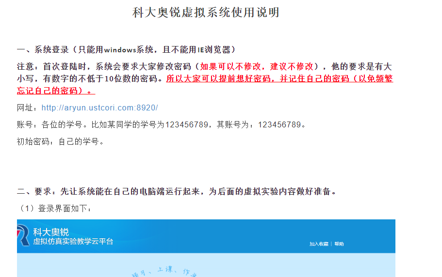

# 4科大奥锐虚拟系统简单指引20221126

<!-- slide: 1 -->

## 内容及要求

- 内容：
- 各老师按照自己组的情况选择
- 要求：
- （一）按平时正常实验一样，学习（预习），实验操作，完成实验报告。
- （二）报告不在平台上提交，还是按平时的方式提交给各自的老师。
- 实验时长：学生在系统上的各项操作都是由记录的，所以希望大家正常，独立完成实验。
- （三）实验原理部分可以参照系统上的所有可用的文件，同时也希望大家针对某些描述不清楚的问题，查找其他资料。

<!-- slide: 2 -->

## 虚拟系统碰到的问题及解决方法

- 账号及密码
- 及时跟自己的老师联系，留下以下信息：姓名，学号，专业。
- 虚拟运行环境无法安装到自己的电脑或无法使用
- 虚拟环境只能在windows系统下安装使用，mac等其他系统无法使用。
- 可以安装但无法使用，建议换个浏览器。IE是不行的。
- 安装后第一次可用，再登陆无法使用。我个人采取的办法是，用完之后卸载，下次用时再装。
- 其他问题，可以相互交流使用方法。
- 穷尽所有方法还是不行，直接在其他同学的电脑上登录完成内容。必须用自己的账号登录完成（因为系统会记录每个同学实际做实验的情况）

<!-- slide: 3 -->

## 学生使用参考

- https://ecourse.scut.edu.cn/web/gt/1/index.html?id=19136进入该网站：

