# 5磁滞回线

**4.9** **铁磁物质磁化曲线和磁滞回线的测量**

2021级 计算机全英创新班  陆俊安  2022/12/12

**一、实验目的**
1. 掌握磁化曲线和磁滞回线的概念,加深对铁磁材料的剩磁、矫顽力、磁滞和磁导率的理解；
1. 了解用示波器显示动态磁化曲线和动态磁滞回线的基本原理和定量测绘的方法。

**二、实验仪器**

磁GY-4可调隔离变压器，示波器，螺线环，交流电流表，电阻R0（标定电阻）、R1（阻值较小）、R2（阻值较大），电容C，BH-2标准互感器

**三、实验原理**

（一）铁磁物质及其磁化规律

铁磁物质是一种性能特异、用途广泛的材料。铁、钴、镍及其众多合金以及含铁的氧化物（铁氧体）均属铁磁物质。铁磁物质的特性一是在外磁场作用下能被强烈磁化，故磁导率很高；另一特性是磁滞，铁磁物质的磁感应强度$B$的变化始终落后于磁场化强度$H$的变化。铁磁物质磁感应强度$B$与磁场化强度$H$之间的关系如图1所示。

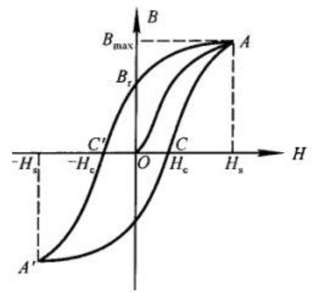

图1

图中的原点$O$表示磁化之前铁磁物质处于磁中性状态，$H$、$B$值均为零。当磁化场强度$H$从零开始增加时，磁感应强度$B$的值随之缓慢上升，继而$B$随$H$的增大而迅速增大，其后$B$的增大又趋缓慢，并当$H$增至${H}_{s}$时，$B$值几乎不随$H$的增大而增大，即磁感应强度$B$达到饱和状态。曲线$OA$称为起始磁化曲线，也称为基本磁化曲线。当磁化场从${H}_{s}$逐渐减小至$0$，磁感应强度$B$并不沿基本磁化曲线恢复到零，而是治着另一条新的曲线下降。由图比较可知，$H$减小，$B$也相应减小，但$B$的变化滞后于$H$的变化。这种现象称为磁滞。磁滞的明显特征是当$H=0$时，$B$不为零，而保留剩磁${B}_{r}$。当磁化场反向从$0$逐渐变至$-{H}_{C}$时，磁感应强度$B$消失。说明要消除剩磁${B}_{r}$必须加上足够大的反向磁场。${H}_{C}$称为矫顽力，它的大小反映铁磁物质保持剩磁状态的能力。曲线$AC'$称为退磁曲线。

当磁场周期性变化时，相应的磁感应强度$B$则沿着一条闭合曲线变化，这条闭合曲线称为磁滞曲线。当初始状态为$H=0$、$B=0$的铁磁材料在交变磁化场强度由弱到强依次进行磁化，可以得到面积由小到大向外扩张的一簇磁滞回线，如图2所示。其中面积最大的磁滞回线称为极限磁滞回线，亦称为饱和磁滞回线。而这一簇由小到大的磁滞回线的顶点的连线，称为铁磁材料的基本磁化曲线。

当铁磁材料处于交变磁场中时(如变压器铁芯)，将沿磁滞回线反复处于“被磁化→去磁→反向磁化→反向去磁”的过程。在此过程中要消耗额外的能量，并以热的形式从铁磁材料中释放。这种损耗称为磁滞损耗。可以证明，磁滞损耗与磁滞曲线所包围的面积成正比。

根据基本磁化曲线可以近似确定铁做材料在某一状态下的磁导率$\mu$（$\mu =B/H$）。因$B$与$H$的关系为非线性，所以快磁材料的磁导率$\mu$不是常数，随磁杨强度$H$的变化而变化。

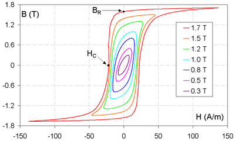

图2

（二）示波器测量磁滞回线的原理

下图所示为示波器测动态磁滞回线的原理电路。将样品制成闭合的环形，然后均匀地绕以磁化线圈${N}_{1}$及副线圈${N}_{2}$，即所谓的罗兰环。交流电压$u$加在磁化线圈上，${R}_{1}$为取样电阻，其两端的电压${u}_{1}$加到示波器的x轴输入端上。副线圈${N}_{2}$与电阻${R}_{2}$和电容串联成一回路。电容$C$两端的电压$u$加到示波器的y输入端上。

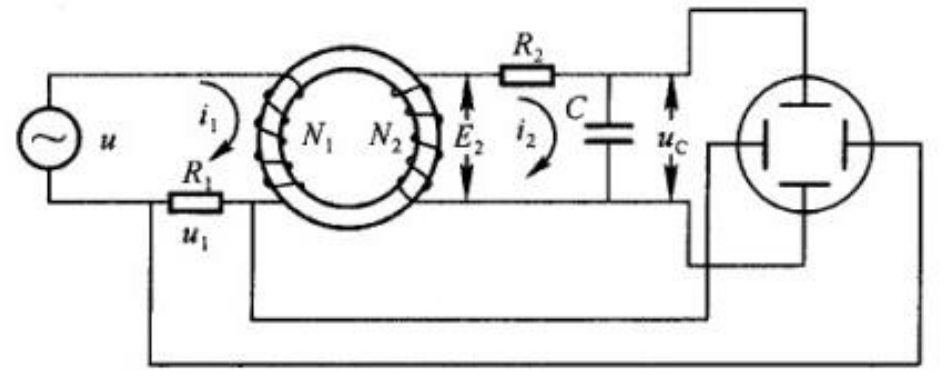
1. ${u}_{x}$(x轴输入)与磁场强度$H$成正比

若样品的品均周长为$l$，磁化线圈的匝数为${N}_{1}$，磁化电流为${i}_{1}$(瞬时值)，根据安培环路定理，有$Hl={N}_{1}{i}_{1}$，而${u}_{1} = {R}_{1}{i}_{1}$，所以

$$
{u}_{1} =\frac {{R}_{1}l} {{N}_{1}}H
$$

由于式中${R}_{1}$、$l$和${N}_{1}$皆为常数，因此，该式清楚地表明示波器荧光屏上电子束水平偏转的大小(${u}_{1}$)与样品中的磁场强度($H$)成正比。        2.  ${u}_{C}$(y轴输入) 在一定条件下与磁感应强度$B$成正比

设样品的截面积为$S$，根据电磁感应定律，在匝数为${N}_{2}$的副线圈中，感应电动势应为

$$
{E}_{2}={N}_{2}S\frac {dB} {dt}
$$

此外，在副线圈回路中的电流为${i}_{2}$且电容$C$上的电量为$q$时，又有

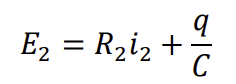

考虑到副线圈匝数$N2$较小，因而自感电动势未加以考虑，同时，${R}_{2}$与$C$都做成足够大，使电容$C$上的电压降(${u}_{C}=q/C$)比起电阻上的电压降${R}_{2}$、${i}_{2}$小到可以忽略不计。于是可以近似地改写为

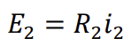

将${i}_{2}=\frac {dq} {dt}=C\frac {d{u}_{c}} {dt}$代入，得

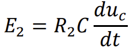

不考虑上式负号(在交流电中负号相当于相位差$\pm \pi$)时，应有

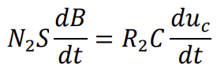

将两式两边对时间积分，由于$B$和${u}_{c}$都是交变的，故积分常数为0。整理后得

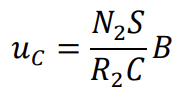

由于${N}_{2}$、$S$、${R}_{2}$和$C$皆为常数，因此该式表明了示波器的荧光屏上竖直方向偏转的大小(${u}_{C}$)与磁感强度($B$)成正比。

在磁化电流变化的一周期内，示波器的光点将描绘出一条完整的磁滞回线，并在以后每个周期都重复此过程，这样在示波器的荧光屏上将看到一稳定的磁滞回线图线。

3.  测量标定

本实验不仅要求能用示波器显示出待测材料的动态磁滞回线，而且要能使用示波器定量观察和分析磁滞回线。因此，在实验中还需确定示波器荧光屏上x轴(即H轴)的每一小格实际代表多少磁场强度，y轴(即B轴)的每一小格实际代表多少磁感应强度，这就是测量标定问题。

1) x轴(H轴)标定

x轴标定操作的目的是标定$H$。具体而言就是确定示波器荧光屏x轴(即H轴)的每一小格实际代表多少磁场强度。我们设法测出光点沿x轴偏转的大小与电压${u}_{1}$的关系，就可确定$H$。标定$H$的线路图如下所示。其中交流电表A用于测量${u}_{0}$(A的指示是${i}_{0}$的有效值${I}_{0}$)。调节${I}_{0}$使荧光屏上水平线长度为${M}_{X}$格，它对应于${u}_{1}$且为峰峰值，即$2\sqrt {2}{R}_{1}{I}_{0}$，因此，每一小格所代表的$u1$的值为$2\sqrt {2}{R}_{1}{I}_{0}/{M}_{X}$。这样由就可知荧光屏每一小格所代表的磁场强度$H$是

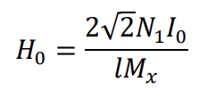

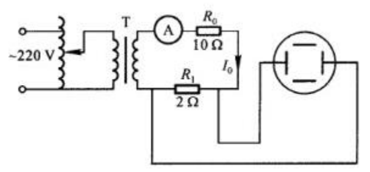

x轴(H)轴标定线路图

2)  y轴(B轴)标定

y轴标定操作的目的是标定$B$，具体而言就是确定y轴(B轴)的每一小格实际代表多少磁感应强度。具体标定$B$的线路如下所示。图中$M$是一个标准互感器。

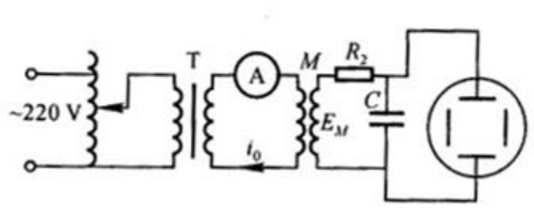

y轴(B轴)标定线路图

流经互感器原边的瞬时电流为$i0$，则互感器副边中的感应电动势${E}_{0}$为

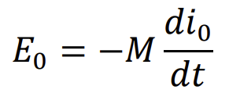

又有

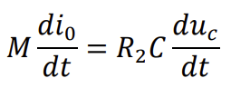

对上式两边积分，可得

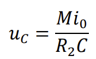

由于A测出的是${i}_{0}$的有效值${I}_{0}$，所以对应于${u}_{C}$的有效值${U}_{C}$，有

$$
{u}_{C} = M{I}_{0}/{R}_{2}C
$$

而相应的峰峰值为$2\sqrt {2}M{I}_{0}/{R}_{2}C$。

若此时对应${U}_{C}$峰峰值的垂直线总长主度为${M}_{y}$，则y轴每一小格所代表的磁感应强度为

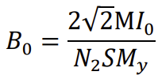

注意实验中，不要使${I}_{0}$超过互感器所允许的额定电流值。

**四、实验步骤**

1．仪器的调节

(1)按图3所示线路接线，调节示波器，使光点调至荧光屏正中心。示波器的x轴增益置“50mV”档，y轴增益置“0.1V” 档，可适当调整x、y的增幅，使荧光屏上得到大小适中的磁滞回线。调节可调隔离变压器，从零开始逐步增大磁化电流，使磁滞回线上的B值能达到饱和。

(2)样品的退磁：缓慢调节调压器的输出电压，使励磁电流从最大值每次减小20mA左右，直至调为零，重新增大励磁电流使样品达到磁滞饱和，若磁滞回线闭合则样品被完全退磁，否则重复退磁操作，直至退磁完成。

(3)退磁完成后，重新调节可调隔离变压器电压为80V，使荧光屏上得到大小适中的磁滞回线，并记录饱和磁化电流I的大小。

2. 测量动态磁滞回线以及基本磁化曲线

(1)将电源电压从0V逐渐调节到100V，以每小格为单位测若干组B、H的坐标值。并记录电压为80V时饱和磁滞回线的顶点($A$)、剩磁(${B}_{r}$)、矫顽力(${H}_{c}$)三个点的读数。

(2)测量基本磁化曲线，将电源电压从0V逐渐调节到100.0V，每隔10V记录下当前电流值以及磁滞回线的顶点坐标值，并将各个磁滞回线的顶点进行连接即可得到基本磁化曲线。

(3)标定H，依次逐渐增大线路中的电流值分别为0.02mA、0.04 mA、0.06 mA、0.08mA、0.10 mA、0.12 mA，并记录下不同电流时示波器对应的格数，根据公式求出示波器单位每小格表示的磁场强度${H}_{0}$。

3. 标定B，依次逐渐增大线路中的电流值分别为0.05mA、0.10 mA、0.15 mA、0.20 mA、0.25 mA、0.30 mA，记录下不同电流时示波器对应的格数，并根据公式求出示波器单位每小格表示的磁感应强度${B}_{0}$。

4. 将标定的结果带入测基本磁化曲线数据表格，求出对应不同电压时的${H}_{m}$、${B}_{m}$以及相对磁导率${\mu }_{a}$，以${\mu }_{a} - {H}_{m}$曲线确定初始磁导率${\mu }_{a0}$和最大磁导率${\mu }_{am}$。

**五、数据处理**

实验数据结果如图所示：

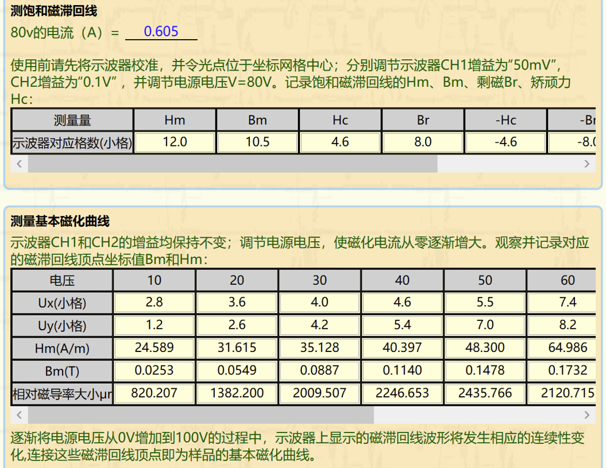 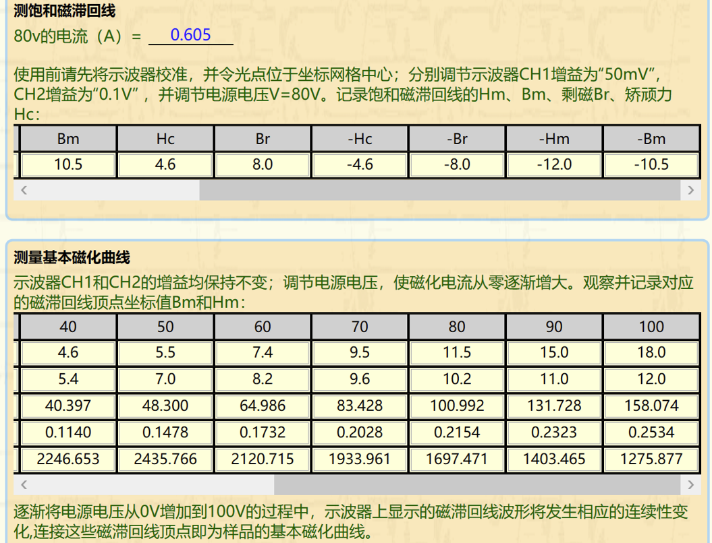

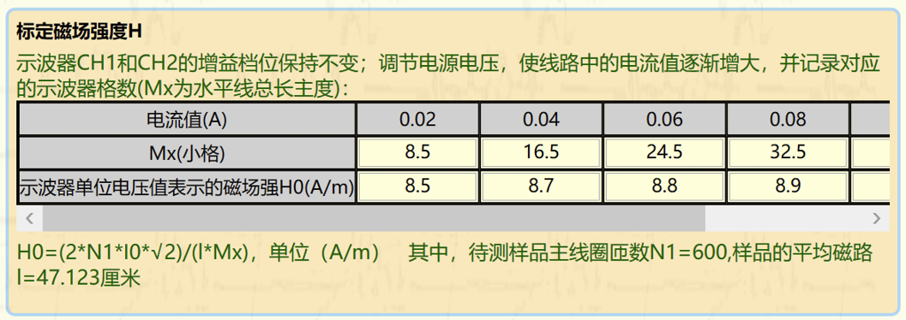 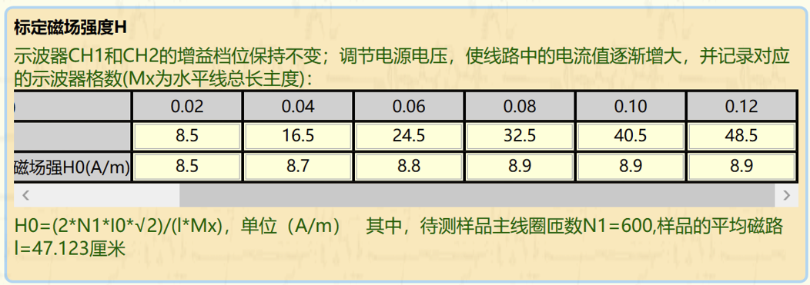

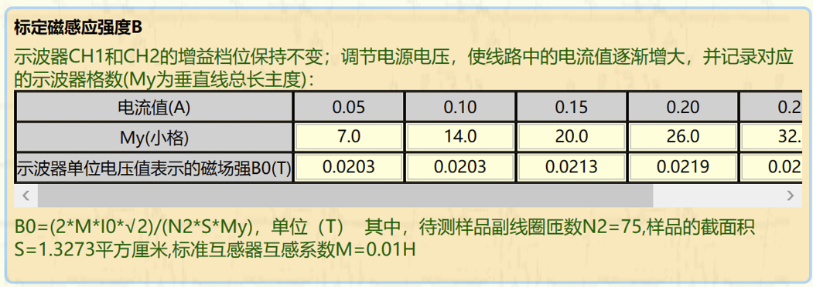 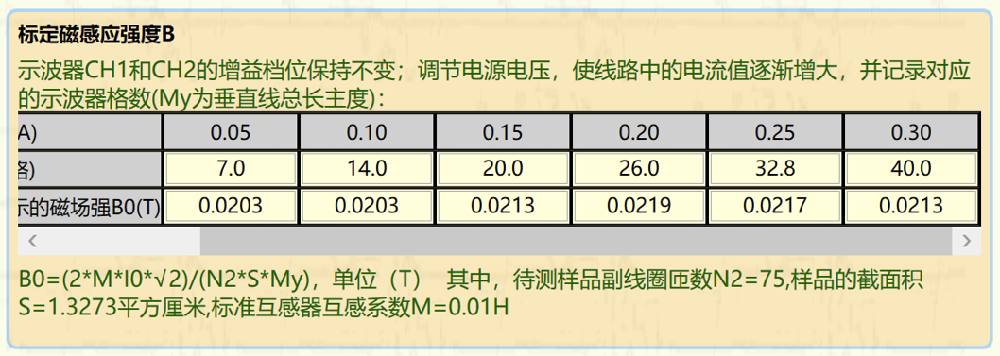

使用excel绘制出基本磁化曲线：

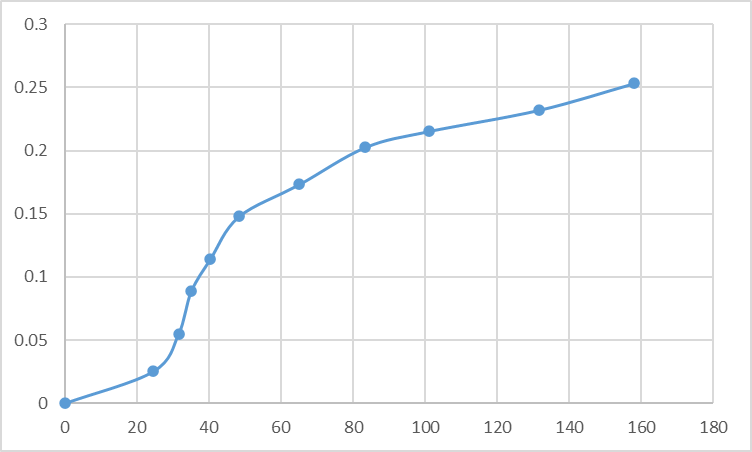

**六、结论及分析**
1. 本次实验掌握了磁化曲线和磁滞回线的概念,加深了对铁磁材料的剩磁、矫顽力、磁滞和磁导率等概念的理解，明白了用示波器显示动态磁化曲线和动态磁滞回线的基本原理。这次实验中绘制出的基本磁化曲线走向与理论图形大致一致，不过图形不够平滑，可能操作和读数的精确度还需要进一步提高。
