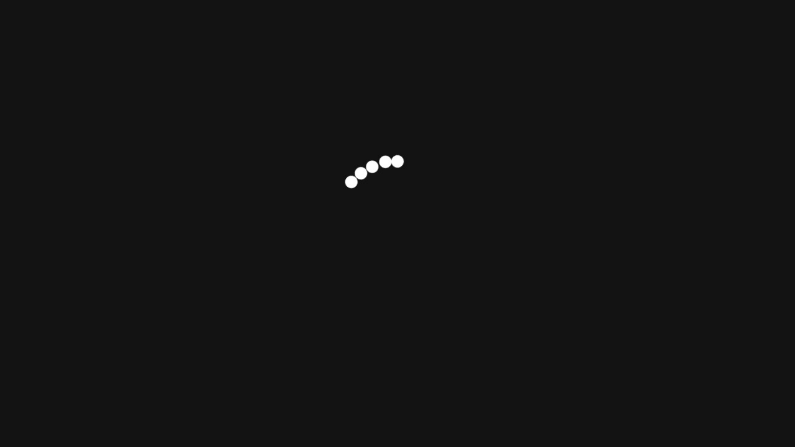
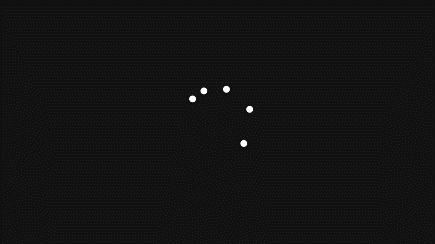
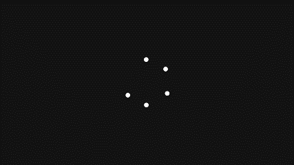
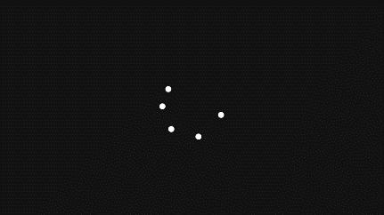
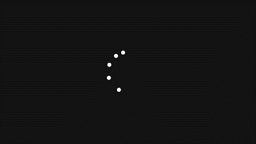
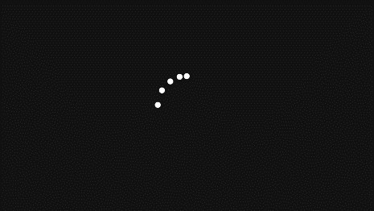
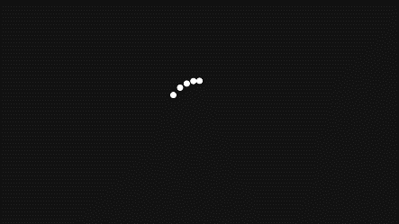
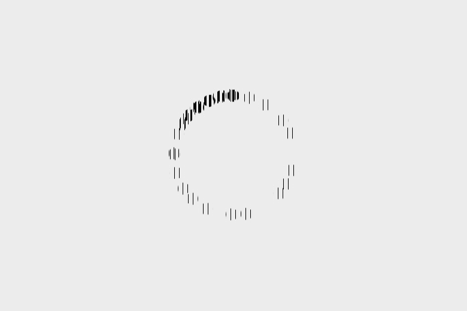
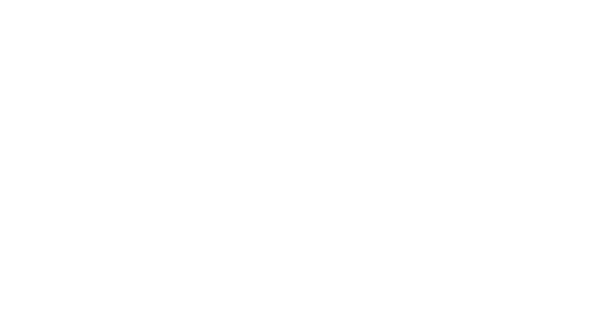

# 6光栅动画

**设计性实验：动态光栅画的原理和设计**

2021级 计算机全英创新班 陆俊安

**一、实验目的**

1. 了解动态光栅画表现为动态的原理

2.  制作动态光栅画

**二、实验道具**

待处理的gif动图，Python3

**三、实验原理**

**视觉暂留**

视觉暂留(Persistence of vision)现象是光对视网膜所产生的视觉在光停止作用后，仍保留一段时间的现象，其具体应用是电影的拍摄和放映。原因是由视神经的反应速度造成的。是动画、电影等视觉媒体形成和传播的根据。视觉实际上是靠眼睛的晶状体成像，感光细胞感光，并且将光信号转换为神经电流，传回大脑引起人体视觉。感光细胞的感光是靠一些感光色素，感光色素的形成是需要一定时间的，这就形成了视觉暂停的机理。人眼观看物体时，成像于视网膜上，并由视神经输入人脑，感觉到物体的像。但当物体移去时，视神经对物体的印象不会立即消失，而要延续0.1至0.4秒的时间。

莫尔条纹动画利用人眼的视觉暂留特性，通过移动光栅使印在纸上的动画底图实现动画效果，将单张图片从静态转变为连贯流场的动画。莫尔条纹动画的产生包含两个关键步骤: ① 静态动画底图的制作; ② 动画的呈现。

**静态动画底图的制作与动画展示原理**

首先，从视频形式的动画中抽取出$P$帧图像$I(M,N,P)$ ，每幅图像的像素数为  $M\times N$，需制作的莫尔条纹动画的帧数为$P$。然后，生成$P$个像素数为$M\times N$ 的黑白光栅。假设每个光栅的栅距周期为$d$个像素，光栅透光间隙宽度为$a$个像素，则该光栅的占空比为 $a∶(d-a)$。根据莫尔条纹动画的形成原理，可制作动画的帧数P和光栅参数满足关系式:

$$
P=d/a
$$

不同光栅的透光间隙占据同一光栅周期中的不同空间位置，则光栅的透过率函数为

$$
g(Μ,Ν,i)=\left \{ {\begin {gathered} \& 1, if Ν=(1∶a)*(i-1)+d*(j-1) \\ \& 0, else \end {gathered}}\right
$$

式中:$i=1,2,\ldots ,P$;$j=1,2,\ldots ,mod(N/d )$。

将每一帧图像与对应的黑白光栅重叠，保留透光间隙部分的图像像素，将不透光部分重叠的像素全部删除。随着光栅的移动，保留动画中不同帧图像中不同位置的像素。最后，将所有帧保留的像素$A(M,N)$放在同一图像中，形成一个条状排列的包含了所有帧像素信息的动画底图，则有:

$$
A(Μ,Ν)=\sum _{i=1} ^{Ρ} Ι(Μ,Ν,i)\times g(Μ,Ν,i)
$$

在动画呈现时，在动画底图上移动同一个黑白光栅，随着它的移动在光栅空隙中漏出不同帧的像素信息，不同帧的信息连续出现。人脑会根据看到的线段自动补充出完整的图案，即可形成动画效果。

**静态动画底图的制作步骤**
1. 首先从动画中抽取$P$帧，帧数不宜过多，那么动画的周期就是$P$，即每隔$P$帧循环播放一次；
1. 然后将每帧图像都通过网格进行划分，同样是$P$个格子为一个周期，将一个周期内的格子统称为一组；
1. 在第$i$帧的每组内保留第$i$个格子的图像，其余部分都涂成背景色；
1. 将所有帧重叠起来得到底图，因为每组内保留的格子在空间上不同，所以不会造成遮挡；
1. 使用缝隙宽度为1个格子，不透光的条纹宽度为$P-1$个格子的光栅在底图上滑动即可看到动画

最终的效果就是在任意时刻，光栅都刚好遮挡住了每组中的$P-1$个格子，而刚好露出了1个格子，每组中的这1个格子必定对应同一帧图像，而光栅不透光的部分刚好填充了上面第3步删掉的部分。尽管光栅没有完全还原被删除的部分，而是显示的整个条纹，但在观看时大脑会自动加工，将各组露出的部分连在一起成为平滑的轮廓。这里图案以外的区域仍然显示的是光栅的重复条纹，而图案范围内的色块将会完全连续。连续的大段色块相对于不连续的栅格其实就是低频图像，那么从远处观看，大脑就会对这部分图像更敏感。

**影响动态光栅画质量的因素**

根据莫尔条纹动画原理，假设原始动画的帧数为${P}_{0}$，每一帧莫尔条纹动画图像中包含原始图像信息量的百分比为$a/d$，又由于莫尔条纹动画的帧数占原始动画帧数的$P/{P}_{0}$，则莫尔条纹动画底图中包含原始动画信息的比例$R$为

$$
R=\frac {a} {d}\times \frac {Ρ} {{Ρ}_{0}}
$$

$$
R=\frac {1} {{Ρ}_{0}}
$$

根据$P=d/a$（前文原理中的第一条式子）可得

该式的含义为，莫尔条纹动画底图中包含的总信息量恒定为原始动画中一帧图像的信息量，与动画的帧数和光栅的参数无关。但是动画帧数和光栅参数的变换会对人眼的视觉感受产生影响。

当莫尔条纹动画的帧数$P$固定时，光栅栅距$d$和透光间隙$a$的比值确定。然而，不同栅距的选择会产生较大的视觉差异。当$d$增大时，总的信息量一定，但由于透光部分距离较大，所得画面信息较为分散，画面细节、整体连贯性及视觉感受均较差。当$d$较小时，人眼感受到的图像整体连贯性较强，流畅性更佳，细节之处更为明显。当$d$较大时，在动画呈现过程中要求光栅的运动速度更快，若光栅未及时运动到下一帧的位置，易导致动画效果不佳，甚至无法实现动画效果。因此，在制作莫尔条纹动画时，光栅的栅距越小越好，最理想的情况是光栅的透光间隙为$1 pixel$时，空间连贯性最好。

当光栅的透光间隙为$1 pixel$不变，理论上，帧数越多，动画效果越连贯流畅，效果越逼真。但帧数越多，每一帧图像中的有效信息${ P}_{0}$越少，并且信息较为分散，画面细节较差。制作帧数过高会导致每幅动画底图之间间隔较小，动画底图变化幅度相应较小，即当移动光栅时，模拟动画效果所能呈现的整体动画效果不明显。经过测试发现在一个动作周期内制作8帧左右莫尔条纹动画时，得到的画面动画效果最佳，总体画面感最流畅，时间连贯性最佳。即在莫尔条纹动画制作时，应当选取的光栅占空比为1∶7。

**四、实验步骤**
1. 分析所用gif动图帧数并截取需要的帧

利用Python分析gif动图，得到gif帧数。分析发现此次实验使用的动图为40帧，因此从第一帧开始每五帧取一帧，得到八帧图像。
1. 融合八帧图像制作动画底图

将选出的八帧图片按顺序轮换，融合进相等大小的底图（底图初始为空白图片）。具体操作为：从底图的起始位置（实验中选择最左侧）开始，将第一帧中对应位置的且宽度为$a$像素的部分复制到底图中；切换到下一帧图片，再将下一帧中对应底图下一段位置的，且宽度为$a$像素的部分复制到底图中；继续切换……以此类推直到处理完整个底图。
1. 制作光栅

使用一张完全不透明的纯色图片（由于实验中底图的空白部分是白色，所以选取纯白色）。每间隔$7\times a$，将下一段宽度为$a$像素的部分设置为透明。
1. 模拟光栅动画效果

使用python进行运算和模拟。对于不透明的部分，显示光栅卡的颜色；对于透明的部分，显示动画底图的颜色。每隔一段时间将光栅卡移动一段距离，并将处理结果展示到屏幕。循环以上操作，最终的结果连接成新的gif动图，即动画模拟结果。

**五、结果展示**

                

以上为通过处理原始gif选取出的八帧，顺序为从左往右、从上往下

最终的光栅动画底图成品

光栅成品

白色为遮盖部分，黑线为透明部分。因为文档在白色背景下两个部分无法区分，所以在图片底下设置了阴影，使得透明部分表现出灰/黑色。

利用python模拟上面两个成品表现出的动画样式（pdf中无法展示动画，详见附件）

**六、结论及分析**

本次实验的最终动画模拟可以看出光栅动画的效果，实现了“静转动”的目的。不过比较遗憾的是最终模拟出来的效果不是黑白图像，而是预料之外的颜色。由于编程水平不佳，没有检查出是否为输出动画时代码造成的问题。也猜测可能是由于动画的条纹太密，和显示屏产生了莫列波纹，影响了最后的视觉观感。不过最终动画的形状等并没有出现问题，与理论相符合。

附录：实验中使用到的部分python代码
1. **def**  parseGIF(GIF_file):
1. frames = []
1. GIF_name = GIF_file.split('.')[0]
1. **for**  i, frame  **in**  enumerate(ImageSequence.Iterator(Image.open(GIF_file))):
1. **if**  i % 5 == 0:
1. frame.save(f"imgs/{GIF_name}-{i}.png")
1. frames.append(frame.copy())
1. frames[0].save("new.gif", save_all=True, append_images=frames[1:])

以上用于分析图像帧数，以及合成抽取出的八帧图像为一个动图。
1. **def**  parseGIF(GIF_file, frame_num=8):
1. img_it = ImageSequence.Iterator(Image.open(GIF_file))
1. frames = [np.array(frame.copy().convert("L"))  **for**  frame  **in**  img_it]
1. frames = frames[::len(frames) // frame_num]
1. patern = np.ones_like(frames[0])
1. index =  **lambda**  i: (slice(None), slice(i, None, frame_num))
1. **for**  i, frame  **in**  enumerate(frames): patern[index(i)] = frame[index(i)]
1. Image.fromarray(255 - patern[100:-100, 250:-250]).convert("L").save('1.png')
1. fig = plt.figure()
1. plt.xticks([])
1. plt.yticks([])
1. **def**  card_when(t):
1. card = np.zeros_like(patern)
1. card[:, t::frame_num] = 1
1. **return**  card
1. to_save = 255 * np.repeat(np.expand_dims(1 - card_when(0), -1), 4, axis=-1)
1. to_save[card_when(0) == 1][-1] = 0
1. **print**(to_save.shape)
1. Image.fromarray(to_save).convert("RGBA").save('3.png')
1. canvas = plt.imshow(patern * card_when(t=0))
1. animat = animation.FuncAnimation(
1. fig,  **lambda**  t: canvas.set_data(patern * card_when(t=t % 100)), interval=200)
1. plt.show()
1. animat.save("out.gif")

以上代码用于绘制光栅、底图，以及进行模拟。
