# 磁滞回线-2022-大学城

<!-- slide: 1 -->

## 内容提要

- 铁磁物质的磁滞回线研究
- 名词解释
- 难点分析
- 操作指南
- 仪器特性
- 问题处理
- 实验报告
- 大学物理实验中心
- 实验目的
- 实验数据

<!-- slide: 2 -->

## 实验目的

- 1.掌握磁化曲线和磁滞回线的概念,加深对铁磁材料的剩磁、矫顽力、磁滞和磁导率的理解。
- 2.了解用示波器显示动态磁化曲线和动态磁滞回线的基本原理和定量测绘的方法

<!-- slide: 3 -->

## 名词解释

- 起始磁化曲线
- 磁滞回线
- 硬磁和软磁材料
- 基本磁化曲线
- 指示:
- 删除样本文档图标,并替换为工作文档图标，如下:
- 在 Word 中创建文档.
- 返回 PowerPoint
- 在“插入”菜单中选择“对象...”
- 单击“从文件创建”
- 定位“文件”框中的文件名
- 确认选中“显示为图标”。
- 单击“确定”
- 选择图标
- 从“幻灯片放映”菜单中选择“动作设置”
- 单击“对象动作”，并选择“编辑”
- 单击“确定”

<!-- slide: 4 -->

## 难点分析

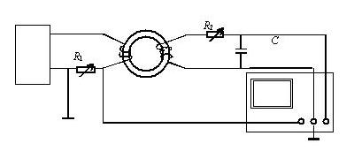
- R的影响
  - 改变电阻R1，R2观察图形的变化。
- f的影响
  - 改变信号频率f观察图形的变化。
- 指示:
- 删除样本文档图标,并替换为工作文档图标，如下:
- 在 Word 中创建文档.
- 返回 PowerPoint
- 在“插入”菜单中选择“对象...”
- 单击“从文件创建”
- 定位“文件”框中的文件名
- 确认选中“显示为图标”。
- 单击“确定”
- 选择图标
- 从“幻灯片放映”菜单中选择“动作设置”
- 单击“对象动作”，并选择“编辑”
- 单击“确定”
- 信号源
- 示波器

<!-- slide: 5 -->

## 操作指南

- 利用教材所给的测量电路，选择适当的电路参数，R1 ，R2、f=50 Hz后，改变信号发生器的输出电压（振幅调节），示波器上将会显示磁滞回线的图形。
- 示波器的输入端要选择适当的“增益”（Volts/DIV），以确保图形的大小合适
- 增大输出电压（振幅调节），至出现饱和磁化曲线，取10个点记录此时的饱和磁滞曲线并按1：1绘制出来。
- 分6-8次逐渐缩小输出电压至0，分别记录每条磁滞回线上的正顶点坐标，绘制出基本磁化曲线。
- 指示:
- 删除样本文档图标,并替换为工作文档图标，如下:
- 在 Word 中创建文档.
- 返回 PowerPoint
- 在“插入”菜单中选择“对象...”
- 单击“从文件创建”
- 定位“文件”框中的文件名
- 确认选中“显示为图标”。
- 单击“确定”
- 选择图标
- 从“幻灯片放映”菜单中选择“动作设置”
- 单击“对象动作”，并选择“编辑”
- 单击“确定”
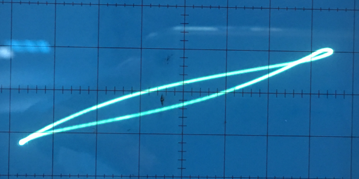

<!-- slide: 6 -->

## 仪器特性

- 磁滞回线仪
- 示波器
- 实验装置
- 指示:
- 删除样本文档图标,并替换为工作文档图标，如下:
- 在 Word 中创建文档.
- 返回 PowerPoint
- 在“插入”菜单中选择“对象...”
- 单击“从文件创建”
- 定位“文件”框中的文件名
- 确认选中“显示为图标”。
- 单击“确定”
- 选择图标
- 从“幻灯片放映”菜单中选择“动作设置”
- 单击“对象动作”，并选择“编辑”
- 单击“确定”

<!-- slide: 7 -->

## 问题处理

- 图形倒置--调换X、Y轴输入。
- 图形不规范--改变R、f，直至达到满意为止。
- 图形大小不适--改变信号发生器衰减倍率，或改变示波器X、Y轴增益，直至达到满意为止。
- 指示:
- 删除样本文档图标,并替换为工作文档图标，如下:
- 在 Word 中创建文档.
- 返回 PowerPoint
- 在“插入”菜单中选择“对象...”
- 单击“从文件创建”
- 定位“文件”框中的文件名
- 确认选中“显示为图标”。
- 单击“确定”
- 选择图标
- 从“幻灯片放映”菜单中选择“动作设置”
- 单击“对象动作”，并选择“编辑”
- 单击“确定”
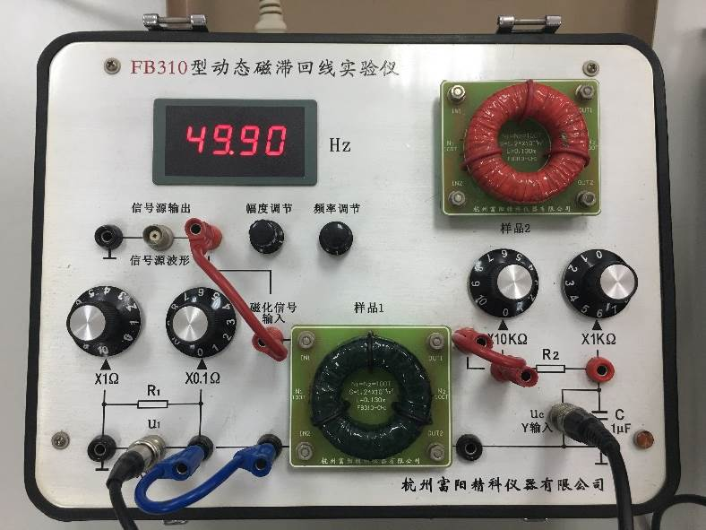
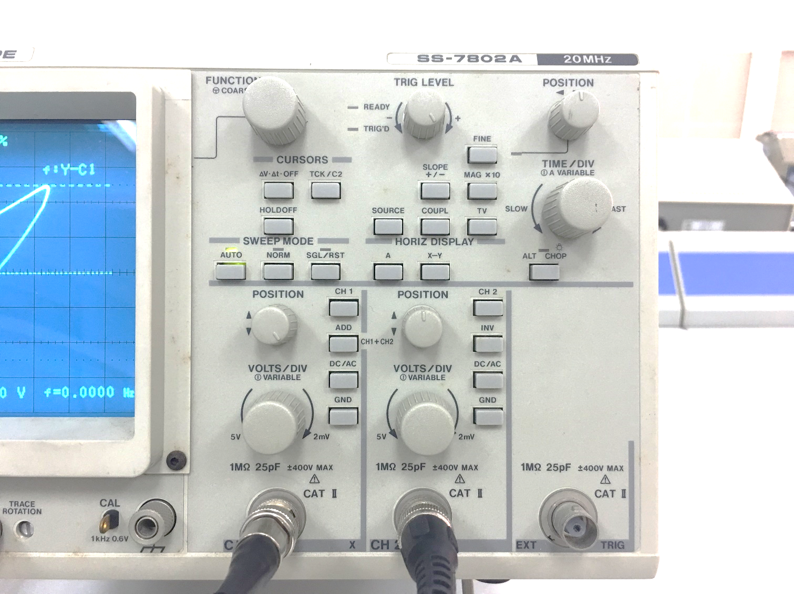
- 调R1
- 调R2
- 调输出电压
- CH1 x
- CH2 y
- 增益

<!-- slide: 8 -->

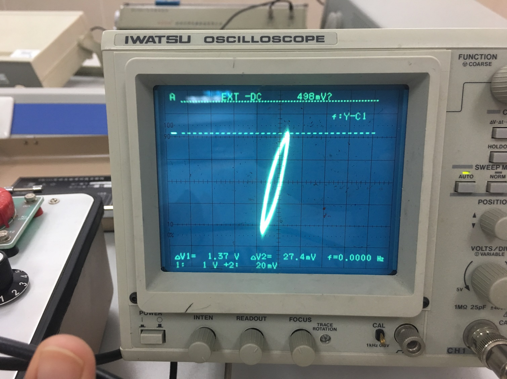
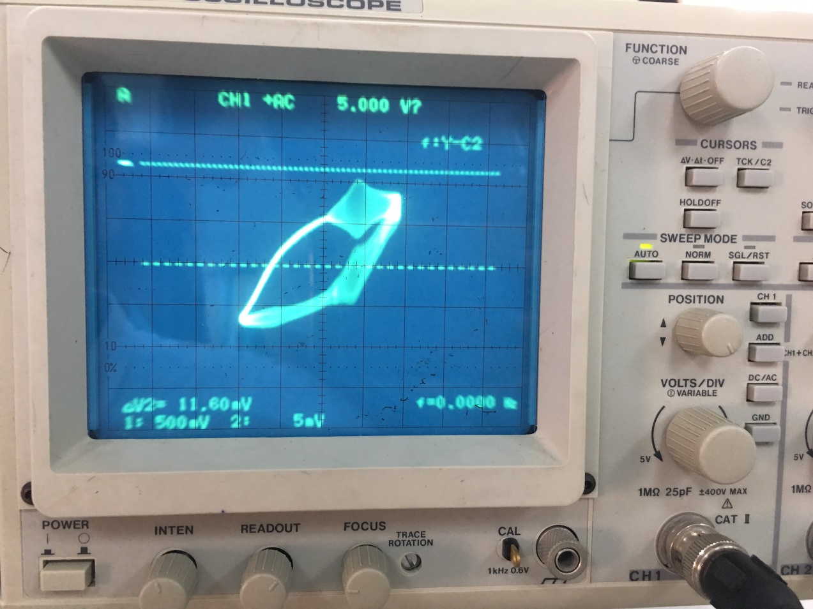
- 调亮度，聚焦
- 线路接触不良

<!-- slide: 9 -->

- 1. 分别改变电阻R1，R2和f 观察图形的变化。
- 2. 增大电压使出现饱和磁滞回线，并求出Br，Bs， Hr，Hs。读取10-12个点记录如下表，并在坐标纸上绘制1：1的图形。
- 3. 分6-8次逐渐缩小输出电压至0，分别记录每条磁滞回线上正顶点坐标，绘制出基本磁化曲线。

|  | 1 | 2 | 3 | 4 | 5 | 6 | 7 | 8 | 9 | 7 | 8 | 9 | 10 | …… |
|---|---|---|---|---|---|---|---|---|---|---|---|---|---|---|
| xi |  |  |  |  |  |  |  |  |  |  |  |  |  |  |
| yi |  |  |  |  |  |  |  |  |  |  |  |  |  |  |
| Hi |  |  |  |  |  |  |  |  |  |  |  |  |  |  |
| Bi |  |  |  |  |  |  |  |  |  |  |  |  |  |  |

- 实验数据记录及处理

<!-- slide: 10 -->

## 起始磁化曲线

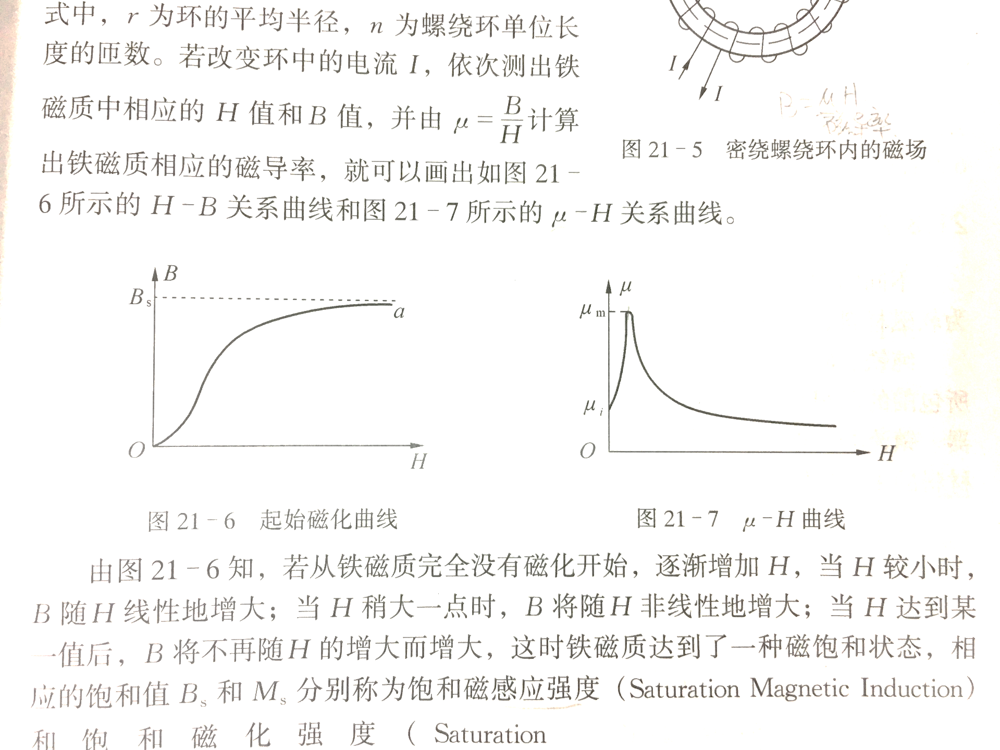
- B =μH
- 铁磁材料在外加磁场中被磁化，外加磁场强度H与铁磁材料内部的磁感应强度B的关系为B =μH，其中磁导率μ不是常量。
- 正顶点、
- 饱和点
- a
- a
- H
- O
- 起始磁化曲线
- B
- Bs
- μ
- μm
- μi
- H
- O
- μ-H 曲线

<!-- slide: 11 -->

- H
- B
- a(Hs,Bs)
- b
- e
- f
- O
- d(-Hs,-Bs)
- Hs
- 铁磁材料的磁滞回线
- Br
- 剩磁
- Hc
- c
- 矫顽力
- 封闭曲线abcdefa
- 称为磁滞回线

<!-- slide: 12 -->

## 磁滞回线

- ①磁导率µ 不是常数；
- ②当H=0 时，B≠0，称Br为剩磁；
- ③要使铁磁物质完全退磁，必须加
- 一反方向磁场﹣Hc，称﹣Hc为矫顽
- 磁力，bc段曲线称为退磁曲线；
- ④ B的变化始终落后于H的变化，
- 这种现象称为磁滞现象。
- ⑤铁磁材料在磁化一周期内所损耗
- 的能量（也称损耗）的大小就等于磁滞回线所包围的面积的大小；
- ⑥在测样品的磁滞回线前，必须对样品先进行退磁处理。

<!-- slide: 13 -->

## 硬磁与软磁材料

- 指示:
- 删除样本文档图标,并替换为工作文档图标，如下:
- 在 Word 中创建文档.
- 返回 PowerPoint
- 在“插入”菜单中选择“对象...”
- 单击“从文件创建”
- 定位“文件”框中的文件名
- 确认选中“显示为图标”。
- 单击“确定”
- 选择图标
- 从“幻灯片放映”菜单中选择“动作设置”
- 单击“对象动作”，并选择“编辑”
- 单击“确定”
- 硬磁材料的磁滞回线宽，剩磁和矫顽力较大（在120-20000A/M，甚至更高），因而磁化后，它的磁感应强度能保持，适宜于制作永久磁铁。
- 软磁材料（如硅钢片）的磁滞回线窄，矫顽力小（一般小于120A/M），但它的磁导率和饱和磁感应强度大，容易磁化和去磁，通常用于制造电机、变压器和电磁铁。

<!-- slide: 14 -->

- 硬磁与软磁材料的磁滞曲线
- B
- H

- B
- H

<!-- slide: 15 -->

- B
- 基本磁化曲线
- 磁性材料的磁化未达到饱和就开始退磁会出现较小的磁滞回线。
- 由一系列大小不同的稳定的磁滞回线的正顶点连成的曲线称为基本磁化曲线，如图中的oa段曲线。
- O
- a
- H

<!-- slide: 16 -->

## 磁滞实验仪

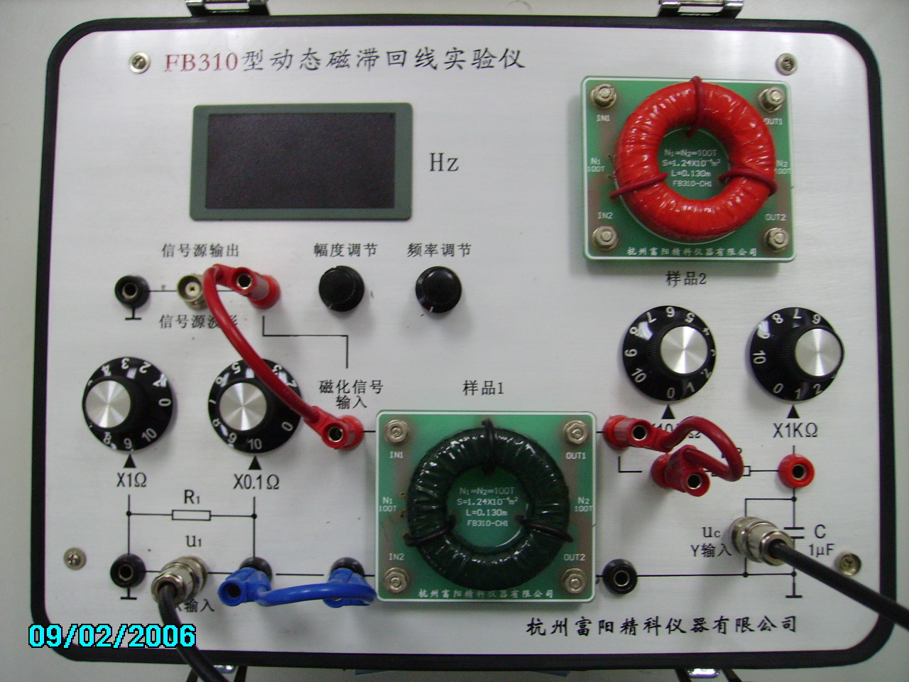
- 振幅调节（输出电压）
- 频率调节
- 频率显示

<!-- slide: 17 -->

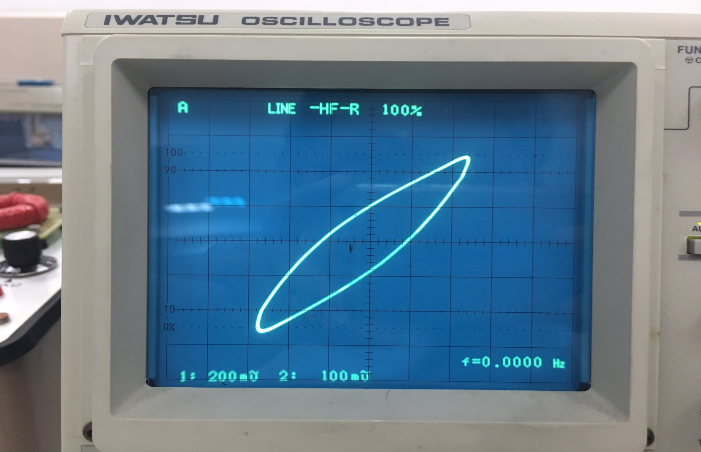
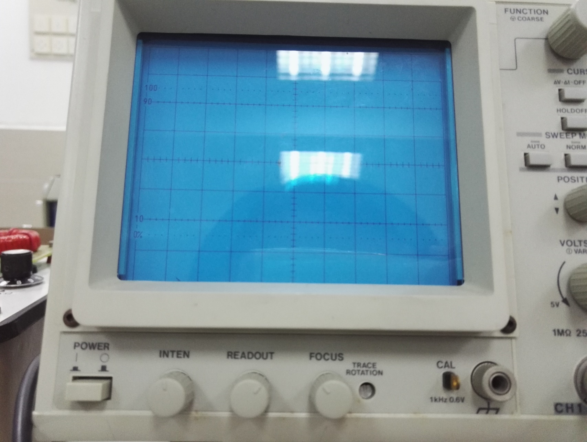
- 亮度
- 聚焦
- 示波器
- 屏幕
- 电源
- CH1，1大格代表200 mV
- CH2，1大格代表100 mV

<!-- slide: 18 -->

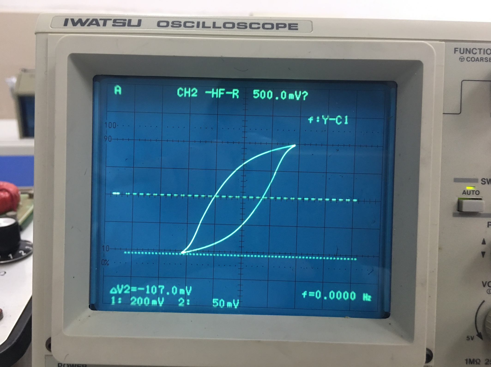

<!-- slide: 19 -->

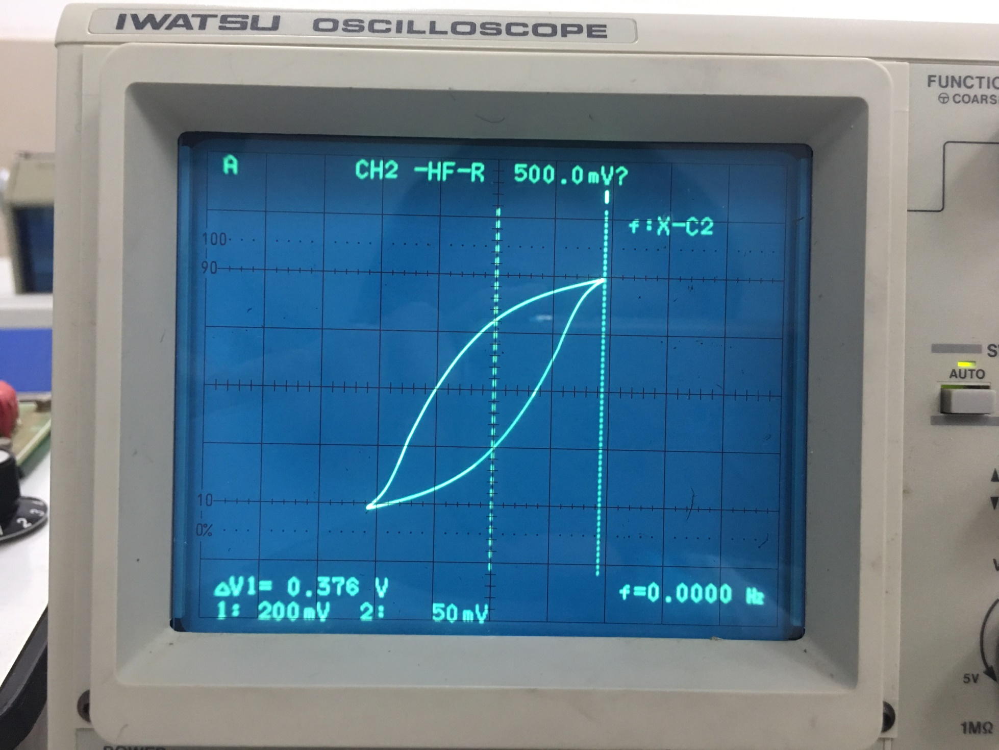

<!-- slide: 20 -->

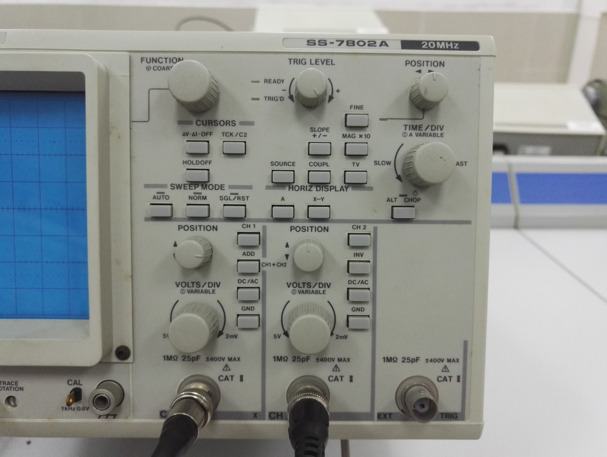
- CH1信号位置和衰减
- CH2信号位置和衰减
- 示波器
- 光标区
- 水平移动图像
- 垂直移动图像

<!-- slide: 21 -->

## 实验装置

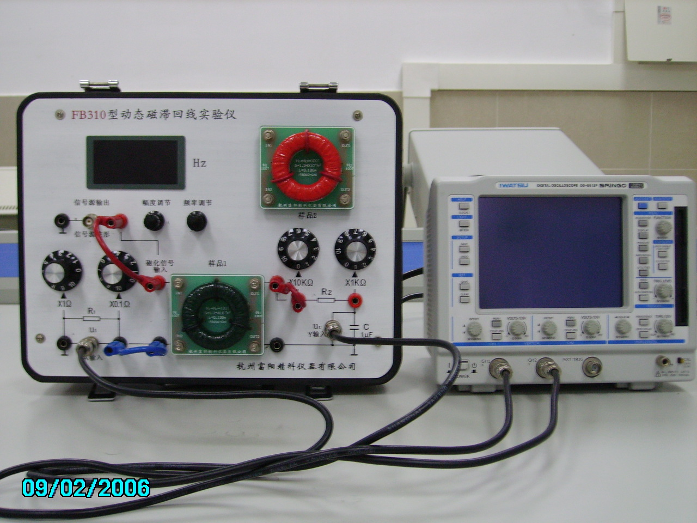
- 软磁铁
- 硬磁铁

- 示波器

<!-- slide: 22 -->

## 数据

- L=0.130 m
- S=1.24*10-4 m2
- N1=100 T, N2=100 T
- C=1.0*10-6 F
- R1= ？   R2= ?    第？号实验台
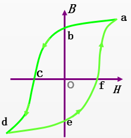
