# 磁滞回线-国际

<!-- slide: 1 -->

- 磁滞回线、居里温度测量

<!-- slide: 2 -->

- 一 、Experimental Objectives
- 1.掌握磁化曲线和磁滞回线的概念,加深对铁磁材料的剩磁、矫顽力、磁滞和磁导率的理解。
- 2.测绘出磁性样品2或3的B-H图、μ-H图和基本磁化曲线；测出样品1的居里温度。

<!-- slide: 3 -->

- Experimental principles

- 1.铁、钴、镍及其众多合金以及含铁的氧化物(铁氧体)
- 2.特性：
- （1）在外磁场作用下能被强烈磁化，故磁导率很高
- （2）磁滞：铁磁物质的磁感应强度B的变化始终落后于磁	场强度H的变化
- 铁磁物质
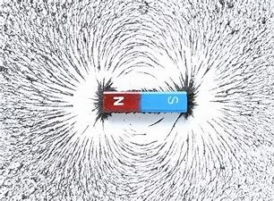
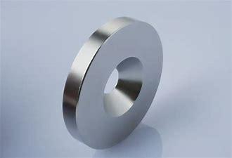

<!-- slide: 4 -->

- Experimental principles

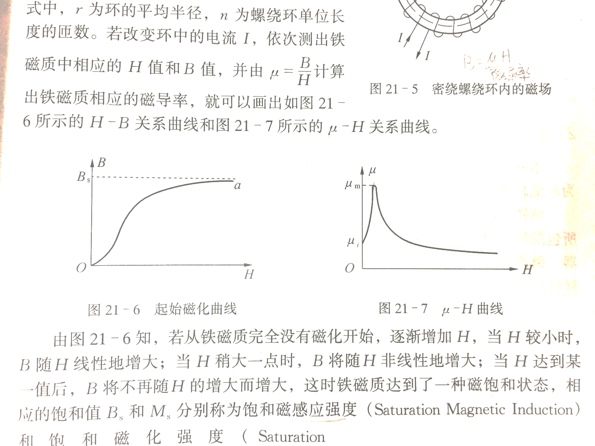
- 铁磁材料在外加磁场中被磁化，外加磁场强度H与铁磁材料内部的磁感应强度B的关系为
- B =μH，其中磁导率μ不是常量。

<!-- slide: 5 -->

- H
- B
- a(Hs,Bs)
- b
- e
- f
- O
- d(-Hs,-Bs)
- Hs
- 铁磁材料的磁滞回线
- Br
- 剩磁
- Hc
- c
- 矫顽力
- 封闭曲线abcdefa
- 称为磁滞回线
- 什么是饱和磁滞回线？

- Experiment Contents

<!-- slide: 6 -->

- Experiment Contents
- ①磁导率µ的特点
- ②剩磁；
- ③矫顽磁力，
- bc段曲线称为退磁曲线；
- ④ B的变化始终落后于H的变化，
- 这种现象称为磁滞现象。
- ⑤铁磁材料在磁化一周期内所损耗
- 的能量（也称损耗）的大小就等于磁滞回线所包围的面积的大小
- ⑥在测样品的磁滞回线前，必须对样品先进行退磁处理。
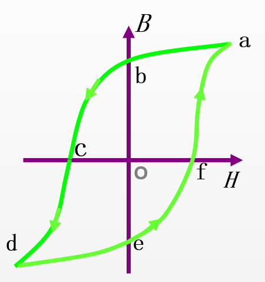

<!-- slide: 7 -->

- Experimental principles

- 硬磁材料的磁滞回线宽，剩磁和矫顽力较大（在120-20000 A/m，甚至更高），因而磁化后，它的磁感应强度能保持，适宜于制作永久磁铁。
- 软磁材料（如硅钢片）的磁滞回线窄，矫顽力小（一般小于120 A/m），但它的磁导率和饱和磁感应强度大，容易磁化和去磁，通常用于制造电机、变压器和电磁铁。
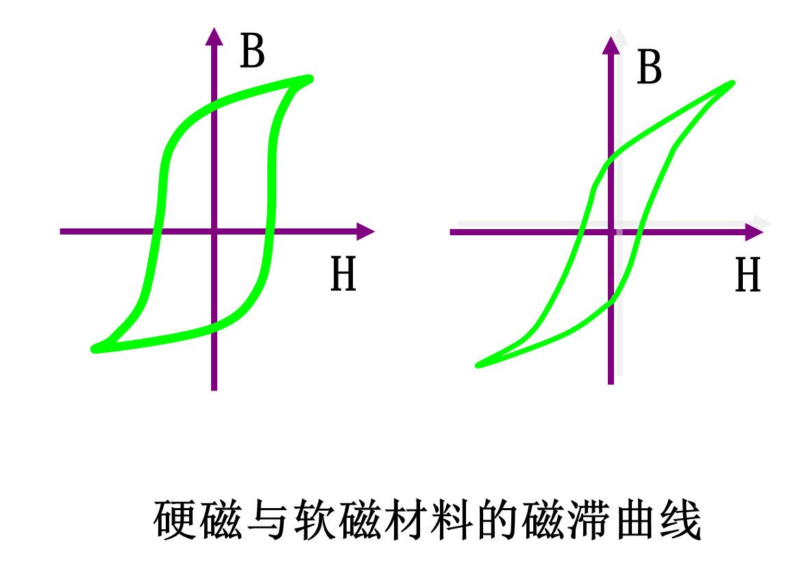

<!-- slide: 8 -->

- B
- 基本磁化曲线
- 磁性材料的磁化未达到饱和就开始退磁会出现较小的磁滞回线。
- 由一系列大小不同的稳定的磁滞回线的正顶点连成的曲线称为基本磁化曲线，如图中的oa段曲线。
- O
- a
- H
- Experimental principles

<!-- slide: 9 -->

- Experimental principles

- 铁磁材料被磁化后表现出的磁性与温度是有关的。随着铁磁物温度的升高，金属点阵热运动的加剧会影响磁畴磁矩的排列，平均磁矩随温度的升高而减小。热运动能大到足以破坏磁畴的结构时，材料的铁磁性消失变为顺磁质。铁磁性消失时所对应的温度叫做居里点温度，简称居里点，用符号TC表示。
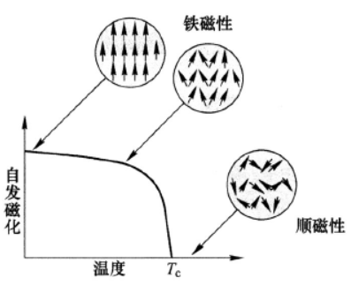

<!-- slide: 10 -->

- Experiment Contents
- 用示波器测动态磁滞回线的电路图
- N1=50       N2=150       R1=？Ω       R2=？Ω
- C=？μF        L=60 mm      S=80 mm2
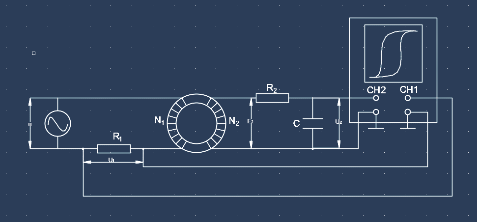
- 示波器
- 信号源
- 样品
- Uy
- Ux

<!-- slide: 11 -->

- Experiment Contents
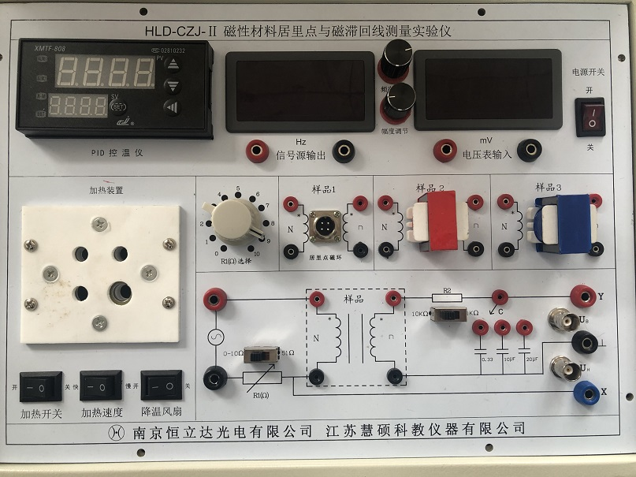

<!-- slide: 12 -->

- Experiment Contents
- 1. R1的选择开关打在左边为0~10Ω档，由其上方的10档位旋转开关决定阻值；R1的选择开关打在右边为51Ω档。R2的选择开关打在左边为10kΩ档，打在右边为1kΩ档。
- 2. 调节旋钮切换方法：按动该旋钮，切换次序为“百分位-十分位-个位-十位-百位-百分位”如此循环，转动旋钮即可改变 光标位数值。
- 3. 温度设定方法：按设置键进入设置状态，按左键选择当前位，按上、下键加减当前位数值。
- 指示:
- 删除样本文档图标,并替换为工作文档图标，如下:
- 在 Word 中创建文档.
- 返回 PowerPoint
- 在“插入”菜单中选择“对象...”
- 单击“从文件创建”
- 定位“文件”框中的文件名
- 确认选中“显示为图标”。
- 单击“确定”
- 选择图标
- 从“幻灯片放映”菜单中选择“动作设置”
- 单击“对象动作”，并选择“编辑”
- 单击“确定”
- 仪器设置

<!-- slide: 13 -->

- Experiment Contents
- 4. 选择样品2。连接电路，取样电阻R1的选择开关置于0-10Ω档，多档开关档位置于6Ω左右，R2的选择开关置于10KΩ，积分电容C选择10μF，信号源输出频率为50Hz，幅度为0V。此时示波器上应显示居中的亮点。
- 5. 调节信号源幅度旋钮逐渐增加磁化电流，使示波器显示出磁滞回线直至Y轴上B值增加缓慢，达到饱和。调节示波器使磁滞回线图形清晰、匀称、居中。
- 6. 调节信号源幅度旋钮逐渐减少磁化电流，观察磁滞回线由大变小直至缩成一点，此为退磁的过程。
- 磁滞回线

<!-- slide: 14 -->

- Experiment Contents
- 7. 从0开始逐渐增加磁化电流使磁滞回线由小到大直至饱和，期间，选择10个适当的点停下来，读取它们正顶点坐标，平滑地连接这些点即得到基本磁化曲线。
- 8. 选择12个点，描绘出完整的饱和磁滞回线。注意几个关键值的坐标要尽量准确。

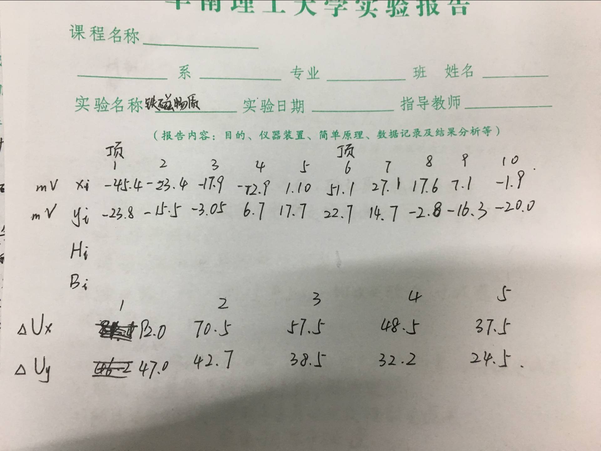

<!-- slide: 15 -->

- Experiment Contents
- 9. 加热开关关闭，将居里点探测样品A的探头端插入加热井，插头端插入面板上样品1的插座，连接电路，并选择R1=51Ω，R2=1KΩ，C=0.33μF，信号源频率为30kHz，温度设置为120℃。示波器上显示合适大小的磁滞回线。
- 10. 加热先快后慢，80℃以后注意观察示波器上的磁滞回线，记下磁滞回线消失时（变为一条单线）显示的温度值，此即测量到的居里点温度。
- 11. 打开风扇降温，观察温度低于居里温度点
- 时，屏幕上恢复磁滞回线。
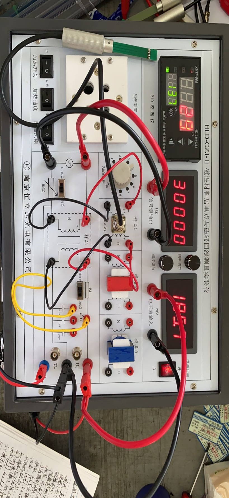
- 居里点测量

<!-- slide: 16 -->

- Experiment Contents
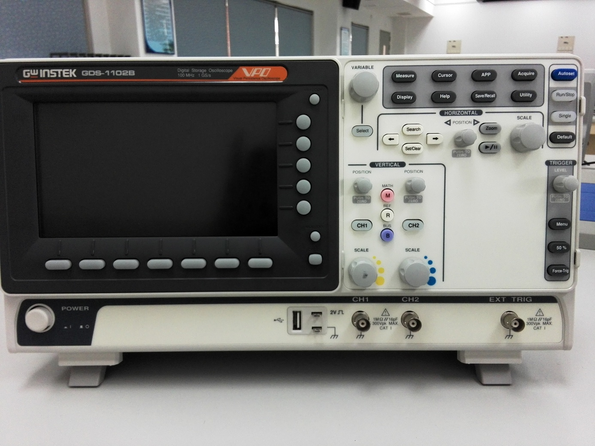
- xy方向位置调节
- 信号输入端口
- 光标测量
- Measure测量
- 调XY
- 菜单选择钮
- 示波器调节

<!-- slide: 17 -->

- Experiment Contents
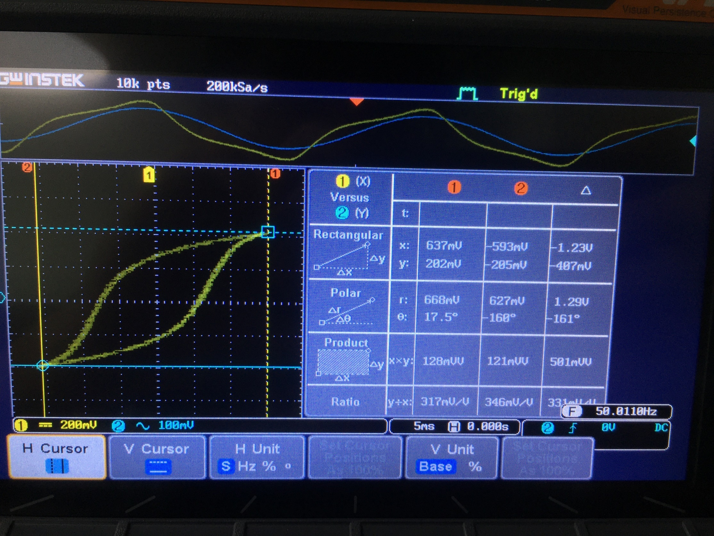

<!-- slide: 18 -->

- Experiment Contents
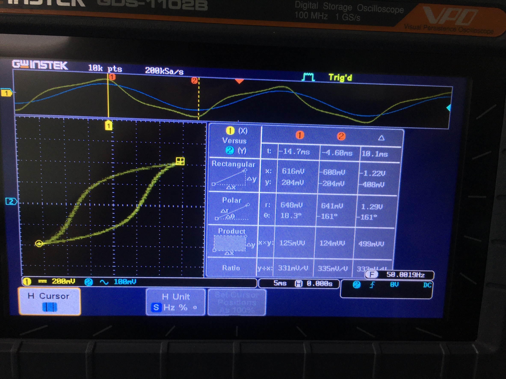

<!-- slide: 19 -->

- 谢谢！
