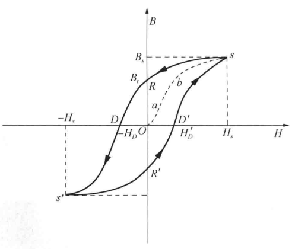
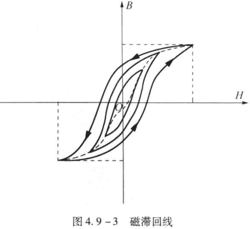
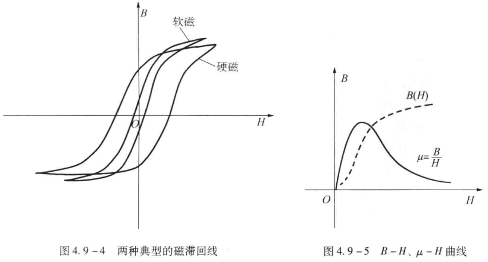
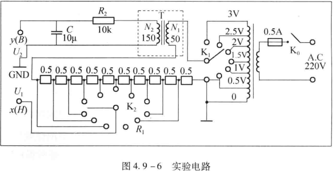
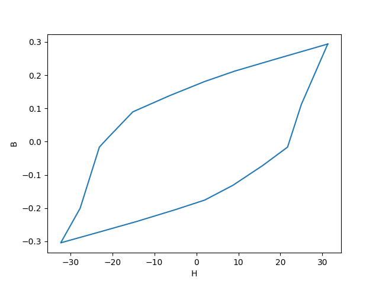
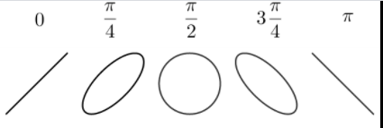

# 4.9铁磁物质磁化曲线和磁滞回线的测量 & 4.10超声波在介质中在传播速度的测量

**铁磁物质磁化曲线和磁滞回线的测量**

2022级  计算机科学与技术（全英创新班） 陈** 2022********

**一、实验目的**

(1)认识铁磁物质的磁化规律，掌握磁化曲线和磁滞回线的概念

(2)掌握用示波器显示动态磁化曲线和动态磁滞回线的原理和方法

(3)掌握使用智能型磁滞回线测试仪定量测量磁参数的方法。

**二、实验仪器**

磁滞回线实验仪、双踪示波器等。

**三、实验原理**

（一）铁磁物质及其磁化规律

**铁磁物质**是一种性能特异、用途广泛的材料。铁、钴、镍及其众多合金以及含铁的氧化物（铁氧体）均属铁磁物质。铁磁物质的特性一是**在外磁场作用下能被强烈磁化**，故磁导率很高；另一特性是**磁滞**，铁磁物质的磁感应强度$B$的变化始终落后于磁场化强度$H$的变化。铁磁物质磁感应强度$B$与磁场化强度$H$之间的关系如图4.9-2所示。

图4.9-2

图中的原点$O$表示磁化之前铁磁物质处于磁中性状态，$H$、$B$值均为零。当磁化场强度$H$从零开始增加时，磁感应强度$B$的值随之缓慢上升，如线段$Oa$；继而$B$随$H$的增大而迅速增大，如线段$ab$；其后$B$的增大又趋缓慢，并当$H$增至${H}_{s}$时，$B$值几乎不随$H$的增大而增大，即磁感应强度$B$达到饱和状态，如线段$bs$；曲线$Oabs$称为起始磁化曲线，也称为**基本磁化曲线**。

当磁化场从${H}_{s}$逐渐减小至零，磁感应强度$B$并不沿基本磁化曲线恢复到零，而是治着另一条新的曲线$sR$下降。比较线段$Os$和$sR$可知，$H$减小，$B$也相应减小，但$B$的变化滞后于$H$的变化。这种现象称为**磁滞**。磁滞的明显特征是当$H=0$时，$B$不为零，而保留剩磁${B}_{r}$。

当磁化场反向从$O$逐渐变至$-{H}_{D}$时，磁感应强度$B$消失。说明要消除剩磁${B}_{r}$必须加上足够大的反向磁场。${H}_{D}$称为**矫顽力**，它的大小**反映铁磁物质保持剩磁状态的能力**。曲线$RD$称为**退磁曲线**。

当磁场按${H}_{s}$→$O$→$-{H}_{D}$→${H}_{s'}$→$O$→${H}_{D'}$→${H}_{s}$次序变化时，相应的磁感应强度$B$则沿着闭合曲线$sRDs'R'D's$变化。这条闭合曲线称为**磁滞曲线**。当初始状态为$H=0$、$B=0$的铁磁材料在交变磁化场强度由弱到强依次进行磁化，可以得到面积由小到大向外扩张的一簇磁滞回线，如图4.9-3所示。其中**面积最大的磁滞回线称为极限磁滞回线**，亦称为饱和磁滞回线。而这一簇由小到大的磁滞回线的顶点的连线，称为铁磁材料的基本磁化曲线。

当铁磁材料处于交变磁场中时(如变压器铁芯)，将沿磁滞回线反复处于“被磁化→去磁→反向磁化→反向去磁”的过程。在此过程中要消耗额外的能量，并以热的形式从铁磁材料中释放。这种损耗称为**磁滞损耗**。可以证明，**磁滞损耗与磁滞曲线所包围的面积成正比**。

不同的铁磁材料其基本磁化曲线和饱和磁滞回线不相同，磁化曲线和饱和磁滞回线是铁磁材料分类和选用的主要依据。图 4.9-4 是常见软磁和硬磁材料的磁滞回线，其中软磁材料的磁滞回线狭长，矫顽力、剩磁和磁滞损耗均较小，是制造变压器、电机和交流电磁铁的主要材料；而硬磁材料的磁滞回线较宽，矫顽力大，剩磁强，可用来制造永磁体。

根据基本磁化曲线可以近似确定铁做材料在某一状态下的磁导率$\mu$（$\mu =B/H$）。因$\mathbf {B}$**与**$\mathbf {H}$**的关系为非线性**，所以快磁材料的磁导率$\mu$不是常数，随磁杨强度$H$的变化而变化，如图4.9-5所示。

（二）用示波器观察和测量磁滞回线

用示波器观察、测量做滞回线和基本磁化曲线的实验电路如图$4.9-6$所示。$T$为待测样品，${N}_{1}$为励磁绕组，${N}_{2}$为用来测量磁感应强度$B$而设置的副绕组，${R}_{2}C$构成积分电路，${R}_{1}$为励磁电流取样电阻。

将电阻${R}_{1}$(要求${R}_{1}$阻值远小于${N}_{1}$绕组的阻抗)上的电压${U}_{x} ={R}_{1}{I}_{1}$($I$是交变电流)加在示波器的$x$轴，则电子束在$x$轴方向的偏移与磁化电流${I}_{1}$成正比。根据安培环路定律有

${I}_{1}{N}_{1}=HL$                        	（4.9-1）

式中，${N}_{1}$为励磁线圈的匝数，$L$为铁芯的平均磁路长度，$H$为铁芯磁化场强度。所以

${U}_{x\left ( {H}\right )}={R}_{1}{I}_{1}=\frac {L{R}_{1}} {{N}_{1}}\cdot H$                 	（4.9-2）

或

$H=\frac {{N}_{1}} {L{R}_{1}}\cdot {U}_{x\left ( {H}\right )}$							（4.9-3）

式（4.9-2）表明，在交变磁场下，任意时刻$t$电子束在$x$轴方向的偏移与励磁场强度$H$成正比；式（4.9-3）则表明，在交变磁场下，通过测量取样电阻${R}_{1}$两端的电压可以测定铁芯的励磁场强度$H$。

为了获得跟样品中磁感应强度瞬时值$B$成正比的电压${U}_{y}$，它由副绕组${N}_{2}$和后面的$RC$积分电路给出。由于交变磁场$H$对样品产生交变磁感应强度$B$，在${N}_{2}$绕组内产生感应电动势

${\varepsilon }_{2}={N}_{2}\frac {ⅆ\Phi } {ⅆt}={N}_{2}S\frac {dB} {dt}$						（4.9-4）

式中，${N}_{2}$为副绕组线圆重数，$\Phi$为通过线圈平面的磁通量，$S$为铁芯根面积。

当${R}_{2}≫\frac {1} {2\pi fC}$，即${R}_{2}$阻值远远大于电容$C$的容抗时，可忽略回路的自感电动势。对于副线圈回路有

${\varepsilon }_{2}$  =  ${R}_{2}{I}_{2}$

${U}_{y\left ( {B}\right )}={U}_{C}=\frac {Q} {C}=\frac {1} {C}\int _{0} ^{t} {I}_{2}ⅆt$

$$
=\frac {1} {C{R}_{2}}\int _{0} ^{t} {\varepsilon }_{2}dt=\frac {{N}_{2}S} {C{R}_{2}}\int _{0} ^{B} ⅆB
$$

$=\frac {{N}_{2}S} {C{R}_{2}}B$								（4.9-5）

或

$B=\frac {C{R}_{2}} {{N}_{2}S}{U}_{y\left ( {B}\right )}$							（4.9-6）

式（4.9-5）说明输入示波器$y$轴的电压${U}_{y\left ( {B}\right )}$正比于铁芯的磁感应强度$B$；式（4.9-6）说明通过测量积分电容$C$上的电压${U}_{y}$，可以测量出铁芯的磁感应强度$B$。

在磁化电流变化的一个周期内，电子束的径迹扫出一条完整的磁滞回线，之后每个周期都重复此过程。由于电源频率为$50 Hz$，在荧光屏上看到的是一条**连续**的磁滞回线。

**四、实验步骤**

1.预操作：调节信号发生器的**输出频率、输出振幅**，以满足对于$R$的要求，并且要使得示波器上的磁滞回线的**图形适中**；

2.数据记录和处理:

先将样品**退磁**，再将磁场$H$由$0$开始，逐步增加至$B$达到饱和，记录对应于$H$（初级电压）的$B$（次级电压）值；

完成表格后根据表格画样品材料的磁滞回线图。

**五、数据处理**

实验数据结果如表1所示：

<table>
<tr><td>序号</td><td>1</td><td>2</td><td>3</td><td>4</td><td>5</td><td>6</td><td>7</td><td>8</td><td>9</td></tr>
<tr><td>{U}_{x}</td><td>93.5</td><td>57.2</td><td>27.2</td><td>6</td><td>-19</td><td>-45.2</td><td>-62.7</td><td>-69</td><td>-82.7</td></tr>
<tr><td>{U}_{y}</td><td>331</td><td>281</td><td>239</td><td>204</td><td>156</td><td>101</td><td>14</td><td>-18.5</td><td>-226</td></tr>
<tr><td>{H}_{i}</td><td>31.27</td><td>19.13</td><td>9.09</td><td>2.01</td><td>-6.35</td><td>-15.12</td><td>-21.00</td><td>-23.08</td><td>-27.66</td></tr>
<tr><td>{B}_{i}</td><td>0.29</td><td>0.25</td><td>0.21</td><td>0.18</td><td>0.14</td><td>0.09</td><td>0.01</td><td>-0.02</td><td>-0.20</td></tr>
<tr><td>\mu $$</td><td>0.009</td><td>0.013</td><td>0.023</td><td>0.090</td><td>-0.022</td><td>-0.006</td><td>-0.001</td><td>0.001</td><td>0.007</td></tr>
<tr><td>序号</td><td>10</td><td>11</td><td>12</td><td>13</td><td>14</td><td>15</td><td>16</td><td>17</td><td>18</td></tr>
<tr><td>{U}_{x}</td><td>-96.5</td><td>-70.2</td><td>-42.7</td><td>-15.2</td><td>6.00</td><td>26.0</td><td>47.2</td><td>64.9</td><td>74.7</td></tr>
<tr><td>{U}_{y}</td><td>-343</td><td>-308</td><td>-271</td><td>-231</td><td>-198</td><td>-148</td><td>-81</td><td>-18.5</td><td>126</td></tr>
<tr><td>{H}_{i}</td><td>-32.27</td><td>-23.48</td><td>-14.28</td><td>-5.08</td><td>2.01</td><td>8.70</td><td>15.79</td><td>21.71</td><td>24.98</td></tr>
<tr><td>{B}_{i}</td><td>-0.30</td><td>-0.27</td><td>-0.24</td><td>-0.20</td><td>-0.18</td><td>-0.13</td><td>-0.07</td><td>-0.02</td><td>0.11</td></tr>
<tr><td>\mu $$</td><td>0.009</td><td>0.012</td><td>0.017</td><td>0.040</td><td>-0.088</td><td>-0.015</td><td>-0.005</td><td>-0.001</td><td>0.004</td></tr>
</table>

表1

L = 0.130m，S = 1.24*10-4m2，N1  = 100T，N2  = 100T，C = 10-6F，R1=2.3Ω，R2=11000Ω，得到该铁磁材料的磁滞回线如图所示：

铁磁材料的磁滞回线

**六、结论及分析**

实验所用铁磁物质的磁滞回线如图3所示。

**七、实验总结**

不同的铁磁材料其基本磁化曲线和饱和磁滞回线不相同，磁化曲线和饱和磁滞回线是铁磁材料分类和选用的主要依据。图3是常见软磁和硬磁材料的磁滞回线，其中软磁材料的磁滞回线狭长，矫顽力、剩磁和磁滞损耗均较小，是制造变压器、电机和交流电磁铁的主要材料;而硬磁材料的磁滞回线较宽，矫顽力大，剩磁强，可用来制造永磁体。

**超声波在介质中在传播速度的测量**

2022级  计算机科学与技术（全英创新班） 陈** 2022********

**一、实验目的**

了解纵驻波的性质；用共振干涉法测量声速；了解作为传感器的压电陶瓷的功能。

**二、实验仪器**

超声声速测定仪、信号源、示波器等。

**三、实验原理**

（一）超声波、驻波及压电陶瓷介绍

超声波是指任何频率超过人类耳朵可以听到的最高阈值$20kHz$的声波或振动。超声波的发射和接收都需要用**换能器**。换能器的作用是**将其他形式的能量转换成超声波的能量（发射换能器）**，或**将超声波的能量转换成其他可以检测的能量（接收换能器）**。最常用的是**压电换能器**。压电晶体或压电陶瓷这类压电材料**受到应力会在材料内部产生电场**，称为**压电效应**。压电换能器把接收的超声波信号（机械振动信号）转换为电信号，从而**将机械能转换为电能**。这就是利用压电晶体的压电效应。当超声波频率与系统固有频率一致时，系统发生**共振**，此时压电换能器转换的电信号最强。压电材料还具有逆压电效应，在交变电场的作用下会产生周期性的压缩和伸长。当外加电场的频率和压电体固有频率相同时振幅最大。

从发射源发出的一定频率的平面声波，称为**发射波**。发射波经过介质传播到达接收器，如果接收面与反射面严格平行，则在接收面上垂直反射平面波。发射波与反射波相互干涉，在一定条件下形成驻波。设发射波的波动方程为

$$
{y}_{1}={A}_{1}\mathrm {cos} \left ( {\omega t-\frac {2\pi } {\lambda }x}\right )
$$

反射波的波动方程为

$$
{y}_{2}={A}_{2}\mathrm {cos} \left ( {\omega t+\frac {2\pi } {\lambda }x}\right )
$$

两者**叠加形成驻波**，驻波方程为

$$
y={y}_{1}+{y}_{2}=\left ( {2A\mathrm {cos} \frac {2\pi } {\lambda }x}\right )\mathrm {cos} \omega t
$$

式中， ${A}_{1}={A}_{2}=A$。根据驻波方程，对应$\left | {\mathrm {cos} \frac {2\pi } {\lambda }x}\right |=1$的各点**振幅最大**，称为**波腹；**对应$\mathrm {cos} \frac {2\pi } {\lambda }x=0$的各点**振幅最小**(静止不动)，称为**波节**。**相邻的两个波节点（或波腹点）之间的距离为半个波长**。

理论证明，振幅最大的点，声波的压强（简称声压)最小；相反，振幅最小处，声压最大。

（二）声速测量方法

测量声速依据的原理可以是$u=v\lambda$（$v$为声波的频率，$\lambda$为声波的波长），也可以是$u=$（$L$表示声音传播的距离，$t$表示通过这段距离所需的时间）。根据不同的原理可以有三种方法测量声速：共振干涉法、相位比较法和时差法。

1.**共振干涉法**。声波在介质中的传播速度、频率和波长之间的关系为

$$
u=v\lambda
$$

据此，只要用实验方法测量出声波的频率$v$和波长$\lambda$，就可以间接测出波速$u$。在实验中，由于声波的频率可以从超声发生器信号源的频率计读出，因此测量声速的关键是测定超声波在媒质中传播的波长$\lambda$。

前面提到，发射端超声换能器平面发出的发射波和接收端超声换能器接收平面反射的反射波在一定条件下会产生干涉形成稳定的驻波。这个条件就是**发射平面和接收平面之间的距离必须等于半波长的整数倍**，即

$$
L=n\frac {\lambda } {2}
$$

因此，可以固定发射端换能器,沿着超声波传播的方向移动接收端换能器，通过**连续探测声压极大值点**（驻波的波节点）位置就能测定超声波的**波长**（因为相邻的两个声压极大值点之间的距离为半个波长），而声压极大值点的位置可以通过**示波器所显示的波形的幅度变化**来确定。

2.**相位比较法**。声波是机械振动状态在媒质中的传播，也是振动相位的传播。所以，声源的振动通过介质传播到达接收器时，接收波和发射波之间产生相位差$∆\varphi$，它与两换能器之间的距离$L$的关系为

$$
∆\varphi =2\pi \cdot \frac {L} {\lambda }
$$

两个交流电信号的相位差可以用示波器显示的波形观测。

特殊的相位差也可以用李萨如图形观察。将发送端和接收端换能器的电信号分别接入示波署的$x$轴输入端和$y$轴输入端，使示波器处于$x-y$工作状态，示波器屏幕的光点将同时参与$x$、$y$两个方向的简谐振动。两个同频率相互垂直的简谐振动合成可以得到不同形状的李萨如图形。若四个活动的相位差$∆\varphi$呈$0\to 2\pi \to 0$的变化，则图形会由斜率为正的直线变为椭圆继而变到斜率为负的直线，再变为椭圆后变为斜率为正的直线，如图。

图1

**四、实验步骤**

（一）共振干涉法测量超声波波长

1.预操作

（1）仪器调试：连接线路后调整发射器与接收器，使两只压电换能器的端面靠拢相贴、平行，且垂直于游标卡尺，然后拉开适当距离（$3\sim 4cm$）；

（2）调节驻波共振：
- 打开各电源开关，预热后，将**信号发射器频率预置为**$\mathbf {35kHz}$；
- 此时示波器上显示的波形振幅可能很小，移动$S2$使示波器上波形振幅达到较大值；
- 再调节**信号发生器的“频率调节”旋钮**，使示波器上的波形**振幅达到最大值**，即**达到共振状态**；
- 再适当调节信号发生器的“**幅度输出**”旋钮，使示波器屏上波形振幅约占屏幕$Y$方向$3/4$大小，**记下共振频率**$\mathbf {f}$；

2.测量与数据记录

（1）缓慢移动$S2$的位置，每当示波器上显示**振幅最大**时，记录一次$S2$的位置读数共测10组数据；

（2）按**逐差法**进行数据处理，算出超声波的声速，并求其相对误差。

**五、数据处理**

<table>
<tr><td>声压极大值点坐标x/mm</td><td>{x}_{1}</td><td>{x}_{2}</td><td>{x}_{3}</td><td>{x}_{4}</td><td>{x}_{5}</td><td>{x}_{6}</td><td>{x}_{7} $$</td><td>{x}_{8} $$</td></tr>
<tr><td></td><td>4.29</td><td>9.03</td><td>13.55</td><td>18.10</td><td>22.52</td><td>27.14</td><td>31.69 $$</td><td>36.25 $$</td></tr>
<tr><td></td><td>{x}_{9}</td><td>{x}_{10}</td><td>{x}_{11}</td><td>{x}_{12}</td><td>{x}_{13}</td><td>{x}_{14}</td><td>{x}_{15} $$</td><td>{x}_{16} $$</td></tr>
<tr><td></td><td>40.03</td><td>44.54</td><td>49.13</td><td>53.59</td><td>58.21</td><td>62.74</td><td>67.33 $$</td><td>71.98 $$</td></tr>
<tr><td>$8$个半波长的距离$\frac {\lambda } {2}/mm$</td><td>35.74</td><td>35.51</td><td>35.58</td><td>35.49</td><td>35.69</td><td>35.60</td><td>35.64 $$</td><td>35.73 $$</td></tr>
<tr><td>对应测量点的声波频率$\nu /kHz$</td><td>39.093</td><td>39.093</td><td>39.093</td><td>39.093</td><td>39.093</td><td>39.093</td><td>39.093 $$</td><td>39.093 $$</td></tr>
<tr><td></td><td>39.093</td><td>39.093</td><td>39.093</td><td>39.093</td><td>39.093</td><td>39.093</td><td>39.093 $$</td><td>39.093 $$</td></tr>
</table>

表1 共振干涉法实验数据

根据标准偏差的计算公式及误差传递原理，得到：$\hat {\lambda }=8.905625mm$，${\sigma }_{\hat {\lambda }}=0.0005$，$\hat {\nu }=39.093kHz$，${\sigma }_{\hat {\nu }}=0$，$\hat {u}=348.1476m/s$，${\sigma }_{u}=0.7492$。故实验测得超声波的声速为$u\pm {\sigma }_{u}=348.1476\pm 0.7492\left ( {m/s}\right )$。

**六、结论及分析**

实验测得超声波的声速为$u\pm {\sigma }_{u}=348.1476\pm 0.7492\left ( {m/s}\right )$。

**七、实验总结**

本实验通过示波器得到图像，获取超声波的频率，再通过图像的周期性求得超声波的波长，进而求出超声波的声速，实验一环扣一环，非常巧妙。
