# 变温霍尔效应&三线摆测转动惯量

**变温霍尔效应**

邓**  计科全英创新班 2022********

**一、实验目的**

1.了解霍尔效应的原理以及霍尔器件的有关参数。

2.通过测量霍尔电压来计算霍尔系数。

3.通过变温霍尔实验，得到霍尔参数的温度特性曲线。

4.通过数据处理计算出不同温度下的霍尔灵敏度、霍尔系数，并计算禁带宽度。

**二、实验仪器**

COC--BWHL变温霍尔效应实验平台，COC-BWHL-C变温霍尔效应测试仪，COC-PS通用电源，COC-HL-Z霍尔转接盒。

**三、实验原理**

**1.** **霍尔效应（霍尔电压、霍尔系数、霍尔元件的灵敏度等概念及相应的物理关系式）**

运动的带电粒子在磁场中受洛仑兹力*f**L*的作用而偏转。当带电粒子（电子或空穴）被约束在固体材料中，这种偏转就导致在垂直电流和磁场的方向上产生正负电荷在不同侧的聚积，从而形成附加的横向电场。这种现象即霍尔效应。

如图所示，磁场*B*位于Z的正向，与之垂直的半导体薄片上X正向通以工作电流*I**S*，假设载流子为电子（N型半导体材料），它沿着与电流*I**S*相反的X负向运动。

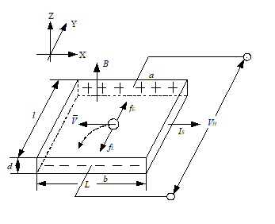

洛伦兹力用矢量式表示为：

（1）

式中*e*为电子电量，为电子运动平均速度，*B*为磁感应强度。

由于洛伦兹力*f**L*的作用，电子即向图中虚线箭头所指的位于Y轴负方向的a侧偏转，并使b侧积累电子，而相对的a侧形成正电荷积累。与此同时运动的电子还受到由于两种积累的异种电荷形成的反向电场力*f**E*的作用。随着电荷积累量的增加，*f**E*增大，当两力大小相等（方向相反）时，*f**L*=  *-f**E*，则电子积累便达到动态平衡。这时在a、b两端面之间建立的电场称为霍尔电场*E**H*，相应的电势差称为霍尔电势*V**H*。

电场作用于电子的力为：

（2）

当达到动态平衡时：

（3）

设霍尔元件宽度为，厚度为*d*，载流子浓度为*n*，则霍尔元件的工作电流为：

（4）

由（3）、（4）两式可得：

（5）

即霍尔电压*V*H与*I*S、*B*的乘积成正比，与霍尔元件的厚度*d*成反比。

取霍尔系数，则有：

                                                                （6）

对于*d*已知的霍尔元件，其霍尔元件灵敏度*K**H*为：

                                                      （7）

由于电导率*σ*与载流子浓度*n*以及载流子迁移率*μ*之间关系如下：

                                                                      （8）

故在得到霍尔系数*R**H*后，只需测得其电导率*σ*或电阻率*ρ*，即可求出载流子迁移率*μ*为：

                                                                （9）

**2.** **用对称测量法消除相关副效应**

测量霍尔电势*V**H*时，不可避免地会产生一些副效应，由此而产生的附加电势叠加在霍尔电势上，形成测量系统误差，这些副效应有：
1. 不等位电势*V**0*

由于制作时，两个霍尔电极不可能绝对对称地焊在霍尔元件两侧（图 2a）、霍尔元件电阻率不均匀、工作电流极的端面接触不良（图 2b）都可能造成C、D两极不处在同一等位面上，此时虽未加磁场，但C、D间存在电势差*V**0*，称为不等位电势，*V*0=*I**S**R**0*，*R**0*是C、D两极间的不等位电阻。由此可见，在*R**0*确定的情况下，*V**0*与*I**S*的大小成正比，且其正负随*I**S*的方向改变而改变。

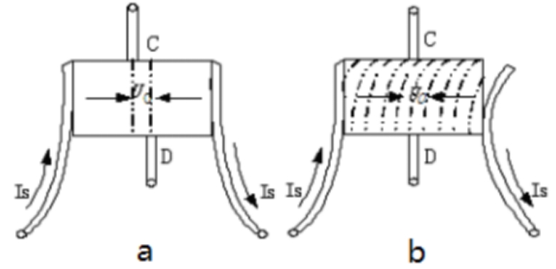

图 2 不等位电势
1. 爱廷豪森（Eting hausen）效应

当霍尔元件的X方向通以工作电流*I**S*，Z方向加磁场*B*时，由于霍尔元件内的载流子速度服从统计分布，有快有慢。在达到动态平衡时，在磁场的作用下慢速与快速的载流子将在洛伦兹力和霍尔电场的共同作用下，沿Y轴分别向相反的两侧偏转，这些载流子的动能将转化为热能，使两侧的温度不同，因而造成Y方向上两侧出现温差（*ΔT=T**C**–T**D*）。

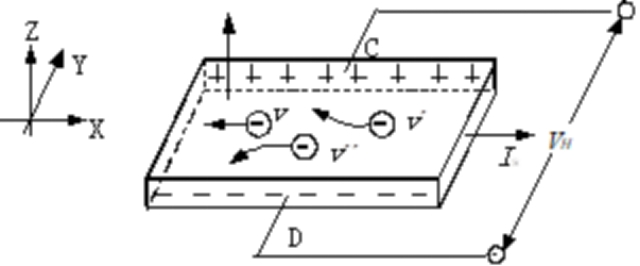

图 3 霍尔元件中电子实际运动情况（图中v΄<v ，v΄΄>v）

因为霍尔电极和元件两者材料不同，电极和元件之间形成温差电偶，这一温差在C、D间产生温差电动势*V**E*，*V**E*∝*I**S**B*。

这一效应称爱廷豪森效应，*V**E*的大小及正负符号与*I**S*、*B*的大小和方向有关，跟*V**H*与*I**S*、*B*的关系相同，所以不能在测量中消除。
1. 伦斯脱（Nernst）效应

由于工作电流的两个电极与霍尔元件的接触电阻不同，工作电流在两电极处将产生不同的焦耳热，引起工作电流两极间的温差电动势，此电动势又产生温差电流（称为热电流）*I**Q*，热电流在磁场作用下将发生偏转，结果在Y方向上产生附加的电势差*V**N*且*U**N**∝**I**Q**B*，这一效应称为伦斯脱效应，由上式可知*V**N*的符号只与*B*的方向有关。
1. 里纪-勒杜克（Righi-Leduc）效应

如3)所述霍尔元件在X方向有温度梯度，引起载流子沿梯度方向扩散而有热电流*I**Q*通过霍尔元件，在此过程中载流子受Z方向的磁场*B*作用，在Y方向引起类似爱廷豪森效应的温差*ΔT=T**C**-T**D*，由此产生的电势差*V**R*∝*I**Q* *B*，其符号与*B*的方向有关，与*I**S*的方向无关。

在确定的磁场*B*和工作电流*I**S*下，实际测出的电压是*V**H* 、*V**0* 、*V**E* 、*V**N* 和*V**R*这5种电势差的代数和。上述5种电势差与*B*和*I**S*方向的关系如下：

<table>
<tr><td>*V**H*</td><td>*V**0*</td><td>*V**E*</td><td>*V**N*</td><td>*V**R*</td></tr>
<tr><td>*B*</td><td>*I**S*</td><td>*B*</td><td>*I**S*</td><td>*B*</td><td>*I**S*</td><td>*B*</td><td>*I**S*</td><td>*B*</td><td>*I**S*</td></tr>
<tr><td>有关</td><td>有关</td><td>无关</td><td>有关</td><td>有关</td><td>有关</td><td>有关</td><td>无关</td><td>有关</td><td>无关</td></tr>
</table>

为了减少和消除以上效应引起的附加电势差，利用这些附加电势差与霍尔元件工作电流*I**S*、磁场*B*（即相应的励磁电流*I*M）的关系，采用对称（交换）测量法测量C、D间电势差：

当*+I**M**，+I**s*时     *V**CD1**=+V**H* *+V**0* *+V**E* *+V**N* *+V**R*

当*+I**M**，- I**s*时      *V**CD2**=-V**H* *-V**0* *-V**E* *+V**N**+V**R*

当*- I**M**，- I**s*时     *V**CD3**=+V**H* *-V**0* *+V**E* *-V**N* *-V**R*

当*- I**M**，+I**s*时    *V**CD4**=-V**H* *+V**0* *-V**E* *-V**N* *-V**R*

对以上四式作如下运算：

	（10）

可见，除爱廷豪森效应以外的其他副效应产生的电势差会全部消除，因爱廷豪森效应所产生的电势差*V**E*的符号和霍尔电势*V**H*的符号，与*I**S*及*B*的方向关系相同，故无法消除，但在非大电流、非强磁场下，*V**H**>>V**E*，因而*V**E*可以忽略不计，故有：

	（11）

**3.** **霍尔系数随温度的变化的关系式，及半导体的禁带宽度测量方法**

半导体内载流子的产生有两种不同机制：本征激发和杂质电离，根据其中占主导地位的载流子浓度类型，随着温度的变化，可以从低到高分为三个区域：

杂质电离区：当温度极低时（几十°K），杂质电离占主导地位，以N型半导体为例，其载流子主要来自施主杂质电离产生的电子；

饱和电离区：温度逐渐升高后杂质全部电离，但本征激发尚未占据主导地位，杂质电离产生的载流子浓度远大于本征激发；

本征导电区：本征激发为主的高温区，此时由于本征半导体中价带电子也激发到导带，本征载流子浓度大大超过杂质电离产生的载流子浓度，霍尔系数*R**H*只由本征载流子浓度决定，不同杂质类型和掺杂浓度的半导体的霍尔系数都将随温度升高而呈指数下降。

当半导体处于本征区时，本征激发产生的载流子浓度*n**i*为：

                （12）

式中*n**n*为电子浓度，*n**p*为空穴浓度，*N**C*和*N**V*分别为导带和价带有效能级密度，*E**C*和*E**V*分别为导带底和价带顶的能量，*K’*为常数，*T*为热力学温度，*E**g*为禁带宽度，*k**B*为玻尔兹曼常量。

由于载流子浓度随温度变化，N型和P型半导体中霍尔系数*R**H*和温度*T*的关系大致如图 4所示：

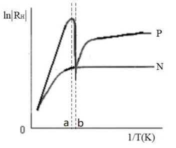

图 4

定义*μ**p*和*μ**n*分别为空穴和电子的迁移率，*b*为空穴和电子的迁移率比，在由饱和电离区向本征导电区过渡的过程中，N型半导体和P型半导体会有不同的变化曲线：

对于N型半导体，在饱和电离区和本征导电区，始终有*n**n**μ**n**2*> *n**p**μ**p**2*，所以霍尔系数*R**H*总有负值，在进入本征导电区后，霍尔系数*R**H*的绝对值随温度升高而降低；

对于P型半导体，在饱和电离区时，以杂质电离导电为主，霍尔系数*R**H*为正值，在饱和电离区向本征导电区过渡的过程中，当*n**n**μ**n**2*= *n**p**μ**p**2*时，会出现*R**H*=0，即图中的b点，之后温度继续升高，霍尔系数*R**H*转为负值，当价带的空穴数*n**p=**n**n**+**N**A*（*N**A*为受主杂质浓度）时，会出现一个负端的极值点*R**HM*，即图中的a点，之后温度继续升高，霍尔系数*R**H*的绝对值随温度升高而降低。

对于电子和空穴混合导电的半导体，在只考虑晶格散射及弱磁场的条件下，半导体的霍尔系数为：

                 （13）

其中*e*为电子电荷，对于本征导电区的半导体，*n**n**=n**p*，则：

                              （14）

根据公式（12）和（14）则可得：

                         （15）

在高温时，（*T**-3/2*）项对*R**H*的影响远小于exp(*E**g**/2k**B**T*)的影响，取对数可得：

                           （16）

根据本征区的实验结果，做出的曲线，通过最小二乘拟合得到禁带宽度：

                            （17）

**四、实验内容**

按以下步骤，测量样品在不同温度下的霍尔电压VH：

1.将霍尔转接盒上的三个换向开关分别设置至“霍尔模式”、“正向”、“正向”状态。

2.在测试仪主菜单选择“温度设置”，设置所需的实验温度。

3.选择“霍尔/磁阻效应测量”返回到实验测量界面, 调整测试仪面板右侧的旋钮将样品的工作电流预设为2.00mA。

4.将转接盒的励磁电流方向开关分别设在“正向”和“反向”, 分别记录B1和B2。

5.按下表调节样品的工作电流(Is)的大小,依次改变工作电流和励磁电流的方向,测量并记录电压。

6.设置不同的温度(25,30,35,40度),重复以上实验步骤。

实验数据记录如下：

<table>
<tr><td>工作温度：25℃  励磁电流：0.300A    B1:766Gs  B2:-759Gs</td></tr>
<tr><td>Is(mA)</td><td>V1(mV)</td><td>V2(mV)</td><td>V3(mV)</td><td>V4(mV)</td><td>VH=(V1-V2+V3-V4)/4</td></tr>
<tr><td></td><td>(Is正，IM正)</td><td>(Is反，IM正)</td><td>(Is反，IM反)</td><td>(Is正，IM反)</td><td></td></tr>
<tr><td>2</td><td>249.37</td><td>-249.19</td><td>240.47</td><td>-240.52</td><td>244.89</td></tr>
<tr><td>2.4</td><td>295.71</td><td>-295.55</td><td>284.66</td><td>-284.63</td><td>290.14</td></tr>
<tr><td>2.8</td><td>340.31</td><td>-340.03</td><td>327.11</td><td>-327.12</td><td>333.64</td></tr>
<tr><td>3.2</td><td>385.53</td><td>-382.27</td><td>368.25</td><td>-368.18</td><td>376.06</td></tr>
<tr><td>3.6</td><td>424.11</td><td>-423.67</td><td>407.25</td><td>-407.16</td><td>415.55</td></tr>
<tr><td>4</td><td>461.48</td><td>-460.89</td><td>444.05</td><td>-443.97</td><td>452.60</td></tr>
</table>

<table>
<tr><td>工作温度：30℃  励磁电流：0.300A    B1:775Gs  B2:-760Gs</td></tr>
<tr><td>Is(mA)</td><td>V1(mV)</td><td>V2(mV)</td><td>V3(mV)</td><td>V4(mV)</td><td>VH=(V1-V2+V3-V4)/4</td></tr>
<tr><td></td><td>(Is正，IM正)</td><td>(Is反，IM正)</td><td>(Is反，IM反)</td><td>(Is正，IM反)</td><td></td></tr>
<tr><td>2</td><td>229.32</td><td>-229.09</td><td>220.54</td><td>-220.49</td><td>224.86</td></tr>
<tr><td>2.4</td><td>272.10</td><td>-271.93</td><td>261.76</td><td>-261.70</td><td>266.87</td></tr>
<tr><td>2.8</td><td>313.10</td><td>-312.76</td><td>301.41</td><td>-301.28</td><td>307.14</td></tr>
<tr><td>3.2</td><td>352.49</td><td>-352.16</td><td>339.01</td><td>-338.68</td><td>345.59</td></tr>
<tr><td>3.6</td><td>391.23</td><td>-390.85</td><td>376.34</td><td>-376.24</td><td>383.67</td></tr>
<tr><td>4</td><td>427.21</td><td>-426.80</td><td>411.29</td><td>-411.23</td><td>419.13</td></tr>
</table>

<table>
<tr><td>工作温度：35℃  励磁电流：0.300A    B1:771Gs  B2:-762Gs</td></tr>
<tr><td>Is(mA)</td><td>V1(mV)</td><td>V2(mV)</td><td>V3(mV)</td><td>V4(mV)</td><td>VH=(V1-V2+V3-V4)/4</td></tr>
<tr><td></td><td>(Is正，IM正)</td><td>(Is反，IM正)</td><td>(Is反，IM反)</td><td>(Is正，IM反)</td><td></td></tr>
<tr><td>2</td><td>211.48</td><td>-211.35</td><td>203.44</td><td>-203.46</td><td>207.43</td></tr>
<tr><td>2.4</td><td>251.00</td><td>-250.81</td><td>241.38</td><td>-241.28</td><td>246.12</td></tr>
<tr><td>2.8</td><td>288.67</td><td>-288.28</td><td>277.60</td><td>-277.52</td><td>283.02</td></tr>
<tr><td>3.2</td><td>325.04</td><td>-324.70</td><td>312.92</td><td>-312.80</td><td>318.87</td></tr>
<tr><td>3.6</td><td>359.82</td><td>-359.55</td><td>346.57</td><td>-346.49</td><td>353.11</td></tr>
<tr><td>4</td><td>394.52</td><td>-394.17</td><td>379.61</td><td>-379.57</td><td>386.97</td></tr>
</table>

<table>
<tr><td>工作温度：40℃  励磁电流：0.300A    B1:738Gs  B2:-728Gs</td></tr>
<tr><td>Is(mA)</td><td>V1(mV)</td><td>V2(mV)</td><td>V3(mV)</td><td>V4(mV)</td><td>VH=(V1-V2+V3-V4)/4</td></tr>
<tr><td></td><td>(Is正，IM正)</td><td>(Is反，IM正)</td><td>(Is反，IM反)</td><td>(Is正，IM反)</td><td></td></tr>
<tr><td>2</td><td>195.14</td><td>-194.97</td><td>187.96</td><td>-187.89</td><td>191.49</td></tr>
<tr><td>2.4</td><td>231.97</td><td>-231.74</td><td>223.26</td><td>-222.76</td><td>227.43</td></tr>
<tr><td>2.8</td><td>266.40</td><td>-266.16</td><td>256.44</td><td>-256.41</td><td>261.35</td></tr>
<tr><td>3.2</td><td>300.11</td><td>-299.75</td><td>288.97</td><td>-288.94</td><td>294.44</td></tr>
<tr><td>3.6</td><td>332.77</td><td>-332.56</td><td>320.39</td><td>-320.37</td><td>326.52</td></tr>
<tr><td>4</td><td>365.25</td><td>-365.16</td><td>351.72</td><td>-351.76</td><td>358.47</td></tr>
</table>

通过实验数据计算样品在不同温度*T*下的霍尔系数*R*H，再拟合出样品的禁带宽度*E*g：

1．取B=(B1-B2)/2，样品厚度d=1.25mm，使用最小二乘法计算样品在当前工作温度下的霍尔灵敏度KH和霍尔系数RH；

根据公式*V**H* *= K**H* *I**S* *B*，由最小二乘法求不同温度下样品的*V**H*-*I**S* *B*图象：

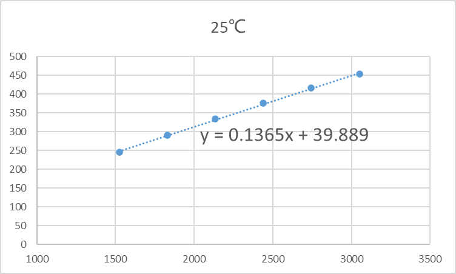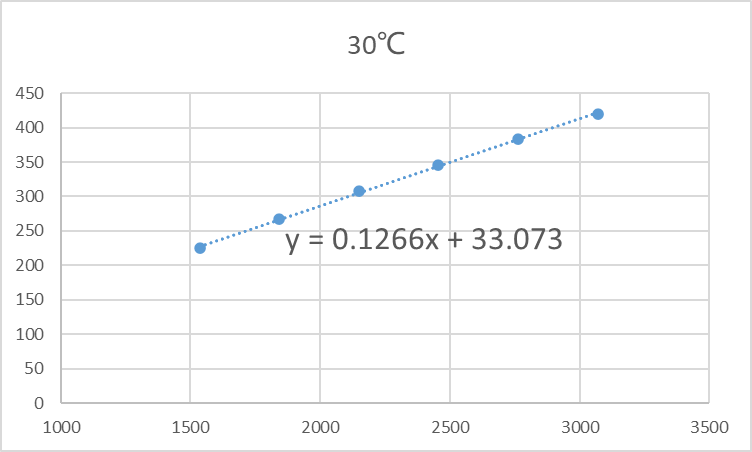

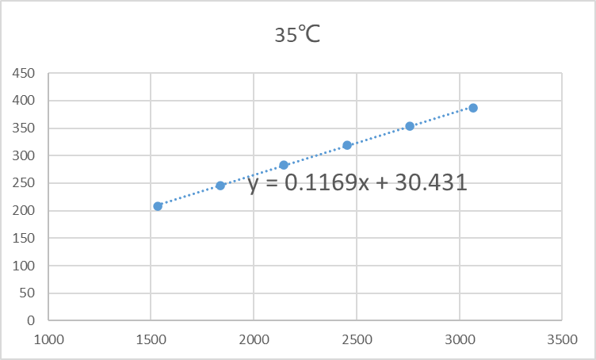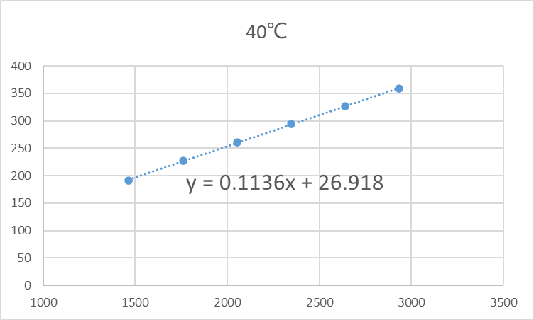

其斜率即为KH，进而由公式${R}_{H}={K}_{H}\cdot d$可得RH：

| 温度 | 25℃ | 30℃ | 35℃ | 40℃ |
|---|---|---|---|---|
| KH | 0.1365 | 0.1266 | 0.1169 | 0.1136 |
| RH | 1.71×10-4 | 1.58×10-4 | 1.46×10-4 | 1.42×10-4 |

1. 在取得4组以上不同温度点的霍尔系数RH后，根据公式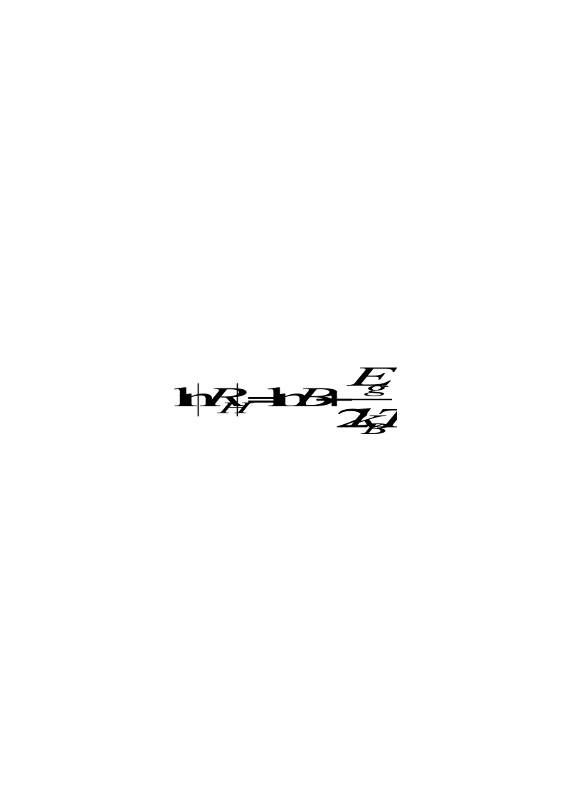使用最小二乘法，绘制图象。（相关参数：玻尔兹曼常数：kB=1.3806505×10-23J/K，电子电荷e=1.602176634×10-19C，绝对零度0K=-273.15℃，常温下锑化铟禁带宽度：Eg=0.18eV）

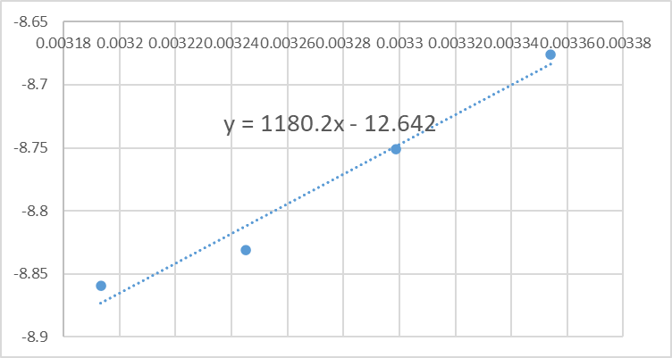

其斜率为1180.2，由公式可得，半导体的禁带宽度*E*g=0.203eV，与常温下标准值比较，不确定度为12.78%。

**五、实验总结**

本实验通过测量霍尔元件在不同温度、不同工作电流下的电势差、磁场强度，利用对称测量法消除相关副效应，再利用最小二乘法处理数据，计算各温度下的霍尔灵敏度、霍尔系数，最终得到半导体的禁带宽度是0.203eV，不确定度为12.78%，误差在可以接受的范围内。因为本实验对数据精度要求较高，在实验过程中，需尽量等待电势差及磁场强度示数保持稳定，且达到目标温度，再记录数据，否则会放大误差。同时，由于本实验数据规模相对较大，需要注意按公式严谨正确处理，消除偶然误差，保证结果合理。

**三线摆测转动惯量**

邓**  计科全英创新班 2022********

**一、实验目的**

1.了解三线摆原理。

2.学会用累积放大法测量周期运动的周期。

3.掌握用三线摆法测定刚体的转动惯量。

**二、实验仪器**

三线摆实验套件，计时计数器，游标卡尺，钢卷尺，电子天平。
- **实验原理**

**1.转动惯量**

转动惯量，是刚体绕轴转动时惯性（回转物体保持其匀速圆周运动或静止的特性）的量度，用字母I或J表示。在经典力学中，转动惯量（又称质量惯性矩，简称惯矩）通常以I或J表示，SI 单位为 kg·m²。对于一个质点，I = mr²，其中 m 是其质量，r 是质点和转轴的垂直距离。

转动惯量在旋转动力学中的角色相当于线性动力学中的质量，可形式地理解为一个物体对于旋转运动的惯性，用于建立角动量、角速度、力矩和角加速度等数个量之间的关系。

**2.三线摆测物体转动惯量**

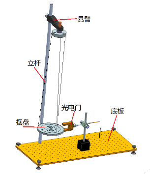

上图是三线摆实验装置的示意图。上、下圆盘均处于水平，悬挂在横梁上。三个对称分布的等长悬线将两圆盘相连。上圆盘固定，下圆盘可绕中心轴作扭摆运动。当下盘转动角度很小，且略去空气阻力时，扭摆的运动可近似看作简谐运动。根据能量守恒定律和刚体转动定律均可以导出物体绕中心轴的转动惯量。

其中，为下盘的质量；、分别为上下悬点离各自圆盘中心的距离；为平衡时上下盘间的垂直距离；为下盘作简谐运动的周期，为重力加速度。

将质量为的待测物体放在下盘上，并使待测刚体的转轴与轴重合。测出此时三线摆摆动周期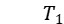和上下圆盘间的垂直距离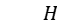。同理可求得待测刚体和下圆盘对中心转轴的总转动惯量为:

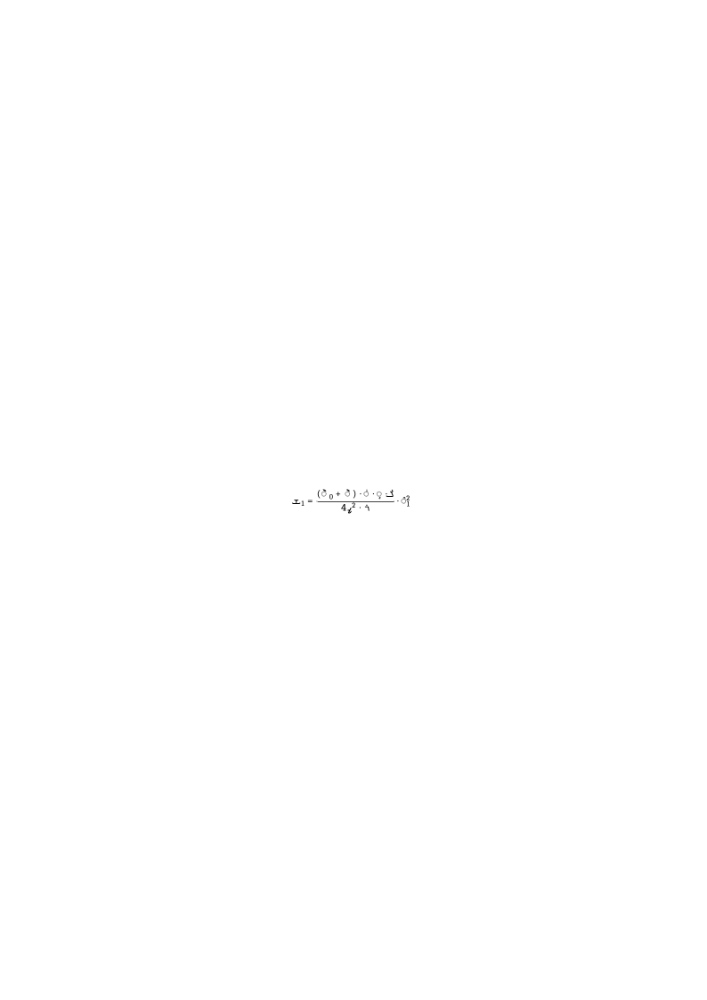

如不计因重量变化而引起的悬线伸长，即，则待测物体绕中心轴的转动惯量为：

因此，通过长度、质量和时间的测量，便可求出刚体绕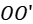轴的转动惯量。

**四、实验内容**

**1．测量悬盘的转动惯量*****J******0***

**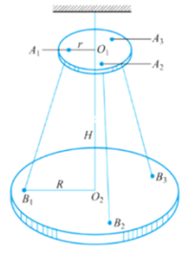**

m0  = 600g,  H =  67.43cm,  R =  8.05cm,  r =  3.12cm, g=9.8m/s2；

| 测量次数 | 1 | 2 | 3 | 4 | 5 | 平均值 | *T**0* |
|---|---|---|---|---|---|---|---|
| 15个周期(s) | 33.365 | 32.867 | 32.492 | 32.158 | 31.883 | 32.553 | 2.170 |

**2．测量小圆柱体的转动惯量*****J***

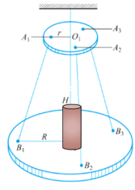

小圆柱体:  *m*(质量) =  58.5g          2*R**x*(直径) =  3.20cm

| 测量次数 | 1 | 2 | 3 | 4 | 5 | 平均值 | *T* |
|---|---|---|---|---|---|---|---|
| 15个周期(s) | 31.327 | 31.201 | 31.095 | 30.997 | 30.894 | 31.103 | 2.074 |

数据处理：
1. 计算悬盘的转动惯量J0。

由公式****及测得数据可得，悬盘的转动惯量J0 =2.625×10-3  kg·m2

2.计算小圆柱体的转动惯量J，将测得值的与理论公式  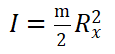计算值相比较，计算不确定度。

由公式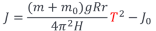及测得数据可得，小圆柱体的转动惯量J  =6.673×10-6  kg·m2

由公式得，小圆柱体的转动惯量理论值为I =7.488×10-6  kg·m2

不确定度为| (J - I) / I | = 10.88%

**五、实验总结**

本实验主要通过累计放大法测量刚体的转动惯量，测得小圆柱体转动惯量为6.673×10-6  kg·m2，不确定度为10.88%。需要注意的是，由于转动惯量数值较小，对精度要求高，且三线摆转动状态多变，难以控制，以及使用卷尺测量长度的精度较低，所以与理论值相比，本实验的不确定度较大，但仍在可接受范围之内。
