# 实验讲义 阿贝成像和空间滤波实验

**阿贝成像原理与空间滤波**

2022级 计算机科学与技术（全英创新班） 陈宇勋  202230430026

光学信息处理，是指对光学图像或光波的振幅分布作进一步的处理。自1874  年阿贝成像理论提出以来，近代光学信息处理通常在频域中进行。用空间频谱的语言分析光信息，在图样的频谱面上设置各种空间滤波器，对图像的频谱进行改造，滤去不需要的光信息和噪声，提取感兴趣的光信息，再经过一个透镜将滤波后的频谱还原成空域中经过修改的图像或信号。光学信息处理在信息存储、图像识别、遥感医疗、产品质检等方面有重要的应用。

**一 实验目的**

1.熟悉阿贝成像原理，了解孔径成像对分辨率的影响；

2.加深对成像过程的傅里叶变换的理解；

3.加深对光学空间频率和空间滤波概念的理解。

**二 实验仪器**

He-Ne激光器及电源、扩束镜，准直透镜，一维光栅，“光”字网格光栅，箭屏，傅里叶变换透镜，频谱滤波器。

**三 实验原理**

**1.空间频率**

通常“频率”是指描述时间信号周期性的物理量，即单位时间内某物理量变化的周期数。为描述空间信号的周期性，我们引入“空间频率”的概念，即单位长度内空间信号变化的周期数，其单位是“周／米”，或“线数／米”。例如，光栅常数d=2x10-5m,则此光栅的空间频率f=1/d，即f=50x104线／米。几何空间一般是三维的，空间频率在3个独立的方向上一般是不同的。以二维干涉等距直条纹为例：令X方向条纹间的周期长度为Tx，Y方向条纹间的周期长度为Ty，如图1所示，则在X、Y方向的空间频率分别为

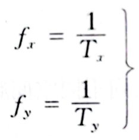

（1）

输入光学成像系统（如望远镜、显微镜等）的信息就是被观察的物体，从系统输出的信息就是所成的像。一张复杂的图像可以看作由许多不同空间频率的单频信息组成，所以光学成像系统所处理、传递的信息是空间性的，因此空间频率是傅里叶光学的重要概念。

时间频率：单位时间内某物理量变化的周期数，是描述时间信号周期性的物理量。

**2.透镜的二维傅里叶变换性质**

在信息光学中，对光的传播现象和成像过程常用傅里叶变换来表达和处理。如果在焦距为F的会聚透镜的前焦面（X-Y面）上放一振幅透射率为g(x,y)的图像作为物，并以波长λ为的相干平行光垂直照明此物，则在透镜后焦面（ζ-η面）得到物的精确傅里叶变换关系为

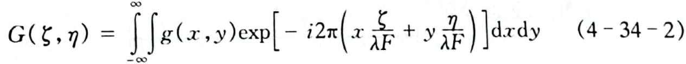

（2）

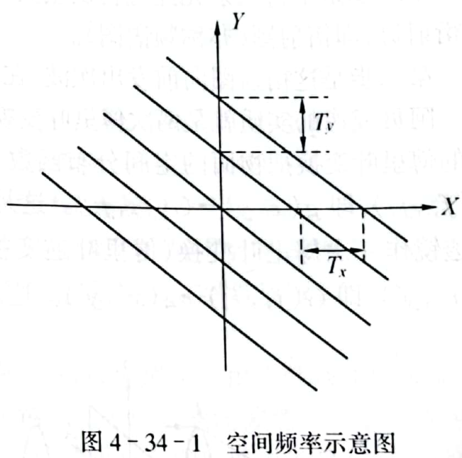

图1  空间频率示意图

其中g(x,y)是物的光场复振幅分布；F是透镜焦距；G(ζ-η)是透镜后焦面上的光场复振幅分布。令空间频率fx，fy为

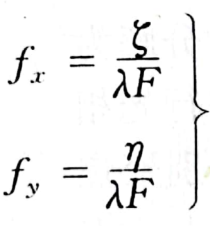

（3）

透镜的后焦面(ζ-η面)称为频谱面(或称傅氏面)，  G（ζ-η）为g（x，y）的空间频谱。

ζ，η较大处(即远离光轴处)  集中了物频谱的高频成分，它反映物面上的精细结构和突变部分;

ζ，η较小处(即靠近光轴处)  集中了物频谱的低频成分，它反映物面上一些粗大缓慢变化的结构;

ζ=η= 0处是物函数零频成分，反映物面上的均匀照明

**3.阿贝成像原理**

物体是由许多不同方位、不同空间频率的光栅构成的。物体通过透镜成像的过程分为两步:

①平行入射光经过物发生夫琅和费衍射，在透镜的后焦面上形成一系列衍射斑，即傅里叶频谱--这是信息分解。

②将后焦平面上的频谱看成新的“波面”，频谱图上的各发光点发出的球面次波在像平面上相干叠加而形成原物的像--这是信息合成。

为了方便起见，可以用一维光栅作物来说明成像的这两个过程。如图2，单色平行光照在光栅上，经衍射分解为不同方向的很多束平行光（每束平行光相应于一定的空间频率），经物镜分别聚焦透镜在后焦面上形成亮斑点阵。光轴上一点是0级衍射，其他依次为±1、±2……级衍像射。从傅里叶光学来看，这些光点正好对应于光栅的各傅里叶分量，0级为零频分量；±1级为基频分量，它产生一个对应于空间频率f1(即原来光栅空间频率）的余弦光栅的像；2级为倍频分量，它在像面上产生一个空间频率为2f1的余弦光栅像……其他以此类推。因此物镜后焦面的振幅分布就反映了光栅（物）的空间频谱。这一后焦面称为频谱面或傅里叶变换面。而在频谱面上的这些代表不同频率的各亮点最后发出球面波重新在像面上复合而成像。

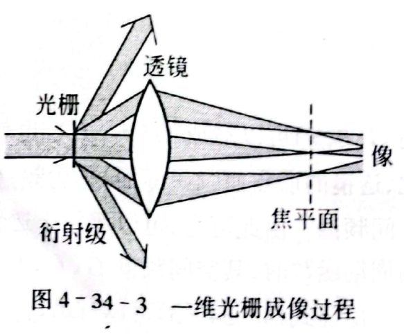

图2  一维光栅成像过程

如果两次傅里叶变换是完全理想的，即没有丢失任何信息，那么物像是完全相似的。但一般来说，由于透镜的孔径总是有限的，总有一部分衍射角较大的成分（高频信息）不能进入物镜而被丢弃，所以像的信息总比物的信息少，像与物不可能完全一样。高频信息丢失越多，像与物的差异就越大。

**4.空间滤波**

任何一个物都具有与之对应的确定的空间频谱。若在频谱面放一模板进行选频或改变某些频率的相位，则像面上的图像就会发生相应的变化，这个过程就称为~。

空间滤波的依据：

①傅里叶频谱是物平面上各种空间频率成分的能量分布图:物平面上某种频率成分越多对应的光点越亮。

②光点离开频谱中心的距离,标志着物平面上该频率成分的频率高低:频谱越靠近中心，对应物平面上该频率成分的频率越低。

③光点的排列方向，标志着物平面上该频率成分的方向:频谱面上的横向分布是物的纵向结构的信息;频谱面上的纵向分布是物的横向结构的信息。

④零频分量是一个直流分量，它只代表像的本底亮度。

阿贝成像原理给了我们一个启示，任何一个物都具有与之对应的确定的空间频谱。若在频谱面放一模板（光阑吸收或相移板）来减少某些空间频率（即进行选频）或改变某些频率的相位，则像面上的图像就会发生相应的变化。这个过程就称为空间滤波，放在频谱面上的模板称为空间滤波器。利用空间滤波技术可以改变成像系统中像场的光分布，滤掉不需要的信息或噪声，达到改造图像的目的。这也称为光学信息处理。常用的滤波方法有：

①低通滤波。目的是滤去高频成分，保留低频成分。由于低频成分集中在谱面的光轴附近，高频成分落在远离光轴的地方，所以低通滤波器可以是一个圆孔。图像的精细结构及突变部分主要由高频成分起作用，所以经过低通滤波后图像的精细结构将消失，边缘也较模糊。

②高通滤波。目的是滤去低频成分，滤波器的形状通常是一个圆屏。经高通滤波后，图像的轮廓显得特别明亮，精细结构变得清晰。

③方向滤波。只让某一方向（例如横向）的频率成分通过，则像面上将突出了物的纵向线条。通常用可调狭缝作为方向滤波器。

**四 实验内容和步骤**

实验光路图如图3所示，其中L1为扩束镜（其焦距为F1=4.5mm），L2为单色准直镜（其焦距为F1=225mm），L为成像透镜（（其焦距为F=120mm））。物面处可放置透射的一维光栅或正交光栅（网络），傅里叶面（频谱面）处可放置各种滤波器。激光束经L1、L2扩束准直成为具有较大截面的平行光束照在物面上，移动成像透镜L,可使像面上得到一个放大的实像，并使频谱面的衍射图适于各种滤波器的大小，以便进行滤波处理。

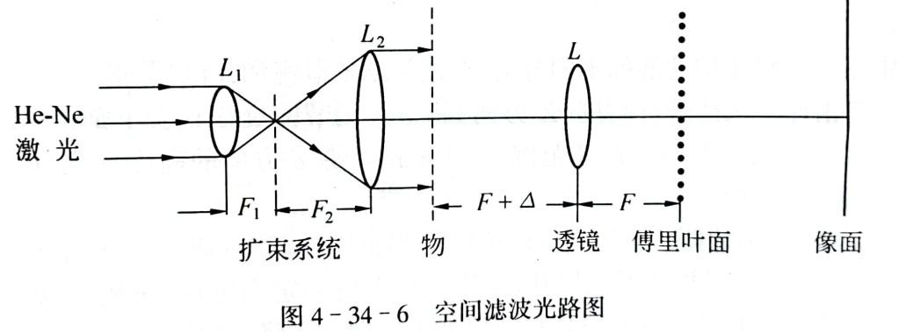

图3  空间滤波光路图

**（1)光路调节**

①把全部器件按图3所示的顺序放在平台上，靠拢后目测调至共焦。

②在激光器后面，沿刻度尺的方向依次放上透镜L1、L2  ，及观察屏（观察屏距离光源1米以上）并调节L1和L2间的距离，使L2的出射光为平行光束。

③将透镜L放在离L2约2F的地方，微调L的高度，使从L2出射的平行光可以通过L。

④放置物屏（箭屏），使扩束平行光均匀垂直地照射在物屏上。移动物屏的位置，使在像面上得到一清晰放大的图像，固定物面的位置。

⑤用一维光栅取代箭屏，用毛玻璃在L的后焦面附近移动，直到观察到一排清晰的衍射光点。此位置即为傅里叶频谱面，固定频谱面的位置。

**（2)方向滤波**

①在物面上放置“光”字网格光栅，则频谱面上出现二维分立的衍射光点阵，像面上出现放大的网格像。

②在频谱面上放置一狭缝光阑，使狭缝分别沿铅直方向、水平方向、与水平方向成45°角放置，观察并记录像面上图像的变化。

**五 实验记录**

记录到的图像如下：

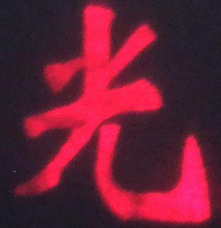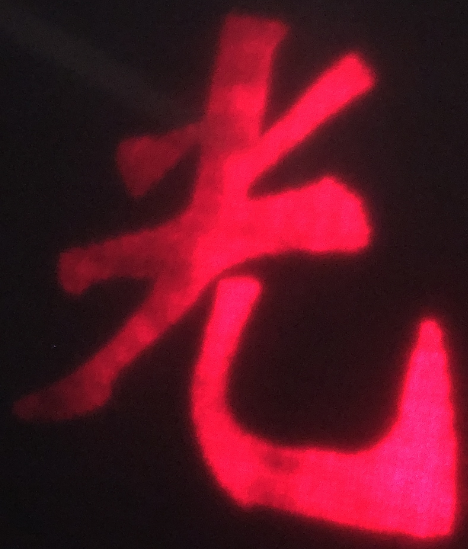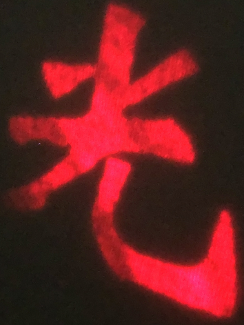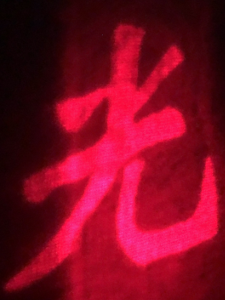

铅直方向			与水平方向成45°角     水平方向	    与水平方向成45°角

**六 实验感想**

这个实验最难完成的部分，或许就是记录图像，因为图像很精细，而手机的拍照像素较低，难以拍到纹路。

**θ调制与颜色的合成**

2022级 计算机科学与技术（全英创新班） 陈宇勋  202230430026

**一 实验目的**

# 1.掌握**θ**调制的原理。

# 2.巩固和加深对光栅衍射基本理论的理解。

# 3.通过**θ**调制，实现黑白图像彩色编码。

**二 实验仪器**

平行白光光源，θ调制板，傅里叶变换透镜，θ调制滤波器，白屏。

**三 实验原理**

当一张透明图片和一片光栅叠合在一起时，再用白光照射，图像的信息就会被调制（或编码）在光栅的每一个衍射分量上。在傅里叶光学中，此现象称为图像与光栅的卷积。

利用光栅的色散和编码功能，可以对一幅图片“上色”。所谓**θ**调制是以不同取向（方位角**θ**)的光栅调制图像上的不同部位。如图1a所示，该图像由A、B、C 3个圆组成，且由3个不同方向的光栅加以调制构成**θ**物片。将该**θ**物片放入傅里叶变换光路中，用准直白光照射**θ**物片，因白光由各种波长的光组成，不同波长的光的非零级谱点与系统光轴夹角不同，所以在频谱面上将产生3组不同取向的彩色衍射光谱，如图4b所示，每一条彩色频谱分别对应于**θ**物片上的一个部分。如果用一张硬的纸卡放在频谱面上，在纸卡上扎孔，在不同的方位角上，小孔选取不同颜色的谱，就可以获得彩色输出图像。例如，图形A对应的彩色频谱图中只让每一级谱点中的红色通过，则输出像上A部分为红色。同理，可按需要使输出面上的B、C部分成为黄色、绿色等，如图4c所示。如果改变频谱面上滤波器的通光位置，所选图像的颜色也会相应变化（例如可以使图形A的输出像为黄色或绿色等）。由于这种方法是将图像中不同方位的空间物体编上不同的颜色，所以也称为等空间彩色编码。

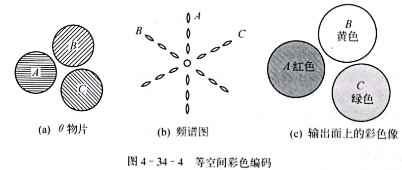

图1 等空间色彩编码

**四 实验内容和步骤**

按图2排出光路。本光路采用4f系统：L1、L2是一对消色差白光傅里叶变换透镜（f=120mm)，两者的距离等于2f，输入面P1在L1的前焦面上，输出面P2在L2的后焦面上，P1与P2之间的距离为4f，故称4f系统。

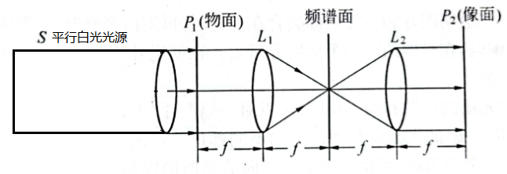

图2  θ调制光路图

①以平行白光为光源，对各元件进行等高共轴调节，使光学系统为共轴系统。

②按图2所示放置各元件（θ调制片放在物面，光屏放在像面处），使像面上出现清晰的天

安门图像。

③在频谱面上插入一张白纸屏，可以看到白纸屏上有3行不同取向的彩色衍射光斑。

④在频谱面处放上θ调制滤波器，调节其上的滑块的过光位置，给像面上的天空，天安门，

草地上色。

**五 实验记录**

记录到的图像如下：

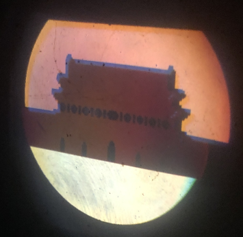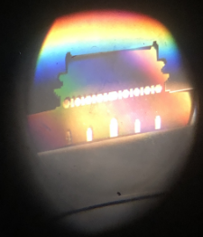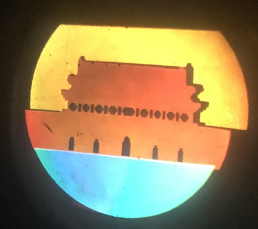

**六 实验感想**

在做这个实验的时候，感觉这个实验挺有意思的，可以自己改变颜色，选择自己喜欢的颜色上色，不过要在无其他光源的环境下做这个实验，否则很难完成。
