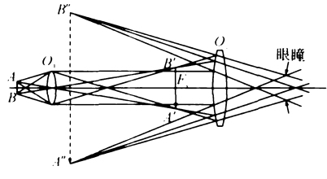
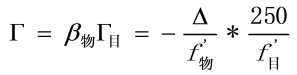
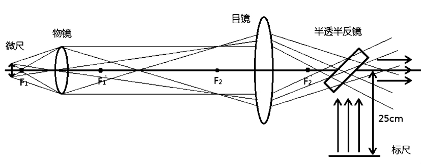

# 《自组显微镜》设计性实验的探索与实践_杨帆

<!-- page: 1 -->

︽
自
组
显
微
镜
︾
设
计
性
实
验
的
探
索
与
实
践

《自组显微镜》设计性实验的探索与实践

Exploration and Practice of the Experimental "Self-organizing Microscope"

杨帆
Yang Fan
(陕西理工学院机械工程学院，陕西汉中7230003)
（School of Mechanical Engineering, Shaanxi University of Technology, Shaanxi Hanzhong 723003)

摘要：通过分析《自组显微镜》设计性实验的现状，针对其问题进行探索与实践,使该实验成为严格意义

上的设计性实验。实践表明,改革后的实验为学生提供了一个很好的设计性实践平台,进一步激发了学生的学
习兴趣和创新意识,提升了学生的科研能力。

关键词：显微镜；设计性实验；光路设计；视觉放大率

中图分类号：G642
文献标识码：A
文章编号：1671-4792-(2011)11-0237-03
Abstract: In order to strictly make sense of the experiment as a designing case. By analyzing the present situa-

tion of "self-organizing microscope" designing, this aims to studying and exploring the issues. It proves that the re-
form of the experiment providing students with a good platform for the designing practice, and furthermore, to
stimulate students' interests in learning and innovation, to enhance the students' researching capabilities.

Keywords:Microscope；Designing Experiment；Optical Path Design；Visual Magnification

0 引言

显微镜是人类认识物质微观世界的重要光学仪

器,也是科学研究工作中不可缺少的仪器之一[1-3]。随

着科学技术的发展、制造技术的成熟、工艺流程的进

步，显微镜的种类、功能、结构逐步得到完善和丰

富，在生命科学、医学医药、科学研究、教育等领域

图一物体被显微镜放大成像的原理图

都有非常广泛的应用。《自组显微镜》设计性实验是

测控技术与仪器专业专业基础必修课《工程光学基

它由焦距很短的物镜和目镜组成，物镜像方焦

础》中最为重要的实验之一，该实验的目的是要求学

点到目镜物方焦点之间有着较大的光学间隔。物体

生掌握仪器测量透镜基本参数的方法，熟悉显微镜

AB 位于物镜物方焦点附近，成一放大倒立的实像

的光路，培养学生的动手能力与创新能力。

AB 于目镜的物方焦点处。当与眼睛联用时，在眼睛

1 自组显微镜的实验内容

的视网膜上回成一放大正立的实像。借助显微镜，人

透镜是组成显微镜光学系统的最基本的光学元

就可以观察非常微小的物体。众所周知，显微镜的视

件,物镜、目镜及聚光镜等部件均由单个或多个透镜

觉放大率为：
[4]

组成。显微镜把近处的微小物体进行放大成像,图一

（1）

是物体被显微镜放大成像的原理图。

237

<!-- page: 2 -->

科技广场
2011.11

其中f 物' 是物镜焦距，f 物' 是目镜焦距，△是光

案；第三阶段，领取透镜等元件，实施设计方案，测量

学间隔，250mm 是明视距离。

数据并完成实验报告。为达到好的实验效果，教师在

该实验包含以下几个内容：

《工程光学基础》课程讲授时加强相关知识点的讲

①用平行光管测透镜焦距；

授，比如“光瞳衔接原理”、
“出瞳直径”、
“出瞳距离”、

②利用已测透镜在光学平台上自组显微镜；

“远心光路”、
“人眼结构与目视效果”等，其中“光瞳

③测量实际系统的视觉放大率并与理论值比

衔接原理”、
“出瞳距离”非常重要，学生在设计时必

较。

须掌握。

2 实验开展过程中的探索与实践

2.3 巧妙设计光路，准确测量实验数据。

2.1 完善实验条件，提高设计自由度

该实验需要学生计算所组显微镜实际的视觉放

自组显微镜实验需要进行设计和组装两个主要

大率，并与理论放大率比较。可以通过公式（1）求出

内容，具备非常强的知识性、科学性、趣味性与实用

所组显微镜的理论放大率。实际的视觉放大率测定

性。设计性实验，使学生有了更多的选择余地，实验

方法：将一微尺放在载物台上夹住，调焦直到所观察

结果呈现出多样性，并具有较强的可比性。过去，对

的微尺像最清晰；再用手拿一把尺子，用一只眼睛通

此设计性实验，学生在实验前具有高涨的热情，对该

过显微镜观察微尺的像，另一只眼睛直接看直尺，经

实验有一定的期待。但是由于对实验项目的认识不

过多次观察，调节眼睛，使得显微镜中看到的微尺像

足，理论知识理解不深刻，准备不充分，实验后同学

投影到直尺上，最后选定微尺上某一分度L。记录其

们都感到很失落。通过与学生沟通了解，对实验开

相当于直尺上的分度L，即得视觉放大率为：

展情况仔细分析，发现实验效果差与学生的知识水

（2）

平、动手能力有一定的原因，但更关键的是实验室条

由于用手拿直尺，通过调节眼睛使微尺的像与

件不够完备。实验室为每组同学提供2 个凸透镜、

直尺在同一视场中，学生有正常眼和近视眼，观察习

若干光具座、光源等必须元件，这样根本没有选择的

惯也不同，L 读数误差较大。最后计算出的放大率与

自由度，自然谈不上设计。于是，这个设计性实验仅

理论放大率误差有时竟达20%，无形中还助长学生

仅是名义上的设计性实验，实际上依然是一个被提

对科学问题马马虎虎、随随便便的态度与作风。

高难度的验证性基础实验。现在，实验中我们提供

给学生不同孔径、焦距的透镜有6 个以上，学生在预

习、设计时具有较大自由度，不同组同学组装的显微

镜也会有不同的效果，具有较强的可比性，使该实验

成为一个深受学生喜欢的设计性实验。

2.2 增加实验学时，强化关键知识点

该实验的学时数由过去的4 学时改为6 学时，

其中课前2 学时（学生自查资料），课内4 学时。实

图二自组显微镜改进光路图

验实施分三个阶段：第一阶段，教师讲解实验的内

容、要求，学生自查资料，自学新知识，根据实验室提

改进后的实验光路如图二所示，在目镜之后置

供的透镜参数提出设计方案；第二阶段，学生提交设

一与主光轴成45°角的平玻璃板（半透半反镜），距

计方案，教师审查并提出指导意见，学生修改设计方

此玻璃板25cm 处置一白光源照明的标尺。通过显

238

<!-- page: 3 -->

微镜既能看到微尺的放大像，还能通过半透半反镜

践，严格意义的设计性实验探索取得较好的效果。学

看到标尺的像，而且它们在同一平面上，通过标尺的

生完成实验后，普遍反映实验内容有趣，实验项目有

︽
自
组
显
微
镜
︾
设
计
性
实
验
的
探
索
与
实
践

像就准确读出微尺像L 的大小。通过实践，此法可

一定的难度，非常具有挑战性与吸引力。改进后的实

以显著提高测量准确度。

验真正具有研究与设计意义，学生通过实验可以锻

2.4 积极探索研究，加强教师自身建设

炼、培养创新精神与创新意识。

教师在实验开展的整个过程中，从基础知识的

讲授到光路设计的指导，从示范实验过程到帮助学

参考文献

生顺利实施实验，从现场比较实验效果到审阅实验

[1] 史旭斌, 田俊成. 计量传感器在万能工具显

论文，起着非常重要的作用。为此，教师在不断增加

微镜中的应用[J].机械工业标准化与质量, 2007,(05).

知识储备的同时，深入实验室，加强实验教学方法的

[2]李霞,王伟,赵秀健.数字式万能工具显微镜常

研究，领悟因材施教的真谛，多运用启发方式指导学

见故障排除[J].计量与测试技术, 2007,(06).

生完成实验。在教学法活动时，教师间相互学习、讨

[3]刘安章,刘泊,高西宽.基于CCD 测量的万能

论，共同提高。在改革前，我们还进行了小范围的尝

工具显微镜[J].哈尔滨理工大学学报, 2008,(05).

试，及时听取学生的意见，不断进行讨论和完善，使

[4]郁道银,谈恒英.工程光学基础教程[M].北京:

得实验教学改革有目的、有计划、科学的进行。

机械工业出版社, 2007.

3 结束语

[5]李田, 汪涛,叶大梧, 陶纯匡. 同一设计性实验

两种教学模式的探索与实践——
—“望远镜、显微镜的

总结该设计性实验的成功经验，为其它实验课

程的教学改革创新以及具体实施寻找到了一些可以

设计与组装”实验的两种教学模式比较[J]. 物理与

借鉴的思路和方法。对实验教学方法改革的创新可

工程, 2010,(06).

行性要有充分的研讨，全面掌握该实验项目的特点

以及课程改革的可实施性，还要有预见到实验过程

作者简介

中会出现各种新情况的远见。另外，在整个改革的

杨帆（1982—），男，汉族，陕西汉中人，助教，任

过程中，不能忽视教师、学生任何一方的作用。教学

教于陕西理工学院机械工程学院，从事测控技术与

改革应该有学生参与，教学是教师和学生互动的过

仪器专业教学，主要研究方向：精密仪器与机械，非

程，两者缺一不可。

接触测量技术。

通过对《自组显微镜》设计性实验的探索与实

239
