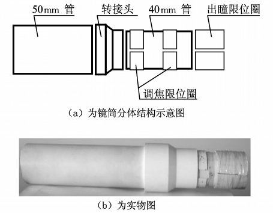
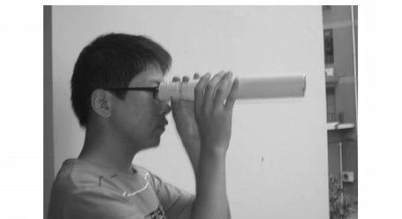
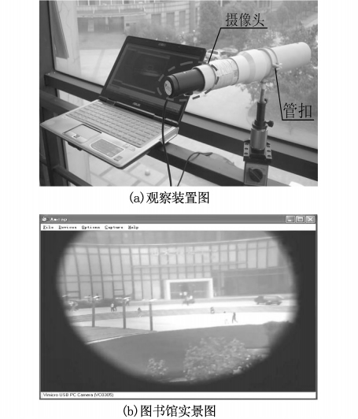
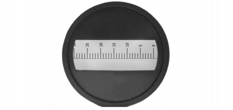
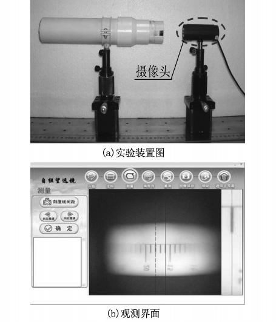
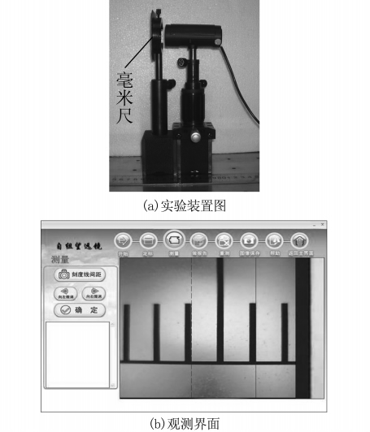

# 自组望远镜实验的改进研究_叶丽军

<!-- page: 1 -->

DOI:10.14139/j.cnki.cn22-1228.2011.05.024

第２４卷
第５期
大
学
物
理
实
验
Ｖｏｌ．２４Ｎｏ．５

２０１１年１０月
ＰＨＹＳＩＣＡＬ　ＥＸＰＥＲＩＭＥＮＴ　ＯＦ　ＣＯＬＬＥＧＥ
Ｏｃｔ．２０１１

文章编号：１００７－２９３４（２０１１）０５－００５１－０４

自组望远镜实验的改进研究

叶丽军，许富洋＊，赖兴俊，陈媛媛，李　浩，何正杨

（浙江师范大学，浙江金华　３２１００４）

摘
要：采用自制镜筒进行自组望远镜实验，可使实验从室内走向室外，有利于调动学生的积极

性。结合ＵＳＢ摄像头进行的相关拓展，可实现望远镜观测的数字化，有助于学生了解计算机辅助测量

的现代化手段，提升实验教学效果。

关
键
词：望远镜；镜筒制作；摄像头；放大率

中图分类号：Ｏ４－３３
文献标志码：Ａ

望远镜发明至今已有４００年的历史，它在人

无穷远处时，镜筒长度Ｌ为：

们的科研、日常生活等方面都发挥着重要的作

Ｌ＝ｆＯ＋ｆＥ＝２７０ｍｍ
（１）

用

［１－２］，学生或多或少都会有一些接触。在普通光

当望远镜聚焦在１ｍ处时，镜筒长度Ｌ′ 为：

学实验中，自组望远镜实验往往能较好地引发学

Ｌ′ ≈ＳｆＯ

Ｓ　ｆＯ＋ｆＥ

生的兴趣，但传统的实验方式通常是用两片透镜

＝１０００×２２５

在光具座上自行搭建望远镜系统，再进行放大率

１０００　２２５ｍｍ＋４５ｍｍ

测量等其它相关操作

［３］。这种模式下，学生自组

≈２９０．３ｍｍ
（２）

的望远镜往往与生活中所认知的望远镜存在一定

制作时，考虑将物镜装于５０ｍｍ管一端；目镜装

的差异，学生很难有效地构架起望远镜理论与实

于４０ｍｍ管一端，并在其上设置限位圈（割一小

际应用联系的桥梁。实验时，学生往往带着激情

段管子破开即可），以满足调焦范围的设计要求。

而来，却失望而归，教学效果不尽理想。针对这些

同时制作物镜、目镜的固定套圈，最后人眼观察时

问题，对传统的自组望远镜实验作了改进，将自制

应在出瞳处的效果最佳

［４］，因此宜再制作一出瞳

的镜筒用于望远镜组装，并结合ＵＳＢ摄像头，引

限位圈，见图１。

入计算机辅助观察与测量的现代化手段，可在大

幅提高实验精度的同时强化实验效果。

１　自制望远镜镜筒

为方便加工，选用ＰＶＣ塑料管为镜筒材料。

下面简要地介绍一下简易单筒望远镜镜筒的制作

过程，以口径为４０ｍｍ，焦距为４５ｍｍ、２２５ｍｍ的

透镜为目镜、物镜进行镜筒设计，设定望远镜的调

焦范围为１ｍ→∞。因此，可选用直径为４０ｍｍ

和５０ｍｍ的ＰＶＣ塑料管，并加配两种塑料管的

转接头，连接后可使直径较小的管子能够进行伸

图１　望远镜镜筒

缩调焦。

根据望远镜成像原理可知，当望远镜聚焦在

收稿日期：２０１１－０３－１８
基金项目：浙江省教育厅科研项目（Ｙ２００９０９２３５）；金华市科学技术研究计划项目（２０１０－１－０５２）；浙江师范大学课程实践教学项目

＊通讯联系人

<!-- page: 2 -->

２
５
自组望远镜实验的改进研究

景图。在调节的过程中，学生可以直接观察到光

２　望远镜的组装与实验拓展

阑、入瞳出瞳等的影响和作用；调节完成时则可看

到成像的渐晕、像差等现象，图（ｂ）中视野边缘的

将物镜、目镜装入制作好的镜筒并固定，即可

模糊及铝合金框的弯曲。如此，学生可以切实地

完成组装，通过调焦可以来观察周围不同距离的

获取各相关概念的感性认识，而不仅仅是枯燥的

景物，见图２。虽然略显笨拙，但能给学生带来深

理论描述，可较好地提升实验教学效果。

切的感受。这种方式可以突破实验室观察的局

限，能较好地激发学生的兴趣。

图２　学生用自制望远镜观察外景

学生在“把玩”望远镜的过程中，很容易就能

发现这种简易望远镜存在的一些问题，如看到的

景物怎么是倒的？视野边缘的景物怎么是逐渐模

糊的？为何在目镜后不同位置观察，现象会有差

异？等等。基于学生的各种疑问，我们有针对性

地进行了引导和拓展，提出一些望远镜制作中必

图３　计算机辅助观察

须了解的问题，如：

３　望远镜放大率的测量

（１）怎么制作：透镜如何选择，放大倍数、镜筒

长度如何确定？

（２）怎么观察：如何调焦？孔径光阑、入瞳出

ＵＳＢ摄像头在生活中的使用已经较为普遍，

瞳的含义与作用如何？

同时在一些基于图像传感的实验中也得到了有效

的应用，具有较高的性价比

［７，８］。据此，实验中采

（３）能观察到什么：视场光阑、入窗出窗的含

用Ｖｉｓｕａｌ　Ｂａｓｉｃ编程，以摄像头代替人眼，进行了

义与作用如何？像差是怎么回事？

放大率测量的数字化研究，取得了较好的效果。

虽然只是一个小小的望远镜，但它几乎囊括

实验时，若望远镜对无穷远调焦，则镜筒长度

了所有几何光学的知识点。为了更好地发挥学生

Ｌ＝ｆＯ＋ｆＥ，其理论放大率Ｍ为

［３］：

的积极性和创造性，实验室实行开放制度

［５］，鼓励

学生利用课外时间继续对自己感兴趣的内容进行

ｆＥ＝２５５

Ｍ＝ｆＯ

４５＝
５
（３）

深入地探索。

目前，科研用望远镜及多数中高端业余望远

镜基本以计算机为监测终端

［６］，基于这样的考虑，

结合常用的ＵＳＢ摄像头，进一步作了计算机辅助

观察拓展。使用时首先通过肉眼观察对景物调

焦，然后再将摄像头进行适当调焦，装入出瞳限位

圈，前后调节摄像头位置，使望远镜出瞳与摄像头

入瞳重合，以获取最佳观察效果，见图３，（ａ）实验

图４　毫米尺

装置图，（ｂ）距实验室百米开外的我校图书馆实

<!-- page: 3 -->

３
５
自组望远镜实验的改进研究

此时，如将物镜卸下，代之以毫米尺（见图４，

刻度线间距为１　ｍｍ），则在距目镜一定距离的ｄ

处，可得到毫米尺经目镜所成的实像。设毫米尺上

所选测量对象的长度为ｌ
１，所成的像长为ｌ
２，由

透镜成像公式可得：

１
ｆＯ＋ｆＥ＋１

ｄ＝１

烄

ｆＥ

（４）

ｌ
１
ｌ
２＝ｆＯ＋ｆＥ
烅

烆
ｄ

由上式得：

Ｍ＝ｆＯ

ｆＥ＝ｌ
１
ｌ
２

（５）

因此只要测得毫米尺上所选测量对象的长度ｌ
１及

其像长ｌ
２，即可求出望远镜放大率Ｍ。

具体测量时，首先将望远镜调焦至无穷远，然

后卸下物镜，代之以毫米尺，并调节摄像头至微距

［９，１０］，用其代替人眼进行观测，见图５。

拍摄状态

可以认为望远镜目镜和摄像头镜头又构成了望远

图６　ｌ１的测量

镜系统，其调焦目标为毫米尺，成像清晰时，中间

实验中最后要计算的是ｌ１与ｌ２之比，因此可

部分之外的区域存在明显的渐晕现象，如图５
（ｂ），这是未设置恰当的视场光阑之故，但可选择

作相对测量，只要保证ｌ１、ｌ２的度量单位相同即

可。为提高测量精度，程序编辑时选用像素为度

两个清晰的刻度间隔为对像进行测量。

量单位，测量时只需确定测量对象的边界位置，然

后计算边界之间的像素数，即可测得相应长度，表

１为实验测量结果。从中可以看出，该方式具有

较高的测量精度；另一方面该方式在数字化测量

方面较为“原生态”，有助于学生了解和掌握信息

化、数字化测量手段，激发实验兴趣。

表１　望远镜放大率实验测量值

ｌ１（ｐｉｘｅｌ）
ｌ２（ｐｉｘｅｌ）
｜Ｍ｜
｜Ｍ｜

１９８
４１
４．８３

１９７
３９
５．０５
４．９４

１９７
４０
４．９３

４　结　　论

采用自制镜筒进行自组望远镜实验，可使实

验从室内走向室外，有利于调动学生的积极性，同

时可有效地将相关理论与实际应用联系起来。结

合ＵＳＢ摄像头进行的相关拓展，可实现望远镜观

图５　ｌ２的测量

测的数字化，更接近当前科研、工程等的实际应

上述操作完成后，将毫米尺卸下，装于支架

用，可减少学生对相关先进测量手段的神秘感。

上，并保持摄像头的调焦状态不变，调节毫米尺与

在实验教学当中，通常组织学生参观光学冷

摄像头之间的距离，使毫米尺成清晰的像，见图

加工实验室，了解透镜的研磨加工过程，并鼓励学

６。同样选择两个刻度间隔为对像进行测量。

生利用课外时间进行镜筒、光阑等外围部件的设

<!-- page: 4 -->

４
５
自组望远镜实验的改进研究

计制作，以更好地掌握相关知识。另外，在利用已

京：高等教育出版社，２０００：７４－７９．

［４］　赵凯华，钟锡华．光学：上册［Ｍ］．北京：北京大学出

开发好的数字化测量系统的基础上，通常要求学

版社，１９８４：１０１．

生利用擅长的计算机语言自行设计编程，进行放

［５］　林根金．学生自主管理实验教学探究［Ｊ］．实验室研

大率的测量。学生在望远镜的加工组装及使用过

究与探索，２００９，２８（８）：１４８－１５０．

程中可加深对相关理论的认识，制作完成的望远

［６］　李祖强．使用电脑控制业余天文望远镜［Ｊ］．电子世

镜又可作为实验成果或器件来演示、观测相关现

界，２００６（４）：４８－５２．

象，从而可进一步激发学生的学习兴趣，一举

［７］　吴学功，张文锦．利用普通摄像头实现振动的实时

多得。

测量［Ｊ］．电子工程师，２００６，３２（７）：４－７．

［８］　于华．关于摄象镜头和显示器在显微镜和望远镜中

参考文献：

的应用［Ｊ］．大学物理实验，２００４，１７（２）：１０－１３．

［９］　祝焱．实验教学中如何灵活运用数码相机的微距摄

［１］　苏定强．望远镜和天文学：４００年的回顾与展望［Ｊ］．

影［Ｊ］．中国教育技术装备，２００９（９）：１０３－１０４．

物理，２００８，３７（１２）：８３６－８４３．

［１０］马炜梁．谈谈生物的微距摄影［Ｊ］．生物学教学，

［２］　李良．谈谈地面大型天文望远镜———纪念望远镜问

世４００周年［Ｊ］．现代物理知识，２００８，２０（６）：１４－２３．

２０１０，３５（６）：７３－７５．

［３］　杨述武主编．普通物理实验：光学部分［Ｍ］３版．北

Ｓｔｕｄｙ　ｏｎ　ｔｈｅ　Ｉｍｐｒｏｖｅｍｅｎｔ　ｏｆ　Ｔｅｌｅｓｃｏｐｅ　Ａｓｓｅｍｂｌｅ　Ｅｘｐｅｒｉｍｅｎｔ

ＹＥ　Ｌｉ－ｊｕｎ，ＸＵ　Ｆｕ－ｙａｎｇ，ＬＡＩ　Ｘｉｎｇ－ｊｕｎ，ＣＨＥＮ　Ｙｕａｎ－ｙｕａｎ，ＬＩ　Ｈａｏ，ＨＥ　Ｚｈｅｎｇ－ｙａｎｇ

（Ｚｈｅｊｉａｎｇ　Ｎｏｒｍａｌ　Ｕｎｉｖｅｒｓｉｔｙ，Ｚｈｅｊｉａｎｇ　Ｊｉｎｈｕａ　３２１００４）

Ａｂｓｔｒａｃｔ：Ｔｈｅ　ｅｘｐｅｒｉｍｅｎｔ　ｃｏｕｌｄ　ｂｅ　ｏｕｔｄｏｏｒ　ａｎｄ　ｍｏｒｅ　ｐｒｏｐｉｔｉｏｕｓ　ｔｏ　ｅｎｈａｎｃｅ　ｓｔｕｄｅｎｔｓ　ｉｎｉｔｉａｔｉｖｅ　ｂｙ　ａｓ－

ｓｅｍｂｌｉｎｇ　ｔｈｅ　ｔｅｌｅｓｃｏｐｅ　ｗｉｔｈ　ｓｅｌｆ－ｍａｄｅ　ｄｒａｗｔｕｂｅ．Ｆｕｒｔｈｅｒｍｏｒｅ，ｅｘｐａｎｄｉｎｇ　ｔｈｅ　ｅｘｐｅｒｉｍｅｎｔ　ｗｉｔｈ　ＵＳＢ

ｗｅｂｃａｍ　ｃｏｕｌｄ　ｒｅａｌｉｚｅ　ｄｉｇｉｔａｌ　ｏｂｓｅｒｖａｔｉｏｎ，ａｎｄ　ｉｔ　ｗｏｕｌｄ　ｂｅ　ｈｅｌｐｆｕｌ　ｆｏｒ　ｓｔｕｄｅｎｔｓ　ｔｏ　ｕｎｄｅｒｓｔａｎｄ　ｔｈｅ　ｍｏｄ－

ｅｒｎ　ｍｅａｓｕｒｅｍｅｎｔ　ａｉｄｅｄ　ｂｙ　ｃｏｍｐｕｔｅｒ．

Ｋｅｙ　ｗｏｒｄｓ：ｔｅｌｅｓｃｏｐｅ；ｍａｋｉｎｇ　ｄｒａｗｔｕｂｅ；ｗｅｂｃａｍ；ｅｎｌａｒｇｅｍｅｎｔ　ｒａｔｅ
