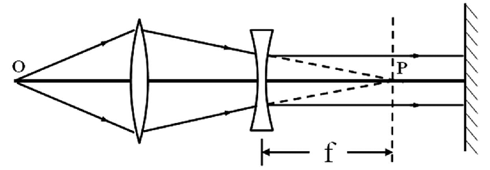
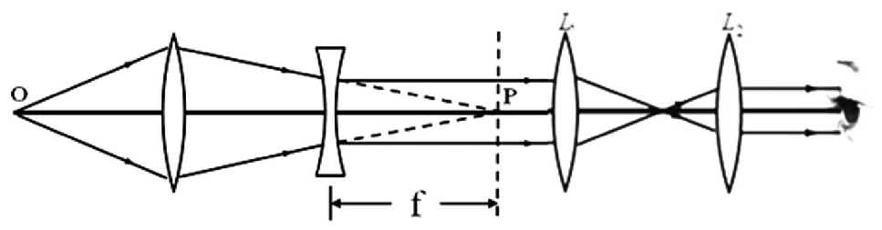

# 自组望远镜测量凹透镜焦距_施洋

<!-- page: 1 -->

论
文
福建轻纺  2021年4月 第4期

自组望远镜测量凹透镜焦距*

施洋，吕佩伟，马靖

（福州大学 物理与信息工程学院，福建 福州 350116）

摘   要：文章提出了一种测量凹透镜焦距的新方法，该方法是在自准直法测量凹透镜焦距的基础上，结合自组望

远镜系统，通过观察望远镜视场中成像的清晰度变化，从而测出凹透镜的焦距。该方法能避免传统自准直法测量

凹透镜焦距时出现的成像较暗、不清晰等问题，数据处理简单，测量结果精确。

关键词：凹透镜；望远镜；焦距

doi：10.3969/j.issn.1007-550X.2021.04.007

中图分类号：O435          文献标识码：A          文章编号：1007-550X（2021）04-0023-03

　　凹透镜焦距测量方法多种多样，常见的测量凹

改进，在测量过程中引入自组望远镜系统，减小传

透镜焦距的方法有：物距像距法[1]、二次成像法[2]、

统自准直法由于透镜多次反射而造成的成像暗淡问

自准直法[3]等。这些方法都是使用一块凸透镜作为辅

题，可有效地提高测量精度。

1　传统自准直法测量凹透镜焦距

助测量工具，根据凹透镜所放位置的不同，可以分

为凹透镜后置（凸透镜前置）[4]与凹透镜前置（凸透

　　自准直法测量凹透镜焦距与自准直法测量凸透

镜后置）[5]两种情况。其中物距像距法与二次成像法

镜焦距类似，都要使用一块平面反射镜。以凹透镜

在判断像的位置时，由于光源对成像的像差、色差

后置（凸透镜前置）为例，如图1所示，当物点O经

的影响[6]虽然在景深、焦深[7]的范围内一般都能成清

过凸透镜所成的像即凹透镜的虚物P位于凹透镜的焦

晰的像，但其测量准确度却受到人眼主观观察判断

平面时，虚物P所发出的光通过凹透镜后将成为一束

能力的限制而导致测量的相对误差较大；自准直法

平行光。利用平面镜把这束平行光反射回去（反射

的成像由于受透镜多次反射影响，能量衰减严重，

光也是一束平行光），反射的平行光再次通过凹透

往往成像较暗、不清晰，因此无法做到准确测量。

镜将会聚成像于凹透镜的焦平面上，该像又经凸透

鉴于存在的上述问题，本文对现有的方法进行研究

镜再次成像在原先物屏上。通过调整凹透镜与其虚

*基金项目：福州大学2018年一流本科教学改革建设项目——大学物理光学实验重难点指导数字教材建设；
                    福州大学2018年一流本科教学改革建设项目——电学设计性实验的教学改革；
                    福州大学2018年一流本科教学改革建设项目——基于创新人才培养的《大学物理实验》课程改革。
收稿日期：2020-11-3
作者简介：施洋（1981—），福建晋江人，实验师，主要从事物理实验教学工作。

<!-- page: 2 -->

施洋，吕佩伟，马靖：自组望远镜测量凹透镜焦距

论
文

物P之间的距离使得在物屏上能看到物体等大倒立清

望远镜为例，如图2所示，2个凸透镜L1和L2组成开

晰的像，那么凹透镜与其虚物P之间的距离就是凹透

普勒型望远镜，当望远镜对焦无穷远时，这2个凸透

镜的焦距f。

镜之间的距离正好等于它们焦距之和。用构造好的

开普勒型望远镜，替代传统自准直法测量凹透镜焦

距实验中的观察屏，经由凹透镜出射的平行光，此

时入射望远镜系统，观察者在望远镜视场中可以看

到清晰的物像。因此，与传统自准直法类似，通过

调整凹透镜与其虚物P之间的距离使得在望远镜视场

中能看到物体的倒立清晰的像，那么凹透镜与其虚

图1  自准直法测量凹透镜焦距

物P之间的距离就是凹透镜的焦距f。

　　使用焦距为200.0 mm的凸透镜和焦距为-150.0

mm的凹透镜进行了实验测量，数据记录在表1中。

通过实验测量，可以看出自准直法测量凹透镜焦距

的优点在于计算简单，通过测出凹透镜位置以及虚

物P点位置，两者之间的距离即为凹透镜焦距的绝对

图2  自组望远镜法测量凹透镜焦距

值。其缺点在于成像较暗，人眼观察成像的清晰度

上存在较大误差。从物点O发出的光，通过凸透镜和

　　同样使用焦距为200.0 mm的凸透镜和焦距为-

凹透镜时，分别在它们的表面发生反射从而光强衰

150.0 mm的凹透镜进行了实验测量，在开普勒型望

减；被平面镜反射后，又再次通过这2个透镜，光强

远镜系统中，分别使用一块焦距为150.0 mm的凸透

进一步衰减；经历了多次衰减后，最终在物屏上只

镜与另一块焦距为100.0 mm的凸透镜作为物镜与目

能看到暗淡的成像，这给人眼判断清晰像造成严重

镜，数据记录在表2中。通过实验测量，可以看出自

影响，导致形成较大的测量误差。

组望远镜法测量凹透镜焦距的优点同样在于计算简

2　自组望远镜法测量凹透镜焦距

单，通过测出凹透镜位置以及虚物P点位置，两者之

间的距离即为凹透镜焦距的绝对值；另外，从物点

　　望远镜是用来观察、瞄准和测量远处物体的助

O发出的光，通过4个不同的透镜时，分别在它们的

视仪器，其构造的类型较多。比较简单的有两种：

表面发生反射从而光强同样经历了多次衰减，但是

由2个凸透镜组成的开普勒型望远镜和由一个凸透镜

由于望远镜可以使得远处物体对人眼所张的视角放

与一个凹透镜组成的伽利略型望远镜。以开普勒型

表1  自准直法测量凹透镜焦距的实验数据

（单位：mm）

物屏位置

凸透镜位置

凹透镜位置

虚物位置

焦距

平均值

绝对误差

相对误差

500.0

957.5

1100.0

-142.5

520.0
540.0

911.4
883.7

1053.3
1025.7

-141.9
-142.0

200.0

-142.1

7.9

5.3%

560.0

868.3

1010.0

-141.7

580.0

860.0

1002.2

-142.2

600.0

857.7

1000.0

-142.3

<!-- page: 3 -->

论
文
福建轻纺  2021年4月 第4期

表2  自组望远镜法测量凹透镜焦距的实验数据

（单位：mm）

物屏位置

凸透镜位置

凹透镜位置

虚物位置

焦距

平均值

绝对误差

相对误差

500.0

954.8

1100.0

-145.2

520.0

908.5

1053.3

-144.8

540.0
560.0

881.0
865.5

1025.7
1010.0

-144.7
-144.5

200.0

-144.8

5.2

3.5%

580.0

857.2

1002.2

-145.0

600.0

855.4

1000.0

-144.6

大，观察者依旧能够清晰的看到物像，提高了测量

经历了多次衰减，但是实验的结果不同。传统自准

的精度。其缺点在于光路中透镜偏多，对所有元件

直的方法，观察到的是暗淡、不太清晰的成像；而

的共轴要求较高，因此在实验测量过程中会产生一

自组望远镜的方法，观察到的是明亮、清晰的成像。

定的测量误差。

从这2种实验现象的对比中，也能直观的体现出自组

3　结论

望远镜测量凹透镜焦距方法的优点。

　　⑶ 自组望远镜测量凹透镜焦距的方法，原理简

　　⑴ 2组实验测量数据测得凹透镜焦距值都比标定

单，操作方便，测量结果精确。该方法不仅能够使

值小，一方面可能是由系统误差造成的；另一方面

用自组开普勒型望远镜，还能够使用自组伽利略型

是该凹透镜的标定值存在误差。但从测量结果的相

望远镜进行测量。而且，凹透镜前置与凹透镜后置

对误差来看，自组望远镜法测量凹透镜焦距误差更

对实验结果的影响不大，使用望远镜系统，2种放置

小，说明这种方法比传统自准直法测量凹透镜焦距

方法同样都能观察到明亮、清晰的成像。

更有优势。

　　⑵ 2种方法使用的仪器元件基本相同，光强同样

参考文献：

[1] 王江华,顾菊观.凹透镜焦距测量方法的改进[J].物理与工程,2014,24(01):31-34.

[2] 刘竹琴.利用二次成像法测定凹透镜的焦距[J].延安大学学报(自然科学版),2013,32(03):28-29+32.

[3] 李建华.凹透镜焦距的测量方法[J].唐山师范学院学报,2001(02):53-57.

[4] 曹鹏飞.薄凹透镜焦距测定的探究实验[J].中国西部科技,2013,12(08):23-24.

[5] 许巧平.凹透镜焦距测量新方法的实验研究[J].河南科学,2014,32(07):1185-1188.

[6] 廖立新.凹透镜焦距测量自准直法的改进[J].吉首大学学报(自然科学版),2015,36(04):30-32.

[7] 张明霞,令维军.用读数显微镜视差法测凹透镜的焦距[J].甘肃联合大学学报(自然科学版),2010,24(06):95-98.
