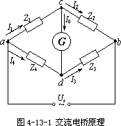
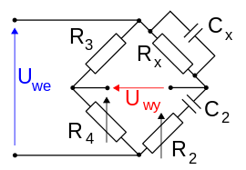

# 4.8（草）

**实验报告4.8**

级    生物科学类     x    **23号**

**一、实验目的**

1.学习使用交流电桥测电容、电感及其损耗的方法；

2.掌握交流电桥的特点和平衡的调节方法；

**二、实验仪器**

FB305A交流电桥实验仪、电阻箱、固定电阻、半导体收音机、耳机。

**三、实验原理**

（一）常用的交流电桥分为阻抗比电桥和变压器电桥两大类。本实验中交流电桥指的是**阻抗比电桥**，如图$1$所示。

图$1$ 交流电桥的基本结构

交流电桥的电路和直流单电桥电路具有同样的结构形式，但交流电桥的四个桥臂可以不仅是电阻，**还可以是电阻、电感、电容等元件或它们的组合**。 交流电桥采用交流电供电。交流平衡指示仪的种类很多，本实验采用高灵敏度的**电子放大式指示仪**，有足够的灵敏度。指示仪指零时，电桥达到平衡。

调节电桥各臂阻抗使电桥平衡(即${\overrightarrow {I}}_{0}=0$，则$cd$两点的电位相等，这时有

$$
\frac {{\overrightarrow {Z}}_{1}} {\overrightarrow {{Z}_{2}}}=\frac {{\overrightarrow {Z}}_{4}} {{\overrightarrow {Z}}_{3}}
$$

上式就是**交流电桥的平衡条件**。将各阻抗用复数形式表示有

$$
\frac {{Z}_{1}{ⅇ}^{i{\varphi }_{1}}} {{Z}_{2}{ⅇ}^{i{\varphi }_{2}}}=\frac {{Z}_{4}{ⅇ}^{i{\varphi }_{4}}} {{Z}_{3}{ⅇ}^{1{\varphi }_{3}}}
$$

即要使电桥平衡，必须使下列方程组成立

$$
\left \{ {\begin {gathered} {Z}_{1}\cdot {Z}_{3}={Z}_{2}\cdot {Z}_{4} \\ {\varphi }_{1}+{\varphi }_{3}={\varphi }_{2}+{\varphi }_{4} \end {gathered}}\right
$$

方程组是**平衡条件的另一种表现形式**。可见，交流电桥的平衡必须同时满足两个条件:一是**相对桥臂上阻抗幅模的乘积相等**;二是**相对桥臂上阻抗幅角之和相等**。方程组说明，交流电桥必须按照一定的方式配置桥臂阻抗，否则有可能无法使电桥平衡。

（二）几种常用的交流电桥：

1.测量**损耗小**的电容电桥(串联电容电桥)

图2 串联电容电桥

图$2$电路为用来测量损耗小的电容的电桥。被测电容${C}_{x}$接到电桥的第一臂，它的损耗以等效串联电阻${R}_{x}$表示，称为串联电容电桥。在电桥中，与被测电容相比较的标准电容${C}_{n}$接人相邻的第四臂，同时与${C}_{n}$串联一个可变电阻${R}_{n}$。桥的另外两臂为纯电阻${R}_{A}$及${R}_{B}$。当电桥调到平衡时：

$$
{R}_{x}=\frac {{R}_{A}} {{R}_{B}}{R}_{n}
$$

$$
{C}_{x}=\frac {{R}_{B}} {{R}_{A}}{C}_{n}
$$

被测电容的损耗因数$D$为

$$
D=\omega {C}_{x}{R}_{x}=\omega {C}_{n}{R}_{n}
$$

由此可知，要使电桥达到平衡，必须同时满足平衡两式，因此需**至少调节两个参数**。如果改变${R}_{n}$和${C}_{n}$,便可以单独调节且互不影响地使电容电桥达到平衡。但通常标准电容是做成固定的，因此${C}_{n}$不能连续可变。这时我们可以调节${R}_{B}/{R}_{A}$比值使前式得到满足。但调节${R}_{B}/{R}_{A}$的比值时又影响到前式的平衡。因此，要使电桥同时满足两个平衡条件，必须反复调节${R}_{n}$和${R}_{B}/{R}_{A}$等参数才能实现。

2.测量**损耗大**的电容电桥(并联电容电桥)

假如被测电容的损耗大，用上述电桥测量时，与标准电容相串联的电阻${R}_{n}$必须很大，这将会降低电桥的灵敏度。因此当被测电容的损耗大时，宜采用电容电桥电路进行测量，它的特点是标准电容${C}_{n}$与电阻${R}_{n}$是彼此并联的。根据电桥的平衡条件可以写成

$$
{R}_{B}\cdot \left ( {\frac {1} {\frac {1} {{R}_{n}}+j\omega {C}_{n}}}\right )={R}_{A}\cdot \left ( {\frac {1} {\frac {1} {{R}_{x}}+jw{C}_{x}}}\right )
$$

整理后可得

$$
{C}_{x}=\frac {{R}_{B}} {{R}_{A}}{C}_{n}
$$

$$
{R}_{x}=\frac {{R}_{A}} {{R}_{B}}{R}_{n}
$$

其损耗因数为

$$
D=\frac {1} {\omega {C}_{x}{R}_{x}}=\frac {1} {\omega {C}_{n}{R}_{n}}
$$

**四、实验步骤**

（一）预操作

连接好仪器。

（二）主体步骤
- 测量电容

根据实验原理，使用合适的桥路分别测量两个待测电容${C}_{x1}$、${C}_{x2}$及其损耗电阻，并计算损耗；
- 测量电感

根据实验原理，使用合适的桥路分别测量两个待测电感${C}_{x1}$、${C}_{x2}$及其损耗电阻，并计算电感的Q值；
- 测量电阻

用交流电桥测量两个待测电阻的阻值，并与直流电桥的测量结果相比较。

**五、数据处理**

<table>
<tr><td>{R}_{A}/\mathrm {\Omega }</td><td>{R}_{B}/\mathrm {\Omega }</td><td>{R}_{n}/\mathrm {\Omega }</td><td>{C}_{n}/\mu F</td><td>{C}_{x1}/\mu F</td><td>{R}_{x1}/\mathrm {\Omega }</td><td>D</td></tr>
<tr><td>10</td><td>997.4</td><td>30</td><td>1</td><td>99.74</td><td>0.30</td><td></td></tr>
<tr><td>10</td><td>1096.0</td><td>234</td><td>0.1</td><td>$11$0</td><td>2</td><td></td></tr>
</table>

表1

<table>
<tr><td>{R}_{A}/\mathrm {\Omega }</td><td>{R}_{B}/\mathrm {\Omega }</td><td>{R}_{n}/\mathrm {\Omega }</td><td>{C}_{n}/\mu F</td><td>{C}_{x2}/\mu F</td><td>{R}_{x2}/\mathrm {\Omega }</td><td>D</td></tr>
<tr><td>100</td><td>453.1</td><td>1202</td><td>1</td><td>4.531</td><td>265</td><td></td></tr>
<tr><td>$10$0</td><td>460.0</td><td>11110</td><td>0.1</td><td>4.600</td><td>242</td><td></td></tr>
</table>

表2

**六、结论及分析**

**七、实验总结**
