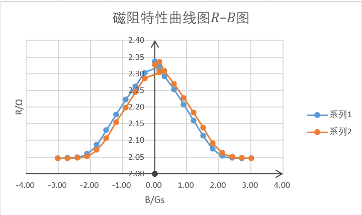

# 4.21（定）

**4.21** **巨磁电阻效应及其应用**

级    生物科学类     x    **号**

**一、实验目的**

了解$GMR$效应的原理；测量$GMR$的磁阻特性曲线。

**二、实验仪器**

巨磁阻实验仪、基本特性组件、磁读写组件、电流测量组件、角位移测量组件。

**三、实验原理**

**物质在磁场中电阻发生变化的现象，称为磁阻效应**。磁性金属和合金材料一般都有这种现象。一般情况下，物质的电阻在磁场中仅发生微小的变化。在某种条件下，**电阻值变动的幅度相当大**，比通常情况下高十余倍，称为**巨磁阻**(  $Giant magneto resisance$, 简称$GMR$)效应。

$1988$年，德国尤利西研究中心的彼得、格林贝格尔和巴黎第十一大学的艾尔伯•费尔分别独立发现了**巨磁阻效应**。巨磁阻效应是一种量子力学效应，它产生于层状的磁性薄膜结构。这种结构是**由铁磁材料和非铁磁材料薄层交替叠合而成**。**当铁磁层的磁矩相互平行时，载流子与自旋有关的散射最小，材料有最小的电阻**；当铁磁层的磁矩相互反平行时，与自旋有关的散射最强，材料的电阻最大。其原理可用**两电流模型**解释：根据导电的微观机理，电子在导电时并不是沿电场直线前进，而是不断和晶格中的原子发生碰撞（又称散射），每次散射后电子都会改变运动方向，总的运动是电场对电子的定向加速与这种无规则散射运动的叠加。电子在两次散射之间走过的平均路程称为电子的平均自由程。**电子散射概率小，则平均自由程长，电阻率低。**一般把电阻定律$R=\rho L/S$中的电阻率$\rho$视为与材料的几何尺度无关的常数，这是因为通常材料的几何尺度远大于电子的平均自由程(例如铜中电子的平均自由程约为$34 nm$)，可以忽略边界效应。当材料的几何尺度小到纳米量级，只有几个原子的厚度时，**电子在边界上的散射效率大大增加**，可以明显观察到**厚度减小电阻率增加**的现象。电子除携带电荷外，还具有自旋特性。自旋磁矩有平行和反平行于外磁场两种取向。在过渡金属中，自旋磁矩与材料的磁场方向平行的电子，所受散射概率远小于自旋磁矩与材料的磁场方向反平行的电子。**总电流是两类自旋电流之和，总电阻是两类自旋电流的并联电阻**，这就是所谓的两电流模型。

在多层膜$GMR$结构中，无外磁场时，上下两层磁性材料是**反平行（反铁磁）耦合**的。施加足够强的外磁场后，**两层铁磁膜的方向都与外磁场方向一致**，外磁场使两层铁磁膜从反平行耦合变成了平行耦合。关于某种多层膜$GMR$材料的磁阻特性：随着外磁场增大，电阻逐渐减小，其间有一段线性区域。**当外磁场已使两铁磁膜完全平行耦合后，继续加大磁场，电阻不再减小，进人磁饱和区域。**磁阻变化率$\Delta R/R$达百分之十几，加反向磁场时磁阻特性是**对称**的。曲线分别对应增大磁场和减小磁场时的磁阻特性。两条曲线不重合是因为铁磁材料都具有磁滞特性。

为进一步提高灵敏度，人们发展了自旋阀结构的$SV-GMR$由钉扎层、被钉扎层、中间导电层和自由层组成。其中，钉扎层使用**反铁磁**材料，被钉扎层使用**硬铁磁**材料，硬铁磁和反铁磁材料在交替耦合作用下形成一个**偏转场**，此偏转场将被钉扎层的磁化方向固定，**不随外磁场改变**。自由层使用软铁磁材料，它的磁化方向**易于随外磁场转变**。这样，**很弱的外磁场就可改变自由层与被钉扎层磁场的相对取向**，对应于很高的灵敏度。

**四、实验步骤**

（一）预操作：

将$GMR$模拟传感器置于螺线管磁场中，功能切换按钮切换为**“巨磁阻测量”**；

实验仪的$4V$电压源串连电流表后接至**基本特性组件 “巨磁电阻供电”**，恒流源接至**“螺线管电流输入”**。

（二）测量：

**调节励磁电流**，使螺线管中的磁场强度逐渐减小，记录相应的磁阻电流于表$1$的“减小磁场”列中；

再次增大电流，**此时流经螺线管的电流与磁感应强度的方向为负**，从上到下记录相应的磁阻电流；

电流至$－100mA$后，逐渐**减小负向电流**，电流到$0$时同样需要交换恒流输出接线的极性。从下到上记录磁阻电流于“增大磁场”列中。

**五、数据处理**

测量结果如下：

<table>
<tr><td>磁感应强度$/Gs$</td><td>磁阻$/\Omega$</td></tr>
<tr><td></td><td>减小磁场</td><td>增大磁场</td></tr>
<tr><td>励磁电流$/mA$</td><td>磁感应强度$/Gs$</td><td>磁阻电流$/mA$</td><td>磁阻$/\Omega$</td><td>磁阻电流$/mA$</td><td>磁阻$/\Omega$</td></tr>
<tr><td>100</td><td></td><td></td><td></td><td></td><td></td></tr>
<tr><td>90</td><td></td><td></td><td></td><td></td><td></td></tr>
<tr><td>80</td><td></td><td></td><td></td><td></td><td></td></tr>
<tr><td>70</td><td></td><td></td><td></td><td></td><td></td></tr>
<tr><td>60</td><td></td><td></td><td></td><td></td><td></td></tr>
<tr><td>50</td><td></td><td></td><td></td><td></td><td></td></tr>
<tr><td>40</td><td></td><td></td><td></td><td></td><td></td></tr>
<tr><td>30</td><td></td><td></td><td></td><td></td><td></td></tr>
<tr><td>20</td><td></td><td></td><td></td><td></td><td></td></tr>
<tr><td>10</td><td></td><td></td><td></td><td></td><td></td></tr>
<tr><td>5</td><td></td><td></td><td></td><td></td><td></td></tr>
<tr><td>0</td><td></td><td></td><td></td><td></td><td></td></tr>
<tr><td>－5</td><td></td><td></td><td></td><td></td><td></td></tr>
<tr><td>－10</td><td></td><td></td><td></td><td></td><td></td></tr>
<tr><td>－20</td><td></td><td></td><td></td><td></td><td></td></tr>
<tr><td>－30</td><td></td><td></td><td></td><td></td><td></td></tr>
<tr><td>－40</td><td></td><td></td><td></td><td></td><td></td></tr>
<tr><td>－50</td><td></td><td></td><td></td><td></td><td></td></tr>
<tr><td>－60</td><td></td><td></td><td></td><td></td><td></td></tr>
<tr><td>－70</td><td></td><td></td><td></td><td></td><td></td></tr>
<tr><td>－80</td><td></td><td></td><td></td><td></td><td></td></tr>
<tr><td>－90</td><td></td><td></td><td></td><td></td><td></td></tr>
<tr><td>－100</td><td></td><td></td><td></td><td></td><td></td></tr>
</table>

表$1$ $GMR$磁阻特性的测量

根据公式$B=\mu N{I}_{M}$以及$R=\frac {U} {{I}_{s}}$,计算得对应的磁感应强度$B$及磁阻电流相应的磁阻$R$。作磁阻特性曲线图$R-B$图如下：

图$1$ 磁阻特性曲线$R-B$图

**六、结论及分析**

如图1所示即为实验所用巨磁阻的磁阻特性曲线图。

**七、实验总结**
