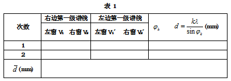

# 4.1（草）

**4.1** **光栅特性及光波波长的测定**

22计科全英创新班  陈** 2022********

**一、实验目的**

进一步掌握分光计的构造、使用和调节方法；

观察光通过透射光栅的衍射现象，了解光栅的作用和基本特性；

学会用光栅测定光栅常数、分辨本领、角色散率和未知光波波长.

**二、实验仪器**

分光计、平面镜、光栅、汞灯及其电源。

**三、实验原理**

（一）光栅常数和光栅方程

衍射光栅是由大量等宽、等间距、平行排列的狭缝构成的光学元件。用于可见光区的光栅每毫米缝数可达几百到上千条。设缝宽为$a$，相邻狭缝间不透光部分的宽度为$b$，则缝间距就称为光栅常数$d=a+b$。

根据夫琅禾费衍射理论，波长为$\lambda$的平行垂直投射到光栅平面上时，光波将在每条狭缝处发生衍射，各缝的衍射光在叠加处又会产生干涉，干涉结果取决于光程差。因为光栅各狭缝间距相等，所以相邻狭缝沿$\theta$方向行射光東的光程差都是$dsin\theta$。$\theta$是衍射光束与光栅法线的夹角，称为衍射角。

在光栅后面放置一个会聚透镜，使透镜光轴平行于光栅法线,透镜将会使图1所示平面上衍射角为$\theta$的光都汇聚在焦平面上的$P$点。根据多光束干涉原理，在$\theta$满足下式时将产生干涉主极大，$P$点为亮点：

$$
dsin\theta =k\lambda
$$

式中，$k$是级数，$d$是光栅常数。该式称为光栅方程，是衍射光栅的基本公式。由该式可知，$\theta =0$对应中央主极大，${P}_{0}$点为亮点。中央主极大两边对称排列着$\pm$1级、$\pm 2$级等的主极大。实际光栅的狭缝数目很大，缝宽很小，所以当平行光产生的光源为细长的狭缝时，光栅的衍射图样将是平行排列的细锐亮线，这些亮线就是光源狭缝的衍射干涉条纹。

当入射光为复色光时，由光栅方程可知，对给定常数$d$的光栅，只有在$k=0$即$\theta =0$时，该复色光所包含的各种波长的中央主极大重合，在透镜的焦平面上形成明亮的中央零级亮线；对$k$的其他值，各种波长的主极大都不重合，不同波长的细锐亮线出现在衍射角不同的方位。由此形成的光谱称为光栅光谱。级数$k$相同的各种波长的亮线在零级亮线的两边按短波到长波的次序对称排列形成光谱，$k=1$为一级光谱，$k=2$为二级光谱……各种波长的细锐亮线称为光谱线。如果已知光栅常数$d$、级数$k$,**精确测定光谱线的衍射角就可以确定光波的波长**；反之，也可以由己知的波长确定光栅常数。

（二）光栅特性

**角色散和分辨本领**是光栅的两个重要特性。行射光栅能将复色光按波长在透镜焦平面上分开成不同波长的谱线，说明衍射光栅有色散作用。衍射现象也使光谱线扩展为较宽的亮条纹，因而限制了光栅的分辨能力。根据理论推导，**光栅的色散能力可以用角色散**$\mathbf {D}$**表征**:

$$
D=\frac {ⅆ\theta } {ⅆ\lambda }
$$

上式表示单位波长间隔的**两条单色谱线间的角间距**。将光栅方程微分就可以得到光栅的角色散

$$
D=\frac {k} {ⅆcos\theta }
$$

由上式可知，**光栅常数越小，角色散越大**；**光谱的级次越高，角色散越大**。

分辨本领$R$表征光栅分辨光谱细节的能力。如果光栅刚刚能将$\lambda$和$\lambda +d\lambda$两条谱线分开，则

$$
R=\frac {\lambda } {ⅆ\lambda }
$$

根据瑞利判断，当一条谱线的光强极大和另一条谱线的光强极小重合时，两条谱线刚好可以被分辨。由此可以推出

$$
R=kN
$$

式中，$N$为光栅的总狭缝数，$k$为光谱的级数。$N$的数目很大，光栅具有高分本领。

**四、实验步骤**

（一）预操作

1. 调整分光计

（1）分光计的调整：

调节平行光管产生平行光，望远镜调焦至无穷远，平行光管光轴、望远镜光轴垂直于仪器转轴，并且平行光管光轴与望远镜光轴在同一水平线上；

（2）平面光栅的调整

调节光栅平面与平行光管光轴垂直：使平行光管正对光源，调节平行光管产生平行光，调节狭缝宽度至$1\sim 2 mm$,转动望远镜使分划板的叉丝对准狭缝中央，固定望远镜。将光栅置于载物台上，根据目测尽能使光栅平面垂直平分$b$、$c$连线，而$a$应在光栅平面内。转动游标盘使光栅大致垂直于望远镜光轴。用自准直法严格地调节载物台下的调平螺钉，直至望远镜射出的经光栅平面反射回来的绿“ 十”字在所示位置，随即固定游标盘。此时光栅平面与平行光管的光轴垂直，且与仪器转轴平行；

调节零级两边谱线等高。松开望远镜的止动螺钉，转动望远镜观察正、负一级光谱线，注意观察叉丝交点是否在各条谱线的中央。如果不在中央，应调节载物台下螺钉使正、负一级谱线的中央都过叉丝交点。此时两边谱线等高；

（二）用平面衍射光栅测量低压汞灯谱线波长

分光计按要求调节好之后必须**固定载物台和游标盘**，让望远镜只能绕主轴转动。先左、右转动望远镜全面观察光栅的衍射光谱，再开始测量各条谱线位置。测量时，可以从中央亮纹开始分别向左、右两边测量，也可以从左（右）边到右（左）边，单方向转动望远镜测量。将数据记录于表1中。测量完毕后，将平面光栅从载物台上拿下，但不要调乱已调好的分光计。

**五、数据处理**

以低压汞灯为光源，测量绿色谱线，数据如下表所示：

表1 绿色谱线的衍射角及光栅常数测定

测量衍射角，相应数据如下表所示：

<table>
<tr><td></td><td></td><td></td><td></td><td></td><td></td><td></td><td></td><td></td></tr>
<tr><td></td><td></td><td></td><td></td><td></td><td></td><td></td><td></td><td></td><td></td></tr>
<tr><td></td><td></td><td></td><td></td><td></td><td></td><td></td><td></td><td></td><td></td></tr>
<tr><td></td><td></td><td></td><td></td><td></td><td></td><td></td><td></td><td></td><td></td></tr>
<tr><td></td><td></td><td></td><td></td><td></td><td></td><td></td><td></td><td></td><td></td></tr>
</table>

表2

计算得超声波平均测量值为$\left ( {m/s}\right )$，与理论值相比。

**六、结论及分析**

本次实验，测得光栅常数$d=1.570(mm)$，光栅角色散$D=0.4286$，分辨本领$R=430.2$。

**七、实验总结**
