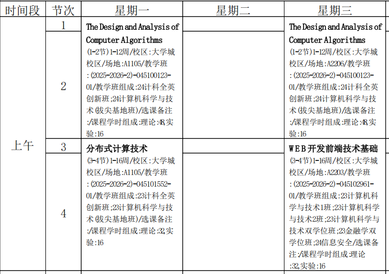

# Lecture 0 Introduction

<!-- slide: 1 -->

## 第0讲 课程简介

- Web Programming
- School of Computer Science and Engineering,
- South China University of Technology

<!-- slide: 2 -->

## 课程概要

- 课程资料
  - 相应的开发工具dreamweaver等及本课程相关的课件、参考资料与网站
- 课程考核方式
  - 上课出勤情况  20%
  - 课上练习与实验情况  20%
  - 大作业   : 60%
  - 颜老师: xiaoyyan@scut.edu.cn, 13711795218
- 刘捷老师: seliujie@scut.edu.cn, 13760786615
- 实验报告和大作业交给刘老师

<!-- slide: 3 -->

<!-- slide: 4 -->

## 课程概要

- 上课时间：
- 试验时间安排
- QQ群号：， 大家加入，上课资料在群里提供，
- 实验时打卡也要用到

| 周次 | 星期 | 节次 | 教室 |
|---|---|---|---|
| 1-16 | 三 | 3-4 | A2203 |
|  |  |  |  |

<!-- slide: 5 -->

## 实验时间安排

<!-- slide: 6 -->

## 实验时间安排

<!-- slide: 7 -->

## 课程概要

- 大作业
- 未定，确定后再告诉大家
- 大作业评分标准：完成内容质量及所要求用的数量

<!-- slide: 8 -->

## 本课程主要包含的内容

- 因特网与万维网简介
- HTML与CSS
- 网页区域和 CSS 盒子模型
- PHP服务端编程
- JavaScript和DOM
- Cookie与Session
- Web安全基础
- HTML5
- XML
- Mashup
- …….

<!-- slide: 9 -->

- 谢谢!
