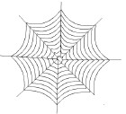
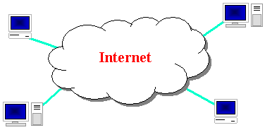
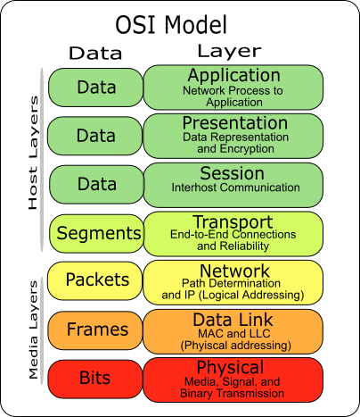
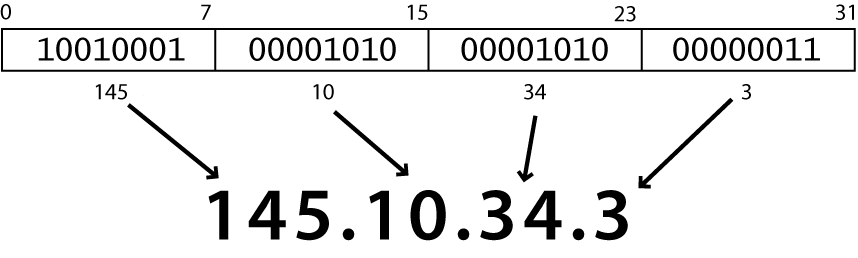
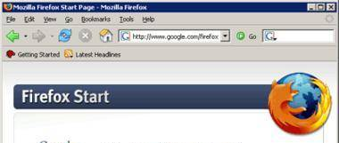
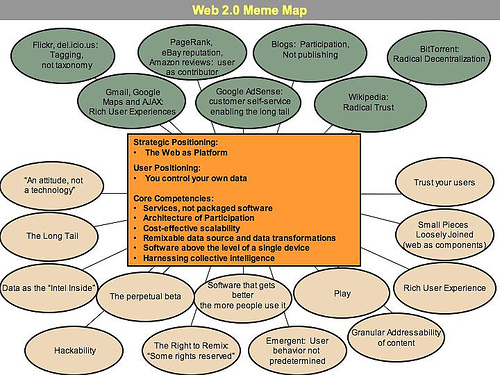
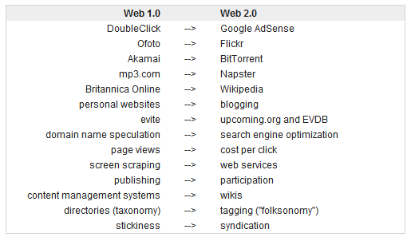

# Lecture 1 Internet and WWW(C)

<!-- slide: 1 -->

## 第1讲 因特网与万维网

- Web Programming
- School of Computer Science and Engineering,
- South China University of Technology

<!-- slide: 2 -->

## 概要

- August 23, 2026
- 因特网
- 万维网 (WWW)
- Web 2.0

<!-- slide: 3 -->

## 因特网(Internet)是什么?

- August 23, 2026
- 某个中国官员
  - “因特网就是英国特务的网”
- 某个美国参议员
  - “信息管道的集合” (解释)
- 到底有多少个因特网 ? Google 是不是其中之一呢?

<!-- slide: 4 -->

## 因特网

- 维基百科: http://en.wikipedia.org/wiki/Internet
- 通过互联网协议集(TCP/IP)连接起来的电脑网络
- 因特网与万维网 (WWW)的区别?
- WWW = HTML* + HTTP(S) (World Wide Web)
- * 包括CSS, JavaScript, 和其它浏览器允许的内容
- August 23, 2026

<!-- slide: 5 -->

## 简史

- 起源于美国国防部门内部网络, 被称为 ARPANET (1960s-70s)
- 最初的服务: 电子邮件, 文件传输
- 在80年代后期向商业领域开放
- Tim Berners-Lee在1989-91创建WWW
- 流行web浏览器发布: Netscape 1994, IE 1995
- 1995年: Amazon.com开放; 1996年二月: Google
- 1986年经过北京计算机应用技术协会的努力,中国首次接入因特网：中国学术网
- 第一个电子邮件, 由CATIB于1987年9月14日发出,“Across the Great Wall we can reach every corner in the world”
- 1994年: 中国第一次完全接入因特网：NCFC (中国国家计算机与网络设施)
- 1999年: Baidu；2003年: Taobao
- August 23, 2026

<!-- slide: 6 -->

## 谁能够关掉因特网?

- August 23, 2026

- 因特网（Internet）是一组全球信息情报资源的总汇。解析网址并承担全球互联的公司ICANN（The Internet Corporation for Assigned Names and Numbers）负责。

<!-- slide: 7 -->

## 因特网的关键点

- 因特网是为信息自由而存在的
- 互联网 Vs. 因特网
- 子网络能够独立存在
- 计算机能够动态加入与离开网络
- 建立于开放标准之上; 每个人都能建立一个新的设备
- 缺乏中心控制(大部分)
- 任何人都能借助简单的软件使用它
- August 23, 2026

<!-- slide: 8 -->

## 人员和组织

- 因特网工程任务推动小组(IETF): 互联网协议标准
- 互联网名称与数字地址分配机构(ICANN): 决定顶级域名
- 万维网联盟(W3C): Web标准
- August 23, 2026

<!-- slide: 9 -->

## 分层架构

- 物理层: 设备, 例如同轴电缆, 光纤,调制解调器
- 数据链路层: 基础硬件协议 (以太网, Wi-Fi, DSL, ATM, PPP)
- 网络/因特网层: 基础软件协议 (IP)
- 运输层: 保证网络层的可靠性 (TCP, UDP)
- 应用层: 为各种应用程序实现通信(HTTP, POP3/IMAP, SSH, FTP)
- August 23, 2026

- 互联网使用一个分层的硬件/软件架构 (OSI模型):

<!-- slide: 10 -->

## 因特网协议 (IP)

- IP 是通信系统的基础, 用来把所有数据(包)在互联网上进行传送
- 每一个设备有一个32-bit 的IP地址, 它包含四个8-bit 数字 (0-255)
- 找出你的互联网IP地址: whatismyip.com
- 找出你的本地IP地址:
  - 在终端中, 键入: ipconfig (Windows) 或者 ifconfig (Mac/Linux)
- IP v4 vs. IP v6 (32-b vs. 128-b)
- August 23, 2026

<!-- slide: 11 -->

## 传输控制协议(TCP)

- 在IP之上添加多个有保证的信息传递机制
- 多路复用: 多个程序使用同个IP地址
  - 端口: 一个给定了的, 属于每个程序或服务的数字
  - 80: Web浏览器(443 用于安全浏览)
  - 25: email
  - 22: ssh
  - 21: ftp
  - 更多常见的端口
- 某些程序 (QQ, 游戏, 流媒体程序) 使用更简单的UDP 协议代替TCP
- 找出正在使用的端口:
  - 在终端中, 使用netstat (Windows) 命令
  - 使用CurrPorts
- August 23, 2026

<!-- slide: 12 -->

## 概要

- August 23, 2026
- 因特网
- 环球网 (WWW)
- Web 2.0

<!-- slide: 13 -->

## Web服务器 与 浏览器

- Web 服务器: 监听Web页面请求的软件
  - Apache
  - 微软因特网信息服务器(IIS) (Windows的一部分)
- Web 浏览器: 从Web服务器获取/显示文档
  - Microsoft Internet Explorer (IE)
  - Mozilla Firefox
  - Apple Safari
  - Google Chrome
  - Opera
- August 23, 2026

<!-- slide: 14 -->

## 域名解析系统(DNS)

- 把给定的名称映射为IP地址的一系列服务器
  - 例子: www.scut.edu.cn  202.38.193.188
  - 使用Windows命令nslookup 找出IP地址
  - 非英语域名 DN ccTLD Fast Track
- 大部分系统拥有一个本地缓存文件：host
  - Windows: C:\Windows\system32\drivers\etc\hosts
  - Mac: /private/etc/hosts
  - Linux: /etc/hosts
- August 23, 2026

<!-- slide: 15 -->

## 统一资源定位符(URL)

- 标识一个文档在网站的位置
- 一个基本的URL: http://www.scut.edu.cn:8080 /cs/ ~~~  ~~~~~~~~~~~~~ ~~~~ ~~~~协议           主机            端口  路径
- 在浏览器中输入这个 URL 时, 它会:
  - 向DNS服务器询问 www.scut.edu.cn的IP地址
  - 连接该地址上的 80 80端口
  - 从服务器获取 /cs/下的文件
  - 把结果页面显示在屏幕上
- August 23, 2026

<!-- slide: 16 -->

## 高级 URL

- 锚点: 跳转到页面的指定部分 http://www.textpad.com/download/index.html#downloads
  - 获取index.html并且跳到标志为downloads的部分
- 端口: 指定访问服务器的端口(而不是默认的80端口) http://www.scut.edu.cn:8080/cs/ _x000b_
- 查询字符串: 一组传给Web程序的参数 http://www.google.com/search?q=miserable+failure&start=10
  - 参数 q 设置为 "miserable+failure"
  - 参数 start 设置为 10
- August 23, 2026

<!-- slide: 17 -->

## 超文本传输协议 (HTTP)

- 由浏览器发送并由服务器解析的一组命令
- 部分 HTTP 命令 (浏览器在内部传送)：
  - GET  filename : 下载
  - POST filename : 传送一个Web表单
  - PUT  filename : 上传
  - DELETE filename: 移除实体
  - HEAD filename: 只是状态信息, 而不是全部内容
- 在终端窗口上模拟一个浏览器:
- August 23, 2026
- $ telnet www.sysu.edu.cn 80 Trying 202.116.64.9... Connected to 202.116.64.9 (202.116.64.9). Escape character is '^]'. GET /2009/xxgk.html <!DOCTYPE HTML PUBLIC "-//W3C//DTD HTML 4.0 ..."> <html> ...

<!-- slide: 18 -->

## HTTP 错误码

- 当某些地方出现问题, Web服务器会返回一个特殊的”错误码”数字给浏览器, 有时会附上一个HTML文档
- 常见错误码:
- August 23, 2026

| 数字 | 含义 |
|---|---|
| 200 | OK |
| 301-303 | 页面已经被移除(永久性或者临时性) |
| 403 | 你不允许访问此页面 |
| 404 | 找不到页面 |
| 500 | 服务器内部错误 |
| 完整列表 |  |

<!-- slide: 19 -->

## 互联网媒体(MIME)类型

- 有时当页面需要包含某些资源(样式表, 图标, 多媒体对象), 我们需要指定它们的数据类型
- MIME类型列表: 按类型, 按扩展名
- .html  vs. .htm
- August 23, 2026

| MIME 类型 | 文件扩展名 |
|---|---|
| text/html | .html , .htm, shtml, .shtm |
| text/plain | .txt |
| image/gif | .gif |
| image/jpeg | .jpg |
| video/quicktime | .mov |
| application/octet-stream | .exe |

<!-- slide: 20 -->

## Web语言/技术

- 超文本标记语言 (HTML): 用于编写Web页面
- 层叠样式表 (CSS): 调整Web页面的样式
- PHP超文本处理器 (PHP): 在服务器上动态生成页面 – 当然, 有很多其它的语言和脚本能够完成这件事 …
- JavaScript: 使页面能够进行交互和可编程
- 异步 JavaScript 与 XML (Ajax): 为Web应用访问数据
- 可扩展标记语言 (XML): 用于组织数据的元语言
- 结构化查询语言 (SQL): 与数据库交互
- 资源描述框架 (RDF): 语意地描述Web资源
- ……
- August 23, 2026

<!-- slide: 21 -->

## 名词

- 因特网服务提供商 (ISP)
  - 提供因特网接入服务的企业或者组织
  - 请找出你的ISP的提供商？
- 网站托管
  - 为消费者提供存放网页的地方,以供Web冲浪者浏览
  - ISP 通常提供网站托管服务以及他们的标准连接包
- 客户端/服务端 vs. 浏览器/服务器
- 表现层
  - 通常指企业级应用架构中的最高层
  - 在Web领域中, 它包括网页的代码和生成网页的代码
- 客户端脚本/编程
  - 编写代码, 使浏览器能够渲染网页并且与用户交互
- 服务端脚本/编程
  - 编写代码, 产生能够被浏览器处理的代码
- August 23, 2026

<!-- slide: 22 -->

## 概要

- August 23, 2026
- 因特网
- 环球网 (WWW)
- Web 2.0

<!-- slide: 23 -->

## Web 1.0 vs. Web 2.0

- Web 1.0 关注的是 发布
  - 用户被限制在被动的浏览提供给他们的信息
- Web 2.0 关注的是 交互
  - 允许用户与其它用户交互或者改变网站内容
  - 信息共享, 互用性, 以用户为中心的设计 和 协作
  - 托管服务, web应用, 社交网站, 视频分享网站, 维基, 博客, mashups 和 folksonomies.
  - 由Tim O‘Reilly命名. 得益于2004年的O’Reilly Media Web 2.0会议
- August 23, 2026

<!-- slide: 24 -->

## Web 2.0 备忘图

- August 23, 2026

<!-- slide: 25 -->

## Web 2.0 例子

- August 23, 2026

<!-- slide: 26 -->

## 2.0 风暴

- 图书馆2.0, 课室2.0, 发布2.0,
- 社交2.0, 企业2.0, 公共关系2.0,
- 医学2.0, 传感器2.0, 旅游2.0
- 政府2.0
- 甚至 Porn 2.0
- 这些涉及不同学科不同领域的2.0新版应用程序都运用了Web2.0技术.
- August 23, 2026

<!-- slide: 27 -->

## Web 2.0 技术

- 浏览器端
  - 异步JavaScript与XML (Ajax),
  - RIA
    - Adobe Flash
    - JavaScript/Ajax 框架
      - Prototype, script.aculo.us, Yahoo! UI Library, Dojo Toolkit, MooTools,  jQuery, ExtJS, …
    - 其它
      - XUL, JavaFX, Silverlight, OpenLaszlo, …
- 服务器端
  - 大量与Web 1.0相同的技术
    - PHP, Ruby, ColdFusion, Perl, Python, JSP, Servlet, 和 ASP
  - 使用不同格式提供数据
    - XML, RSS, 和 JSON , 为什么?
- August 23, 2026

<!-- slide: 28 -->

## 总结

- August 23, 2026
- 因特网
  - 历史
  - 关键词
  - 人员和组织
  - 分层结构
  - 协议: IP, TCP
- 万维网(WWW)
  - 服务器端和浏览器端
  - 协议: DNS, URL, HTTP, MIME
  - web 语言/技术
- Web 2.0
  - 特征, 能力, 应用, 和技术

<!-- slide: 29 -->

## 练习

- 使用命令行窗口获取华南理工大学主页
- 安装 Firefox 和 Firebug 插件
- August 23, 2026

<!-- slide: 30 -->

## 阅读材料

- 因特网简史 http://www.isoc.org/internet/history/brief.shtml
- http://en.wikipedia.org/wiki/Web_2.0
- http://oreilly.com/web2/archive/what-is-web-20.html
- August 23, 2026

<!-- slide: 31 -->

- 谢谢!
