# Lecture 10 DOM Events(C)

<!-- slide: 1 -->

## 第10讲 DOM事件

<!-- slide: 2 -->

## 概要

- 观察者模式
- DOM 2 事件流
- 事件处理

<!-- slide: 3 -->

## 事件驱动编程

- 事件驱动编程: 编写由用户事件驱动的程序
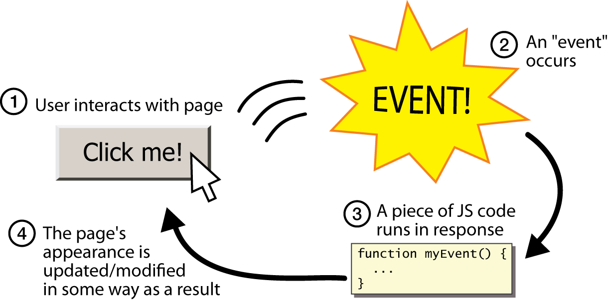

<!-- slide: 4 -->

## 观察者模式

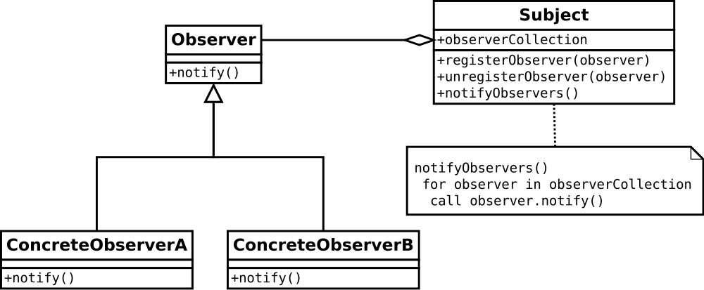
- 事件使得对象有多个观察者队列
- Event

<!-- slide: 5 -->

## 观察者模式

- 观察者模式 是基于事件驱动编程
- 我们如何把观察者模式运用到复杂的DOM树上呢?
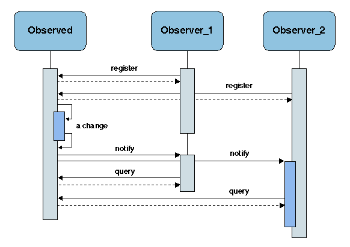

<!-- slide: 6 -->

## 概要

- 观察者模式
- DOM 2 事件流
- 事件处理

<!-- slide: 7 -->

## 事件流

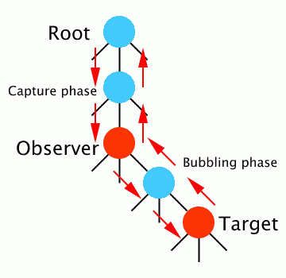
- 每个事件都有一个目标, 这个目标可以经由事件取得
- element.onclick = handler(e);function handler(e){	if(!e) var e = window.event;	// e refers to the event	// see detail of event	var original = e.eventTarget;}
- 每个事件都从浏览器开始, 传递到DOM
- DOM通过3个阶段传播这事件:
  - 捕捉阶段, 目标阶段, 冒泡阶段(一些事件没有冒泡阶段, 例如读取一个文件元素的事件.)
  - 注册一个捕捉阶段句柄: (IE 不能这样做)element.addEventListener('click',handler,true);

<!-- slide: 8 -->

## 事件流

- 停止一个事件的传播
  - 在一个事件句柄中抛出异常
  - 在一个句柄中调用 event.stopProgagation();
- 取消事件
  - 取消默认的动作(例如当按下一个超链接导向一个新页面的时候): event.preventDefault();
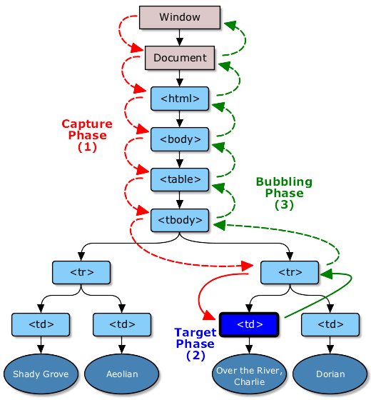

<!-- slide: 9 -->

## 注册事件句柄

- 行内:
  - <a href="somewhere.html" onClick="doSomething()">
- 传统的:
  - element.onclick = doSomething;
- DOM 2:
  - element.addEventListener('click', doSomething, false);
- IE: (邪恶!)
  - element.attachEvent('onclick', doSomething);
- Prototype: (完美 )
  - Event.observe('target', 'click', doSomething);
  - document.observe('dom:loaded', doSomething);
- 更多的细节

<!-- slide: 10 -->

## 概要

- 观察者模式
- DOM 2 事件流
- 事件处理

<!-- slide: 11 -->

## 关键字 this

- 所有的JavaScript代码实际上是在一个对象上运行的
- 默认地, 代码运行在全局 window 对象中
  - 所有你所声明的全局变量和函数都会成为 window 的一部分
- this 关键字指向当前对象
- 事件句柄运行于它所注册的元素域里, 因此它可以使用 this 去访问这个元素的DOM节点,，那就是说：
  - 在这句柄中, 那一个元素成为 this 指向的对象(而不是 window对象)
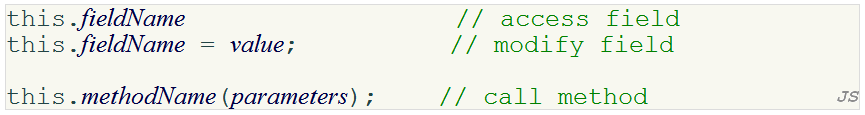

<!-- slide: 12 -->

## DOM 2 事件类型

- UI 事件类型:
  - DOMFocusIn, DOMFocusOut, DOMActivate
- 鼠标事件类型:
  - click, mousedown, mouseup, mouseover, mousemove, mouseout
- 键盘事件类型: (不在DOM 2中,  但会出现在DOM 3里)
- 突发事件:
  - DOMSubtreeModified, DOMNodeInserted, …
- HTML 事件类型:
  - load, unload, abort, error, select, change, submit, reset, focus, blur, resize, scroll
- 更多的细节

<!-- slide: 13 -->

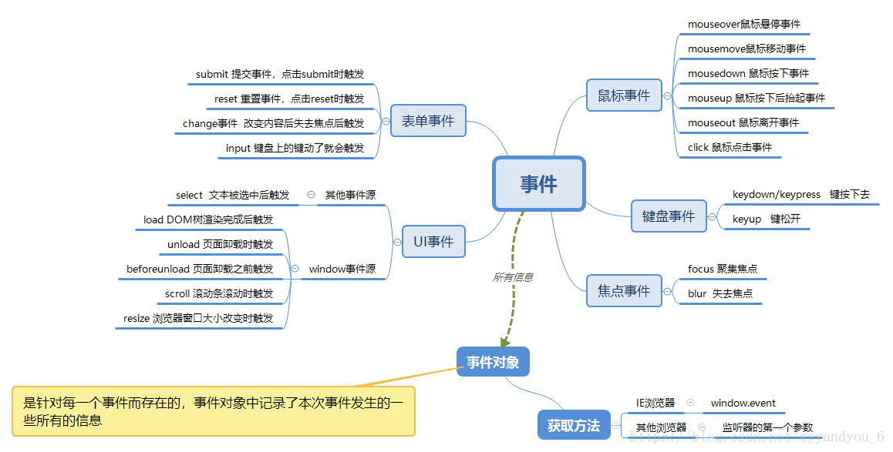

<!-- slide: 14 -->

## 常用的事件类型

- 问题: 事件是非常棘手的, 而且有跨浏览器的兼容性问题: 模糊的W3C事件规范; IE不遵守网页规范; 等等.
- 解决方案: Prototype 包含很多与事件相关的特性和修复

| abort | blur | change | click | dblclick | error |
|---|---|---|---|---|---|
| keydown | keypress | keyup | load | mousedown | mousemove |
| mouseover | mouseup | reset | resize | select | submit |
| focus | mouseout | unload |  |  |  |

<!-- slide: 15 -->

## 用Prototype附加事件句柄

- 要使用Prototype的事件特性, 你必须使用DOM元素对象的observer 方法(由Prototype增加的)去附加句柄
- 传递感兴趣的事件和作为句柄的函数
- 句柄必须 用这样的方法去附加, 才能使Prototype的事件特性凑效
- observe 是 addEventListener 和 attachEvent (IE)的替代品
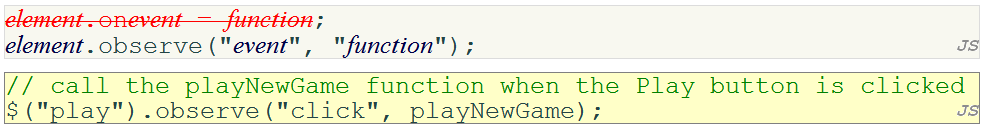

<!-- slide: 16 -->

## 使用 $$ 附加多个事件句柄

- 在window.onload代码中, 你可以使用 $$ 和其它的 DOM 遍历方法去非侵入式地为一组相关的元素附加事件句柄
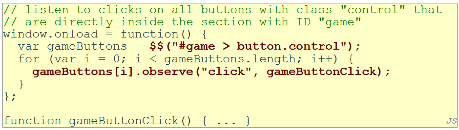

<!-- slide: 17 -->

## 事件对象

- 事件句柄能够接受一个代表正在发生的事件的可选参数. 事件对象有以下属性/方法:
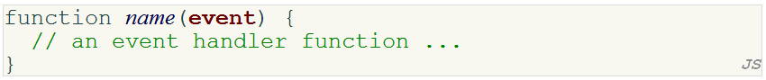

| 方法/ 属性名 | 描述 |
|---|---|
| type | 事件类型, 例如 “click” 或者 "mousedown" |
| element() * | 事件发生在哪个元素 |
| stop() ** | 取消一个事件 |
| stopObserving() | 移除一个事件句柄 |

- *   代替非标准的 srcElement 和 which 属性
- **  代替非标准的 return false;, stopPropagation

<!-- slide: 18 -->

## 鼠标事件

| click | 用户在这个元素上按下/释放鼠标 |
|---|---|
| dblclick | 用户在这个元素上按下/释放鼠标两次 |
| mousedown | 用户在这个元素上按下鼠标 |
| mouseup | 用户在这个元素上释放鼠标 |

- 点击

| mouseover | 鼠标的光标进入这个元素的范围 |
|---|---|
| mouseout | 鼠标的光标离开这个元素的范围 |
| mousemove | 鼠标的光标在这个元素的范围中移动 |

- 移动

<!-- slide: 19 -->

## 鼠标事件对象

- 传递给鼠标事件句柄的事件参数有以下属性:
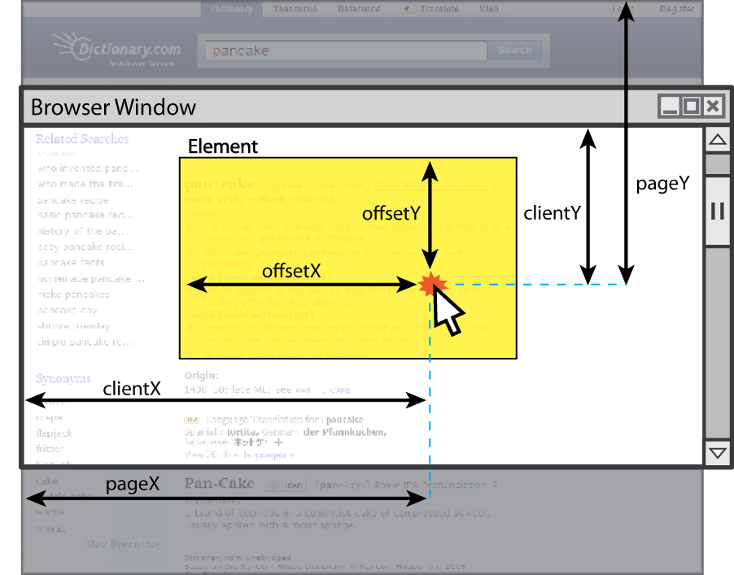

| 属性/方法 | 描述 |
|---|---|
| clientX, clientY | 浏览器中的坐标 |
| screenX, screenY | 屏幕中的坐标 |
| offsetX, offsetY | 元素中的坐标 |
| pointerX(), pointerY() * | 整个网页的坐标 |
| isLeftClick() ** | 如果点击左键则为 true |

- *   代替非标准属性 pageX 和 pageY
- ** 代替非标准属性 button 和 which

<!-- slide: 20 -->

## 鼠标事件例子

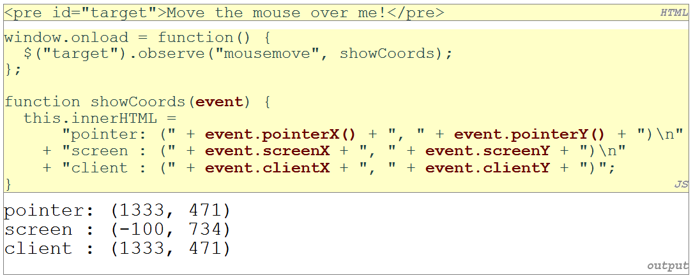

<!-- slide: 21 -->

## 总结

- 观察者模式
  - 事件驱动编程, 观察者模式
- DOM 2 事件流
  - 事件流 (捕捉, 目标, 冒泡, 停止, 取消)
  - 句柄注册 (行内, 传统, DOM 2, IE, Prototype)
- 事件处理
  - this
  - 事件类型 & 常用的事件类型
  - 用 prototype 处理事件
  - 鼠标事件

<!-- slide: 22 -->

## 练习

- 在单个页面上编写一个简单的待办事项列表应用.
  - 使用 

 元素包含这个应用所有的HTML元素
  - 一个表单。表单使用一个textarea指定一个新待办事项, 和一个”add” 按钮添加这个事项到列表中
  - 当前待办事项的列表
  - 每个事项有一个checkbox以供选择
  - 按钮 “select all”, “deselect all”, “remove” (把所有选中的待办事项从列表中移除)
  - 当点击 “add” 按钮, 新的待办事项会被加入列表的最后
  - 使用所学的非侵入式JavaScript技术
    - 使用 prototype.js 中的 DOM 事件句柄函数
    - 所有的事件句柄注册到“to-do” div 元素上
    - 使用 event.element() 找出事件的源头

<!-- slide: 23 -->

## 阅读材料

- W3School DOM 节点参考http://www.w3school.com/dom/dom_node.asp/
- W3School DOM 指南 http://www.w3schools.com/htmldom/
- Quirksmode DOM 指南 http://www.quirksmode.org/dom/intro.html
- Prototype Learning Center http://www.prototypejs.org/learn
- How prototype extends the DOM http://www.prototypejs.org/learn/extensions

<!-- slide: 24 -->

- 谢谢!
