# Lecture 11 Manipulating+DOM+with+JavaScript(中文版)

<!-- slide: 1 -->

## Lecture 11 使用JavaScript操纵DOM

<!-- slide: 2 -->

## 概要

- DOM 树
- 操纵 DOM

<!-- slide: 3 -->

## 复杂的DOM 操纵问题

- 在JavaScript中，我们如何实现以下每项的内容? 每一项都涉及到对一组元素的每个个体进行修改...
  - 当Go按钮被点击， 把所有class属性为puzzle 的div 放置到坐标为x/y随机位置上去.
  - 当用户悬停在迷宫边界，将迷宫的所有墙变成红色.
  - 在ul列表中，将id属性为TA的项的背景色设置为灰色 .

<!-- slide: 4 -->

## DOM 树

- 网页中的元素被插入到一个由对象组成的树状结构中– DOM树
  - DOM 拥有遍历该树的属性跟方法
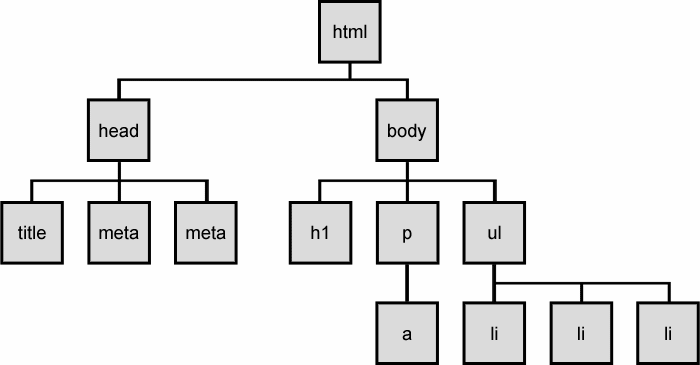

<!-- slide: 5 -->

## DOM 节点的类型

- 元素节点 (HTML 标签)
  - 可以拥有子节点 或者属性
- 文本节点 (在块元素中的文本)
- 属性节点  (属性/值对 )
  - 文本/属性 是元素节点中的子节点
  - 不可以拥有子节点或属性
  - 在绘制DOM树的时候通常不画出来

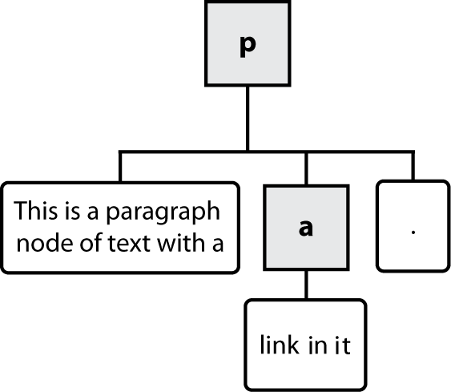
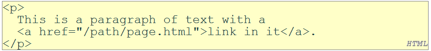

<!-- slide: 6 -->

## 遍历DOM 树

- 每个节点的DOM对象拥有以下属性:
- 完整的DOM节点属性列表
- 浏览器不兼容信息(IE 最差劲)

| 属性名 | 描述 |
|---|---|
| firstChild, lastChild | 该节点的子节点列表的开始/结尾节点 |
| childNodes | 该节点的子节点数组 |
| nextSibling, previousSibling | 有相同父节点的邻节点 |
| parentNode | 该节点的父节点 |

<!-- slide: 7 -->

## DOM 树遍历示例

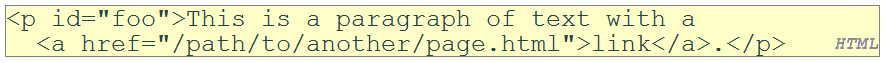
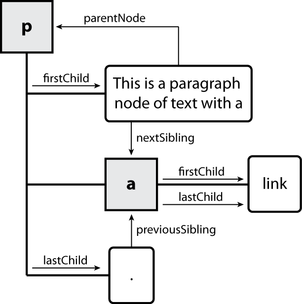

<!-- slide: 8 -->

## 元素vs. 文本节点

- Q: 上面的div有多少个子节点?
- A: 3
  - 元素节点

  - 两个 文本节点  “\n\t” (在段落的前/后 )
- Q: 该段落具有多少个子节点? 那个a 标签呢?
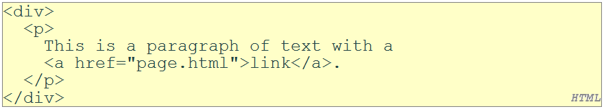

<!-- slide: 9 -->

## 概要

- DOM树
- 操纵DOM

<!-- slide: 10 -->

## Prototype的 DOM元素 方法

- 类别: CSS类, DOM 树遍历/操纵, 事件, 样式

| absolutize | addClassName | classNames | cleanWhitespace | clonePosition |
|---|---|---|---|---|
| cumulativeOffset | cumulativeScrollOffset | empty | extend | firstDescendant |
| getDimensions | getHeight | getOffsetParent | getStyle | getWidth |
| hasClassName | hide | identify | insert | inspect |
| makeClipping | makePositioned | match | positionedOffset | readAttribute |
| recursivelyCollect | relativize | remove | removeClassName | replace |
| scrollTo | select | setOpacity | setStyle | show |
| toggle | toggleClassName | undoClipping | undoPositioned | update |
| viewportOffset | visible | wrap | writeAttribute |  |

<!-- slide: 11 -->

## Prototype的 DOM 树遍历方法

- Prototype 去除了不需要的文本
- 注意，这些都是方法, 因此你需要加上括号()
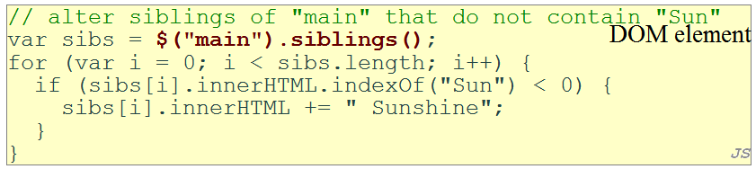

| 方法 | 描述 |
|---|---|
| ancestors, up | 元素的父节点 |
| childElements, descendants, down | 元素的子节点 (非文本节点 ) |
| siblings, next, nextSiblings, previous, previousSiblings, adjacent | 有相同父节点的元素 (非文本节点) |

<!-- slide: 12 -->

## 选择多组DOM对象

- 在文档或其它DOM对象 中访问后代节点:

| 名称 | 属性 |
|---|---|
| getElementsByTagName | 选择指定标签元素的后代，例如  “div”，以数组形式返回。 |
| getElementsByName | 选择带有给定name属性的元素的后代，以数组形式返回。 (在表单控制的时候很有用) |

<!-- slide: 13 -->

## 选择特定类型的所有元素

- 高亮本文档中的所有段落 :
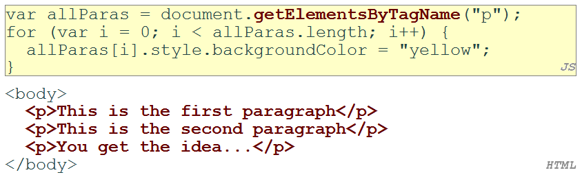

<!-- slide: 14 -->

## 与getElementById联合使用

- 高亮这部分中所有ID为"address"的段落  :
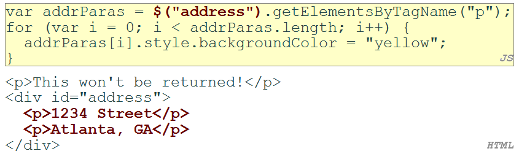

<!-- slide: 15 -->

## Prototype选择元素的方法

- Prototype 添加了对文档对象 (以及所有的DOM元素对象) 进行多组选择的方法 :

| getElementsByClassName | 选择带有指定class属性的元素，并以数组形式返回。 |
|---|---|
| select | 匹配给定CSS 选择器的元素的数组，例如"div#sidebar ul.news > li" |

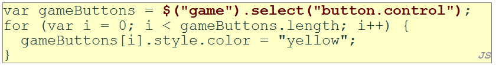

<!-- slide: 16 -->

## 创造新节点

- 只是创建一个节点，并没把它加入到该网页中
- 你必须把这个新节点加入到网页中现存的一个元素中，作为其子节点 ...

| 名称 | 描述 |
|---|---|
| document.createElement( "tag") | 创造并返回一个具有该类型的元素的空的DOM 节点 |
| document.createTextNode("text") | 创造并返回包含给定文本的文本节点 |

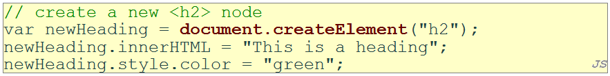

<!-- slide: 17 -->

## 修改DOM树

- 每一个DOM元素对象拥有以下方法:

| 名称 | 描述 |
|---|---|
| appendChild(node) | 在该节点的子节点列表末尾追加一个新节点 |
| insertBefore(new, old) | 在该节点的子节点列表中，在指定的旧节点前面插入新节点 |
| removeChild(node) | 在该节点的子节点列表中，删除指定的节点 |
| replaceChild(new, old) | 用新的子节点将旧的子节点替换掉 |

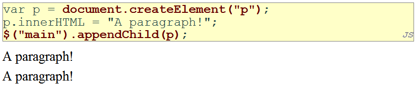

<!-- slide: 18 -->

## 从网页中删除一个节点

- 每一个 DOM 对象有一个removeChild方法，用于从网页中删除它的子节点
- Prototype 为节点添加了 remove 方法来删除它本身
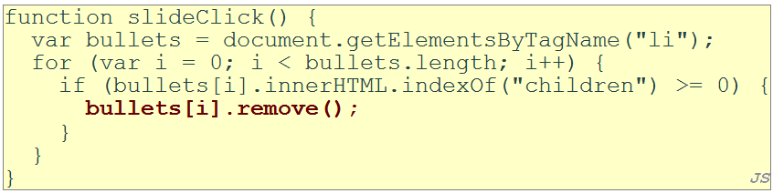

<!-- slide: 19 -->

## DOM vs. innerHTML 编辑

- 为什么不对先前的例子采用以下方法?
- 假设新节点是更加复杂的:
  - 丑陋的 : 在许多层面上是不好的编程风格 (e.g. JS嵌入在HTML代码中)
  - 易出错 : 必须仔细辨别"和  '
  - 只能在子节点列表的开始跟结尾处 ，不能在中间添加
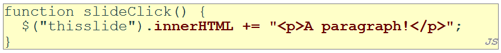
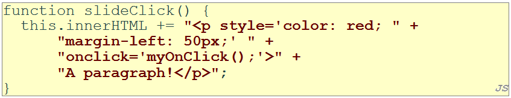

<!-- slide: 20 -->

## 读取/更改样式的问题

- style 属性允许你对一个元素的所有CSS样式进行设置
- 问题: 你(通常)不能用它来读取存在的样式
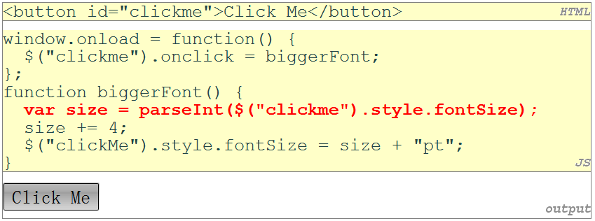

<!-- slide: 21 -->

## 在Prototype中访问样式属性

- 将getStyle 函数添加到DOM对象里，能访问存在的样式
- addClassName, removeClassName, hasClassName 操纵CSS的class属性
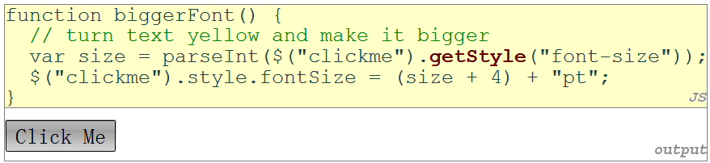

<!-- slide: 22 -->

## 常见错误: 对存在的样式的错误使用

- 例如用上面的例子计算. “200px” + 100 + “px” , 会得到"200px100px"
- 正确的方法:
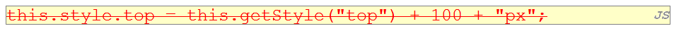
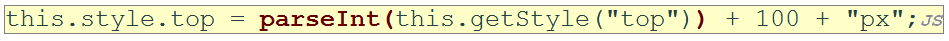

<!-- slide: 23 -->

## 在Prototype中设置CSS 的class属性

- addClassName, removeClassName, hasClassName操纵CSS的class属性
- 与DOM 现有的className属性类似, 但不用手动地用空格进行分隔
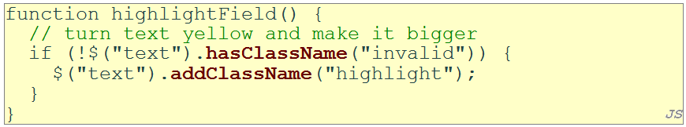

<!-- slide: 24 -->

## 总结

- DOM树
  - DOM 树, 节点类型
  - 遍历DOM, 文本节点
- 操纵 DOM
  - prototype的DOM方法
  - 通过tagName, name, className, CSS 选择器选择
  - DOM vs. innerHTML
  - 编程式地访问样式属性

<!-- slide: 25 -->

## 练习

- 在一个页面中写一个简单的待办事项列表应用 .
  - 一个表单，带有文本区域，对要添加的待办事项进行说明，并有一个“添加”按钮，用来将该新的待办事项加入到列表中。
  - 一个当前待办事项列表
  - 每个事项有一个用于选择的复选框
  - 按钮“选择全部”, “删除全部”, “删除” (用来对列表中选中的项目进行删除　)
  - 当点击“添加”按钮 时，新的待办事项将被插入到列表的底部

<!-- slide: 26 -->

## 进阶阅读

- W3School DOM 节点参考 http://www.w3school.com/dom/dom_node.asp/
- W3School DOM 教程	 http://www.w3schools.com/htmldom/
- Quirksmode DOM 教程http://www.quirksmode.org/dom/intro.html
- Prototype 学习中心 	    http://www.prototypejs.org/learn
- prototype 如何扩展DOM http://www.prototypejs.org/learn/extensions

<!-- slide: 27 -->

- Thank you!
